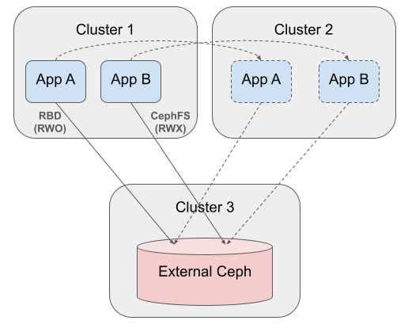

When there are multiple Kubernetes clusters that are configured to connect
to the same external Ceph cluster, the applications running in each K8s cluster
will be storing the data in the same central Ceph cluster.
In this setup, applications can be migrated to another cluster without requiring any data movement.
For example, an application may need to migrate if one application cluster is becoming
overloaded or if there is an outage in a cluster.

Consider the following diagram to illustrate two applications available for migration:

- App A has an RBD RWO PVC in Cluster 1 that can be migrated to Cluster 2
- App B has a CephFS RWX PVC in Cluster 1 that can be migrated to Cluster 2

The external Ceph cluster stores the data, thus no data movement is necessary when the applications
are migrated.



### Defining Applications for Migration

Configuring an application to migrate between clusters requires the following:

- One external Ceph cluster that is accessible from the K8s application clusters.
    The Ceph cluster could be configured by Rook with [host networking](../../CRDs/Cluster/network-providers.md#host-networking),
    or configured with other tools such as cephadm.
- The application clusters must configure Rook to connect to the same
    [external cluster](../../CRDs/Cluster/external-cluster/external-cluster.md),
    with access to the same Ceph pool, radosnamespace (RBD), and/or subvolumegroup (CephFS).
- For each application
    - Create the application and its PVC in the first cluster
    - Backup the PV and modify the PV for creation in another cluster

After creating the application, there will be a PV that is bound to the application's PVC.
Find which PV is bound to the application's PVC. For example:

```command
# replace "rbd-pvc" with the actual pvc name
$ kubectl get pvc rbd-pvc -o yaml | grep volumeName

  volumeName: pvc-2dc3e161-bda2-4b42-956a-42a69a717979
```

Retrieve the PV and save to a file:

```command
# This command removes the cluster-specific `uid` and `resourceVersion` fields
kubectl get pv pvc-2dc3e161-bda2-4b42-956a-42a69a717979 -o yaml | egrep -v " uid: | resourceVersion: " > application-pv.yaml
```

Now the PV can be created in another cluster when the application needs to be migrated.

!!! tip
    The PV could be backed up with tools such as Velero. This doc is only attempting to show
    how the application can be migrated without external tools.

!!! tip
    Consider provisioning volmes from a storage class with `reclaimPolicy: Retain` to prevent
    accidental deletion of a volume in one cluster while the other cluster is still consuming
    the volume.

### Migrating an Application

When the application needs to be migrated to another cluster:

1. Scale down the application in the first cluster.
2. If an RWO PVC, ensure the application is stopped and is not capable of accidentally connecting
    to Ceph. RBD volumes have no protection against corruption from multiple instances
    of an application accessing the same volume across clusters. Either confirm the
    volume attachment has been removed in the original cluster, or block-list the
    original cluster from connecting to the Ceph cluster. This requirement
    does not apply to CephFS RWX volumes, as CephFS allows multiple clients.
3. Create the PV that was prepared in the previous section.
    - If the application will be created in a different namespace or with a different PVC
        name from the original cluster, update the corresponding properties in the `claimRef`.
    - `kubectl create -f application-pv.yaml`
4. Create or scale up the application and its PVC in the new cluster.
5. Confirm that the application PVC is bound to the PV created in step 3.
