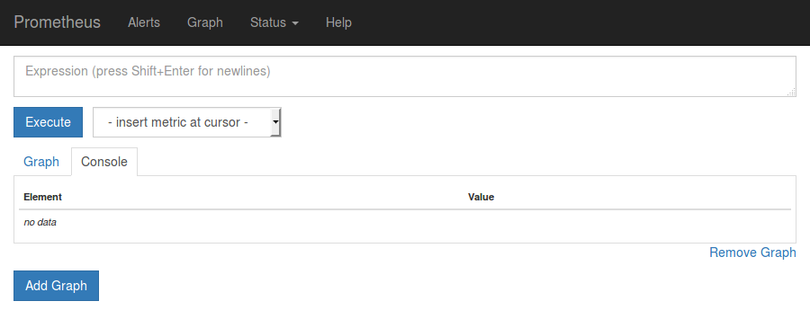
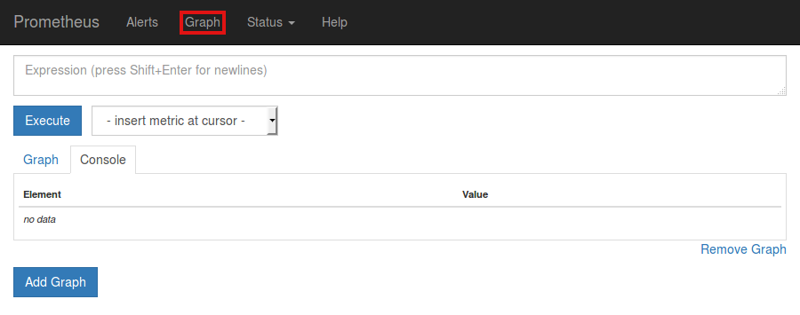
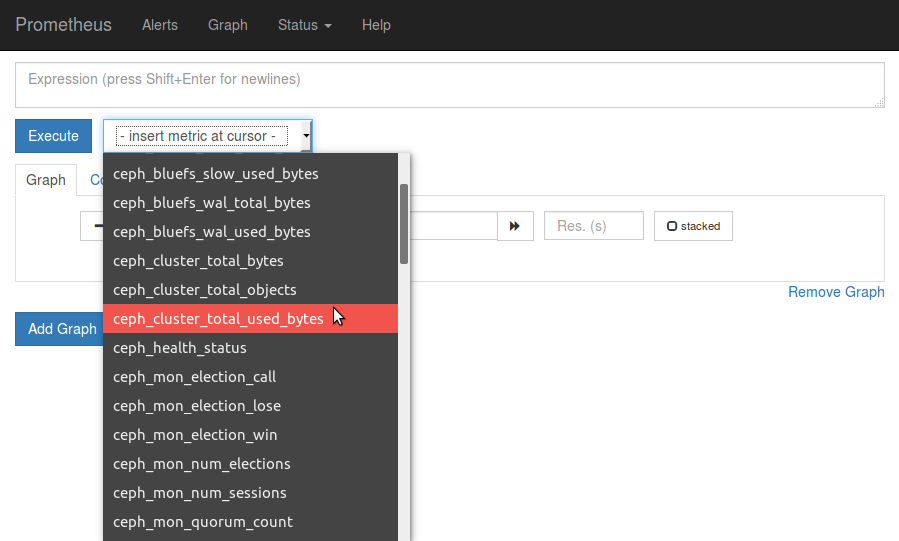
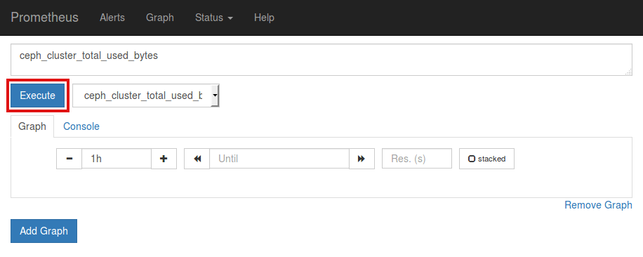
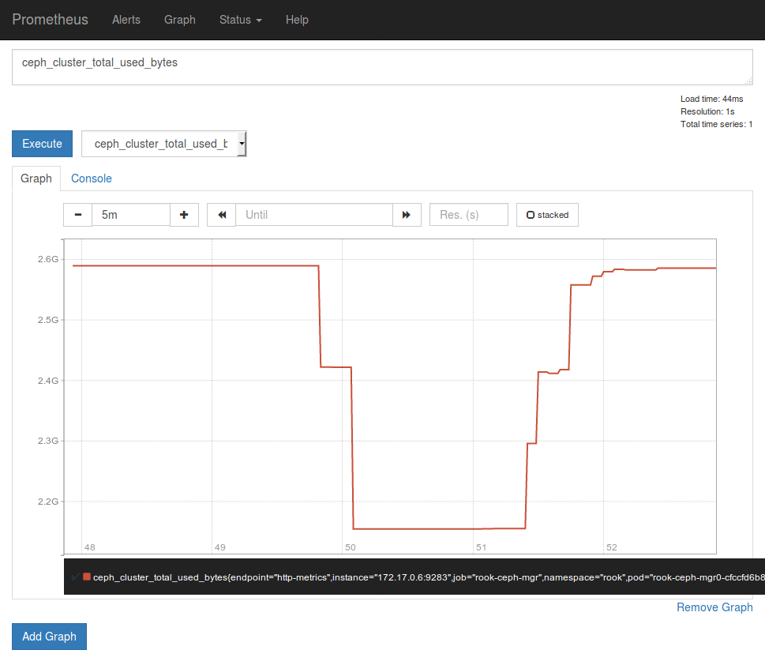

Each Rook Ceph cluster has some built in metrics collectors/exporters for monitoring with [Prometheus](https://prometheus.io/).

If you do not have Prometheus running, follow the steps below to enable monitoring of Rook. If your cluster already
contains a Prometheus instance, it will automatically discover Rook's scrape endpoint using the standard
`prometheus.io/scrape` and `prometheus.io/port` annotations.

!!! attention
    This assumes that the Prometheus instances is searching all your Kubernetes namespaces for Pods with these annotations.
    If prometheus is already installed in a cluster, it may not be configured to watch for third-party service monitors such as for Rook.
    Normally you should be able to add the prometheus annotations `prometheus.io/scrape=true` and `prometheus.io/port={port}` and
    prometheus would automatically configure the scrape points and start gathering metrics. If prometheus isn't configured to do this, see the
    [prometheus operator docs](https://github.com/prometheus-community/helm-charts/tree/main/charts/kube-prometheus-stack#prometheusioscrape).

## Prometheus Operator

First the Prometheus operator needs to be started in the cluster so it can watch for our requests to start monitoring Rook and respond by deploying the correct Prometheus pods and configuration.
A full explanation can be found in the [Prometheus operator repository on GitHub](https://github.com/prometheus-operator/prometheus-operator), but the quick instructions can be found here:

```console
kubectl apply -f https://raw.githubusercontent.com/coreos/prometheus-operator/v0.40.0/bundle.yaml
```

This will start the Prometheus operator, but before moving on, wait until the operator is in the `Running` state:

```console
kubectl get pod
```

Once the Prometheus operator is in the `Running` state, proceed to the next section to create a Prometheus instance.

## Prometheus Instances

With the Prometheus operator running, we can create service monitors that will watch the Rook cluster.

There are two sources for metrics collection:

- Prometheus manager module: It is responsible for exposing all metrics other than ceph daemons performance counters.
- Ceph exporter: It is responsible for exposing only ceph daemons performance counters as prometheus metrics.

From the root of your locally cloned Rook repo, go the monitoring directory:

```console
$ git clone --single-branch --branch master https://github.com/rook/rook.git
cd rook/deploy/examples/monitoring
```

Create the service monitor as well as the Prometheus server pod and service:

```console
kubectl create -f service-monitor.yaml
kubectl create -f exporter-service-monitor.yaml
kubectl create -f prometheus.yaml
kubectl create -f prometheus-service.yaml
```

Ensure that the Prometheus server pod gets created and advances to the `Running` state before moving on:

```console
kubectl -n rook-ceph get pod prometheus-rook-prometheus-0
```

### Dashboard config

Configure the Prometheus endpoint so the dashboard can retrieve metrics from Prometheus with two settings:
- `prometheusEndpoint`: The url of the Prometheus instance
- `prometheusEndpointSSLVerify`: Whether SSL should be verified if the Prometheus server is using https

The following command can be used to get the Prometheus url:

```console
echo "http://$(kubectl -n rook-ceph -o jsonpath={.status.hostIP} get pod prometheus-rook-prometheus-0):30900"
```

Following is an example to configure the Prometheus endpoint in the CephCluster CR.

    ```YAML
    spec:
      dashboard:
        prometheusEndpoint: http://192.168.61.204:30900
        prometheusEndpointSSLVerify: true
    ```

!!! note
    It is not recommended to consume storage from the Ceph cluster for Prometheus.
    If the Ceph cluster fails, Prometheus would become unresponsive and thus not alert you of the failure.

## Prometheus Web Console

Once the Prometheus server is running, you can open a web browser and go to the URL that is output from this command:

```console
echo "http://$(kubectl -n rook-ceph -o jsonpath={.status.hostIP} get pod prometheus-rook-prometheus-0):30900"
```

You should now see the Prometheus monitoring website.



Click on `Graph` in the top navigation bar.



In the dropdown that says `insert metric at cursor`, select any metric you would like to see, for example `ceph_cluster_total_used_bytes`



Click on the `Execute` button.



Below the `Execute` button, ensure the `Graph` tab is selected and you should now see a graph of your chosen metric over time.



## Prometheus Consoles

You can find Prometheus Consoles for and from Ceph here: [GitHub ceph/cephmetrics - dashboards/current directory](https://github.com/ceph/cephmetrics/tree/master/dashboards/current).

A guide to how you can write your own Prometheus consoles can be found on the official Prometheus site here: [Prometheus.io Documentation - Console Templates](https://prometheus.io/docs/visualization/consoles/).

## Prometheus Alerts

To enable the Ceph Prometheus alerts via the helm charts, set the following properties in values.yaml:

* rook-ceph chart:
  `monitoring.enabled: true`
* rook-ceph-cluster chart:
  `monitoring.enabled: true`
  `monitoring.createPrometheusRules: true`

Alternatively, to enable the Ceph Prometheus alerts with example manifests follow these steps:

1. Create the RBAC and prometheus rules:

    ```console
    kubectl create -f deploy/examples/monitoring/rbac.yaml
    kubectl create -f deploy/examples/monitoring/localrules.yaml
    ```

2. Make following changes to your CephCluster object (e.g., `cluster.yaml`).

    ```YAML
    apiVersion: ceph.rook.io/v1
    kind: CephCluster
    metadata:
      name: rook-ceph
      namespace: rook-ceph
    [...]
    spec:
    [...]
      monitoring:
        enabled: true
    [...]
    ```

3. Deploy or update the CephCluster object.

    ```console
    kubectl apply -f cluster.yaml
    ```

!!! note
    This expects the Prometheus Operator and a Prometheus instance to be pre-installed by the admin.

### Customize Alerts

The Prometheus alerts can be customized with a post-processor using tools such as [Kustomize](https://kustomize.io/).
For example, first extract the helm chart:

```console
helm template -f values.yaml rook-release/rook-ceph-cluster > cluster-chart.yaml
```

Now create the desired customization configuration files. This simple example will show how to
update the severity of a rule, add a label to a rule, and change the `for` time value.

Create a file named kustomization.yaml:

```yaml
patches:
- path: modifications.yaml
  target:
    group: monitoring.coreos.com
    kind: PrometheusRule
    name: prometheus-ceph-rules
    version: v1
resources:
- cluster-chart.yaml
```

Create a file named modifications.yaml

```yaml
- op: add
  path: /spec/groups/0/rules/0/labels
  value:
    my-label: foo
    severity: none
- op: add
  path: /spec/groups/0/rules/0/for
  value: 15m
```

Finally, run kustomize to update the desired prometheus rules:

```console
kustomize build . > updated-chart.yaml
kubectl create -f updated-chart.yaml
```

## Grafana Dashboards

The dashboards have been created by [@galexrt](https://github.com/galexrt). For feedback on the dashboards please reach out to him on the [Rook.io Slack](https://slack.rook.io).

!!! note
    The dashboards are only compatible with Grafana 7.2.0 or higher.
    Also note that the dashboards are updated from time to time, to fix issues and improve them.

The following Grafana dashboards are available:

- [Ceph - Cluster](https://grafana.com/grafana/dashboards/2842)
- [Ceph - OSD (Single)](https://grafana.com/grafana/dashboards/5336)
- [Ceph - Pools](https://grafana.com/grafana/dashboards/5342)

## Updates and Upgrades

When updating Rook, there may be updates to RBAC for monitoring. It is easy to apply the changes
with each update or upgrade. This should be done at the same time you update Rook common resources
like `common.yaml`.

```console
kubectl apply -f deploy/examples/monitoring/rbac.yaml
```

!!! hint
    This is updated automatically if you are upgrading via the helm chart

## Teardown

To clean up all the artifacts created by the monitoring walk-through, copy/paste the entire block below (note that errors about resources "not found" can be ignored):

```console
kubectl delete -f service-monitor.yaml
kubectl delete -f prometheus.yaml
kubectl delete -f prometheus-service.yaml
kubectl delete -f https://raw.githubusercontent.com/coreos/prometheus-operator/v0.40.0/bundle.yaml
```

Then the rest of the instructions in the [Prometheus Operator docs](https://github.com/prometheus-operator/prometheus-operator#removal) can be followed to finish cleaning up.

## Special Cases

### Tectonic Bare Metal

Tectonic strongly discourages the `tectonic-system` Prometheus instance to be used outside their intentions, so you need to create a new [Prometheus Operator](https://coreos.com/operators/prometheus/docs/latest/) yourself.
After this you only need to create the service monitor as stated above.

### CSI Liveness

To integrate CSI liveness into ceph monitoring we will need to deploy
a service and service monitor.

```console
kubectl create -f csi-metrics-service-monitor.yaml
```

This will create the service monitor to have prometheus monitor CSI

### Collecting RBD per-image IO statistics

RBD per-image IO statistics collection is disabled by default. This can be enabled by setting `enableRBDStats: true` in the CephBlockPool spec.
Prometheus does not need to be restarted after enabling it.

### Using custom label selectors in Prometheus

If Prometheus needs to select specific resources, we can do so by injecting labels into these objects and using it as label selector.

```YAML
apiVersion: ceph.rook.io/v1
kind: CephCluster
metadata:
  name: rook-ceph
  namespace: rook-ceph
  [...]
spec:
  [...]
  labels:
    monitoring:
      prometheus: k8s
  [...]
```

### Horizontal Pod Scaling using Kubernetes Event-driven Autoscaling (KEDA)

Using metrics exported from the Prometheus service, the horizontal pod scaling can use the custom metrics other than CPU and memory consumption. It can be done with help of Prometheus Scaler provided by the [KEDA](https://keda.sh/docs/2.5/scalers/prometheus/). See the [KEDA deployment guide](https://keda.sh/docs/2.5/deploy/) for details.

Following is an example to autoscale RGW:

```YAML
apiVersion: keda.sh/v1alpha1
kind: ScaledObject
metadata:
 name: rgw-scale
 namespace: rook-ceph
spec:
 scaleTargetRef:
   kind: Deployment
   name: rook-ceph-rgw-my-store-a # deployment for the autoscaling
 minReplicaCount: 1
 maxReplicaCount: 5
 triggers:
 - type: prometheus
   metadata:
     serverAddress: http://rook-prometheus.rook-ceph.svc:9090
     metricName: collecting_ceph_rgw_put
     query: |
       sum(rate(ceph_rgw_put[2m])) # prometheus query used for autoscaling
     threshold: "90"
```

!!! warning
    During reconciliation of a `CephObjectStore`, the Rook Operator will reset the replica count for RGW which was set by horizontal pod scaler. The horizontal pod autoscaler will change the again once it re-evaluates the rule. This can result in a performance hiccup of several seconds after a reconciliation. This is briefly discussed (here)[https://github.com/rook/rook/issues/10001]
