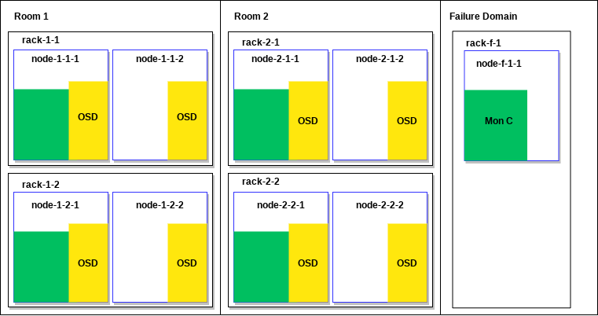
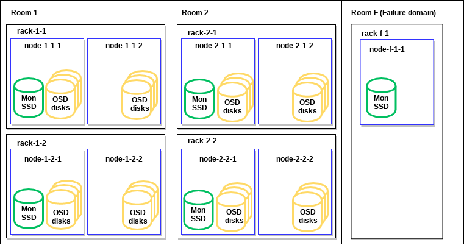
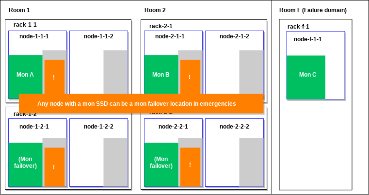
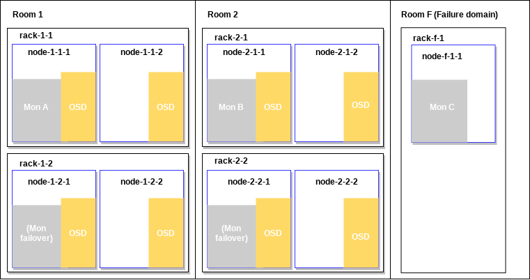

# Rook-Ceph Best Practices

## Overview

Ceph and Kubernetes are both complex tools and harmonizing the interactions between the two can be
daunting. This is especially true for users who are new to operating either system, prompting
questions such as:
 * How can I restrict Ceph to a portion of my nodes?
 * Can I set Kubernetes CPU or RAM limits for my Ceph daemons?
 * What are some ways to get better performance from my cluster?

This document covers tested patterns and best practices to answer these questions and more. Our
examples will help you configure and manage your Ceph cluster running in Kubernetes to meet your
needs. The following examples and advice are based on Ceph Octopus (v15) with Rook v1.3 running in a
Kubernetes 1.17 cluster.

This is a moderately advanced topic, so basic experience with Rook is recommended. Before you begin,
ensure you have the following requisite knowledge:
 * Basics of Kubernetes
 * How to create Kubernetes applications using manifests
 * Kubernetes topics:
   - Pods
   - Nodes
   - Labels
   - Topology
   - Taints and tolerations
   - Affinity and Anti-affinity
   - Resource requests
   - Limits
 * Ceph components and daemons, basic Ceph configuration
 * Rook basics and how to install Rook-Ceph

In places, we will give examples that describe an imaginary data center. This data center is
hypothetical, and it will focus on the Ceph- and Rook-centric elements and ignore user applications.

Our example data center has two rooms for data storage. A properly fault tolerant Ceph cluster
should have at least three monitor (MON) nodes. These nodes should be spread across fault-tolerant
rooms if possible. Real world data centers commonly have two rooms, so the example will have a
separate failure domain just for the third monitor node. As such, our hypothetical data center has
two rooms and one failure domain, with the following configuration:
* The failure domain is small and can only to be used for the third Ceph MON;
  it does not have space for storage nodes.
* Eight Ceph OSD nodes provide a good amount of data safety without requiring too many nodes.
* These eight nodes should be equally separated — four to each data center room.
* We can imagine that the four nodes are separated in each room into two racks.
* In the event of a MON node failure, let's decide we want to be able to run MONs on each rack

The data center looks as follows:



Now we will dig a little deeper and talk about the actual disks used for Rook and Ceph storage. To
ensure we are following known Ceph best practices for this data center setup, ensure that MON
storage goes on the SSDs. We'll discuss this a little more later. Because each rack should be able
to run a Ceph MON, one of the nodes in each rack will have an SSD that is usable for MON storage.
Additionally, all nodes in all racks (except in the failure domain) will have disks for OSD storage.
This will look like the following:



> **IMPORTANT:** Refer to these diagrams when we discuss the example data center below.


## Introduction

Ceph and Kubernetes both have their own well-known and established best practices. Rook bridges the
gap between Ceph and Kubernetes, putting it in a unique domain with its own best practices to
follow. Therefore, this document specifically covers best practices for running Ceph on Kubernetes
with Rook. Because Rook augments on top of Kubernetes, it has different ways of meeting both Ceph
and Kubernetes best practices. This is in comparison to the bare metal versions of each. Out of the
box, Rook is predominantly a default Ceph cluster. The Ceph cluster needs tuning to meet user
workloads, and Rook does not absolve the user from planning out their production storage cluster
beforehand.

For the purpose of this document, we will consider two simplified use cases to help us make informed
decisions about Rook and Ceph:
 * Co-located: User applications co-exist on nodes running Ceph
 * Disaggregated: Ceph nodes are totally separated from user applications


## General Best Practices

This chapter provides an outline of a series of generalized recommendations for best practices:
* Ceph monitors are more stable on fast storage (SSD-class or better) according to Ceph best
  practices. In Rook, this means that the `dataDirHostPath` location in the `cluster.yaml` should be
  backed by SSD or better on MON nodes.
* Raise the Rook log level to `DEBUG` for initial deployment and for upgrades, as it will help with
  debugging problems that are more likely to occur at those times.</br>
  Ensure that the `ROOK_LOG_LEVEL` in operator.yaml equals `debug`.
* The Kubernetes CSI driver is the preferred default, but ensure in `operator.yaml` that
  `ROOK_ENABLE_FLEX_DRIVER` remains set to `false`. This is because the FlexVolume driver is in
  sustaining mode, is not getting non-priority bug fixes, and will soon be deprecated.
* Ceph’s placement group (PG) auto-scaler module makes it unnecessary to manually manage PGs. We
  recommend you always set this to `enabled`, unless you have some need to manage PGs manually. In
  `cluster.yaml`, enable the `pg_autoscaler` MGR module.
* Rook has the capability to auto-remove Deployments for OSDs which are kicked out of a Ceph
  cluster. This is enabled by: `removeOSDSIfOutAndSafeToRemove: true`. This means there is less user
  OSD maintenance and no need to delete Deployments for OSDs that have been kicked out. Rook will
  automatically clean up the cluster by removing OSD Pods if the OSDs are no longer holding Ceph
  data. However, keep in mind that this can reduce the visibility of failures from Kubernetes Pod
  and Pod Controller views. You can optionally set `removeOSDSIfOutAndSafeToRemove` to `false` if
  need be, such as if a Kubernetes administrator wants to see disk failures via a Pod overview.
* Configure Ceph using the central configuration database when possible. This allows for more
  runtime configuration flexibility. Do this using `ceph config set` commands from Rook's toolbox.
  Only use Rook’s provided ceph.conf override ConfigMap when it is required.


## Limiting Ceph to Specific Nodes

One of the more common setups you may want for your Rook-Ceph cluster is to limit Ceph to a specific
set of nodes. Even for co-located use cases, you could have valid reasons why you must not (or do
not want to) use some nodes for storage. This is applicable for both co-located and disaggregated
use cases. To limit Ceph to specific nodes, we can label Kubernetes nodes and configure Rook to have
Affinity (as a hard preference) for our label.

For our example, let's label the desired storage nodes with `storage-node=true`. To run Rook and
Ceph daemons on labeled nodes, we will configure Affinities for this label in both the Rook
Operator manifest (`operator.yaml`) and the Ceph cluster manifest (`cluster.yaml`).

For Rook daemons and the CSI driver daemons, adjust the Operator manifest. Note that the CSI
Provisioner is best started on the same nodes as other Ceph daemons.

**`operator.yaml`:**
```yaml
CSI_PROVISIONER_NODE_AFFINITY: “storage-node=true”
AGENT_NODE_AFFINITY: “storage-node=true”
DISCOVER_AGENT_NODE_AFFINITY: “storage-node=true”
```

For `all` Ceph daemons, we must add Affinity for storage nodes in `cluster.yaml`.

**`cluster.yaml`:**
```yaml
placement:
  all:
    nodeAffinity:
      requiredDuringSchedulingIgnoredDuringExecution:
        nodeSelectorTerms:
          - matchExpressions:
              - key: storage-node
                operator: In
                values:
                  - "true"
```

## Segregating Ceph from User Applications

You could also have reason to totally separate Rook and Ceph nodes from application nodes. This
falls under the disaggregated use-case, and it is a more traditional way to deploy storage. In this
case, we still need to follow the best practices described in the section above to
[Limit Ceph to Specific Nodes](#limiting-ceph-to-specific-nodes), and we also need some additional
settings.

To segregate Ceph from user applications, we will also label all non-storage nodes with
`storage-node=false`. The CSI plugin pods must run where user application Pods run and not where
Rook or Ceph Pods are run. Add a CSI plugin Affinity for all non-storage nodes in the Rook
operator configuration.

**`operator.yaml`:**
```yaml
CSI_PLUGIN_NODE_AFFINITY: "storage-node=false"
```

In addition to that, we will set Kubernetes node Taints and configure Rook Tolerations. For example,
Taint the storage nodes with `storage-node=true:NoSchedule`, and then add the Tolerations shown
below to the Rook operator in `operator.yaml`.

**`operator.yaml`:**
```yaml
AGENT_TOLERATIONS: |
  - key: storage-node
    operator: Exists
```
```yaml
DISCOVER_TOLERATIONS: |
  - key: storage-node
    operator: Exists
```
```yaml
CSI_PROVISIONER_TOLERATIONS: |
  - key: storage-node
    operator: Exists
```

We must also add a Toleration for `all` Ceph daemon Pods in `cluster.yaml`.

**`cluster.yaml`:**
```yaml
placement:
  all:
    tolerations:
      - key: storage-node
        operator: Exists
```

## Setting Ceph CRUSH Map via Kubernetes Node Labels

A feature that was implemented early in Rook’s development is to set Ceph’s CRUSH map via Kubernetes
Node labels. For our example data center, we recommend labelling Nodes with `room`, `rack`, and
`chassis`.

As a note, Rook will only set a CRUSH map location for each OSD upon initial creation of the OSD.
It will not alter the CRUSH map if these labels are modified later. Therefore, modifying the CRUSH
location of an OSD after Rook has created it must be done manually.

As an example, in our hypothetical data center, labeling nodes will look like the following:

```sh
# -- room-1 --

kubectl label node node-1-1-1 topology.rook.io/room=room-1
kubectl label node node-1-1-1 topology.rook.io/rack=rack-1-1
kubectl label node node-1-1-1 topology.rook.io/chassis=node-1-1-1

kubectl label node node-1-1-2 topology.rook.io/room=room-1
kubectl label node node-1-1-2 topology.rook.io/rack=rack-1-1
kubectl label node node-1-1-2 topology.rook.io/chassis=node-1-1-2

kubectl label node node-1-2-1 topology.rook.io/room=room-1
kubectl label node node-1-2-1 topology.rook.io/rack=rack-1-2
kubectl label node node-1-2-1 topology.rook.io/chassis=node-1-2-1

kubectl label node node-1-2-2 topology.rook.io/room=room-1
kubectl label node node-1-2-2 topology.rook.io/rack=rack-1-2
kubectl label node node-1-2-2 topology.rook.io/chassis=node-1-2-2

# -- room-2 --

kubectl label node node-2-1-1 topology.rook.io/room=room-2
kubectl label node node-2-1-1 topology.rook.io/rack=rack-2-1
kubectl label node node-2-1-1 topology.rook.io/chassis=node-2-1-1

kubectl label node node-2-1-2 topology.rook.io/room=room-2
kubectl label node node-2-1-2 topology.rook.io/rack=rack-2-1
kubectl label node node-2-1-2 topology.rook.io/chassis=node-2-1-2

kubectl label node node-2-2-1 topology.rook.io/room=room-2
kubectl label node node-2-2-1 topology.rook.io/rack=rack-2-2
kubectl label node node-2-2-1 topology.rook.io/chassis=node-2-2-1

kubectl label node node-2-2-2 topology.rook.io/room=room-2
kubectl label node node-2-2-2 topology.rook.io/rack=rack-2-2
kubectl label node node-2-2-2 topology.rook.io/chassis=node-2-2-2

# -- room-f (failure domain) --

kubectl label node node-f-1-1 topology.rook.io/room=room-f
kubectl label node node-f-1-1 topology.rook.io/rack=rack-f-1
kubectl label node node-f-1-1 topology.rook.io/chassis=node-f-1-1
```

## Planning the Nodes Where Ceph Daemons Will Run

### Ceph MONs
Using the hypothetical data center described in the [0verview](#overview), this section will look at
planning the nodes where Ceph daemons are going to run.

Ceph MON scheduling is one of the more detailed, and more important, things to understand about
maintaining a healthy Ceph cluster. The goals we will target in this section can be summarized as:
“Avoid risky co-location scenarios, but allow them if there are no other options in order to still
have as much redundancy as possible.”

This can lead us to the following specific goals:
 * Allow MONs to be in the same room if a room is unavailable.
 * Allow MONs to be in the same rack if no other racks in the room are available.
 * Allow MONs to be on the same host only if no other hosts are available.</br>
   We must allow host co-location specifically in the cluster configuration `cluster.yaml` by
   setting `allowMultiplePerNode: true`.
   > **IMPORTANT:** This **cannot** be set to true for clusters using host networking.

> **TIP:**  We recommend using the same topology labels used for informing the CRUSH map here for
> convenience.

Because of the MON SSD availability in our hypothetical data center, we only want monitors to be
able to run where shown below in green. We need to plan for monitors to fail over, and so we will
make two nodes explicitly available for this scenario. In our example, we want any node with a MON
SSD to be a MON failover location in emergencies, for maximum cluster health. This is highlighted in
orange below. This will give us the most redundancy under failure conditions.



To implement this in Rook, we ensure that Rook will only schedule MONs on nodes with MON SSDs. We
therefore have a required Affinity for those nodes. We can accomplish this by applying a
`ceph-mon-ssd=true` label to nodes with SSDs for Ceph MONs. Note that the `mon` section’s
`nodeAffinity` takes precedence over and overwrites the `all` section’s `nodeAffinity` for Ceph MON
daemons. Make sure that you re-specify the rules from the `all` section to ensure Ceph MONs also
continue to maintain Affinity only for storage nodes as we configured above.


**`cluster.yaml`:**
```yaml
placement:
  mon:
    nodeAffinity:​
      requiredDuringSchedulingIgnoredDuringExecution:​
        nodeSelectorTerms:​
          # respecify the 'all' nodeAffinity rules here for Ceph MON daemons
          - matchExpressions:​
              - key: role​
                operator: In​
                values:​
                  - storage-node
          # add affinity for nodes with MON SSDs
          - matchExpressions:​
              - key: ceph-mon-ssd​
                operator: In​
                values:​
                  - "true"
```

We want to schedule MONs so they are spread across failure domains whenever possible. We will
accomplish this by applying Anti-affinity between MON pods. Rook labels all MON pods
`app=rook-ceph-mon`, and that is what will be used to spread the monitors apart. There is one rule
for rooms, and one for racks if a room is down. We want to ensure a higher `weight` is given to
riskier co-location scenarios.

We do not recommend running MONs on the same node unless absolutely necessary. Rook automatically
applies an Anti-affinity with medium-level `weight`. However, this might not be appropriate for all
scenarios. For our scenario, we only want node-level co-location in the worst of failure scenarios,
so we want to apply the highest possible `weight` of Anti-affinity for nodes.

**`cluster.yaml`:**
```yaml
placement:
  mon:
    # ... nodeAffinity from above ...
    podAntiAffinity:​
      preferredDuringSchedulingIgnoredDuringExecution:​
        - weight: 80​
          podAffinityTerm:​
            labelSelector:​
              matchLabels:​
                app: rook-ceph-mon​
            topologyKey: topology.rook.io/room​
        - weight: 90​
          podAffinityTerm:​
            labelSelector:​
              matchLabels:​
                app: rook-ceph-mon​
            topologyKey: topology.rook.io/rack​
        - weight: 100​
          podAffinityTerm:​
            labelSelector:​
              matchLabels:​
                app: rook-ceph-mon​
            topologyKey: kubernetes.io/hostname​
```

> **NOTE:** If host networking is enabled, you cannot co-locate MONs because the ports will collide
> on nodes. To enforce this, if host networking is enabled, Rook will automatically set a
> `requiredDuringSchedulingIgnoredDuringExecution` Pod Anti-affinity rule.

### Ceph OSDs

There is a lot of planning that goes into the placement of monitors, and this is also true for OSDs.
Fortunately, because the planning is already done with the monitors and because we have discussed
the methods, it is quite a bit easier to discuss best practices for the OSDs.



There are two ways to select nodes to use for OSDs:
* Apply Kubernetes Node labels and tell Rook to look for those labels. Specify in the cluster.yaml
  `storage:useAllNodes: true` and specify `osd` `nodeAffinity` using a `ceph-osd=true` label using
  the same Affinity methods we used for `mon`s.
 * Specify node names in the `CephCluster` definition (`cluster.yaml`) individually in `storage:nodes`.

Choosing which option to use depends on your desired management strategy. There is no single
strategy we would recommend over any other.

### Other Ceph Daemons

Placing the other Ceph daemons follows the same logic and methods as MONs and OSDs: MGR, MDS, RGW,
NFS-Ganesha, and RBD mirroring daemons can all be placed as desired. We won't discuss these in
details here since there are fewer strong recommendations for where these should be placed. For more
information, see the [placement configuration settings](./ceph-cluster-crd.md#placement-configuration-settings].)


## Hardware Requirements and Requests

Kubernetes can watch the system resources available on nodes and can help schedule applications
automatically. Kubernetes uses Resource Requests to do this. For Rook, we are notably concerned
about Kubernetes' scheduling of Ceph daemons.

Kubernetes has two Resource Request types: Requests and Limits. Requests govern scheduling, and
Limits instruct Kubernetes to kill and restart application Pods when they are over-consuming given
Limits.

When there are Ceph hardware requirements, treat those requirements as Requests, not Limits. This is
because all Ceph daemons are critical for storage, and it is best to never set Resource Limits for
Ceph Pods. If Ceph Daemons are over-consuming Requests, there is likely a failure scenario
happening. In a failure scenario, killing a daemon beyond a Limit is likely to make an already bad
situation worse. This could create a “thundering herds” situation where failures synchronize and
magnify.

Generally, storage is given minimum resource guarantees, and other applications should be limited so
as not to interfere. This guideline already applies to bare-metal storage deployments, not only for
Kubernetes.

As you read on, it is important to note that all recommendations can be affected by how Ceph daemons
are configured. For example, any configuration regarding caching. Keep in mind that individual
configurations are out of scope for this document.

### Resource Requests - MON/MGR

Resource Requests for MONs and MGRs are straightforward. MONs try to keep memory usage to around
1GB; however, that can expand under failure scenarios. We recommend 4 GB RAM and 4 CPU cores.

Recommendations for MGR nodes are harder to make, since enabling more modules means higher usage. We
recommend starting with 2 GB RAM and 2 CPU cores for MGRs. It is a good idea to look at the actual
usage for Deployments, and do not forget to consider usage during failure scenarios.

MONs:
 * Request 4 CPU cores
 * Request 4GB RAM (2.5GB minimum)

MGR:
 * Memory will grow the more MGR modules are enabled
 * Request 2 GB RAM and 2 CPU cores

### Resource Requests - OSD CPU

Recommendations and calculations for OSD CPU are straightforward.

Hardware recommendations:
 * 1 x 2GHz CPU Thread per spinner
 * 2 x GHz CPU Thread per SSD
 * 4 x GHz CPU Thread per NVMe

Examples:
 * 8 HDDS journaled to SSD – `10 cores / 8 OSDs = 1.25 cores per OSD`
 * 6 SSDs without journals – `12 cores / 6 OSDs = 2 cores per OSD`
 * 8 SSDs journaled to NVMe – `20 cores / 8 OSDs = 2.5 cores per OSD`

Note that resources are applied cluster-wide to all OSDs. If a cluster contains multiple OSD types,
you must use the highest Requests for the whole cluster. For the examples below, a mixture of HDDs
journaled to SSD and SSDs without journals would necessitate a Request for 2 cores.

### Resource Requests - OSD RAM

We have node hardware recommendations for OSD RAM usage, and we need to translate this to RAM
requests on a per-OSD basis. The node-level recommendation we have is given below where
`osd_memory_target`. This is a Ceph configuration described more afterwards.

> `Total RAM required = [number of OSDs] x (1 GB + osd_memory_target) + 16 GB `

Ceph OSDs will attempt to keep heap memory usage under a designated target size set via the
`osd_memory_target` configuration option. Ceph’s default `osd_memory_target` is 4GB, and it is
recommended to never decrease the `osd_memory_target` below 4GB. You may wish to increase this value
to improve overall Ceph read performance by allowing the OSDs to use more RAM. While the total
amount of heap memory mapped by the process should generally stay close to this target, there is no
guarantee that the Linux kernel will actually reclaim memory that has been unmapped.

As an example, for a node hosting 8 OSDs, memory Requests would be calculated as below.

> `8 OSDs x (1GB + 4GB) + 16GB = 56GB per node`

This gives us resource usage for each OSD.

> `56GB / 8 OSDs = 7GB`

Ceph has a feature that allows it to set `osd_memory_target` automatically when a Rook OSD Resource
Request is set. However, Ceph sets this value 1:1 and does not leave overhead for waiting for the
kernel to free memory. Therefore, we recommend setting `osd_memory_target` in Ceph explicitly, even
if you wish to use the default value. Set Rook’s OSD resource requests accordingly and to a higher
value than `osd_memory_target` by at least an additional 1GB. This is so Kubernetes does not
schedule more applications or Ceph daemons onto a node than the node is likely to have RAM available for.

OSD RAM Resource Requests come with the same cluster-wide Resource Requests note as for OSD CPU. Use
the highest Requests for a cluster consisting of multiple different configurations of OSDs.

### Resource Requests - Gateways

For gateways, the best recommendation is to always tune your workload and daemon configurations.
However, we do recommend the following initial configurations:

**RGWs:**
 * 6-8 CPU cores
 * 64 GB RAM (32 GB minimum – may only apply to older "civetweb" protocol)

> **NOTE:** The numbers below for RGW assume a lot of clients connecting. Thus they might not be the
> best for your scenario. Additionally, the RAM usage should be lower for the newer “beast” protocol
> compared to the older “civetweb” protocol.

**MDS:**
 * 2.5 GHz CPU with a least 2 cores
 * 3GB RAM

**NFS-Ganesha:**
 * 6-8 CPU cores (untested, high estimate)
 * 4GB RAM for default settings (settings hardcoded in Rook presently)


## Basic Performance Enhancements

The following are some basic performance enhancements. These are a few easy, low-hanging-fruit
recommendations.

> **NOTE:** Not all of these will be right for all clusters or workloads. Always performance test
> and use your best judgment.

* You can gain performance by using a CNI plugin with an accelerated network stack. For example,
  Cilium uses eBPF to improve performance over some other CNI plugins.
* Enable host networking to gain some networking performance. Notably, this provides lower, more
  stable latency. This does however step outside of Kubernetes’ network security domain. In the
  cluster.yaml set network:provider: host.
* Use jumbo frames for your networking. This can be applied to both host networking and the CNI plugin.
* For performance-sensitive deployments, ensure Ceph OSDs always have the system resources they need
  by not allowing other Ceph daemons or user applications to run on OSD nodes. Co-locating MONs and
  MGRs with OSDs can still be done fairly safely as long as there are enough hardware resources to
  also include them.
