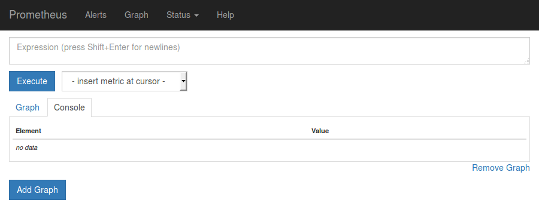



## Ceph Dashboard Monitoring

To enable monitoring and alerting functionality for the Ceph dashboard, additional steps are required to install the required dependencies.

The monitoring stack components required include:

1. [Prometheus operator](#prometheus-operator): records real-time metrics in a time series database
2. [Prometheus Ceph manager module](#prometheus-ceph-manager-module): provide Ceph cluster metrics to Prometheus
3. [Grafana](#grafana): displays charts for the information collected by Prometheus
4. [Prometheus Node exporter](#prometheus-node-exporter): provides cluster nodes machine metrics to Prometheus
5. [Prometheus alert manager](#prometheus-alert-manager): manage alerts produced in Prometheus

## Production systems considerations

The documentation provided is intended to explain how to provide the monitoring and alerting capabilities to the Ceph Dashboard. This is not replacing the original procedures/documentation that are needed to install the whole 
monitoring stack in a kubernetes production system. Security, High availability, Multi Tenancy aspects are not in the scope of this document and those topics must be managed following the recommendations/documentation of each monitoring stack component.

The monitoring stack installed in a Kubernetes production system is a separate functional component that provides a service not only to Ceph, but also to other applications. After the monitoring stack is configured, enabling monitoring and alerting in the Ceph Dashboard requires only two simple steps:

1. Enable dashboard, prometheus manager module and monitoring in the [Ceph cluster CR](#ceph-cluster).
2. Use the [Rook toolbox](ceph-toolbox.md) to set the urls used by the different monitoring stack components, and to disable (_set-*-api-ssl-verify settings_) the ssl certificates verification if self signed certificates are used. 
```console
ceph dashboard set-grafana-api-url <grafana_url>
ceph dashboard set-grafana-api-ssl-verify <False|True>
ceph dashboard set-alertmanager-api-host <alert manager url>
ceph dashboard set-alertmanager-api-ssl-verify <False|True>
ceph dashboard set-prometheus-api-host <prometheus url>
ceph dashboard set-prometheus-api-ssl-verify <False|True>
```

## Preparation

Clone the Rook repository to have access to the different resource files used in the next steps:
```console
git clone --single-branch --branch {{ branchName }} https://github.com/rook/rook.git
cd rook/cluster/examples/kubernetes/ceph/monitoring
```

## Ceph Cluster

Dashboard, prometheus manager modules and Prometheus monitoring must be enabled in your cluster CR:
```yaml
mgr:
...
  modules:
    ...
  - name: prometheus
    enabled: true
...
dashboard:
  enabled: true
  ssl: true
...
monitoring:
  enabled: true
  rulesNamespace: rook-ceph  
```

## Prometheus Operator

The Prometheus operator allows you to set up a Prometheus instance in you kubernetes cluster. Follow the instructions provided in [Prometheus Monitoring](https://github.com/rook/rook/blob/{{ branchName }}/Documentation/ceph-monitoring.md).

To verify that prometheus is running you can try to access the prometheus instance.

Execute:
```console
echo "http://$(kubectl -n rook-ceph -o jsonpath={.status.hostIP} get pod prometheus-rook-prometheus-0):30900"
```
>```
>http://192.168.122.70:30900
>```
If you use the output URL in your browser, you should see the Prometheus monitoring website.



## Prometheus Ceph manager module

The source of the Ceph cluster metrics is this manager module, by default is enabled, and the Prometheus operator service monitor configures Prometheus to scrape data from it.

In order to avoid monitoring issues just verify that the scrape intervals are the same in Prometheus and in the Ceph manager module. Both intervals must be the same. Depending on your monitoring needs, a value between 5 and 30 is correct.

In the Prometheus web UI, go to Status-Configuration. The scrape configuration should be the following:

```yaml
scrape_configs:
- job_name: rook-ceph/rook-ceph-mgr/0
  honor_timestamps: true
  scrape_interval: 5s
```

To verify this value in the Ceph Manager module, open a [Rook toolbox](ceph-toolbox.md) and execute:
```console
ceph config get mgr mgr/prometheus/scrape_interval
```
>```
>30.000000
>```

If you have a different value (as you can see in this example), you can change it executing:
```console
ceph config set mgr mgr/prometheus/scrape_interval 5
```

## Grafana

The Grafana image used is a _customized_ image of Grafana V.6.7.4, and it includes the set of Grafana dashboards used in the Ceph dashboard, and a couple of visualization plugins.

In order to deploy Grafana properly configured for Ceph, we will use the grafana.yaml file stored in the monitoring folder. Some modifications in this file could be needed: 

**1. Change of SSL certificates (optional)**

The grafana.yaml file includes a configmap for the SSL certificates used to enable secure access to the UI. These certificates are self-signed and if it is needed or preferred can be replaced by others.

**2. Grafana storage (mandatory)**

Grafana needs storage for its database and other stuff. The "grafana.yaml" file provided uses a PVC that get the storage from a PV based in a Storage Class with name "ceph-storage". _The user must be sure that a PV using this storage class is available for the grafana PVC_. Or change the storage class used in the grafana PVC to point the right one for your cluster. 

Verify you have a PV with enough space(at least 500Mb) available for the Grafana PVC:
```console
kubectl get pv
```
>```
>NAME              CAPACITY   ACCESS MODES   RECLAIM POLICY   STATUS      CLAIM   STORAGECLASS   REASON   AGE
>ceph-pv-grafana   9Gi        RWO            Retain           Available           ceph-storage            5s
>```

_**Note about High Availability:**
If you use a storage class that provides "high availability storage" (for example using a [Ceph shared filesystem](ceph-filesystem-md)), the Grafana installation can be also high available. Just is needed label more than 1 node with the label "app=grafana" and set the number of replicas to the desired number in the grafana.yaml file._

**3. Modify the grafana.ini file to point the right Prometheus service URL (mandatory)**

Go to the monitoring folder (where the grafana.yaml file is located) and execute:
```console
sed -i "s/PROMETHEUS-SVC/http:\/\/$(kubectl -n rook-ceph -o jsonpath={.status.hostIP} get pod prometheus-rook-prometheus-0):30900/g" grafana.yaml
```

Once we have updated the grafana ini file with the Prometheus URL, and we know that there is A PV with enough space available for Grafana, we can proceed to create the Grafana deployment and service:
```console
kubectl create -f grafana.yaml
```
To verify Grafana is up and running, just check deployments and services in the rook-ceph workspace. To access the web interface, execute:

```console
echo "https://$(kubectl -n rook-ceph -o jsonpath='{.items[0].status.hostIP}' get pod --selector=app=grafana):32000"
```
>```
>https://192.168.122.157:32000
>```

Which will give you the url to use in your browser to see the Grafana UI.


Once you have an instance of Grafana connected with Prometheus, you will need to connect Grafana with the Ceph Dashboard following the next steps: 

   1. In one of your Kubernetes nodes, obtain the grafana URL:

      ```console
      echo "https://$(kubectl -n rook-ceph -o jsonpath='{.items[0].status.hostIP}' get pod --selector=app=grafana):32000"
      ```
      >```
      >https://192.168.122.157:32000
      >```
   2. Open a [Rook toolbox](ceph-toolbox.md) and provide the Grafana URL to the Ceph Dashboard

      ```console
      # ceph dashboard set-grafana-api-url https://192.168.122.157:32000
      ```
      >```
      >Option GRAFANA_API_URL updated
      >```
   3. If you are using self-signed certificates for Grafana (this is the case by default unless you have changed them), you will need to set an additional Ceph dashboard property to avoid the certificate validation. Execute:

      ```console
      ceph dashboard set-grafana-api-ssl-verify False
      ```
      >```
      >Option GRAFANA_API_SSL_VERIFY updated
      >```

Now it is time to verify that the different pieces are connected properly. Open the Ceph Dashboard and verify that Grafana dashboards are shown with data:

Get the Ceph Dashboard URL:

_Note: In this example it is supposed that [you have enabled external access to the ceph dashboard](ceph-dashboard.md#node-port)._

```console
echo "https://$(kubectl get pod -l app=rook-ceph-mgr -n rook-ceph -o jsonpath='{.items[0].status.hostIP}'):$(kubectl get service rook-ceph-mgr-dashboard-external-https -n rook-ceph  -o jsonpath='{.spec.ports[0].nodePort}')"
```
>```
>https://192.168.122.142:32260
>```

Open the Ceph Dashboard URL in your browser, [login](ceph-dashboard.md#login-credentials) and navigate to "Cluster/Hosts", select the "overall performance" tab, and you should see something like:


_Note: Until node exporter will be installed metrics about nodes will not be available (see alert manager section in this document)_ 

## Prometheus Node exporter

Metrics coming from the cluster nodes are recollected by Prometheus Node exporter, this application must be installed in all the cluster nodes and communicate properly with Prometheus server.

Execute:
```console
kubectl create -f node-exporter.yaml
```

After that, you must have a new daemonset with the related pods running in your kubernetes cluster

```console
kubectl create -f node-exporter.yaml
```
>```
>daemonset.apps/node-exporter created
>```
```console
kubectl get daemonset -n rook-ceph
```
>```
>NAME               DESIRED   CURRENT   READY   UP-TO-DATE   AVAILABLE   NODE SELECTOR   AGE
>...
>node-exporter      3         3         3       3            3           <none>          17s
>```
```console
kubectl get pod -l app.kubernetes.io/name=node-exporter -n rook-ceph
```
>```
>NAME                  READY   STATUS    RESTARTS   AGE
>node-exporter-4x4g2   1/1     Running   0          3m49s
>node-exporter-w6gz8   1/1     Running   0          3m49s
>node-exporter-xzfb5   1/1     Running   0          3m49s
>```
Next step is to instruct the Prometheus server about how to scrape metrics from these pods, execute:
```console
kubectl create secret generic additional-scrape-configs --from-file=prometheus-additional.yaml -oyaml -n rook-ceph > additional-scrape-configs.yaml
kubectl create -f additional-scrape-configs.yaml
kubectl patch prometheus rook-prometheus -n rook-ceph --type merge --patch "$(cat scrape-config-patch.yaml)"
```

Finally, just verify that the metrics coming from the cluster nodes are present in the Prometheus server.

```console
echo "http://$(kubectl -n rook-ceph -o jsonpath={.status.hostIP} get pod prometheus-rook-prometheus-0):30900/targets"
```
>```
>http://192.168.122.70:30900/targets
>```

Type the URL returned in your internet browser, you should see something like:


## Prometheus alert manager

In order to enable the complete set of alerting features provided by the Ceph dashboard, a Prometheus Alert Manager must be accessible.

Execute:
```console
kubectl create -f alert-manager.yaml
```
>```
>configmap/alertmanager-config created
>service/alertmanager created
>deployment.apps/alertmanager created
>```

You should be able now to connect with the alert manager using the following URL:
```console
echo "http://$(kubectl get pod -l app=alertmanager -n rook-ceph -o jsonpath={.items[0].status.hostIP}):$(kubectl get service alertmanager -n rook-ceph  -o jsonpath='{.spec.ports[0].nodePort}')"
```
>```
>http://192.168.122.70:31000
>```
You will get something like:


Once deployed the Prometheus Alert Manager is needed to modify the Prometheus server configuration to point the new Alert manager.

Execute:
```console
kubectl patch prometheus rook-prometheus -n rook-ceph --type merge --patch "$(cat alert-manager-patch.yaml)"
```

Verify that the Prometheus Configuration is set, accessing the Prometehus server UI, go to "Status-configuration" you should see the reference to the alert manager in the configuration file:

```yaml
alertmanagers:
- kubernetes_sd_configs:
      - role: endpoints
        namespaces:
        names:
            - rook-ceph
```

The last step in the Prometheus alert manager configuration is to update a couple of Ceph dashboard settings:

- Get the alert manager URL:
```console
echo "http://$(kubectl get pod -l app=alertmanager -n rook-ceph -o jsonpath={.items[0].status.hostIP}):$(kubectl get service alertmanager -n rook-ceph  -o jsonpath='{.spec.ports[0].nodePort}')"
```
>```
>http://192.168.122.70:31000
>```
- Open a Ceph toolbox and configure the alert manager api host:

```console
# ceph dashboard set-alertmanager-api-host 'http://192.168.122.70:31000'
```
>```
>Option ALERTMANAGER_API_HOST updated
>```
```console
ceph dashboard set-alertmanager-api-ssl-verify False
```
>```
>Option ALERTMANAGER_API_SSL_VERIFY updated
>```

Now if you open the Ceph dashboard and go to "cluster-monitoring" you should see:


## Teardown

To clean up all the artifacts created by the Ceph dashboard monitoring walk-through, copy/paste the entire block below (note that errors about resources "not found" can be ignored):

```console
kubectl delete -f alert-manager.yaml
kubectl delete -f node-exporter.yaml
kubectl delete -f grafana.yaml
kubectl delete secret additional-scrape-configs -n rook-ceph
```
This will cause that some parts in the Ceph Dashboard stop work (all the grafana charts and monitoring tab), and error messages will appear claiming for the lost alert manager and grafana servers. To solve the issue clean the related configuration settings:
```console
ceph config set mgr mgr/dashboard/ALERTMANAGER_API_HOST ""
ceph config set mgr mgr/dashboard/GRAFANA_API_URL ""
```

The teardown of the Prometheus server is explained in the [Prometheus monitoring documentation](ceph-monitoring.md). A brief summary of the commands to execute is:
```console
kubectl delete -f service-monitor.yaml
kubectl delete -f prometheus.yaml
kubectl delete -f prometheus-service.yaml
kubectl delete -f https://raw.githubusercontent.com/coreos/prometheus-operator/v0.40.0/bundle.yaml
```
