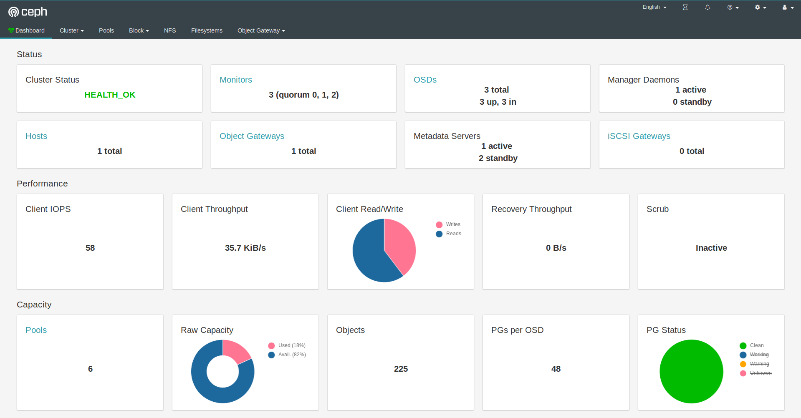

# Ceph Dashboard

The dashboard is a very helpful tool to give you an overview of the status of your cluster, including overall health,
status of the mon quorum, status of the mgr, osd, and other Ceph daemons, view pools and PG status, show logs for the daemons,
and more. Rook makes it simple to enable the dashboard.



## Enable the Dashboard

The [dashboard](http://docs.ceph.com/docs/luminous/mgr/dashboard/) can be enabled with settings in the cluster CRD. The cluster CRD must have the dashboard `enabled` setting set to `true`.
This is the default setting in the example manifests.
```yaml
  spec:
    dashboard:
      enabled: true
```

The Rook operator will enable the ceph-mgr dashboard module to listen on the default port 7000.
A K8s service will also be created to expose that port inside the cluster.
```bash
kubectl -n rook-ceph get service
NAME                               TYPE        CLUSTER-IP       EXTERNAL-IP   PORT(S)          AGE
rook-ceph-mgr                      ClusterIP   10.108.111.192   <none>        9283/TCP         3h
rook-ceph-mgr-dashboard            ClusterIP   10.110.113.240   <none>        7000/TCP         3h
```

The first service is for reporting the [Prometheus metrics](monitoring.md), while the latter service is for the dashboard.
If you are on a node in the cluster, you will be able to connect to the dashboard by using either the
DNS name of the service at `http://rook-ceph-mgr-dashboard:7000` or by connecting to the cluster IP,
in this example at `http://10.110.113.240:7000`.

## Viewing the Dashboard External to the Cluster

Commonly you will want to view the dashboard from outside the cluster. For example, on a development machine with the
cluster running inside minikube you will want to access the dashboard from the host.

There are several ways to expose a service that will depend on the environment you are running in.
You can use an [Ingress Controller](https://kubernetes.io/docs/concepts/services-networking/ingress/) or [other methods](https://kubernetes.io/docs/concepts/services-networking/service/#publishing-services-service-types) for exposing services such as
NodePort, LoadBalancer, or ExternalIPs.

The simplest way to expose the service in minikube or similar environment is using the NodePort to open a port on the
VM that can be accessed by the host. To create a service with the NodePort, save this yaml as `dashboard-external.yaml`:
```yaml
apiVersion: v1
kind: Service
metadata:
  name: rook-ceph-mgr-dashboard-external
  namespace: rook-ceph
  labels:
    app: rook-ceph-mgr
    rook_cluster: rook-ceph
spec:
  ports:
  - name: dashboard
    port: 7000
    protocol: TCP
    targetPort: 7000
  selector:
    app: rook-ceph-mgr
    rook_cluster: rook-ceph
  sessionAffinity: None
  type: NodePort
```

Now create the service:
```bash
$ kubectl create -f dashboard-external.yaml
```

You will see the new service `rook-ceph-mgr-dashboard-external` created:
```bash
$ kubectl -n rook-ceph get service
NAME                               TYPE        CLUSTER-IP       EXTERNAL-IP   PORT(S)          AGE
rook-ceph-mgr                      ClusterIP   10.108.111.192   <none>        9283/TCP         4h
rook-ceph-mgr-dashboard            ClusterIP   10.110.113.240   <none>        7000/TCP         4h
rook-ceph-mgr-dashboard-external   NodePort    10.101.209.6     <none>        7000:31176/TCP   4h
```

In this example, port `31176` will be opened to expose port `7000` from the ceph-mgr pod. Find the ip address
of the VM. If using minikube, you can `minikube ssh` to the machine and `ifconfig` to find the ip address.
Now you can enter the URL in your browser such as `http://192.168.99.110:31176` and the dashboard will appear.
