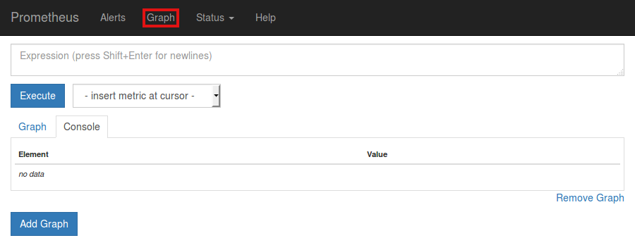



# Prometheus Monitoring

Each Rook Ceph cluster has some built in metrics collectors/exporters for monitoring with [Prometheus](https://prometheus.io/).

If you do not have Prometheus running, follow the steps below to enable monitoring of Rook. If your cluster already
contains a Prometheus instance, it will automatically discover Rooks scrape endpoint using the standard
`prometheus.io/scrape` and `prometheus.io/port` annotations.

> **NOTE**: This assumes that the Prometheus instances is searching all your Kubernetes namespaces for Pods with these annotations.

## Prometheus Operator

First the Prometheus operator needs to be started in the cluster so it can watch for our requests to start monitoring Rook and respond by deploying the correct Prometheus pods and configuration.
A full explanation can be found in the [Prometheus operator repository on GitHub](https://github.com/prometheus-operator/prometheus-operator), but the quick instructions can be found here:

```console
kubectl apply -f https://raw.githubusercontent.com/coreos/prometheus-operator/v0.40.0/bundle.yaml
```

This will start the Prometheus operator, but before moving on, wait until the operator is in the `Running` state:

```console
kubectl get pod
```

Once the Prometheus operator is in the `Running` state, proceed to the next section to create a Prometheus instance.

## Prometheus Instances

With the Prometheus operator running, we can create a service monitor that will watch the Rook cluster and collect metrics regularly.
From the root of your locally cloned Rook repo, go the monitoring directory:

```console
$ git clone --single-branch --branch v1.7.3  https://github.com/rook/rook.git
cd rook/cluster/examples/kubernetes/ceph/monitoring
```

Create the service monitor as well as the Prometheus server pod and service:

```console
kubectl create -f service-monitor.yaml
kubectl create -f prometheus.yaml
kubectl create -f prometheus-service.yaml
```

Ensure that the Prometheus server pod gets created and advances to the `Running` state before moving on:

```console
kubectl -n rook-ceph get pod prometheus-rook-prometheus-0
```

> **NOTE**: It is not recommended to consume storage from the Ceph cluster for Prometheus.
> If the Ceph cluster fails, Prometheus would become unresponsive and thus not alert you of the failure.

## Prometheus Web Console

Once the Prometheus server is running, you can open a web browser and go to the URL that is output from this command:

```console
echo "http://$(kubectl -n rook-ceph -o jsonpath={.status.hostIP} get pod prometheus-rook-prometheus-0):30900"
```

You should now see the Prometheus monitoring website.


Click on `Graph` in the top navigation bar.



In the dropdown that says `insert metric at cursor`, select any metric you would like to see, for example `ceph_cluster_total_used_bytes`


Click on the `Execute` button.


Below the `Execute` button, ensure the `Graph` tab is selected and you should now see a graph of your chosen metric over time.


## Prometheus Consoles

You can find Prometheus Consoles for and from Ceph here: [GitHub ceph/cephmetrics - dashboards/current directory](https://github.com/ceph/cephmetrics/tree/master/dashboards/current).

A guide to how you can write your own Prometheus consoles can be found on the official Prometheus site here: [Prometheus.io Documentation - Console Templates](https://prometheus.io/docs/visualization/consoles/).

## Prometheus Alerts

To enable the Ceph Prometheus alerts follow these steps:

1. Create the RBAC rules to enable monitoring.

```console
kubectl create -f cluster/examples/kubernetes/ceph/monitoring/rbac.yaml
```

2. Make following changes to your CephCluster object (e.g., `cluster.yaml`).

```YAML
apiVersion: ceph.rook.io/v1
kind: CephCluster
metadata:
  name: rook-ceph
  namespace: rook-ceph
[...]
spec:
[...]
  monitoring:
    enabled: true
    rulesNamespace: "rook-ceph"
[...]
```

(Where `rook-ceph` is the CephCluster name / namespace)

3. Deploy or update the CephCluster object.

```console
kubectl apply -f cluster.yaml
```

> **NOTE**: This expects the Prometheus Operator and a Prometheus instance to be pre-installed by the admin.

## Grafana Dashboards

The dashboards have been created by [@galexrt](https://github.com/galexrt). For feedback on the dashboards please reach out to him on the [Rook.io Slack](https://slack.rook.io).

> **NOTE**: The dashboards are only compatible with Grafana 7.2.0 or higher.
>
> Also note that the dashboards are updated from time to time, to fix issues and improve them.

The following Grafana dashboards are available:

* [Ceph - Cluster](https://grafana.com/dashboards/2842)
* [Ceph - OSD (Single)](https://grafana.com/dashboards/5336)
* [Ceph - Pools](https://grafana.com/dashboards/5342)

## Updates and Upgrades

When updating Rook, there may be updates to RBAC for monitoring. It is easy to apply the changes
with each update or upgrade. This should be done at the same time you update Rook common resources
like `common.yaml`.

```console
kubectl apply -f cluster/examples/kubernetes/ceph/monitoring/rbac.yaml
```

> This is updated automatically if you are upgrading via the helm chart

## Teardown

To clean up all the artifacts created by the monitoring walk-through, copy/paste the entire block below (note that errors about resources "not found" can be ignored):

```console
kubectl delete -f service-monitor.yaml
kubectl delete -f prometheus.yaml
kubectl delete -f prometheus-service.yaml
kubectl delete -f https://raw.githubusercontent.com/coreos/prometheus-operator/v0.40.0/bundle.yaml
```

Then the rest of the instructions in the [Prometheus Operator docs](https://github.com/prometheus-operator/prometheus-operator#removal) can be followed to finish cleaning up.

## Special Cases

### Tectonic Bare Metal

Tectonic strongly discourages the `tectonic-system` Prometheus instance to be used outside their intentions, so you need to create a new [Prometheus Operator](https://coreos.com/operators/prometheus/docs/latest/) yourself.
After this you only need to create the service monitor as stated above.

### CSI Liveness

To integrate CSI liveness and grpc into ceph monitoring we will need to deploy
a service and service monitor.

```console
kubectl create -f csi-metrics-service-monitor.yaml
```

This will create the service monitor to have promethues monitor CSI

### Collecting RBD per-image IO statistics

RBD per-image IO statistics collection is disabled by default. This can be enabled by setting `enableRBDStats: true` in the CephBlockPool spec.
Prometheus does not need to be restarted after enabling it.

### Using custom label selectors in Prometheus

If Prometheus needs to select specific resources, we can do so by injecting labels into these objects and using it as label selector.

```YAML
apiVersion: ceph.rook.io/v1
kind: CephCluster
metadata:
  name: rook-ceph
  namespace: rook-ceph
[...]
spec:
[...]
labels:
  monitoring:
    prometheus: k8s
[...]
```
