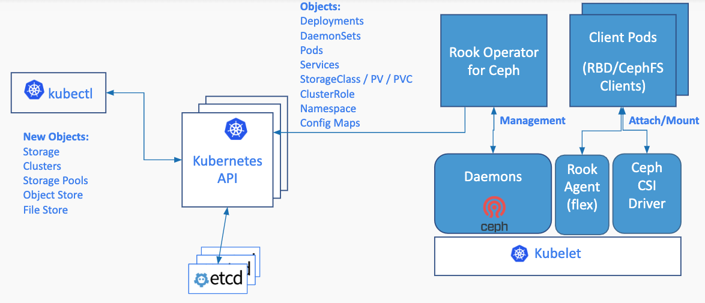
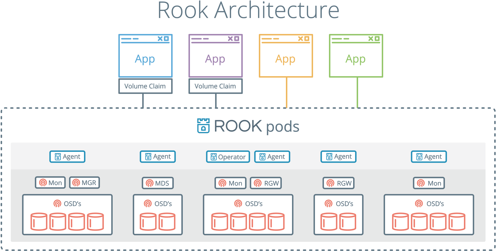

# Ceph Storage

Ceph is a highly scalable distributed storage solution for **block storage**, **object storage**, and **shared filesystems** with years of production deployments.

## Design

Rook enables Ceph storage systems to run on Kubernetes using Kubernetes primitives. The following image illustrates how Ceph Rook integrates with Kubernetes:

With Ceph running in the Kubernetes cluster, Kubernetes applications can
mount block devices and filesystems managed by Rook, or can use the S3/Swift API for object storage. The Rook operator
automates configuration of storage components and monitors the cluster to ensure the storage remains available
and healthy.

The Rook operator is a simple container that has all that is needed to bootstrap
and monitor the storage cluster. The operator will start and monitor [Ceph monitor pods](https://github.com/rook/rook/blob/master/design/ceph/mon-health.md), the Ceph OSD daemons to provide RADOS storage, as well as start and manage other Ceph daemons. The operator manages CRDs for pools, object stores (S3/Swift), and filesystems by initializing the pods and other artifacts necessary to run the services.

The operator will monitor the storage daemons to ensure the cluster is healthy. Ceph mons will be started or failed over when necessary, and
other adjustments are made as the cluster grows or shrinks.  The operator will also watch for desired state changes
requested by the api service and apply the changes.

The Rook operator also initializes the agents that are needed for consuming the storage. Rook automatically configures the Ceph-CSI driver to mount the storage to your pods. Rook's flex driver is still also configured automatically, though will soon be deprecated in favor of the CSI driver.

The `rook/ceph` image includes all necessary tools to manage the cluster -- there are no changes to the data path.
Rook does not attempt to maintain full fidelity with Ceph. Many of the Ceph concepts like placement groups and crush maps
are hidden so you don't have to worry about them. Instead Rook creates a much simplified UX for admins that is in terms
of physical resources, pools, volumes, filesystems, and buckets. At the same time, advanced configuration can be applied when needed with the Ceph tools.

Rook is implemented in golang. Ceph is implemented in C++ where the data path is highly optimized. We believe
this combination offers the best of both worlds.
