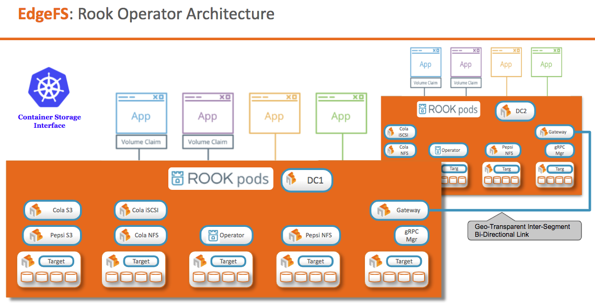

# EdgeFS Rook Operator Design

EdgeFS is high-performance and low-latency object storage system with Geo-Transparent data access via standard protocols (S3, NFS, iSCSI) from on-prem, private/public clouds or small footprint edge (IoT) devices.

EdgeFS spans unlimited number of Geo-sites, connected with each other as one global name space data fabric running on top of Kubernetes platform, providing persistent, fault-talerant and high-performant volumes for Kubernetes Applications.

At each Geo-site, EdgeFS nodes deployed as containers (StatefulSet) on physical or virtual Kubernetes nodes, pooling all their storage capacity and presenting it as fully compatible S3/NFS/iSCSI object access for cloud-native applications running on the same or dedicated servers.

### How it works, in a Nutshell?

If you familiar with git, where all modifications are fully versioned and globally immutable, it is highly likely you already know how it works. Think of it as a trully world-scale copy-on-write technique people use every day. Now, if we can make a parallel for you to understand it better - what EdgeFS does, it expands this paradigm to object storage and making Kubernetes Persistent Volumes accessible via standard protocols e.g. S3, NFS and even block devices such as iSCSI, in a high-performance and low-latency ways. Now, with fully versioned modifications, fully immutable metadata and data, things can be transparently replicated, distributed and dynamically pre-fetched across many Geo-sites.

## Design

Rook enables EdgeFS storage systems to run on Kubernetes using Kubernetes primitives.

With Rook running in the Kubernetes cluster, Kubernetes PODs or External applications can
mount block devices and filesystems managed by Rook, or can use the S3/Swift API for object storage. The Rook operator
automates configuration of storage components and monitors the cluster to ensure the storage remains available
and healthy.

The Rook operator is a simple container that has all that is needed to bootstrap and monitor the storage cluster. The operator will start and monitor StatefulSet storage Targets, gRPC manager and Prometheus Multi-Tenant Dashboard. All the attached devices (or directores) will provide pooled storage site. Storage sites then can be easily connected with each other as one global name space data fabric. The operator manages CRDs for Targets, Scale-out NFS, Object stores (S3/Swift), and iSCSI volumes by initializing the pods and other artifacts necessary to
run the services.

The operator will monitor the storage Targets to ensure the cluster is healthy. EdgeFS will dynamically handle services failover, and other adjustments that maybe made as the cluster grows or shrinks.

The EdgeFS Rook operator also comes with tighitly integrated CSI plugin. CSI pods deployed on every Kubernetes node. All storage operations required on the node are handled such as attaching network storage devices, mounting NFS exports, and dynamic provisioning.

Rook is implemented in golang. EdgeFS is implemented in Go/C where the data path is highly optimized.
While fully immutable, you will be impressed with additional capabilities EdgeFS provides besides ultra high-performant storage, i.e. built in Data Reduction with Global De-duplication and on the fly compression, at rest encryption and per-Tenant QoS controls.
