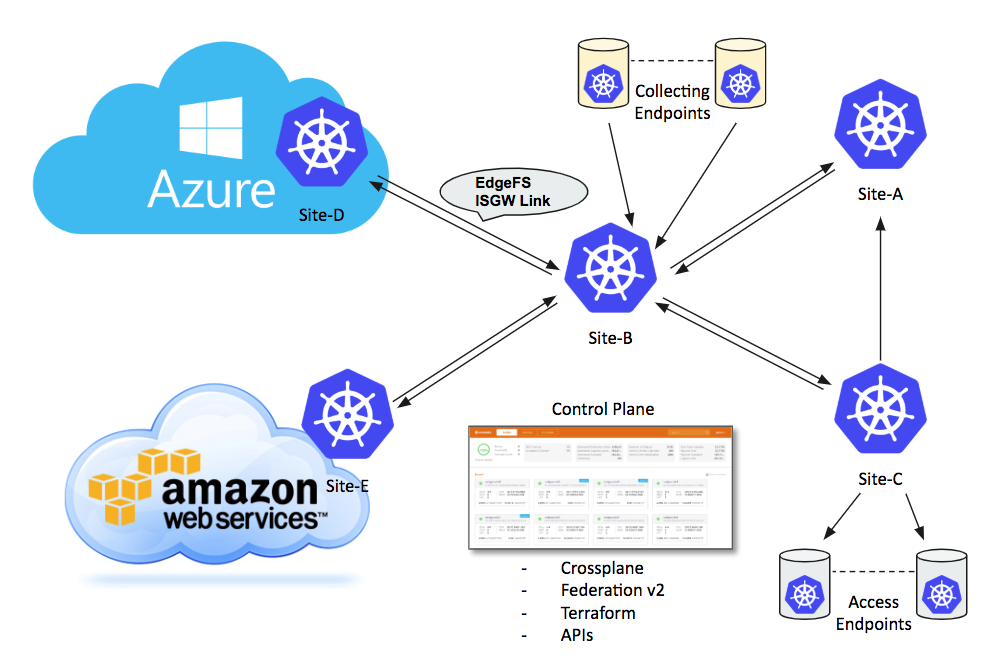
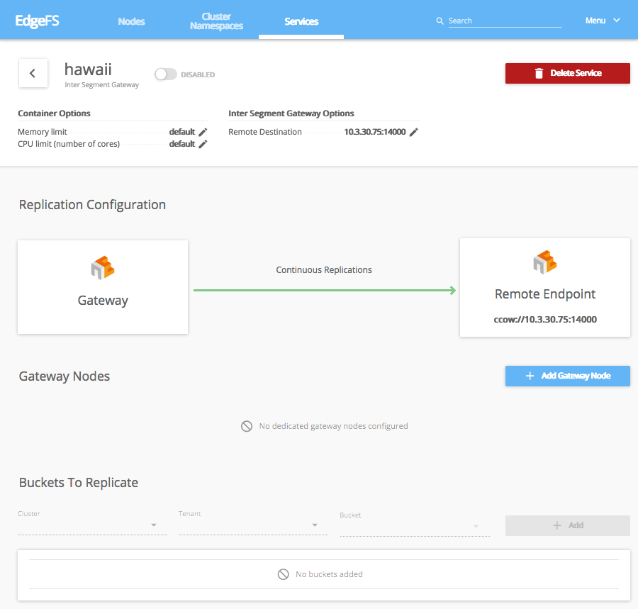

# EdgeFS ISGW (Inter-Segment GateWay) CRD

EdgeFS Inter-Segment Gateway link is a building block for EdgeFS cross-site, cross-cloud global namespace synchronization functionality.

It distributes modified chunks of data asynchronously and enables seamless as well as geographically transparent access to files, objects and block devices.
It is important to note that a file or a block device consists of one or more objects, and so, within EdgeFS scope, ultimately everything is an object, globally immutable and self-validated.

To create an analogy, EdgeFS concept of global immutability of modifications very similar to how git operates with repository commits and branches.
As such, this technique empowers EdgeFS users to construct and operate comprehensive wide-spread global namespaces with management overhead greatly simplified.
A file or object modified at a source site where ISGW link is setup will be immediately noticed by ISGW endpoint links, thus spread out the change.
Eventually, all the connected sites will receive file modification where only modified blocks get transferred.



Not only ISGW link reduces the amount of data needed to be transferred, it also deduplicating the transfers.
Matching globally unique cryptographic signatures of a file change will not be transferred, thus enabling global namespace deduplication.

ISGW link can be bi-directional, i.e. enabling same file/object modifications across the namespaces.
It works well for many use cases where application logic can ensure serialization of changes.
Single bi-directional link can connect two sites but it is possible to create as many non-overlapping links as needed.

ISGW link can also transparently synchronize file, object, directory, bucket or tenant level snapshots, grouped into so-called SnapView construct.
Thus, modification to a block device, for instance, can be consistently viewed across entire global namespace.

Because EdgeFS metadata is also globally immutable and unique, it is possible to enable a mode of transferring only metadata changes.
With this mode enabled, users can construct efficient access endpoints where modifications can be fetched on demand, as a result creating globally and geographically distributed cache fog aggregation with a built-in E-LRU eviction policy.

Local I/O at each site executed with the speed of media devices used. Modifications transferred eventually, and not slowing down local site running application workflow.

EdgeFS Rook Operator allows creation and customization of High-Performance Inter-Segment synchronization links through the custom resource definitions (CRDs).

The following settings are available for customization of ISGW services.

## Sample

```yaml
apiVersion: edgefs.rook.io/v1
kind: ISGW
metadata:
  name: isgw01                               # Inter-Segment Gateway service name
  namespace: rook-edgefs
spec:
  direction: "send+receive"
  remoteURL: "ccow://192.168.1.43:14000"
  #replicationType: "initial"
  #metadataOnly: all
  #dynamicFetchAddr: 0.0.0.0:49600
  #localAddr: 0.0.0.0:10000
  #useEncryptedTunnel: true
  #chunkCacheSize: 1Gi
  #config:
  #   server: "isgws"
  #   clients: ["isgwc1", "isgwc2"]
  #placement:
  #  nodeAffinity:
  #    requiredDuringSchedulingIgnoredDuringExecution:
  #      nodeSelectorTerms:
  #      - matchExpressions:
  #        - key: rook-edgefs-nodetype
  #          operator: In
  #          values:
  #          - isgw
  #  tolerations:
  #  - key: node230
  #    operator: Exists
  #  podAffinity:
  #  podAntiAffinity:
  #resourceProfile: embedded
  resources:
  #  limits:
  #    cpu: "2"
  #    memory: "4Gi"
  #  requests:
  #    cpu: "2"
  #    memory: "4Gi"
  # A key/value list of annotations
  annotations:
  #  key: value
```

## Metadata

* `name`: The name of the ISGW link service to create, which must match existing EdgeFS service. Provided CRD metadata can override existing EdgeFS service metadata.
* `namespace`: The namespace of the Rook cluster where the ISGW service is created.
* `direction`: I/O flow direction: `send`, `receive` or `send+receive` (default).
* `remoteURL`: I/O flow with destination pointing to the other ISGW endpoint service, locally mounted directory or other (non-EdgeFS) S3 compatible service. Format should be of form PROTOCOL://LOCATION, where PROTOCOL can be of "ccow", "file", "s3" and LOCATION depends on the PROTOCOL. In case of "ccow" LOCATION needs to specify a HOST:PORT of the other EdgeFS site, e.g. ccow://192.168.1.43:14000. In case of "file" LOCATION needs to be a path to a local POSIX directory, e.g. file://volumeDir. In cae of "s3" LOCATION can either point to an existing bucket, e.g. s3://mybucket.aws.com or to the other S3 compatible server IP:HOST, e.g. s3://214.4.34.22:4567. It is important to note that file:// and s3:// protocols only provided for easy integration with existing infrastructure.
* `replicationType`: Defines how tenant's buckets needs to be replicated. Can be specified as `initial`, `continuous` or `initial+continuous` (default). In case of `initial` replication type, ISGW service will only sync served buckets once with ability to manually trigger re-sync again. In case of `continuous` replication type, ISGW service will enable asynchronous syncing from the moment a bucket added to a served list of buckets, so that only recent changes will be synchronized, continuously. In case of `initial+continuous` replication type, ISGW service will first initiate syncing of all existing served buckets contents and once all is copied, it will automatically enable `continuous` mode of operation, guaranteeing that none of the source objects are skipped.
* `metadataOnly`: If set, then only immutable metadata changes will be transferred. This also enables on-demand data fetch and E-LRU cache capability. In case of metadata only transfers, dynamically fetched data will be cached at the accessing endpoints ISGW links locations. If an application would want to read an offset of a data which isn't found, global search request will be formed and distributed across all the connected ISGW bi-directional links serving source bucket. Missing data chunks will be found and fetched, delivered transparently to application. Can be set to either `all` or `versions`. Setting it to `versions` enables extremely fast replication (next second!) of data modifications.
* `dynamicFetchAddr`: Defines local cluster pod service host:port. Used by EdgeFS gateways (S3, S3X, NFS or iSCSI) to distribute missing chunk fetch requests. It needs to be set to other than 0.0.0.0 on access endpoints so to enable dynamic fetch feature. Default is 0.0.0.0:49678.
* `localAddr`: Defines local cluster pod service address and port. Used by ISGW link endpoint. Kubernetes ExternalIP will be automatically constructed if address is provided. Default is 0.0.0.0:14000.
* `useEncryptedTunnel`: If true, enables usage of encrypted SSH tunnel. By default, transferred metadata and data chunks are just compressed but unencrypted. Enable encryption if ISGW links crossing boundaries of single data center or multiple clouds.
* `chunkCacheSize`: Limit amount of memory allocated for dynamic chunk cache. By default ISGW pod uses up to 75% of available memory as chunk caching area. This option can influence this allocation strategy.
* `config`: Advanced ISGW services configurations - one kubernetes service per many EdgeFS services. `Server` is EdgeFS ISGW server service name, `Clients` array of ISGW client services names. When `config` option is defined the `remoteURL` is optional.
* `annotations`: Key value pair list of annotations to add.
* `placement`: The ISGW pods can be given standard Kubernetes placement restrictions with `nodeAffinity`, `tolerations`, `podAffinity`, and `podAntiAffinity` similar to placement defined for daemons configured by the [cluster CRD](/cluster/examples/kubernetes/edgefs/cluster.yaml).
* `resourceProfile`: ISGW pod resource utilization profile (Memory and CPU). Can be `embedded` or `performance` (default). In case of `performance` an ISGW pod trying to increase amount of internal I/O resources that results in higher performance at the cost of additional memory allocation and more CPU load. In `embedded` profile case, ISGW pod gives preference to preserving memory over I/O and limiting chunk cache (see `chunkCacheSize` option). The `performance` profile is the default unless cluster wide `embedded` option is defined.
* `resources`: Set resource requests/limits for the ISGW pods, see [Resource Requirements/Limits](edgefs-cluster-crd.md#resource-requirementslimits).

## Setting up two-sites bi-directional syncing EdgeFS namespace and tenants

This example will demonstrate creation of simple syncing namespace between two sites.

For more detailed instructions please refer to [EdgeFS Wiki](https://github.com/Nexenta/edgefs/wiki).

Below is an exampmle procedure to get things initialized and configured.

Before new local namespace (or local site) can be used, it has to be initialized with FlexHash and special purpose root object.

FlexHash consists of dynamically discovered configuration and checkpoint of accepted distribution table. FlexHash is responsible for I/O direction and plays important role in dynamic load balancing logic. It defines so-called Negotiating Groups (typically across zoned 8-24 disks) and final table distribution across all the participating components, e.g. data nodes, service gateways and tools.

Root object holds system information and table of namespaces registered to a local site. Root object is always local and never shared between the sites.

For each cluster, to initialize system and prepare logical definitions, login to the toolbox as shown in this example:

```console
kubectl get po --all-namespaces | grep edgefs-mgr
kubectl exec -it -n rook-edgefs rook-edgefs-mgr-6cb9598469-czr7p -- env COLUMNS=$COLUMNS LINES=$LINES TERM=linux toolbox
```

Assumption at this point is that nodes are all configured and can be seen via the following command:

```console
efscli system status
```

1. Initialize EdgeFS cluster:

Verify that HW (or better say emulated in this case) configuration look normal and accept it

```console
efscli system init
```

At this point new dynamically discovered configuration checkpoint will be created at `$NEDGE_HOME/var/run/flexhash-checkpoint.json`.
This will also create system "root" object, holding Site's Namespace. Namespace may consist of more then single region.

2. Create new local namespace (or we also call it "Region" or "Segment"):

```console
efscli cluster create Hawaii
```

3. Create logical tenants of cluster namespace "Hawaii", also buckets if needed:

```console
efscli tenant create Hawaii/Cola
efscli bucket create Hawaii/Cola/bk1
efscli tenant create Hawaii/Pepsi
efscli bucket create Hawaii/Pepsi/bk1
```

Now that Hawaii serving namespace cluster is setup, repeat steps on the secondary site:

```console
efscli cluster create Hawaii
efscli tenant create Hawaii/Cola -r 2
efscli tenant create Hawaii/Pepsi -r 2
```

This steps also includes a possibility to override destination defaults on per-tenant (Cola and Pepsi) basis.
In the example above we setting replication count to 2 on the secondary site.

4. Create ISGW link services on both EdgeFS sites:

Order of creation of ISGW links doesn't matter.
Link status change will be noticed automatically and syncing can be delayed for up to 7 days by default.

On the primary site:

```console
efscli service create isgw hawaii
efscli service serve hawaii Hawaii/Cola/bk1
efscli service serve hawaii Hawaii/Pepsi/bk1
```

Because we creating bi-directional link, on the secondary site we would need to create exactly same configuration except X-ISGW-Remote (remoteURL in CRD) where it should point back to primary. Synchronization is enabled on per-bucket level. Buckets which do not yet exist will be automatically created with tenant parameter overrides taken into an account.

5. Create ISGW Link CRDs on both EdgeFS sites:

```yaml
apiVersion: edgefs.rook.io/v1
kind: ISGW
metadata:
  name: hawaii
  namespace: rook-edgefs
spec:
  direction: send+receive
  remoteURL: ccow://10.3.32.240:14000
  localAddr: 10.3.30.75:14000
```

```yaml
apiVersion: edgefs.rook.io/v1
kind: ISGW
metadata:
  name: hawaii
  namespace: rook-edgefs
spec:
  direction: send+receive
  remoteURL: ccow://10.3.30.75:14000
  localAddr: 10.3.32.240:14000
```

It also maybe a bit easier to create services and CRDs using [EdgeFS UI Dashboard](edgefs-ui.md). ISGW Link page may look like this:



EdgeFS UI Dashboard automates the process of CRD composing but also has a capability to execute and monitor running Kubernetes Rook CRDs.

At this point two ISGW link services should be operational. Verify its operation with `show` command:

```console
efscli service show hawaii -s
```
