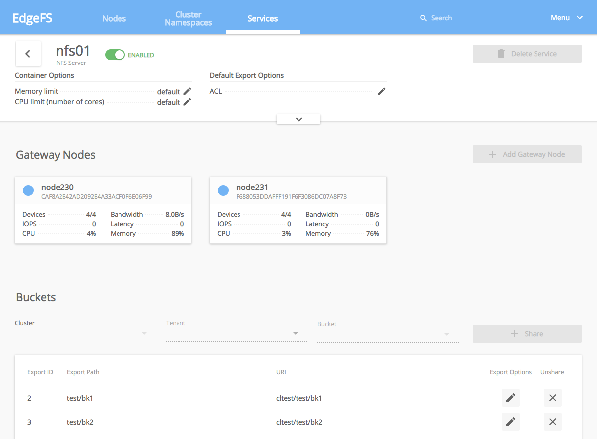

# EdgeFS Dashboard and User Interface

EdgeFS comes with built-in local cluster Dashboard and User Interface.

The dashboard is a very helpful tool to give you an overview of the status of your cluster, including overall health,
status of the corosync quorum, status of the VDEVs, and other EdgeFS services.


Rook EdgeFS Operator enables the dashboard by default.
A K8s service will be created to expose HTTP/S ports inside the cluster.

This example shows what ports was configured for EdgeFS right after successful cluster deployment:

```console
# kubectl get svc -n rook-edgefs
NAME                  TYPE        CLUSTER-IP      EXTERNAL-IP   PORT(S)                                        AGE
rook-edgefs-restapi   NodePort    10.105.177.93   <none>        8881:32135/TCP,8080:31363/TCP,4443:31485/TCP   3h14m
rook-edgefs-ui        NodePort    10.97.70.209    <none>        3000:32048/TCP,3443:30273/TCP                  3h14m
rook-edgefs-mgr       NodePort    10.108.199.1    <none>        6789:31370/TCP                                 3h14m
```

The `rook-edgefs-restapi` service is used for the [Prometheus metrics](edgefs-monitoring.md) scrape and REST API endpoints.
REST API endpoint is used by Console and Graphical UIs. It exposing ClusterIPs with HTTP ports 8080 and 4443(SSL). NodePort(s) for external access automatically pre-created.

The `rook-edgefs-ui` service is used to expose browser based User Interface ports.
Using NodePort you will be able to connect to the dashboard by direct node IP and provided port number, in this example at `http://NODEIP:32048`.

The `rook-edgefs-mgr` service is for gRPC communication between the [EdgeFS CSI Provisioner](edgefs-csi.md), REST API and services. It exposes cluster internal port 6789.

## Dynamic EdgeFS Service CRD editing

One of the very useful features of EdgeFS Dashboard is Dynamic Service CRD editing UI. Ability to edit CRDs via intuitive graphical interface can simplify on-going EdgeFS cluster management drastically. For instance, below picture demonstrates how NFS CRD service can be dynamically edited, exports can be added or removed:



EdgeFS UI renders user requests and sends them to the REST API where service CRD is constructed, validated and executed. Certain parameters can only be updated within a cluster service definition itself, and as such this UI blends the two, thus providing simplified management functionality.

### Credentials

After you connect to the dashboard you will need to login for secure access. Rook EdgeFS operator creates a default user named
`admin` and password `edgefs`. It can be changed later via `neadm system passwd` command executed within `mgr` pod.
