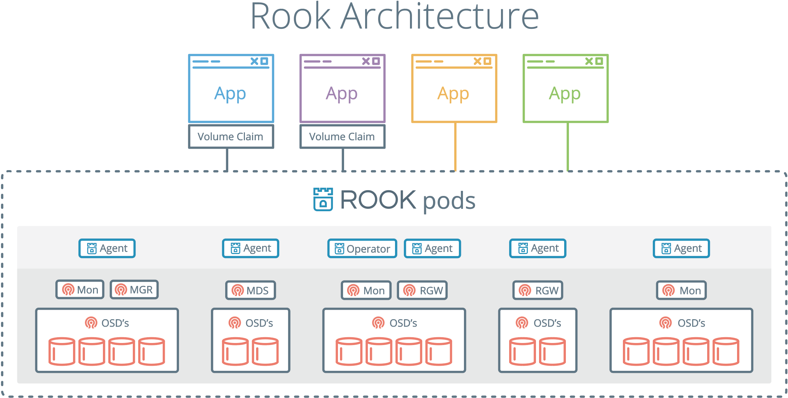

# Rook on Kubernetes

- [Quickstart](#quickstart)
- [Design](#design)

## Quickstart

This example shows how to build a simple, multi-tier web application on Kubernetes using persistent volumes enabled by Rook.

### Minimum Version

Kubernetes **v1.6** or higher is targeted by Rook (while Rook is in alpha it will track the latest release to use the latest features).

Support is available for Kubernetes **v1.5.2**, although your mileage may vary.
You will need to use the yaml files from the [1.5 folder](/cluster/examples/kubernetes/1.5).

### Prerequisites

To make sure you have a Kubernetes cluster that is ready for `Rook`, you can [follow these quick instructions](k8s-pre-reqs.md).

If you are using `dataDirHostPath` to persist rook data on kubernetes hosts, make sure your host has at least 5GB of space available on the specified path.

### Deploy Rook

With your Kubernetes cluster running, Rook can be setup and deployed by simply creating the rook-operator deployment and creating a rook cluster. To customize the operator settings, see the [Rook Helm Chart](helm-operator.md).

```bash
cd cluster/examples/kubernetes
kubectl create -f rook-operator.yaml

# verify the rook-operator and rook-agents pods are in the `Running` state before proceeding
kubectl -n rook-system get pod
```

---
#### **Restart Kubelet**
**(K8S 1.7.x and older only)**

For versions of Kubernetes prior to 1.8, the Kubelet process on all nodes will require a restart after the Rook operator and Rook agents have been deployed. As part of their initial setup, the Rook agents deploy and configure a Flexvolume plugin in order to integrate with Kubernetes' volume controller framework. In Kubernetes v1.8+, the [dynamic Flexvolume plugin discovery](https://github.com/kubernetes/community/blob/master/contributors/devel/flexvolume.md#dynamic-plugin-discovery) will find and initialize our plugin, but in older versions of Kubernetes a manual restart of the Kubelet will be required.

#### **Disable Attacher-detacher controller**
**(K8S 1.6.x only)**

For Kubernetes 1.6, it is also necessary to pass the `--enable-controller-attach-detach=false` flag to Kubelet when you restart it.  This is a workaround for a [Kubernetes issue](https://github.com/kubernetes/kubernetes/issues/47109) that only affects 1.6.

---

Now that the rook-operator pod is running, we can create the Rook cluster. For the cluster to survive reboots, 
make sure you set the `dataDirHostPath` property. For more settings, see the documentation on [configuring the cluster](cluster-crd.md). 


Save the cluster spec as `rook-cluster.yaml`:

```yaml
apiVersion: v1
kind: Namespace
metadata:
  name: rook
---
apiVersion: rook.io/v1alpha1
kind: Cluster
metadata:
  name: rook
  namespace: rook
spec:
  versionTag: v0.6.0
  dataDirHostPath: /var/lib/rook
  storage:
    useAllNodes: true
    useAllDevices: false
    storeConfig:
      storeType: bluestore
      databaseSizeMB: 1024
      journalSizeMB: 1024
```

Create the cluster:

```bash
kubectl create -f rook-cluster.yaml
```

Use `kubectl` to list pods in the `rook` namespace. You should be able to see the following pods once they are all running:

```bash
$ kubectl -n rook get pod
NAME                              READY     STATUS    RESTARTS   AGE
rook-api-1511082791-7qs0m         1/1       Running   0          5m
rook-ceph-mgr0-1279756402-wc4vt   1/1       Running   0          5m
rook-ceph-mon0-jflt5              1/1       Running   0          6m
rook-ceph-mon1-wkc8p              1/1       Running   0          6m
rook-ceph-mon2-p31dj              1/1       Running   0          6m
rook-ceph-osd-0h6nb               1/1       Running   0          5m
```

## Storage

For a walkthrough of the three types of storage exposed by Rook, see the guides for:
- **[Block](k8s-block.md)**: Create block storage to be consumed by a pod
- **[Shared File System](k8s-filesystem.md)**: Create a file system to be shared across multiple pods
- **[Object](k8s-object.md)**: Create an object store that is accessible inside or outside the Kubernetes cluster

## Tools

We have created a toolbox container that contains the full suite of Ceph clients for debugging and troubleshooting your Rook cluster.  Please see the [toolbox readme](toolbox.md) for setup and usage information. Also see our [advanced configuration](advanced-configuration.md) document for helpful maintenance and tuning examples.

The toolbox also contains the `rookctl` tool as required in the [File System](k8s-filesystem.md) and [Object](k8s-object.md) walkthroughs, or a [simplified walkthrough of block, file and object storage](client.md). In the near future, `rookctl` will not be required for kubernetes scenarios.

### Monitoring

Each Rook cluster has some built in metrics collectors/exporters for monitoring with [Prometheus](https://prometheus.io/).
To learn how to set up monitoring for your Rook cluster, you can follow the steps in the [monitoring guide](./k8s-monitoring.md).

## Teardown

To clean up all the artifacts created by the demo, first cleanup the resources from the [block](k8s-block.md#teardown) and [file](k8s-filesystem.md#teardown) walkthroughs (unmount volumes, delete volume claims, etc).
Those steps have been copied below for convenience, but note that some of these may not exist if you did not complete those parts of the demo:
```console
kubectl delete -f wordpress.yaml
kubectl delete -f mysql.yaml
kubectl delete -n rook pool replicapool
kubectl delete storageclass rook-block
kubectl -n kube-system delete secret rook-admin
kubectl delete -f kube-registry.yaml
```

After those resources have been cleaned up, you can then delete your Rook cluster:
```console
kubectl delete -n rook cluster rook
```

This will begin the process of all cluster resources being cleaned up, after which you can delete the rest of the deployment with the following:
```console
kubectl delete -n rook serviceaccount rook-api
kubectl delete -n rook role rook-api
kubectl delete -n rook rolebinding rook-api
kubectl delete -n rook serviceaccount rook-ceph-osd
kubectl delete -n rook role rook-ceph-osd
kubectl delete -n rook rolebinding rook-ceph-osd
kubectl delete thirdpartyresources cluster.rook.io pool.rook.io objectstore.rook.io filesystem.rook.io volumeattachment.rook.io # ignore errors if on K8s 1.7+
kubectl delete crd clusters.rook.io pools.rook.io objectstores.rook.io filesystems.rook.io volumeattachments.rook.io  # ignore errors if on K8s 1.5 and 1.6
kubectl delete -n rook-system daemonset rook-agent
kubectl delete -f rook-operator.yaml
kubectl delete clusterroles rook-agent
kubectl delete clusterrolebindings rook-agent
kubectl delete namespace rook
```
If you modified the demo settings, additional cleanup is up to you for devices, host paths, etc.

## Design

Rook enables storage software systems to run on Kubernetes using Kubernetes primitives. Although Rook's reference storage system is Ceph, support for other storage systems can be added. The following image illustrates how Rook integrates with Kubernetes:


With Rook running in the Kubernetes cluster, Kubernetes applications can
mount block devices and filesystems managed by Rook, or can use the S3/Swift API for object storage. The Rook operator
automates configuration of storage components and monitors the cluster to ensure the storage remains available
and healthy. There is also a REST API service for configuring the Rook storage and a command line tool called `rookctl`.

The Rook operator is a simple container that has all that is needed to bootstrap
and monitor the storage cluster. The operator will start and monitor [ceph monitor pods](https://github.com/rook/rook/blob/master/design/mon-health.md) and a daemonset for the OSDs, which provides basic
RADOS storage as well as a deployment for a RESTful API service. When requested through the api service,
object storage (S3/Swift) is enabled by starting a deployment for RGW, while a shared file system is enabled with a deployment for MDS.

The operator will monitor the storage daemons to ensure the cluster is healthy. Ceph mons will be started or failed over when necessary, and
other adjustments are made as the cluster grows or shrinks.  The operator will also watch for desired state changes
requested by the api service and apply the changes.

Rook operator also creates the Rook agents. These agents are pods deployed on every Kubernetes node. Each agent configures a Flexvolume plugin that integrates with Kubernetes' volume controller framework and also handle all storage operations required on the node, such as attaching network storage devices, mounting volumes and formating filesystem.



The Rook daemons (Mons, OSDs, MGR, RGW, and MDS) are compiled to a single binary `rook`, and included in a minimal container.
The `rook` container includes Ceph daemons and tools to manage and store all data -- there are no changes to the data path.
Rook does not attempt to maintain full fidelity with Ceph. Many of the Ceph concepts like placement groups and crush maps
are hidden so you don't have to worry about them. Instead Rook creates a much simplified UX for admins that is in terms
of physical resources, pools, volumes, filesystems, and buckets.

Rook is implemented in golang. Ceph is implemented in C++ where the data path is highly optimized. We believe
this combination offers the best of both worlds.

For more detailed design documentation, see the [design docs](https://github.com/rook/rook/tree/master/design).
