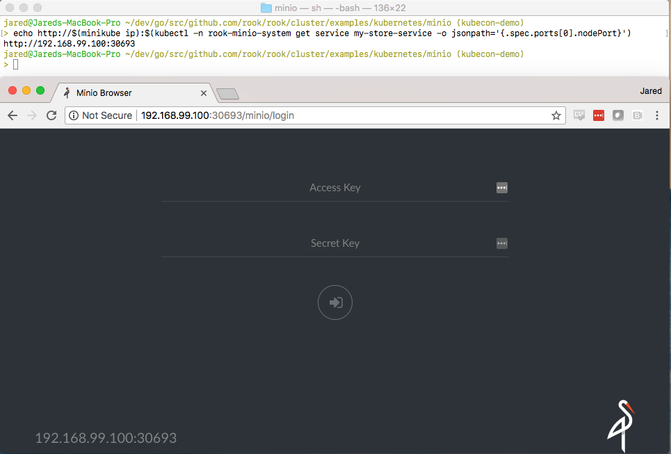

# Minio Object Store Quickstart

Minio is a high performance distributed object storage server, designed for
large-scale private cloud infrastructure.
Rook provides an operator to deploy and manage Minio clusters.

## Prerequisites

A Kubernetes cluster is necessary to run the Rook Minio operator.
To make sure you have a Kubernetes cluster that is ready for `Rook`, you can [follow these instructions](k8s-pre-reqs.md).

## Deploy the Minio Operator

First deploy the Rook Minio operator using the following commands:

```console
cd cluster/examples/kubernetes/minio
kubectl create -f operator.yaml
```

You can check if the operator is up and running with:

```console
kubectl -n rook-minio-system get pod
```

## Create and Initialize a Distributed Minio Object Store

Now that the operator is running, we can create an instance of a distributed Minio object store by creating an instance of the `objectstore.minio.rook.io` resource.
Some of that resource's values are configurable, so feel free to browse `object-store.yaml` and tweak the settings to your liking.

It is **strongly recommended** to update the values of `accessKey` and `secretKey` in `object-store.yaml` to a secure key pair,
as described in the [Minio client quickstart guide](https://docs.minio.io/docs/minio-client-quickstart-guide).

When you are ready to create a Minio object store, simply run:

```console
kubectl create -f object-store.yaml
```

We can verify that a Kubernetes object has been created that represents our new Minio object store
with the command below. This is important because it shows that Rook has successfully extended
Kubernetes to make Minio object stores a first class citizen in the Kubernetes cloud-native
environment.

```console
kubectl -n rook-minio get objectstores.minio.rook.io
```

To check if all the desired replicas are running, you should see the same number of entries from the following command as the replica count that was specified in `object-store.yaml`:

```console
kubectl -n rook-minio get pod -l app=minio,objectstore=my-store
```

## Accessing the Object Store

Minio comes with an embedded web based object browser. In the example, the object store we have created can be exposed external to the cluster at the Kubernetes cluster IP via a "NodePort". We can see
which port has been assigned to the service via:

```console
kubectl -n rook-minio get service minio-my-store -o jsonpath='{.spec.ports[0].nodePort}'
```

If you are using [Minikube](https://github.com/kubernetes/minikube), you can get your cluster IP via
`minikube ip`.
The full address of the Minio service when using Minikube can be obtained with the following:

```console
echo http://$(minikube ip):$(kubectl -n rook-minio get service minio-my-store -o jsonpath='{.spec.ports[0].nodePort}')
```

Copy and paste the full address and port into an internet browser and you will be taken to the Minio web console login page, as shown in the screenshot below:



## Clean up

To clean up all resources associated with this walk-through, you can run the commands below.

**NOTE** that this will destroy your Minio object store and delete all of its associated data.

```console
kubectl delete -f object-store.yaml
kubectl delete -f operator.yaml
```

## Troubleshooting

If the Minio cluster does not come up, the first step would be to examine the operator's logs:

```console
kubectl -n rook-minio-system logs -l app=rook-minio-operator
```

If everything looks OK in the operator logs, you can also look in the logs for one of the Minio instances. Assuming your `object-store.yaml` file named it "my-store", each node in the cluster can be inspected via:

```console
kubectl -n rook-minio logs my-store-0
```

Feel free to modify the above to inspect other instances.
