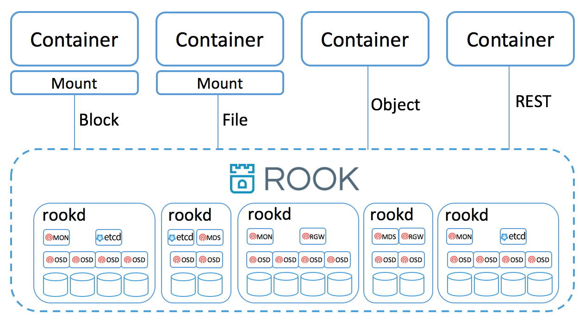

# Rook Standalone

- [Directly on Linux Host](#directly-on-linux-host)
- [Vagrant](#vagrant)
- [Design](#design)

## Directly on Linux Host

Rook can be deployed as a standalone service directly on any modern Linux host by running the following:

1. Download the latest client and server binaries
   ```bash
   wget https://github.com/rook/rook/releases/download/v0.4.0/rook-v0.4.0-linux-amd64.tar.gz
   tar xvf rook-v0.4.0-linux-amd64.tar.gz
   ```

2. Start a one node Rook cluster
   ```bash
   ./rookd --config-dir /tmp/rook-test
   ```

3. In another console (but in the same path), verify the Rook cluster is ready
   ```bash
   ./rookctl status
   ```

At this point, you can use the `rookctl` tool along with some [simple steps to create and manage block, file and object storage](client.md).


## Vagrant

Rook is also easy to run in virutal machines with `vagrant` using the standalone [Vagrantfile](/demo/standalone/Vagrantfile).  When instructed, `vagrant` will start up CoreOS virtual machines and launch `rookd` via `rkt`.  Note that you can make configuration changes as desired in the provided [cloud config file](/demo/standalone/cloud-config.yml.in).

```
cd demo/standalone
vagrant up
```

### Rook Client Tool
Once the Rook cluster in Vagrant is running and initialized, you can use the `rookctl` client tool to manage the cluster and consume the storage.  First, either use a locally built `rookctl` tool or download the latest release from github:
```
wget https://github.com/rook/rook/releases/download/v0.4.0/rook-v0.4.0-linux-amd64.tar.gz
tar xvf rook-v0.4.0-linux-amd64.tar.gz
```

Verify the cluster is up and running:
```
export ROOK_API_SERVER_ENDPOINT="172.20.20.10:8124"
./rookctl status
```

At this point, you can use the `rookctl` tool along with some [simple steps to create and manage block, file and object storage](client.md).

### Clean up

When you are all done with your Rook cluster in Vagrant, you can clean everything up by destroying the VMs with:
```
vagrant destroy -f
rm -f .discovery-token
```

## Design

Rook supports an environment where there is no orchestration platform. Rook comes with its own basic orchestration 
engine based on Etcd that is activated when not running in Kubernetes. 



The Rook daemon, `rookd`, is a single binary that is self-contained and has all that is needed to bootstrap, scale
and manage a storage cluster. `rookd` is typically compiled into a single static binary (just like most golang
binaries) or a dynamic binary that takes a dependency on mostly libc. It can run in minimal containers, alongside a
hypervisor, or directly on the host on most Linux distributions. Each machine in the cluster must run the Rook daemon.

`rookd` embeds Etcd to store configuration and coordinate cluster-wide management operations. `rookd` will automatically
bootstrap Etcd, manage it, and scale it as the cluster grows. It's also possible to use an external Etcd instead of the embedded one
if needed.

Standalone Rook still requires some key orchestration features such as resource management, health monitoring, failover, and upgrades. 
If this scenario is interesting to you, contributions are welcome!