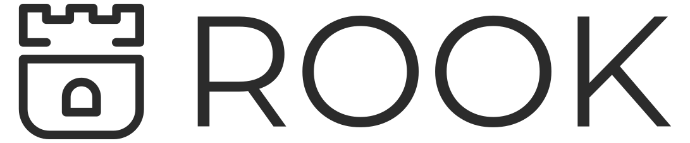

# What is Rook?

Rook is an open source **cloud-native storage orchestrator** for Kubernetes, providing the platform, framework, and support for a diverse set of storage solutions to natively integrate with cloud-native environments.

Rook turns storage software into self-managing, self-scaling, and self-healing storage services. It does this by automating deployment, bootstrapping, configuration, provisioning, scaling, upgrading, migration, disaster recovery, monitoring, and resource management. Rook uses the facilities provided by the underlying cloud-native container management, scheduling and orchestration platform to perform its duties.

Rook integrates deeply into cloud native environments leveraging extension points and providing a seamless experience for scheduling, lifecycle management, resource management, security, monitoring, and user experience.

For more details about the storage solutions currently supported by Rook, please refer to the [project status section](#project-status) below.
We plan to continue adding support for other storage systems and environments based on community demand and engagement in future releases. See our [roadmap](ROADMAP.md) for more details.

Rook is hosted by the [Cloud Native Computing Foundation](https://cncf.io) (CNCF) as a [graduated](https://www.cncf.io/announcements/2020/10/07/cloud-native-computing-foundation-announces-rook-graduation/) level project. If you are a company that wants to help shape the evolution of technologies that are container-packaged, dynamically-scheduled and microservices-oriented, consider joining the CNCF. For details about who's involved and how Rook plays a role, read the CNCF [announcement](https://www.cncf.io/blog/2018/01/29/cncf-host-rook-project-cloud-native-storage-capabilities).

## Getting Started and Documentation

For installation, deployment, and administration, see our [Documentation](https://rook.github.io/docs/rook/latest).

## Contributing

We welcome contributions. See [Contributing](CONTRIBUTING.md) to get started.

## Report a Bug

For filing bugs, suggesting improvements, or requesting new features, please open an [issue](https://github.com/rook/rook/issues).

### Reporting Security Vulnerabilities

If you find a vulnerability or a potential vulnerability in Rook please let us know immediately at
[cncf-rook-security@lists.cncf.io](mailto:cncf-rook-security@lists.cncf.io). We'll send a confirmation email to acknowledge your
report, and we'll send an additional email when we've identified the issues positively or
negatively.

For further details, please see the complete [security release process](SECURITY.md).

## Contact

Please use the following to reach members of the community:

- Slack: Join our [slack channel](https://slack.rook.io)
- GitHub: Start a [discussion](https://github.com/rook/rook/discussions) or open an [issue](https://github.com/rook/rook/issues)
- Twitter: [@rook_io](https://twitter.com/rook_io)
- Security topics: [cncf-rook-security@lists.cncf.io](#reporting-security-vulnerabilities)

### Community Meeting

A regular community meeting takes place every other [Tuesday at 9:00 AM PT (Pacific Time)](https://zoom.us/j/392602367?pwd=NU1laFZhTWF4MFd6cnRoYzVwbUlSUT09).
Convert to your [local timezone](http://www.thetimezoneconverter.com/?t=9:00&tz=PT%20%28Pacific%20Time%29).

Any changes to the meeting schedule will be added to the [agenda doc](https://docs.google.com/document/d/1exd8_IG6DkdvyA0eiTtL2z5K2Ra-y68VByUUgwP7I9A/edit?usp=sharing) and posted to [Slack #announcements](https://rook-io.slack.com/messages/C76LLCEE7/).

Anyone who wants to discuss the direction of the project, design and implementation reviews, or general questions with the broader community is welcome and encouraged to join.

- Meeting link: <https://zoom.us/j/392602367?pwd=NU1laFZhTWF4MFd6cnRoYzVwbUlSUT09>
- [Current agenda and past meeting notes](https://docs.google.com/document/d/1exd8_IG6DkdvyA0eiTtL2z5K2Ra-y68VByUUgwP7I9A/edit?usp=sharing)
- [Past meeting recordings](https://www.youtube.com/playlist?list=PLP0uDo-ZFnQP6NAgJWAtR9jaRcgqyQKVy)

## Project Status

The status of each storage provider supported by Rook can be found in the table below.
Each API group is assigned its own individual status to reflect their varying maturity and stability.
More details about API versioning and status in Kubernetes can be found on the Kubernetes [API versioning page](https://kubernetes.io/docs/concepts/overview/kubernetes-api/#api-versioning), but the key difference between the statuses are summarized below:

- **Alpha:** The API may change in incompatible ways in a later software release without notice, recommended for use only in short-lived testing clusters, due to increased risk of bugs and lack of long-term support.
- **Beta:** Support for the overall features will not be dropped, though details may change. Support for upgrading or migrating between versions will be provided, either through automation or manual steps.
- **Stable:** Features will appear in released software for many subsequent versions and support for upgrading between versions will be provided with software automation in the vast majority of scenarios.

| Name | Details                                                                                                                                                    | API Group       | Status |
| ---- | ---------------------------------------------------------------------------------------------------------------------------------------------------------- | --------------- | ------ |
| Ceph | [Ceph](https://ceph.com/) is a distributed storage system that provides file, block and object storage and is deployed in large scale production clusters. | ceph.rook.io/v1 | Stable |

This repo is for the Ceph storage provider. The [Cassandra](https://github.com/rook/cassandra) and [NFS](https://github.com/rook/nfs) storage providers moved to a separate repo to allow for each [storage provider](https://rook.github.io/docs/rook/latest/storage-providers.html) to have an independent development and release schedule.

### Official Releases

Official releases of Rook can be found on the [releases page](https://github.com/rook/rook/releases).
Please note that it is **strongly recommended** that you use [official releases](https://github.com/rook/rook/releases) of Rook, as unreleased versions from the master branch are subject to changes and incompatibilities that will not be supported in the official releases.
Builds from the master branch can have functionality changed and even removed at any time without compatibility support and without prior notice.

## Licensing

Rook is under the Apache 2.0 license.

