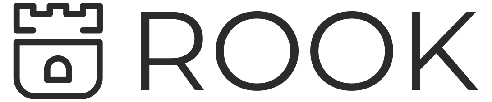

# What is Rook?

Rook is an open source **cloud-native storage orchestrator** for Kubernetes, providing the platform, framework, and support for Ceph storage to natively integrate with Kubernetes.

[Ceph](https://ceph.com/) is a distributed storage system that provides file, block and object storage and is deployed in large scale production clusters.

Rook automates deployment and management of Ceph to provide self-managing, self-scaling, and self-healing storage services.
The Rook operator does this by building on Kubernetes resources to deploy, configure, provision, scale, upgrade, and monitor Ceph.

The status of the Ceph storage provider is **Stable**. Features and improvements will be planned for many future versions. Upgrades between versions are provided to ensure backward compatibility between releases.

Rook is hosted by the [Cloud Native Computing Foundation](https://cncf.io) (CNCF) as a [graduated](https://www.cncf.io/announcements/2020/10/07/cloud-native-computing-foundation-announces-rook-graduation/) level project. If you are a company that wants to help shape the evolution of technologies that are container-packaged, dynamically-scheduled and microservices-oriented, consider joining the CNCF. For details about who's involved and how Rook plays a role, read the CNCF [announcement](https://www.cncf.io/blog/2018/01/29/cncf-host-rook-project-cloud-native-storage-capabilities).

## Getting Started and Documentation

For installation, deployment, and administration, see our [Documentation](https://rook.github.io/docs/rook/latest-release) and [QuickStart Guide](https://rook.github.io/docs/rook/latest-release/Getting-Started/quickstart).

## Contributing

We welcome contributions! Whether you are a developer, technical writer, or user, there are many ways to contribute:
* Review the [Contributing Guide](CONTRIBUTING.md) to learn how to set up your environment and submit Pull Requests.
* Join our [Slack](https://slack.rook.io) to discuss ideas with the community.
* Report bugs or request features via [GitHub Issues](https://github.com/rook/rook/issues).
* Help improve our [Documentation](https://github.com/rook/rook/tree/master/Documentation).

## License

Rook is licensed under the [Apache License, Version 2.0](LICENSE).