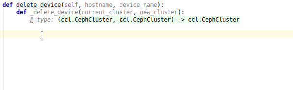

# `rook-client` Python API Classes  

Automatically generated models for Rook's custom resource definitions.

Right now, it supports three operators:

* Ceph
* Edgefs
* Cassandra

It is used to type check client code against the Rook API

Inspired by https://github.com/kubernetes-client/python/tree/master/kubernetes/client/models

Main uses case is the mgr/rook orchestrator module of the Ceph MGR

## Installing `rook-client`

To install the package, run:

```bash
pip install -e 'git+https://github.com/rook/rook#egg=rook-client&subdirectory=build/codegen/python'
```


## Example

```python
def objectstore(api_name, name, namespace, instances):
    from rook_client.ceph import cephobjectstore as cos
    rook_os = cos.CephObjectStore(
        apiVersion=api_name,
        metadata=dict(
            name=name,
            namespace=namespace
        ),
        spec=cos.Spec(
            metadataPool=cos.MetadataPool(
                failureDomain='host',
                replicated=cos.Replicated(
                    size=1
                )
            ),
            dataPool=cos.DataPool(
                failureDomain='osd',
                replicated=cos.Replicated(
                    size=1
                )
            ),
            gateway=cos.Gateway(
                type='s3',
                port=80,
                instances=instances
            )
        )
    )
    return rook_os.to_json()
```

## Demo



## Regenerate

To re-generate the python files, run 

```bash
./generate.sh
```

## Rational

The Rook CRDs are evolving over time and to verify that clients make use of the correct definitions, 
this project provides generated API classes to let users write correct clients easily.