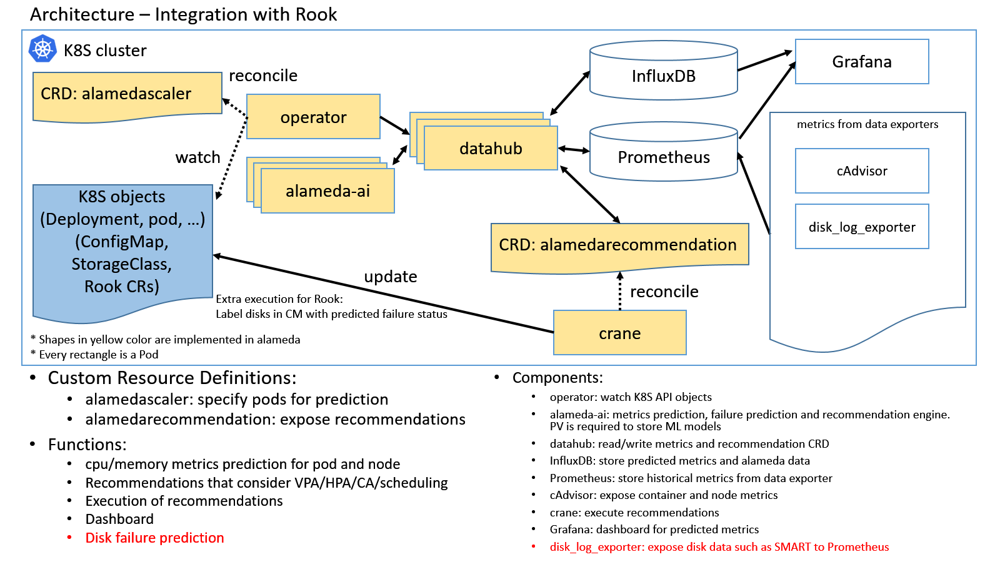
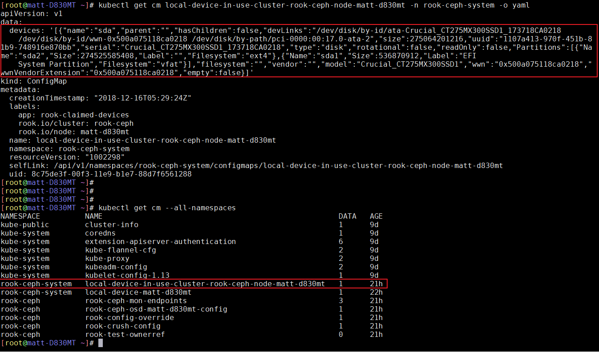

## What is Alameda

Alameda is an intelligent resource orchestrator for Kubernetes, providing the features of autonomous balancing, scaling, and scheduling by using machine learning. Alameda learns the continuing changes of computing resources from K8S clusters, predicts the future computing resources demands for pods and nodes, and intelligently orchestrates the underlying computing resources without manual configuration.

For more details, please refer to https://github.com/containers-ai/Alameda

## How Alameda works with Rook


(Note: CRD AlamedaResource is called AlamedaScaler and CRD AlamedaResourcePrediction is called AlamedaRecommendation from release 0.2)

This figure illustrates Alameda's architecture and how it can work with Rook. The primary purpose of Alameda is to **recommend optimal computing resource configuration for Kubernetes**. To achieve that, users of Alameda (which is Rook here) specify which Pods require metrics prediction and resource configuration recommendation by creating *AlamedaResource* CRs ([example](https://github.com/containers-ai/alameda/blob/master/example/samples/nginx/alameda_deployment.yaml)). After some machine learning calculations, users can see metrics predictions and recommendations in the *AlamedaResourcePrediction* CRs. An example can be found [here](https://github.com/containers-ai/alameda/blob/master/docs/quickstart.md#example). Please note that starting from Alameda release 0.2, the metrics predictions will be store in a time-series DB instead of CRs due to performance and size considerations of etcd.

Another function that Alameda provided for Rook is **disk failure prediction**. This function can be switch on/off when deploying Alameda or in Alameda's configmap. When this function is enabled, Alameda requires [prometheus_disk_log_exporter](https://github.com/containers-ai/prometheus_disk_log_exporter) to expose disk data such as S.M.A.R.T. to Prometheus. Once Alameda have disk failure prediction results, it will expose them in Alameda's recommendation. Since the physical disk can be identified by their world wild names (WWN) or serial numbers, Rook can pick up from here or Alameda can write the result to Rook's configmap that is named with *device-in-use* prefix. For example, Rook maintains a configmap to track the devices in use. Crane component of Alameda can execute the disk failure prediction by adding data to the configmap.


An example disk failure prediction result is:
```
{
    "near_failure": "Good",
    "disk_wwn": "500a075118cb0318",
    "serial_number": "174718CB0318",
    "predicted": "2018-05-30 18:33:12",
}
```
and the *near_failure* attribute indicates disk life expectancy in the following table.

near_failure        | Life expectancy (weeks)                             
--------------------|------------------------------------------------------
Good                | > 6 weeks                                           |
Warning             | 2 weeks ~ 6 weeks                                   |
Bad                 | < 2 weeks                                           |


