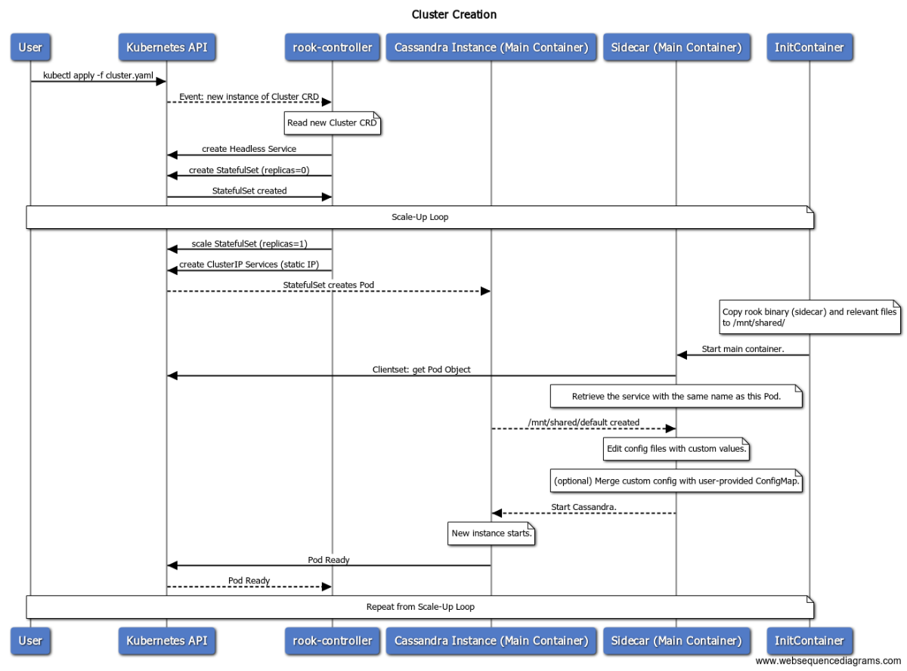

# Cluster Creation Design Doc

In this document, we outline the procedure we need to follow to bootstrap a new Cassandra Cluster from scratch. We also explain and evaluate any decisions we had to take.

## Sequencing of Events




Explanation:

1. **User** creates an instance of Cluster CRD, ie:

``` yaml
apiVersion: "cassandra.rook.io/v1alpha1"
kind: "Cluster"
metadata:
  name: "my-cassandra-cluster"
spec:
  version: "3.1.11"
  # Optional: repository overrides the default image repo
  repository: "custom-enterprise-repo.io/cassandra"
  # Optional: what database to expect in the image
  mode: cassandra | scylla
  dataCenter:
    name: "us-east-1"
    racks:
    - name: "us-east-1c"
      instances: 3
      # Optional: configMapName references a user's custom configuration for
      # a specific Cassandra Rack 
      configMapName: "cassandra-config"
      # Rook Common Type: StorageSpec
      storage:
        volumeClaims:
          - storageClassName:
            metadata:
              name: "cassandra-data"
            spec:
              accessModes: ["ReadWriteOnce"]
              storageClassName: default
              resources:
                requests:
                  storage: "500Gi"
      # Rook Common Type: PlacementSpec
      # Optional: Placement declares node/pod (anti)affinity
      placement:
        nodeAffinity: 
          requiredDuringSchedulingIgnoredDuringExecution:
            nodeSelectorTerms:
              - matchExpressions:
                - key: failure-domain.beta.kubernetes.io/region
                  operator: In
                  values:
                  - us-east-1
                - key: failure-domain.beta.kubernetes.io/zone
                  operator: In
                  values:
                  - us-east-1c
      # Rook Common Type: ResourceSpec
      # Resources declares the CPU,RAM resources of a single instance of the Rack.
      resources:
        requests:
          cpu: "2000m"
          memory: "4Gi"
        limits:
          cpu: "2000m"
          memory: "4Gi"
```

2. **Controller** is informed of a new Cluster CRD instance. For each (dc,rack) it creates:
    1. A StatefulSet (see [Appendix A](#appendix-a)) 
    2. A Headless Service that clients will use to connect to ready members of the database.
    3. ClusterIP Services that serve as static IPs for Pods. Labeled accordingly if they are seeds. Each Service is named after the Pod that uses it.

3. **StatefulSet Pod** starts and it starts the init container:
    1. Init container starts and copies the rook binary and other necessary files (like plugins) to the shared volume `/mnt/shared/`, then exits.
    2. The Cassandra container starts with the rook binary (sidecar) as its entrypoint. 
    3. Sidecar starts and edits config files with custom values applying to Kubernetes (see [Appendix B](#appendix-b)).
    4. Sidecar starts the Cassandra process.
    

## Design Decisions

* Seeds: for the time being, 2 members from each rack will serve as seeds. This provides good fault-tolerance without sacrificing performance.

* Sidecar and Cassandra run in the same container. This provides the following advantages:
    1. Sidecar has direct access to the filesystem of the Cassandra instance, in order to edit config files in-place. 
    2. Separate containers means users need to define cpu and ram requests for the sidecar. This fragments the resources of a Node and provides a bad UX (ie if a Node has 16 cores, you want to give 16 to Cassandra, not 15.9 to Cassandra and 0.1 to the Sidecar). It also doesn't integrate well with the [CPU Manager](https://kubernetes.io/blog/2018/07/24/feature-highlight-cpu-manager/) feature for cpu affinity, that users may want to use for additional performance. 

## Appendices

### Appendix A

The StatefulSet that will be created by the controller is more or less the following:

``` yaml
apiVersion: apps/v1
kind: StatefulSet
metadata: 
  name: <sts-name>
  namespace: <sts-name>
  labels:
    # Kubernetes recommended labels
    app.kubernetes.io/name: cassandra
    app.kubernetes.io/managed-by: rook 
    # Rook operator labels
    cassandra.rook.io/cluster: <cluster>
    cassandra.rook.io/datacenter: <datacenter>
    cassandra.rook.io/rack: <rack>
spec:
  replicas: <instances>
  serviceName: <sts-name>-hs
  selector:
    matchLabels:
      cassandra.rook.io/cluster: <cluster>
      cassandra.rook.io/datacenter: <datacenter>
      cassandra.rook.io/rack: <rack>
  template:
    metadata:
      labels:
        cassandra.rook.io/cluster: <cluster>
        cassandra.rook.io/datacenter: <datacenter>
        cassandra.rook.io/rack: <rack>
    spec: 
      volumes: 
        - name: shared
          emptyDir: {}
      initContainers:
        - name: init
          image: rook/rook-cassandra
          imagePullPolicy: Always
          command:
          - "cp"
          - "-a"
          - "/sidecar/* /mnt/shared/"
          volumeMounts:
           - name: shared
             mountPath: /mnt/shared
      containers:
        - name: cassandra
          image: "<repository>:<version>"
          imagePullPolicy: IfNotPresent
          command:
            - "/mnt/shared/rook"
            - "cassandra"
            - "sidecar"
          ports:
            - containerPort: 7000
              name: intra-node
            - containerPort: 7001 
              name: tls-intra-node
            - containerPort: 7199 
              name: jmx
            - containerPort: 9042
              name: cql
            - containerPort: 9160
              name: thrift 
          env:
            - name: POD_IP
              valueFrom:
              fieldRef:
                fieldPath: status.podIP
          resources:
            limits: 
              cpu: <cassandra-cpu>
              memory: <cassandra-mem>
            requests: 
              cpu: <cassandra-cpu>
              memory: <cassandra-mem>
          volumeMounts: 
            - name: <sts-name>-data
              mountPath: /var/lib/cassandra
            - name: shared
              mountPath: /mnt/shared
              readOnly: true
  volumeClaimTemplates:
    - metadata:
        name: <sts-name>-data
      spec:
        storageClassName: <sc-name>
        accessModes: [ "ReadWriteOnce" ]
        resources: 
          requests:
            storage: <storage-request>
```


### Appendix B

The options that are of interest to the operator are:

#### cassandra.yaml

|  Option  |  Description  |  Our Value  |
  ---  |  ---  |  ---
|  `cluster_name`  |  |  name from Cluster CRD metadata  |
|  `listen_address`  | The IP address or hostname that Cassandra binds to for connecting to this node.  |  Pod.IP  |
|  `broadcast_address`  |  The "public" IP address this node uses to broadcast to other nodes outside the network or across regions.  |  `ClusterIP` Service's Virtual IP  |
|   `rpc_address`  | The listen address for client connections  |  Pod.IP  |
|   `broadcast_rpc_address`  |  RPC address to broadcast to drivers and other Cassandra nodes  | A publicly accessible IP, obtained via an Ingress. Otherwise, same as `broadcast_address`. | 
|  `endpoint_snitch`  |  Cassandra uses the snitch to locate nodes and route requests.  |  GossipingPropertyFileSnitch. Also need to pass DC, RACK values to container.  |
|  `seed_provider`  |  The addresses of hosts designated as contact points in the cluster. A joining node contacts one of the nodes in the -seeds list to learn the topology of the ring. | Controller will label Pods that will serve as seeds with a `cassandra.rook.io/seed` label. Then, when the Sidecar is setting up the ClusterIP service, it will label it accordingly. To get the seeds for a cluster, you need to query for services with `cassandra.rook.io/seed`, `cassandra.rook.io/cluster` labels set accordingly. If we could develop a custom SeedProvider that queries the Kubernetes API, that would be great. For starters, we can have the sidecar retrieve them and provide them through the --seeds list. |  

#### cassandra-env.sh

1. Load Jolokia for JMX <--> HTTP communication.
```bash
JVM_OPTS="$JVM_OPTS -javaagent:/mnt/shared/plugins/jolokia.jar=port=<agent_port>,host=<node_ip>"
```
