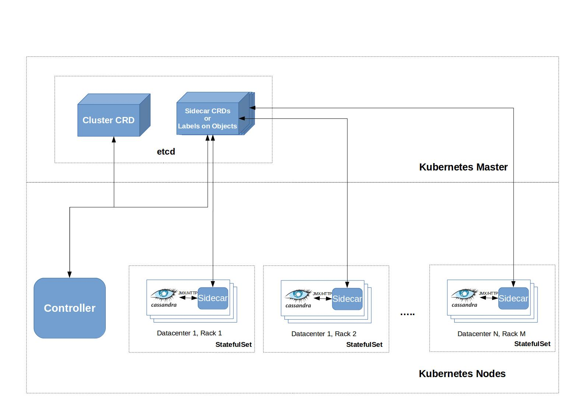

# Kubernetes Operator for Apache Cassandra

## Why ?

* Cassandra is one of the most popular NoSQL databases.
* Peer-to-Peer write-anywhere design for very high write and read throughput.
* Despite those advantages, maintaining a Cassandra cluster is a highly manual and tiring task, which requires extensive familiarity with Cassandra's internals.
* An operator will automate all the manual interventions that a human administrator normally has to perform and provide a production-ready database out-of-the-box.

## Features

The operator will provide all the important features of Cassandra while exposing a user-friendly declarative UI, in accordance to Kubernetes principles.
More specifically, those features include:

1. Cluster Creation
2. (Auto)Scaling 
3. Failed Cassandra Node Replacement / Recover from data loss
4. Schedule Node Repair
5. Backup/Restore
6. Metrics endpoint for Kubernetes

Since [Scylla](https://www.scylladb.com/) uses the same interfaces and protocols as Cassandra and offers significantly better performance, the operator will also try to support it. This effort will continue as long as the interfaces remain the same and code works for both databases with very minimal changes. If Scylla start to differ significantly, it should be broken into its own operator. This is not expected though, as it is supposed to be a drop-in replacement of Cassandra.

## Current Approaches

### Operator-Based Approaches

* [cassandra-operator](https://github.com/instaclustr/cassandra-operator) by [Instaclustr](https://www.instaclustr.com/): This is indeed a very promising project, coming from a company that offers managed Cassandra deployments. It also utilizes a sidecar, which accepts commands through HTTP endpoints. It is written in Java, so it misses on the more advanced functionality of client-go. Also I don't know how many people are out there developing Kubernetes operators in other than Golang languages, so that may be a barrier for the community the operator will attract. They also do not support different racks.
  * *Phase:* Alpha
  * *License:* Apache 2.0

* [navigator](https://github.com/jetstack/navigator) by [Jetstack](https://www.jetstack.io/): Navigator is aspiring to be a managed DBaaS platform on top of Kubernetes. Their model they promote is very similar to the one proposed here (CRD + Controller + Sidecar) and has been an inspiration while designing the model for Cassandra Operator. They currently provide operators for Cassandra and Elasticsearch.
  * *Phase:* Alpha
  * *License:* Apache 2.0

### Vanilla Approaches

* Kubernetes StatefulSets: this approach uses the out-of-the-box features of StatefulSets to run a Cassandra cluster. This usually works fine, until something goes wrong, like a node failure. Also, it is very limited in how much it can be extended for more advanced uses, like node replacement, backups, restores, monitoring, etc.
* Helm: this approach encapsulates much of the complexity of the vanilla approach, offering a better UX. However, it suffers from the same caveats.

## Design

### Goals

The operator should:
* Be level-based in the Kubernetes sense, immune from edge-case race-condition scenarios.
* Provide a UX consistent with the [Kuberneter API Conventions](https://github.com/kubernetes/community/blob/e8dbd18a193795bee952ba98c0c5529e880050f9/contributors/devel/api-conventions.md) as well as rook.
* Leverage the existing Kubernetes API Objects to offload as much work as possible. We don't want to reinvent the wheel.
* Provide an all-in-one production-ready solution to run Cassandra on Kubernetes.
* Allow for easy manual intervention when needed.


### Overview

* This operator will use the pattern: `CRD` + `Controller` + `Sidecar`



### Sidecar

In Cassandra, many actions require access to the cassandra process or the underlying system. More specifically:

* *Cluster Creation:* dynamically insert java classes and other preparations for Cassandra to run. 
* *Cassandra Node Replacement:* requires editing config files.
* *Backup, Monitoring:* requires talking to a JMX interface that the Cassandra process exposes.

By running a sidecar alongside Cassandra, we can monitor the process closely and deal with complex failure scenarios. 
For more information on how the sidecar works, please see the [sidecar design doc](sidecar.md)

### Cassandra-Kubernetes Mapping

* The design of the Cassandra CRD will follow the Cassandra terminology as much as possible, in order to be familiar to existing users of Cassandra and not confuse new users studying the Cassandra docs.

* Cassandra abstracts resources in the following order:
`Cluster` -> `Datacenter` -> `Rack` -> `Node`

* We map those abstractions to Kubernetes in the following way:

|  Cassandra    |  Kubernetes   |
|   :----:      |     :----:    |
|    Cluster    |  Cluster CRD  |
|   Datacenter  |  Pool of StatefulSets  |
|      Rack     |   StatefulSet | 
|     Node      |     Pod       |

### Cassandra Cluster CRD

An example CRD would look something like this: 

``` yaml
apiVersion: "cassandra.rook.io/v1alpha1"
kind: "Cluster"
metadata:
  name: "my-cassandra-cluster"
spec:
  version: "3.1.11"
  # Optional: repository overrides the default image repo
  repository: "custom-enterprise-repo.io/cassandra"
  dataCenter:
    name: "us-east-1"
    racks:
    - name: "us-east-1c"
      members: 3
      # Optional: configMapName references a user's custom configuration for
      # a specific Cassandra Rack 
      configMapName: "cassandra-config"
      # Rook Common Type: StorageSpec
      storage:
        volumeClaimTemplates:
          - storageClassName:
            metadata:
              name: "cassandra-data"
            spec:
              accessModes: ["ReadWriteOnce"]
              storageClassName: default
              resources:
                requests:
                  storage: "500Gi"
      # Rook Common Type: PlacementSpec
      # Optional: Placement declares node/pod (anti)affinity
      placement:
        nodeAffinity: 
          requiredDuringSchedulingIgnoredDuringExecution:
            nodeSelectorTerms:
              - matchExpressions:
                - key: failure-domain.beta.kubernetes.io/region
                  operator: In
                  values:
                  - us-east-1
                - key: failure-domain.beta.kubernetes.io/zone
                  operator: In
                  values:
                  - us-east-1c
      # Rook Common Type: ResourceSpec
      # Resources declares the CPU,RAM resources of a single instance of the Rack.
      resources:
        requests:
          cpu: "2000m"
          memory: "4Gi"
        limits:
          cpu: "2000m"
          memory: "4Gi"
  # Optional: sidecarImage overwrites the default image used
  sidecarImage: 
    repository: "rook.io/sidecar-cassandra"
    tag: "0.1"
```

* The operator will create a StatefulSet for every Rack in each Datacenter.
* In practice, Datacenter is usually mapped to a Region and Rack to an Availability Zone.

### Major Pain Point: Stable Pod Identity

A problem that every approach so far has, is dealing with loss of persistence.
If a Cassandra instance loses its data (ie the underlying node fails, the disk dies).
The replacing instance has to provide the IP of the instance it's replacing. Cassandra doesn't support stable hostnames as an identification method.
However, IPs on Kubernetes are ephemeral and that leaves us with 2 options:

* **Bookkeeping:** we do some kind of bookkeeping on Host-IDs (UUIDs uniquely identifying Cassandra instances) or IP addresses. This method has 2 major drawbacks:
  1. Complexity
  2. Subject to race-conditions in edge-case scenarios: since we don't know the instance's identity from the beginning, we have to query the instance to get it. If the instance loses its data (ie due to underlying node fail), then we have no way of knowing the identity of the instance.
* **Sticky IPs Workaround / Service per Instance:** we create a `ClusterIP` Service for each Cassandra instance(Pod). This essentially provides us with a stable IP address for each instance. Since Cassandra uses IP addresses as the means of identification, this means that we don't need to do any bookkeeping. Also, we are immune from race-conditions, as we know our instance's identity beforehand. Some sceptical thoughts about this method:
  1. Feels/Seems hacky
  2. Uses too many services: most clusters have a /12 IP block to utilize, so we do not expect them to run out of IPs soon.
  3. Performance Issues: since the default implementation of ClusterIPs is iptables this could be an issue with clusters in the 100s/1000s. However, an IPVS implementation of ClusterIP is [GA in 1.11](https://kubernetes.io/blog/2018/07/09/ipvs-based-in-cluster-load-balancing-deep-dive/) and works well even with 1000s of Services. 


Based on the above, in accordance to our goals, we choose to implement the operator using the Service Per Instance approach.

## Example Roadmap

* This may be subject to change.

1. Cluster Creation
2. Scaling Up
3. Scaling Down
4. Metrics Endpoint for Prometheus
5. Recover from data loss
6. Schedule Node Repair
7. Backup
8. Restore
