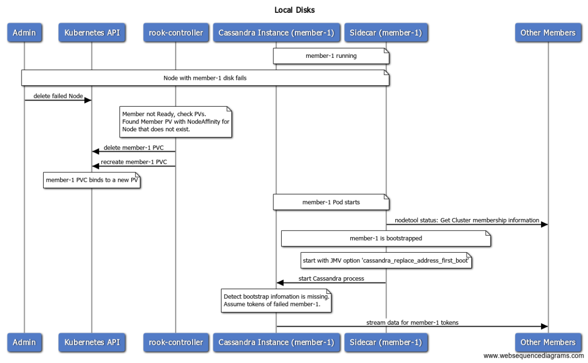

# Loss of Persistence - The Case of Local Disks

## The Problem

* Network Attached Storage is fault tolerant but slower and more expensive.
* Local Storage is much faster and cheaper but it is tied to the Node it lives on.

NoSQL databases like Cassandra implement fault tolerance and were designed with hardware failure in mind.
We should leverage these capabilities in the Cassandra Operator, 
so users can easily take advantage of the vastly superior performance of local disks.

These fault tolerant capabilities useful for all kinds of storage in case of data loss, 
but they are especially important for local storage, where failures are expected to happen often.

## Background

### Kubernetes Support For Local Storage

From the beginning of Kubernetes, storage solutions have focused on Network Attached Storage.
There has been very little support for using local storage and the way to do it until recently was by using hostPath volumes, which had a multitude of problems.

With Kubernetes 1.10, [the local Persistent Volumes feature graduated to beta](https://kubernetes.io/blog/2018/04/13/local-persistent-volumes-beta/), making local storage portable and easy to use on Kubernetes.
In order to use a local disk as a Persistent Volume, users can leverage [the local volume static provisioner](https://github.com/kubernetes-sigs/sig-storage-local-static-provisioner). 
To use a local Persistent Volume for a Cassandra Cluster, the user only needs to specify the correct `storageClassName`.

Let's now explore what happens when a local disk fails in Kubernetes, in some different cases:
1. **Disk exhibits errors and slow performance but hasn't failed yet:** The Local Provisioner won't do something about it. The [local volume monitor](https://github.com/kubernetes-sigs/sig-storage-local-static-provisioner/issues/10), a solution being discussed for such problems, should provide a solution once ready.
2. **Disk fails, mount point disappears:** The Local Provisioner won't do something about it. The [local volume monitor](https://github.com/kubernetes-sigs/sig-storage-local-static-provisioner/issues/10), a solution being discussed for such problems, should provide a solution once ready. This condition is easier to detect, so we can look into extending the Local Provisioner if we need it immediately.
3. **Node with local disk fails:** This is the most common scenario, especially in cloud environments. In a cloud environment, local storage can be lost by VM migrations, Kubernetes or security upgrades, Node failure or fencing.

The 3rd scenario, Node Failure, is the one we will focus on.

### Cassandra Support for Member Failures

Cassandra was built with fault tolerance in mind, so hardware failures were expected and included into the design.
The normal way for a human administrator to deal with a Member failure is:

1. Get the failed Member's IP address.
2. Start a new Member with the JVM flag `-Dcassandra.replace_address_first_boot=<dead_node_ip>`. When starting, Cassandra will check if the Member has its bootstrap data. If it doesn't, it means that the Member lost its data and should stream it from other Members. 

:warning: This only works if the Replication Factor is high enough. If some data have RF=1 and a Member fails, there is no-one to stream that data from.

## Algorithm

As we established before, our focus will be on the `Node Failure` scenario.

Let's see how a Node Failure would play out.
Assume a Kubernetes environment with a Cassandra Cluster of 3 Members using local disks, each Member on a different Node.
Node of member-1 fails, bringing the local disk down with it.

1. Administrator knows that the Node is failed and deletes the corresponding Node Object from Kubernetes.
2. Cassandra Operator: 
  1. Detects that a Member's PersistentVolume has NodeAffinity for a Node that does not exist.
  2. Deletes the Member's PVC and recreates it, in order to give that Member a new empty disk.
5. The member-1 Pod starts again. The Cassandra Sidecar:
  1. Contacts another Member and finds out that member-1 is bootstrapped.
  2. Starts Cassandra with the JVM option `-Dcassandra.replace_address_first_boot=<dead_node_ip>`.
6. Cassandra detects that bootstrap data is missing, assumes the failed member-1's tokens and streams its data back from other Members.

## Security Implications

Implementing this feature means exposing the Jolokia HTTP interface outside the Pod.
This is an interface that can be used to perform administrative actions on the Cluster.
It will be secured in the future when TLS is implemented for Cassandra's member-to-member communications.
For now, it does not represent a big security hole, because the setup isn't secure yet anyway.