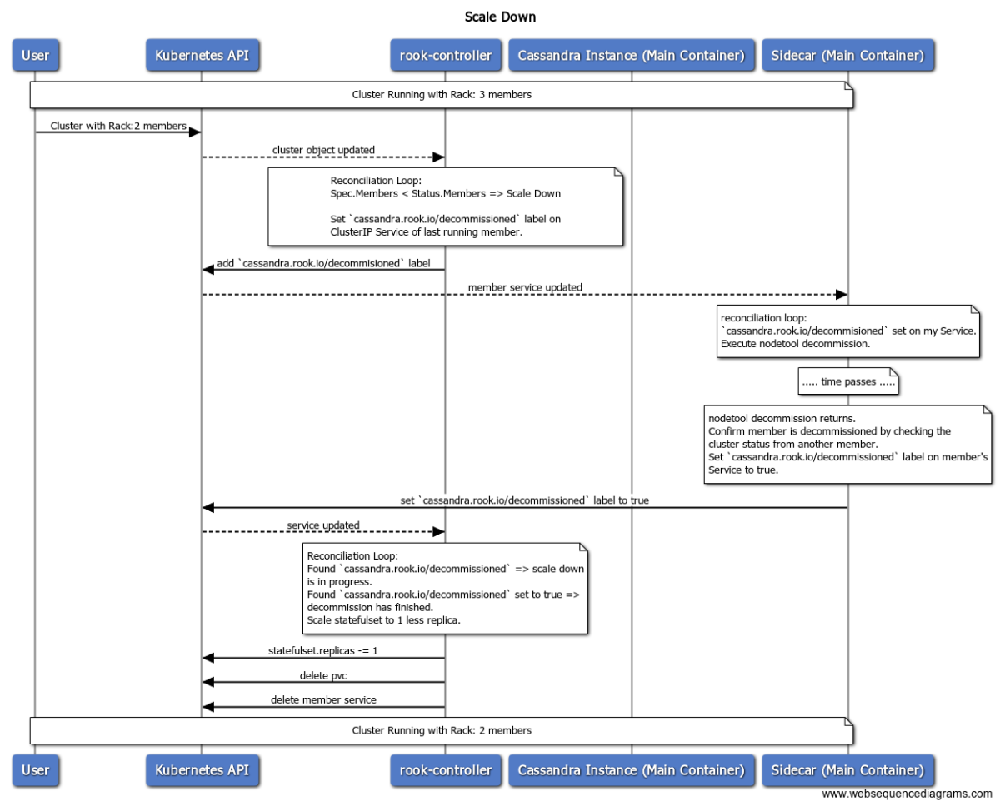

## Cassandra Scale Down

Overview of the actions we need to scale down a Cassandra Cluster.
Scaling down a Cassandra Cluster is a two part procedure:
1. Issue a `decommission` command on the instance that will shut down. Once the instance receives this command, it will stream its data to the other instances and then shut down permanently. This process can be very lengthy, especially for large datasets.
2. Once the instance has decommissioned, the StatefulSet can be safely scaled down. The PVC of the deleted Pod will remain (default behaviour of StatefulSet), so we need to clean it up or it may cause problems in the future (if the StatefulSet scales up again, the new Pod will get bound to the old PVC).

### Background

In Cassandra operator, each Pod has a corresponding ClusterIP Service, that serves as a static IP and thus its identity. We also use labels on those objects to communicate intent in our operator. For example, the `cassandra.rook.io/seed` label communicates that the instance is a seed.

For database management and operations, Cassandra uses a Java RPC Interface (JMX). Since Go can't talk to JMX, we use an HTTP<->JMX bridge, Jolokia. This way, we can operate Cassandra though HTTP calls.

### Algorithm

With that in mind, the proposed algorithm is:

* Phase 1
Operator:
1. Detect requested scale down (`Rack[i].Spec.Members` < `RackStatus.Members`)
2. Add label `cassandra.rook.io/decommissioned` to the ClusterIP Service of the last pod of the StatefulSet. This serves as the record of intent to decommission that instance.
Sidecar:
3. Detect the `cassandra.rook.io/decommissioned` label on the ClusterIP Service Object. 
4. Run `nodetool decommission` on the instance.

* Phase 2 
Sidecar: 
1. Confirm that `decommission` has completed by running `nodetool status` on another instance and confirming its own ip is no longer in the Cluster State.
2. Update label to `cassandra.rook.io/decommissioned: true`
Operator: 
3. Detect label change and scale down the StatefulSet.
4. Delete PVC of the now-deleted Pod.

### Security

* In order to get the status of the Cassandra cluster from a remote instance, we need to expose the Jolokia HTTP Server outside the local instance. This is a security concern, since it includes powerful management capabilities. To secure it, we will use HTTPS with client certificates. All servers will use the same private key, which will be created as a Secret by the operator and mounted on the Pods. Certificates will be self-signed, also by the same private key. This simplifies things and also provides reasonable security. To hack this setup, one would need to gain access to the Secret.

### Alternatives

* `preStop` lifecycle hook: another option would be to have a `preStop` lifecycle hook which will issue the decommission command. The problem with that approach is that `preStop` hooks are best-effort. The Pod will be deleted even if the `preStop` hook fails. That makes it a bad fit for Cassandra, since we need to be absolutely sure that a Pod has decommissioned, otherwise unpredictable things will happen.

