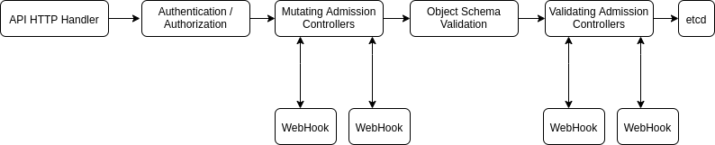
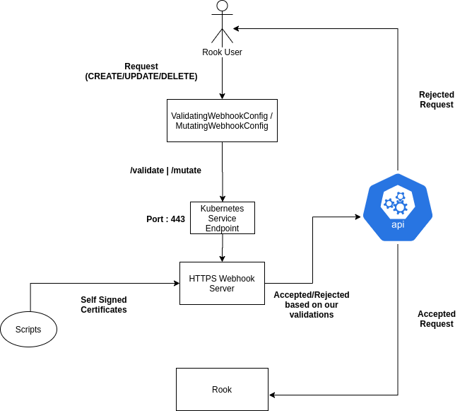

# Admission Controllers in Rook

**The admission controller has been removed in favor of the declarative validation admission policies**

# Background

This proposal is to add support for admission controllers in Rook. An admission controller is a piece of code that intercepts requests to the Kubernetes API server prior to persistence of the object, but after the request is authenticated and authorized

 There are two special controllers: MutatingAdmissionWebhook and ValidatingAdmissionWebhook.

 Mutating controllers may modify the objects they admit but validation controllers are only allowed to validate requests.

Currently, user can manipulate Custom Resource specs with any values which may result in Rook not functioning as expected. The present validation method in Kubernetes is the OpenAPI schema validation which can be used for basic validations like checking type of data, providing a range for the values etc but anything more complex (checking resource availability, network status, error handling) would not be possible under this scenario.

# Admission Controllers Concept



## Requirements

1. Webhook server which will validate the requests
2. TLS certificates for the server,
3. ValidatingWebhookConfig/MutatingWebhookConfig which will intercept requests and send a HTTPS request to the webhook server.
4. RBAC Components

## Implementation

As shown in the above diagram, the admission control process proceeds in two phases. In the first phase, mutating admission controllers are run. In the second phase, validating admission controllers are run. Note again that some of the controllers are both.

The admission controllers intercept requests based on the values given in the configuration. In this config, we have to provide the details on

* What resources should it be looking for ? (Pods, Service)
* What api version and group does it belong to ? *Example : ApiVersion = (v1, v1beta) Group version = (rook.ceph.io, admissionregistration.k8s.io)*
* What kind of operation should it intercept ? (Create, Update, Delete)
* A valid base64 encoded CA bundle.
* What path do we want to send with HTTPs request (/validate, /mutate)

A webhook server should be in place (*with valid TLS certificates*) to intercept any HTTPs request that comes with the above path value. Once the request is intercepted by the server, an [AdmissionRequest](https://github.com/kubernetes/api/blob/master/admission/v1beta1/types.go#L40) object is sent through with the resource specifications.

When the webhook server receives Admission Request, it will perform predefined validations on the provided resource values and send back an [AdmissionResponse](https://github.com/kubernetes/api/blob/master/admission/v1beta1/types.go#L116) with the indication whether request is accepted or rejected.

If any of the controllers in either phase reject the request, the entire request is rejected immediately and an error is returned to the end-user.

## Certificate Management

### Development and Testing



We can use self-signed certificates approved by the Kubernetes Certificate Authority for development purposes.This can be done by following the steps given below.

* Creating the private key and certs using openssl.

**Sample : Generating the public and private keys**

```
openssl genrsa -out ${PRIVATE_KEY_NAME}.pem 2048
openssl req -new -key ${PRIVATE_KEY_NAME}.pem -subj "/CN=${service}.${namespace}.svc"

#Created after CSR is approved
openssl base64 -d -A -out ${PUBLIC_KEY_NAME}.pem
```

* Creating and sending a CSR to kubernetes for approval

**Sample : Certificate Signing Request (CSR) in Kubernetes**

```
apiVersion: certificates.k8s.io/v1
kind: CertificateSigningRequest
metadata:
  name: ${csrName}
spec:
  request: $(cat server.csr | base64 | tr -d '\n')
  usages:
  - digital signature
  - key encipherment
  - server auth
```

Verify with
`kubectl get csr ${csrName}`

**Sample : Approval of Signed Certificate**

```
kubectl certificate approve ${csrName}
```

If it is approved, then we can check the certificate with following command

```
$(kubectl get csr ${csrName} -o jsonpath='{.status.certificate}')
```

* Once approved, a generic secret will be created with the given public and private key which will be later mounted onto the server pod for use.

**Sample : Creating a Secret in Kubernetes**

```
kubectl create secret generic ${secret} \
        --from-file=key.pem=${PRIVATE_KEY_NAME}.pem \
        --from-file=cert.pem=${PUBLIC_KEY_NAME}.pem
```

* Modifying the webhook config to inject CA bundle onto the ValidatingWebhookConfig
* All the above resources will be created in rook-ceph namespace

Using the above approach, the dev/admins will have the responsibility of rotating the certificates when they expire.

Below is an excerpt of what a ValidatingWebhookConfig looks like

```
apiVersion: admissionregistration.k8s.io/v1
kind: ValidatingWebhookConfiguration
metadata:
  name: demo-webhook
webhooks:
  - name: webhook-server.webhook-demo.svc
    clientConfig:
      service:
        name: webhook-server
        namespace: rook-ceph
        path: "/validate"
      caBundle: ${CA_PEM_B64}
    rules:
      - operations: [ "CREATE" ]
        apiGroups: [""]
        apiVersions: ["v1"]
        resources: ["pods"]
```

We can make changes to the above values according to intercept based on whether a resource is being updated/deleted/created or change the type of resource or the request path which will be sent to the server.

## Setup in Rook

### Starting the Webhook Server

 Based on the whether the  secrets are present, the rook operator will  deploy the relevant configuration files onto the cluster and start the server.

The secrets will be volume mounted on the rook operator pod dynamically when they are detected. After the volumes are mounted, an HTTPs server would be started.

Once the server starts, it will look for the appropriate tls key and crt files in the mounted volumes and start intercepting requests based on the path set in ValidatingWebhookConfig.

### Error Handling

If the server is unable to find valid certificates, It will not deploy any admission controller components onto the cluster and hence rook will continue to function normally as before.

# References

1. <https://kubernetes.io/docs/tasks/tls/managing-tls-in-a-cluster/>
1. <https://github.com/kubernetes/api/blob/master/admission/v1beta1/types.go>
1. <https://kubernetes.io/blog/2019/03/21/a-guide-to-kubernetes-admission-controllers/>
1. <https://kubernetes.io/docs/reference/access-authn-authz/admission-controllers/>
