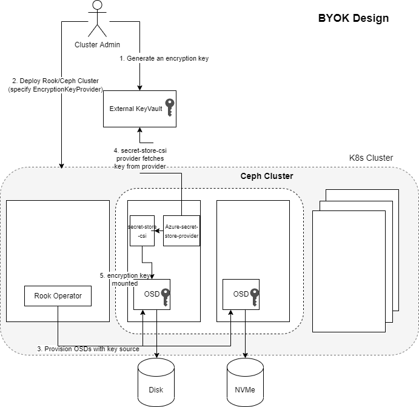

#  Ceph encryption at rest

## Dmcrypt
Dm-crypt is a Linux Kernel submodule that provides encryption support. It allows
users to maps a virtual device to a physical device, that way the data can be
encrypted on disk but decrypted when read from the virtual device.

## Ceph & Encryption Support
Ceph supports encryption at rest using dmcrypt with a disk-backed file system
mapped to a logical volume by the LVM (Logical Volume Manager). Flow for
encryption is as follows:
1.  When OSD is created, during the initial OSD preparation the lockbox and
    dmcrypt keys are generated and sent to the monitors in JSON. The data is
    persisted in the mon db.
```json
{
    "cephx_secret": CEPHX_SECRET,
    "dmcrypt_key": DMCRYPT_KEY,
    "cephx_lockbox_secret": LOCKBOX_SECRET,
}
```

2.  All complementary devices get created and encrypted with the same OSD key.
    Key is stored in the LUKS Header (LVM metadata) of the OSD.
3.  After preparation is complete, the dmcrypt key will be retrieved from the
    monitors and the logical volume decrypted before the OSD gets started.

Source: https://docs.ceph.com/en/latest/ceph-volume/lvm/encryption/

### Encryption keys
Ceph supports 2 modes: lvm or raw modes. When creating an OSD, an initial step
is to prepare the volume that will be used to store the data. This is done
through `ceph-volume prepare` command. Ceph supports passing an extra flag to
encrypt the volume using the kernel module `dmcrypt`. ex: `ceph-volume lvm
prepare --filestore --dmcrypt --data volume_group/lv_name --journal journal`

Depending on the type of volume used, Ceph uses different source for the key
used for encryption.
-   LVM: For logical volumes, ceph-volume generates the encryption key as part
    of the prepare step. [Source: ceph/prepare.py at
    a67d1cf2a7a4031609a5d37baa01ffdfef80e993 · ceph/ceph
    (github.com)](https://github.com/ceph/ceph/blob/a67d1cf2a7a4031609a5d37baa01ffdfef80e993/src/ceph-volume/ceph_volume/devices/lvm/prepare.py)

```python
if encrypted:
    secrets['dmcrypt_key'] = encryption_utils.create_dmcrypt_key()
```

-   RAW: For raw disks/partitions, ceph-volume reads the encryption key from an
    environment variable. [Source: ceph/prepare.py at
    a67d1cf2a7a4031609a5d37baa01ffdfef80e993 · ceph/ceph
    (github.com)](https://github.com/ceph/ceph/blob/a67d1cf2a7a4031609a5d37baa01ffdfef80e993/src/ceph-volume/ceph_volume/devices/raw/prepare.py)
```python
if encrypted:
secrets['dmcrypt_key'] = os.getenv('CEPH_VOLUME_DMCRYPT_SECRET')
```

## Rook, Ceph & encryption
Rook exposes Ceph’s ability to encrypt data through its CRDs. It is worth
mentioning that Rook supports creating a Ceph cluster using 2 different ways:
1.  Host based Ceph cluster: [A Ceph cluster
    deployment](https://github.com/rook/rook/blob/master/Documentation/ceph-cluster-crd.md#host-based-cluster)
    where Ceph data is stored directly on disk. For a host based Ceph cluster,
    encryption can be easily enabled by specifying a `encrypted` flag in the
    Ceph CRD. Note: For a host based Ceph cluster, Rook implements that through
    using lvm and hence the encryption key is generated and managed exclusively
    by Ceph.

```yaml
apiVersion: ceph.rook.io/v1
kind: CephCluster
metadata:
  name: rook-ceph
  namespace: rook-ceph
spec:
  cephVersion:
    image: quay.io/ceph/ceph:v16.2.6
  dataDirHostPath: /var/lib/rook
  mon:
    count: 3
    allowMultiplePerNode: false
  storage:
    useAllNodes: false
    useAllDevices: false
    onlyApplyOSDPlacement: false
    encryptedDevice: "true"  # ==> enable encryption
    nodes:
      < hosts and disks goes here >
```

2.  PVC based Ceph cluster: Rook's cloud native & recommended [Ceph cluster
    deployment](https://github.com/rook/rook/blob/master/Documentation/ceph-cluster-crd.md#pvc-based-cluster)
    where Ceph data is stored on volumes requested through StorageClasses & K8s.
    Note: For PVC based clusters, [Rook will always use raw
    mode](https://github.com/rook/rook/blob/2f850b6ae65ac632d594c091f6d3a8422bf3b2ef/pkg/daemon/ceph/osd/volume.go#L483).
    In these cases when encryption is specified, rook takes it upon itself to
    generate the encryption key and set the required environment variable
    expected by ceph-volume. It also saves the generated key as either a K8s
    secret or through a KMS.

```yaml
kind: StorageClass
apiVersion: storage.k8s.io/v1
metadata:
  name: local-storage
provisioner: kubernetes.io/no-provisioner
volumeBindingMode: WaitForFirstConsumer
---
kind: PersistentVolume
apiVersion: v1
metadata:
  name: local0-1
spec:
  storageClassName: local-storage
  capacity:
    storage: 10Gi
  accessModes:
    - ReadWriteOnce
  persistentVolumeReclaimPolicy: Retain
  volumeMode: Block
  local:
    path: /dev/sdc
  nodeAffinity:
    required:
        ...
---
apiVersion: ceph.rook.io/v1
kind: CephCluster
metadata:
  name: rook-ceph
  namespace: rook-ceph
spec:
  dataDirHostPath: /var/lib/rook
  mon:
    count: 3
    allowMultiplePerNode: false
    volumeClaimTemplate:
      spec:
        storageClassName: local-storage
        resources:
          requests:
            storage: 10Gi
  cephVersion:
    image: quay.io/ceph/ceph:v16.2.6
    allowUnsupported: false
  mgr:
    count: 1
  storage:
    storageClassDeviceSets:
      - name: set1
        count: 1
        portable: false
        tuneDeviceClass: true
        tuneFastDeviceClass: false
        encrypted: true    # ==> enable encryption
```

## Customer requirements & encryption at rest
There are scenarios when the managers of the Ceph cluster are different than the
consumers of the cluster. In those scenarios, encryption at rest can be a legal
and compliance requirement, that includes key rotation support and the ability
for customers to bring their own encryption keys.

This introduces new feature requirements into rook/ceph:
1. Support for key rotation.
2. Support for BYOK (Bring Your Own Key) for encryption.

## Key Rotation
As of today, neither Ceph nor Rook support a flag or easy mechanism to
tate a
Ceph key. Key rotation is feasible through generating a new key and adding it to
the LUKS header using cryptsetup. There are 2 different approaches to this:
-  Updating the LUKS key: LUKS header can be updated to change the key, ex:
   `cryptsetup luksAddKey <device> --key-file <new key file>` however this doesn't
   change the `volume key` which is the master key used for encryption.
-  Updating the master key requires reencryption and can be done through
   `cryptsetup-reencrypt` which reencrypts data on LUKS device in-place. During
   reencryption process the LUKS device is marked unavailable and there's a chance
   for data loss and hence this is not recommended.

References:
- https://man7.org/linux/man-pages/man8/cryptsetup-reencrypt.8.html
- https://man7.org/linux/man-pages/man8/cryptsetup.8.html#LUKS_EXTENSION

To be able to fulfill key rotation requirements, changes are required to either
Ceph or Rook depending on the Rook Ceph cluster deployment type:

1.  Host based clusters:

    a.  Ceph: Key rotation will need to be enabled in Ceph and a flag exposed to
    enabled it. For rotation frequency, it can default to 90 days which is
    commonly used.

    b.  Rook: Add support to expose and pass the required flags to enable key
    rotation.

2.  PVC based clusters: Since keys are managed by Rook, it is easier to add such
    capability into rook. This can be added as an extra flag to the cluster crd
    `rotateEncryptionKey: true`. Once specified, rook can automatically
    regenerate a new key on certain frequency (can default to 90days) and update
    the LUKS header as needed. Internally this can be implemented using a `CronJob`.


## BYOK Support in Rook

Customers may be already using existing key management systems to manage their
secrets or relying on enterprise grade cloud providers for key management. Thus
the proposal is to leverage [secrets store
csi](https://github.com/kubernetes-sigs/secrets-store-csi-driver) for mounting
of secrets from external secret stores into the OSDs.

Supporting secrets-store-csi will allow customers to pick from the different
existing providers based on their scenarios. Supported providers include:
https://github.com/Azure/secrets-store-csi-driver-provider-azure
https://github.com/aws/secrets-store-csi-driver-provider-aws
https://github.com/googlecloudplatform/secrets-store-csi-driver-provider-gcp
https://github.com/hashicorp/vault-csi-provider

This option will be only available for PVC based clusters, similar to how KMS
works today in rook.

At a high-level, the design will be as follows:


