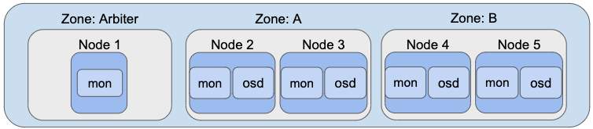

# Stretch Cluster with an Arbiter

Target version: 1.5

## Summary

In a production environment it is generally expected to have three failure domains where three replicas
of the data are stored. If any individual failure domain goes down, the data is still available for
reads and writes in the other two failure domains.

For environments that only have two failure domains available where data can be replicated, we need to
also support the case where one failure domain is lost and the data is still fully available in the
remaining failure domain.

To support this scenario, Ceph has integrated support for stretch clusters with an arbiter mon
as seen in [this PR](https://github.com/ceph/ceph/pull/35906) and in the following design docs:
- [Stretch clusters](https://github.com/ceph/ceph/blob/master/doc/rados/operations/stretch-mode.rst)
- Mon election [strategies](https://github.com/ceph/ceph/blob/master/doc/rados/operations/change-mon-elections.rst) and [design](https://github.com/ceph/ceph/blob/master/doc/dev/mon-elections.rst)

Rook will enable the stretch clusters when requested by the admin through the usual Rook CRDs.

## Architecture

To enable the stretch cluster based on the Ceph architecture:
- Rook requires three zones
- Two zones (A and B) will each run all types of Rook pods. We call these the "data" zones.
    - Two mons run in each data zone for two reasons:
      - The OSDs can only connect to the mon in their own zone so we need more than one mon in the data zones.
      - A zone is considered down by Ceph when the mons in the zone are all unavailable.
- The third zone (Arbiter):
    - Runs a single mon, called the "tiebreaker" or "arbiter"
    - No other Rook or Ceph daemons will be run in the arbiter zone



The arbiter zone will commonly contain just a single node that is also a K8s master node,
although the arbiter zone may certainly contain more nodes.

The type of failure domain used for stretch clusters is commonly "zone", but can be set to a different failure domain.

### Latency

Distributed systems are impacted by the network latency between critical components.
In a stretch cluster, the critical latency is in the Etcd servers configured with Kubernetes.
K8s only supports latency of up to 5ms (10ms round trip), which is lower than the latency
requirements for any Ceph components. Ceph mons can handle higher latency, designed for up to
700ms round trip.

## Design

### Domain Failure Configuration

The topology of the K8s cluster is to be determined by the admin, outside the scope of Rook.
Rook will simply detect the topology labels that have been added to the nodes.

If the desired failure domain is a "zone", the `topology.kubernetes.io/zone` label should
be added to the nodes. Any of the [topology labels](https://rook.io/docs/rook/latest/ceph-cluster-crd.html#osd-topology)
supported by OSDs can be used.

In the minimum configuration, two nodes in each data zone would be labeled, while one
node in the arbiter zone is required.

For example:

```yaml
topology.kubernetes.io/zone=a
topology.kubernetes.io/zone=a
topology.kubernetes.io/zone=b
topology.kubernetes.io/zone=b
topology.kubernetes.io/zone=arbiter
```

### Rook Cluster Design

The core changes to rook are to associate the mons with the required zones.

- Five mons are required. No other count of mons is supported for stretch clusters.
- One mon will be assigned to the arbiter zone
- Two mons will each be assigned to the data zones
  - The two mons within each zone will have node antiaffinity

The new configuration is found under the `stretchCluster` configuration where the
three zones must be listed and the arbiter zone is identified.

```yaml
  mon:
    count: 5
    allowMultiplePerNode: false
    stretchCluster:
      # The cluster is most commonly stretched over zones, but could also be stretched over
      # another failure domain such as datacenter or region. Must be one of the labels
      # used by OSDs as documented at https://rook.io/docs/rook/latest/ceph-cluster-crd.html#osd-topology.
      failureDomainLabel: topology.kubernetes.io/zone
      zones:
      # There must be exactly three zones in this list, with one of them being the arbiter
      - name: arbiter
        arbiter: true
      - name: a
      - name: b
```

The operator will track which mons belong to which zone. The zone assignment for each mon
will be stored in the `rook-ceph-mon-endpoints` configmap in the same data structure where the host
assignment is stored for mons with node affinity.

For example, if the zones are called
"arbiter", "zone1", and "zone2", the configmap would contain:

```
data:
  data: a=10.99.109.200:6789,b=10.98.18.147:6789,c=10.96.86.248:6789,d=10.96.86.249:6789,e=10.96.86.250:6789
  mapping: '{"node":{"a":"arbiter","b":"zone1","c":"zone1","d":"zone2","e":"zone2"}}'
  maxMonId: "4"
```

If no zones are listed in the `stretchCluster.zones`, it is not considered a stretch cluster.
If anything other than 3 zones, it would be an error and the cluster would not be configured.

### Mon Failover

Mon failover will replace a mon in the same zone where the previous mon failed.

### Mon Storage

The mons can all be backed by a host path or a PVC, similar to any other Rook cluster.

In this example, all the mons will be backed by the same PVC:

```yaml
  mon:
    count: 5
    allowMultiplePerNode: false
    stretchCluster:
      zones:
      - name: arbiter
        arbiter: true
      - name: a
      - name: b
    volumeClaimTemplate:
      spec:
        storageClassName: gp2
        resources:
          requests:
            storage: 10Gi
```

It is possible that the mons will need to be backed by a different type of storage in different zones.
In that case, a volumeClaimTemplate specified under the zone will override the default storage setting for
the mon.

For example, the arbiter could specify a different backing store in this manner:

```yaml
  mon:
    count: 5
    allowMultiplePerNode: false
    stretchCluster:
      zones:
      - name: arbiter
        arbiter: true
        volumeClaimTemplate:
          spec:
            storageClassName: alternative-storage
              resources:
                requests:
                  storage: 10Gi
      - name: a
      - name: b
    volumeClaimTemplate:
      spec:
        storageClassName: gp2
        resources:
          requests:
            storage: 10Gi
```

Question: Is there a need for a dataDirHostPath to be specified for the mons in one zone
when the other mons are using the PVCs? For now, we assume all the mons are either using
a PVC or a host path, but not a mix.

### Ceph Config

Rook will set the mon election strategy to the new "connectivity" algorithm.

```console
mon election default strategy: 3
```

The mons will be configured so Ceph will associate the mons with the correct failure domains.
Rook will set each mon location to the zone name

```console
$ ceph mon set_location <mon> <zone>
```

The stretch mode will be enabled with the command:

```console
$ ceph mon enable_stretch_mode tiebreaker_mon <mon> new_crush_rule <rule> dividing_bucket zone
```

### Pools

For data protection in the stretch cluster, all pools should be created with the following configuration, including
pools for an rbd storage class (CephBlockPool), shared filesystem (CephFilesystem), or object store (CephObjectStore).
- Replica: 4
- Failure domain: zone
- Two replicas of data are stored in each zone using a special CRUSH rule specified by `replicasPerFailureDomain: 2`

```yaml
apiVersion: ceph.rook.io/v1
kind: CephBlockPool
metadata:
  name: stretchedreplica
  namespace: rook-ceph
spec:
  failureDomain: zone
  replicated:
    size: 4
    replicasPerFailureDomain: 2
```

See [this issue](https://github.com/rook/rook/issues/5591) for more details on implementation of the CRUSH rule.

Erasure coded pools are not supported currently in Ceph stretch clusters.
