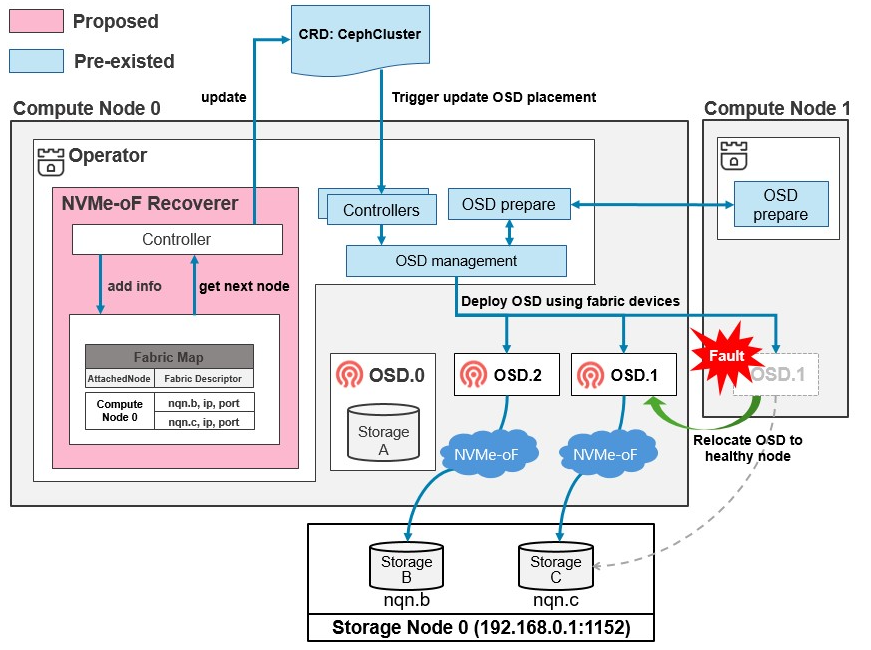

# NVMe-oF OSD Recovery and Scheduling

## Summary
We propose a recovery design, called NVMe-oF recoverer. NVMe-oF is an emerging storage network where the storage devices can be attached to any storage node using RDMA, TCP or Fiber channel. In this environment, the failure caused by a server node can be recoverable because the OSD can be re-spawned to another server node with the storage device attached to the failed server node through NVMe-oF.

So, what we propose is a functionality that moves the OSD pod to another server node either automatically or manually when the server node fails because storage devices are still workable in NVMe-oF environment.

### Goals

 

- **Enhanced Fault Tolerance**: NVMe-oF allows storage to be disaggregated from specific server nodes, which makes it possible to dynamically reassign resources in case of compute node failures. This capability provides enhanced fault tolerance, as storage can be attached to any operational node without requiring physical movement of devices.
- **Minimized Downtime**: In traditional systems, node failures are manually recovered or reattached. The Rook operator retries pod-level recovery for transient failures, but if repeated restarts fail, it marks the OSD as out, allowing Ceph-level recovery (rebalancing). NVMe-oF recoverer minimizes this downtime by automatically reassigning storage devices to other nodes, ensuring data availability with minimal delay even in the event of unrecoverable compute node failures.

- **Load balance**: As storage needs grow, Recoverer enables easy expansion of storage capacity. It introduces a scheduler that automatically connects fabric devices to suitable nodes using load-balancing and deploys OSDs. By utilizing Kubernetes Jobs, the scheduler dynamically connects based on the workload ensuring optimal performance

### Non-Goals

- **Support for Non-NVMe-oF Environments**: This design focuses solely on NVMe-oF environments.
- **Modifications to the Core Ceph Codebase**: The proposal does not involve changing Ceph's core functionalities.

## Proposal Details

### Overview

We propose a design, called NVMe-oF recoverer. NVMe-oF is an emerging storage network where the storage devices can be attached to any storage node using RDMA, TCP or Fiber channel. In this environment, the failure caused by a server node can be recoverable because the OSD can be re-spawned to another server node with the storage device attached to the failed server node through NVMe-oF.

To address these challenges, we recommend a phased implementation consisting of four key steps:

1. **Implement an Explicit Command for Manual OSD Relocation**
2. **Automate OSD Relocation Upon Failure**
3. **Modify CRUSH Map to Minimize Data Rebalancing**
4. **Improve OSD Scheduling Based on Node Workloads**

Each step can be implemented and contributed individually, allowing for incremental progress and testing.

### Step 1: Implement an Explicit Command for Manual OSD Relocation

#### Description

Introduce explicit commands or scripts that allow administrators to manually deploy and relocate OSD pods using NVMe-oF devices. These tools will streamline the management of NVMe-oF devices and OSD pods in standard scenarios and during failures.

#### Implementation Steps

- **Develop a Script or Command-line Tool**:
  - **For Connecting NVMe-oF Devices and Deploying OSD Pods**:
    - Retrieve NVMe-oF target information from predefined sources (e.g., configuration files, environment variables).
      - Key parameters: IP, Port, Subsystem NQN (SubNQN), and attachable nodes.
    - Connect devices to target nodes using `nvme-cli` or appropriate tools.
    - Update the `CephCluster` Custom Resource Definition (CRD) with fabric device details to facilitate automated OSD deployment.
  - **For Handling OSD Relocation in Failure Scenarios**:
    - Remove the faulted OSD pod.
    - Disconnect the device from the failed node and reconnect it to a healthy node.
    - Update the `CephCluster` CRD to reflect the new device-node mapping.
- **Usage Example**:

  ```bash
  kubectl exec -it rook-ceph-operator-xxxxx -- osd_move node-failed node-healthy
  ```

#### Benefits

- Provides immediate control for administrators.
- Simplifies the process of OSD deployment and relocation.

### Step 2: Automate OSD Relocation Upon Failure

#### Description

Enhance the Rook operator to automatically detect OSD pod failures and relocate the affected OSDs to healthy nodes, reducing manual intervention and downtime.

#### Implementation Steps

- **Discovery of Connected Fabric Devices**:
  - **Scan for Previously Connected Devices**:
    - During initialization, use Kubernetes Jobs to scan all nodes for previously connected NVMe-oF devices.
    - Perform device discovery using `nvme-cli`.
  - **Identify Devices by SubNQN**:
    - Use SubNQN to verify the connection status of devices and ensure correct node mapping.
- **Detect OSD Pod Failures**:
  - Monitor the state of OSD pods to identify failures associated with NVMe-oF devices.
  - Utilize the operator's reconciler to detect failures and trigger recovery actions.
- **Relocate Failed OSD**:
  - **Delete the Affected OSD Pod**:
    - Upon detecting a failure, remove the OSD pod from the failed node.
  - **Reconnect the NVMe-oF Device**:
    - Disconnect the device from the failed node.
    - Connect the device to a healthy node.
  - **Update the CephCluster CRD**:
    - Reflect the new device-node mapping in the CRD.
    - The operator will automatically deploy the OSD pod on the new node based on the updated CRD.

#### Benefits

- Minimizes downtime by automating recovery processes.
- Reduces the need for manual intervention during node failures.

### Step 3: Modify CRUSH Map to Minimize Data Rebalancing

#### Description

To prevent unnecessary data rebalancing during OSD relocation, we introduce the concepts of `virtual` and `physical` hosts in the CRUSH map.
Note that the virtual host is a logical bucket leveraging existing CRUSH rule to group OSDs using fabric devices into a single failure domain, while a physical host represents OSDs directly attached to a server. Since the virtual host exists as a logical entity in the CRUSH map, the map remains unchanged when an OSD's physical location changes (e.g., moving from Host 1 to Host 2), avoiding recovery I/Os and ensuring consistent data placement.

#### Implementation Steps

- **Update OSD Creation Logic**:
  - Modify the `prepareOSD()` function to assign OSDs to specific CRUSH map locations, such as virtual hosts.
- **Assign OSDs to Virtual Hosts**:
  - During OSD creation (as implemented in Step 2), set the CRUSH map location of OSDs to the corresponding virtual host.
- **Validate with Integration Tests**:
  - Conduct tests to verify that relocating an OSD (e.g., from `node1` to `node2`) does not alter the CRUSH map or trigger unnecessary recovery I/O.
  - Ensure data placement remains consistent and no additional data rebalancing occurs.

#### Benefits

- **Efficient Recovery**: Avoids unnecessary rebalancing, reducing recovery time.
- **Consistent Data Placement**: Maintains data distribution as defined by the CRUSH map.

### Step 4: Improve OSD Scheduling Based on Node Workloads

#### Description

Implement a scheduling mechanism within the operator to dynamically balance the number of OSDs across server nodes based on their workloads. This approach leverages the flexibility of NVMe-oF devices to prevent performance bottlenecks and optimize resource utilization.

#### Implementation Steps

- **Design a Scheduling Mechanism**:
  - Define a strategy for monitoring node workloads (e.g., CPU, memory, I/O usage).
  - Determine OSD placement based on collected metrics.
- **Extend the Operator**:
  - Modify the operator to evaluate workload metrics and adjust OSD assignments dynamically.
  - Utilize Kubernetes APIs or monitoring tools to gather metrics.
- **Validate the Scheduling Mechanism**:
  - Conduct tests to ensure effective load balancing and performance optimization.
  - Simulate various workload scenarios to verify the scheduler's responsiveness.

#### Benefits

- **Optimized Performance**: Balances workloads to prevent overloading individual nodes.
- **Scalability**: Facilitates smooth expansion of storage capacity by efficiently utilizing resources.

## Risks and Mitigation

### Risks

- **Data Integrity**:
  - Relocating OSDs carries a risk of data loss if not handled correctly.
- **Performance Overhead**:
  - Overhead may occur during controller restarts due to the reinitialization of NVMe-oF device information.

### Mitigation

- **Data Integrity**:
  - Implement thorough testing and validation procedures.
  - Ensure relocation processes are fail-safe and reversible.
- **Performance Optimization**:
  - Perform scan jobs to query multiple fabric devices simultaneously during controller reinitialization, reducing overhead caused by sequential operations.

## Alternatives

- **Manual Management Only**:
  - Rely solely on administrators to manage OSD relocation without operator enhancements.
  - **Downside**: Increases downtime and operational overhead.
- **Ceph Native Solutions**:
  - Investigate if Ceph's native features can be leveraged for similar functionality.
  - **Downside**: May require changes to the Ceph codebase or not fully address the problem.

## Open Questions

- **Failure Detection Sensitivity**:
  - How sensitive should the failure detection mechanism be to avoid unnecessary relocations?
  - What thresholds or policies will govern the detection and initiation of recovery processes?
- **Node Selection Criteria**:
  - How will the operator select the optimal node for OSD relocation?
  - What factors (e.g., network latency, node health) will influence this decision?
- **Security Implications**:
  - Are there security concerns when dynamically connecting NVMe-oF devices to different nodes?
  - How can we ensure secure authentication and authorization during device reconnections?
