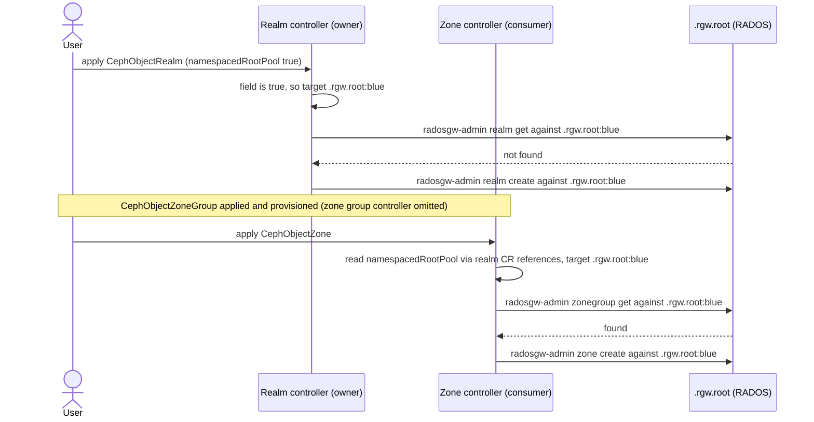
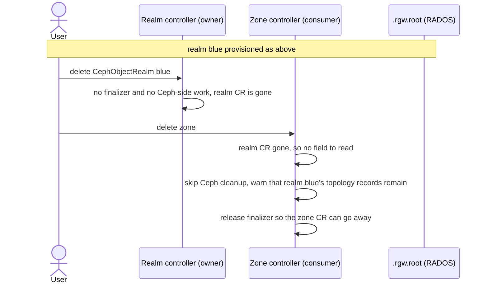

# Namespaced RGW Topology Pool (`namespacedRootPool`)

Store a realm's RGW topology records in a RADOS namespace of `.rgw.root` instead of using the raw `.rgw.root` pool.

## Summary

`sharedPools` collapses a store's data and metadata into shared pools partitioned by RADOS
namespaces, which are named after the zone name. The **RGW topology records** — realm, zone group, zone, and
period — are not covered by this feature. Instead every store in the cluster keeps the realm information together in a single, un-namespaced `.rgw.root` pool.

To mitigate this we propose a new `namespacedRootPool` feature.
`namespacedRootPool: true` should be an opt-in setting for storing a realm's topology records in a RADOS namespace of `.rgw.root`. A store using `sharedPools` together with `namespacedRootPool` would then have its entire RADOS footprint (data, metadata, and topology) stored with RADOS namespaces.

### Motivation

- **Enabling realm separation at the cephx level.** With `namespacedRootPool` and `sharedPools`
  together, a realm's entire RADOS footprint (data, metadata, and topology) would lie in
  distinct RADOS namespaces. A Rook user could then achieve cephx-enforced realm separation by manually provisioning an RGW instance with a cephx user scoped to those namespaces (the user's mon caps must use the [`profile rgw`](https://github.com/ceph/ceph/pull/70538) cap profile; a bare `mon 'allow rw'` would undermine the separation).
  Separating realms like this closes confidentiality gaps between realms. For example, the zone record in `.rgw.root` carries the realm's `system_key` (the
  credentials used for multisite replication) in cleartext, so under broad OSD
  capabilities any RGW can read another realm's replication credentials out of the
  shared pool. An OSD capability scoped to the realm's namespaces stops that read.
- **Decrease coupling of realms stored in the same `.rgw.root` pool.** If every realm shares a `.rgw.root` pool then every `radosgw-admin` invocation can reach any realm, so a wrong `--rgw-realm`, a default-realm-fallback commit, or a `realm list` delete sweep can hit a neighboring realm. Invoking any `radosgw-admin` command against a namespace-separated realm would not influence realms living in other namespaces.

    Keeping each realm in a separate RADOS namespace would also help with:
    - Backing up realm topology: back up the RADOS namespace
    - Deleting a realm: delete every RADOS namespace associated with it
- **No reliance on the root pool's default location.** Every `radosgw-admin` invocation implicitly relies on the root pool location being `.rgw.root` and Rook relies on that default today. Rook otherwise tries consistently to be explicit rather than depend on defaults.

### Goals

- Opt-in partitioning of `.rgw.root` by RADOS namespace, for single-site and multisite setups.
- Off by default: existing stores, and stores that do not set the
  field, should be untouched and keep using the shared `.rgw.root`.
- Backward compatible: existing shared `.rgw.root` stores and realms should be untouched, and enabling
  the feature should never rewrite or migrate an already-provisioned layout. (Operator *downgrade*
  below the introducing release is a separate matter and is problematic while namespaced stores or
  realms exist. See Open Question 2 on operator downgrade.)
- Should apply to newly created realms and object stores only.

### Non-Goals

- Relocating existing shared `.rgw.root` topology to a RADOS namespaced `.rgw.root` (and the other way around)
    - `namespacedRootPool` is immutable on a CR, so the layout cannot be flipped in place. Deleting a realm
      and re-creating it under the same name with the inverse value is accepted, but this does not cause a
      migration. Instead it provisions at the new location and leaves the old records orphaned.
- Configurable namespace or pool names. The pool would always be `.rgw.root` and the namespace
  always the realm name. No new naming knobs are introduced.
- Changing the `sharedPools` data/metadata model or its API.
- Access control. This feature would control the placement of topology records. It would not change
  what any RGW daemon or client is authorized to read or write. It would, however, arrange the
  layout that namespace-scoped cephx capabilities require (see Motivation).

### Constraints and assumptions

The design builds on the following pre-existing behaviors and accepts the constraints they impose:

- **Deleting a `CephObjectRealm` CR in multisite does not delete the realm on the Ceph side.** CephObjectRealm's reconcile performs no Ceph-side work on delete and the CR carries no finalizer. In contrast, in single-site `CephObjectStore` teardown the associated realm records are removed.
- **Kubernetes enforces no deletion order between resources.** A whole-setup teardown (`kubectl
  delete -f`, namespace deletion) removes all CRs at once and only a finalizer makes a CR linger.
  `CephObjectZone` is deletion-gated by a finalizer while the realm and zone group CRs are not, so
  during a teardown the realm CR may disappear before the zone.
- **Consumers already wait for their parent's topology records.** Before writing anything, the zone group,
  zone and store controllers each run a Ceph-side `radosgw-admin` read of their parent's record and try
  again later if it is missing. The design relies on this existing
  ordering, i.e., a consumer never has to act before the records it depends on exist, because it waits
  instead.
- **The root pool location is cluster-local.** RGW and `radosgw-admin` resolve the root pool from
  their local configuration, and no multisite exchange (`realm pull`, `period pull`, replication)
  carries a pool location. A realm's `namespacedRootPool` value therefore needs to be consistent
  only within a cluster. Peering with clusters that do not know the field, such as non-Rook peers
  or Rook releases before this feature, is unaffected (see the Multisite DR operational note).


## Glossary

- Root pool: The pool an RGW reads its initial state from. It holds the RGW topology records an RGW needs in order
  to start. Default location `.rgw.root`.
- RGW topology records: the RADOS objects RGW stores in a root pool to describe the multisite layout.
- Parent CR: the CR one step up the Rook CR spec chain "realm → zone group → zone → object store".
  A zone group's parent is the realm, a zone's parent is its zone group, an object store's parent is its zone;
  the realm has no parent. A CR's controller reads the parent CR's record before writing its own and never
  creates it. This applies to multisite only, since a standalone `CephObjectStore` creates the realm,
  zone group, and zone records itself.
- Consumer controller: a controller that resolves `namespacedRootPool` from a realm CR it does not own.
- Owner CR: the CR that carries `namespacedRootPool`. For a standalone store the `CephObjectStore` CRD carries the `namespacedRootPool` field, and in multisite the `CephObjectRealm` CRD does. The `CephObjectRealm` and `CephObjectStore` controllers are the only ones that create the realm's records.
- Root pool location: a root pool together with an optional RADOS namespace, written `pool[:namespace]`. Under this
  design a realm's root pool location is either the shared `.rgw.root` or `.rgw.root:<realm>`.

## Proposal details

### API

One boolean field, defined at two authorities:

```yaml
# Single-site: CephObjectStore is the authority.
apiVersion: ceph.rook.io/v1
kind: CephObjectStore
spec:
  sharedPools:            # optional; namespacedRootPool works with or without sharedPools
    metadataPoolName: rgw-meta-pool
    dataPoolName: rgw-data-pool
  namespacedRootPool: true  # topology in .rgw.root:<store-name>
```

```yaml
# Multisite: CephObjectRealm is the authority; zone group, zone, and store follow it.
apiVersion: ceph.rook.io/v1
kind: CephObjectRealm
spec:
  namespacedRootPool: true  # topology in .rgw.root:<realm-name>
```

Shaping decisions:

- **`namespacedRootPool` does not require `sharedPools`.** Reconciling the realm CR is what
  initializes the realm in the root pool, so the multisite `namespacedRootPool` field must live on
  CephObjectRealm, while `sharedPools` sits on the CephObjectZone CRD. Coupling the two across CRDs is
  therefore not possible in multisite, and for consistency the single-site `CephObjectStore` case does
  not require it either.
- **The root pool namespace will be the realm name (`.rgw.root:<realm>`).** Topology records are realm-scoped, unlike the
  sharedPools zone-scoped data/metadata namespaces. In single-site, Rook names the realm after the store.
- **A plain bool, not a struct.** Pool and namespace names would not be configurable (see Open Question 1).

Validation:

- **The `namespacedRootPool` field should be immutable**. A realm's topology records cannot be
  relocated once written. RGW offers no supported way to move them to another root pool location. The
  pool location is therefore fixed when the realm or store is created. The field should **default to `false`** so that it is never absent from
  a stored spec. With this default, the immutability rule always has an old value to compare against. Without the
  default, adding `namespacedRootPool: true` to a store or realm that did not carry the field would not
  register as a change to an existing value and would be accepted and the realm's topology records
  could then be resolved at the wrong root pool location. Immutability constrains updates only. A CR
  that is deleted and recreated with the inverse value presents no previous spec and is accepted.
- **`namespacedRootPool` should be set on the CR that owns the realm** — the `CephObjectStore` for a
  standalone store, the `CephObjectRealm` in multisite. A store that joins a zone (`zone.name`
  set) does not own its realm, so setting the field there should be rejected.

CRD enforcement:

The default and both validations are enforced at the CRD level, so the Kubernetes API server rejects an
invalid spec before it ever reaches a controller (the same approach as the `accountRef` immutability in
[rgw-user-accounts](rgw-user-accounts.md)). On both `ObjectStoreSpec` and `ObjectRealmSpec`:

```go
// +kubebuilder:validation:XValidation:message="namespacedRootPool is immutable",rule="self == oldSelf"
// +kubebuilder:default=false
// +optional
NamespacedRootPool bool `json:"namespacedRootPool,omitempty"`
```

The rule that a store joining a zone cannot own its realm is a whole-object CEL rule on
`ObjectStoreSpec`, mirroring the existing `defaultRealm`/`zone.name` exclusion on the same struct:

```go
// +kubebuilder:validation:XValidation:rule="!(has(self.namespacedRootPool) && self.namespacedRootPool == true && has(self.zone) && size(self.zone.name) > 0)",message="namespacedRootPool must not be set on a store that joins a zone; in multisite the CephObjectRealm carries the field"
```

CEL validation rules run on every write, not only at creation. This matters because `zone.name` is
mutable. A create-time-only check would accept a namespaced standalone store that is later changed to
join a zone. The rejection of root-pool options in `spec.gateway.rgwConfig` (risk 5) is
enforced in the controller.

Status:

To surface the resolved location (see Observability), `CephObjectRealm.status` gains an `info` map,
following the pattern `CephObjectStore` already uses. Whether the realm gains a dedicated status
type or an `info` field on the shared struct is Open Question 4. The realm's
status should look like this:

```yaml
status:
  phase: Ready
  info:
    rootPool: .rgw.root:<realm-name>
```

`CephObjectStore` needs no status change. Its existing `status.info` map carries the new `rootPool`
entry.

### Mechanism

Ceph uses these four options, `rgw_realm_root_pool`, `rgw_zonegroup_root_pool`,
`rgw_zone_root_pool`, and `rgw_period_root_pool`, to set the RGW root pool (default is `.rgw.root`). Ceph parses each value as `pool[:namespace]`, so setting them to `.rgw.root:<realm-name>` keeps the same pool but confines the records to a RADOS namespace. When a realm's resolved layout is namespaced, Rook should set all four options to `.rgw.root:<realm-name>`. This must be propagated on every `radosgw-admin` call and in the RGW daemon's startup flags (its pod container arguments).

### How do controllers get the correct root pool location?

Every controller that issues a `radosgw-admin` command, and every RGW pod that is rendered, needs to
know whether a realm's RGW topology records belong to the shared `.rgw.root` pool or to the realm's own
`.rgw.root:<realm>` RADOS namespace. Resolution rests on one principle:

> The `namespacedRootPool` field on the realm CR decides where a realm's topology records go, and every
> controller reads it from there. Ceph is never asked where the topology records are.
> If the field cannot be read at all, which happens when a deletion runs after the realm CR is gone, the
> controller skips its Ceph-side cleanup rather than determining the location some other way.

That yields the following rules.

**Resolution.** Consumers should read `namespacedRootPool` from the `CephObjectRealm` CR. They can do it via the
reference chain: `CephObjectStore.spec.zone.name` →
`CephObjectZone.spec.zoneGroup` → `CephObjectZoneGroup.spec.realm` → the realm CR. In single-site, the
store owns the field and reads its own. For the store and the zone group controller this adds no new
dependency. The store already fetches the realm CR to resolve realm/zone-group/zone names and the
zone group controller already reads the realm CR. However, the zone controller
gains a new read since currently it takes only the realm name from the zone group CR and never fetches the
realm CR itself.

**Provisioning.** The field alone decides the location, so no controller needs to compare it against
Ceph. The *owner* (the realm controller in multisite, the store controller in single-site) keeps its
current behavior, i.e., it calls `radosgw-admin realm get` at the resolved location and `realm create`
when the realm is not found, but now it does so with the four root-pool options set from the resolution.

**Provisioning waits if the root pool location cannot be resolved.** If a consumer cannot read the
realm CR while creating or reconciling, it requeues and tries
again later. It never guesses and never consults Ceph to determine the root pool location. This mirrors the timed requeue consumers
already use for a missing or not-ready parent CR (the zone controller requeues today when the zone
group CR is not ready).

**Deletion is skipped if root pool location cannot be resolved.** A controller about to perform Ceph-side
cleanup must first work out which root pool location to address. That location has to be known before
any deletion can proceed. However, the realm CR where `namespacedRootPool` is stored may already be deleted by then. The following rules govern that case:

- If the realm CR read fails for a reason **other than the CR not existing**, the controller should keep its finalizer and requeue. Unresolvable now does not mean permanently unresolvable.
- If the realm CR **does not exist**, the controller should not guess and should not consult Ceph. It
  should run no part of the Ceph-side deletion, log a warning naming the zone, the realm name it still
  holds from the zone group CR, and the topology records left in place, emit a matching Warning event, and then
  release its finalizer so the CR can delete itself.
- **An empty or malformed realm reference counts as "does not exist".**

This implements a "release rather than stay stuck" deletion mechanism for the CRs that rely on the realm CR to read `namespacedRootPool`.

**Example — provisioning (multisite).** The following diagram shows how a `namespacedRootPool` realm
`blue` is provisioned. The owner (the realm controller) resolves the field and creates the realm at
`.rgw.root:blue`. One consumer (the zone controller) reads the field via the CR references and
creates the zone at the same location. The store and zone-group controllers resolve the layout
identically and are omitted, as are the RGW pods. Once the zone exists, the store controller deploys
them with the four root-pool options in the pod args.



**Example — teardown with the realm CR deleted first (multisite).** The following diagram shows the
deletion path the skip-and-release rule exists for. A whole-setup teardown removes the realm CR
before the zone, because only the zone is finalizer-gated. The zone controller can then no longer
resolve the root pool location, so it skips its Ceph-side cleanup, warns, and releases its finalizer
(risk 3). Single-site has no counterpart to this race since the `CephObjectStore` owns the field
itself, so the location is always resolvable during the store's own teardown.



### Risks and Mitigation

1. **Wrongfully deleting `.rgw.root` when it is still in use by another realm.** Only a single-site
   `CephObjectStore` teardown deletes the `.rgw.root` *pool*, and only when `preservePoolsOnDelete` is
   false, the store declares its own metadata/data pools, and `radosgw-admin realm list` indicates that no
   other realm still uses the pool. The problem with this check is that namespacing makes that list
   incomplete. Each `realm list` reports only the realms in the location it is pointed at, so a store can
   read a list with no other realms while another realm's topology is still present in a different
   namespace, and Rook would delete the whole shared `.rgw.root` pool and every realm's topology in it.
    - Mitigation: a two-step occupancy check must pass before Rook deletes the `.rgw.root` pool. See
      **The `.rgw.root` occupancy check** below.
2. **Outdated CRDs during upgrade window.** During the upgrade that introduces the feature, a
   `namespacedRootPool: true` spec can be silently ignored in two situations.
   - (a) The operator is upgraded ahead of the CRDs. The installed schema does not yet know
     `namespacedRootPool` and the API server silently prunes the field, so the realm resolves to the
     shared `.rgw.root`.
   - (b) The CRDs are upgraded first but the operator rollout has not finished. A store or realm
     created with `namespacedRootPool: true` while old operator pods still run is provisioned at the
     shared `.rgw.root`. The upgraded operator then finds no realm at `.rgw.root:<realm>` and creates
     one, forking the realm identity.
   - Mitigation: the documented upgrade order — **CRDs before the operator** — closes (a). This is a
     standard Rook idiom and the residual risk is accepted. For (b), create no namespaced stores or
     realms until the rollout has completed.
3. **Deletion without realm CR.** In multisite the realm CR is the only source of the `namespacedRootPool`
   state, so without it no delete operation that depends on the root pool options is possible. (Single-site the
   field is on the `CephObjectStore` being deleted, so it is always readable during its own teardown.)
   - Mitigation: see the **Deletion is skipped if root pool location cannot be resolved** paragraph.
4. **Operator downgrade.** A downgraded Rook operator does not know how to use the `namespacedRootPool` option and therefore uses the root pool default location `.rgw.root`, which shares the pool among realms. It may then create a new realm there even though the newer operator had provisioned a `namespacedRootPool` realm that lives in a namespace of `.rgw.root`.
    - Mitigation: Such a scenario is not tackled by this design. See Open Question 2 on operator downgrade.
5. **RGW Root Pool options redefined in `spec.gateway.rgwConfig`.** A user can specify `rgw_realm_root_pool`,
`rgw_zonegroup_root_pool`, `rgw_zone_root_pool`, `rgw_period_root_pool`, or the obsolete
`rgw_region_root_pool` via `spec.gateway.rgwConfig`. This can collide with values set by `namespacedRootPool`.
    - Mitigation: For stores whose resolved layout is namespaced, such overriding should be
      **rejected as an invalid spec**. Stores that do not use `namespacedRootPool` keep today's
      `rgwConfig` behavior.

#### The `.rgw.root` occupancy check (mitigation of risk 1)

Each `radosgw-admin realm list` reports only the realms in the location it is pointed at, so a store can read a
list without another realm's records while they are still present. Before deleting the `.rgw.root` pool,
Rook should therefore verify that no RADOS namespace in the pool still holds a realm:

1. `rados --pool .rgw.root --all ls` reports the RADOS namespace of every object in the pool (including the default (empty) namespace). This is
   the only way to discover which namespaces exist at all, because a RADOS namespace has no existence
   apart from the objects that carry it.
2. For every detected RADOS namespace, run `radosgw-admin realm list` with the four root-pool options
   pointed at the namespace's root pool location. If any location reports a realm, the pool is still
   in use and the delete is refused.

Step 1 discovers the RADOS namespaces in the pool and step 2 checks whether any of them holds a realm.
Rook runs the check right before it deletes the pool. At that point the store's own realm records are
already deleted, so the store never blocks its own teardown.

Listing the whole pool sounds expensive but is not at this size, and the check only runs during a
delete operation, never in a steady-state reconcile. Rook creates `.rgw.root` with `pg_num` 8, and the
pool holds nothing but topology records (roughly ten objects per realm, plus one per committed period
epoch). librados fetches object names in batches of up to 1024 per request, asking each PG in turn, so
a cluster with a few dozen realms may still be listed in one request per PG, eight in total. Each
request reads the OSD object index rather than object data. It would be far more expensive against a
pool that is not what Rook created, for instance if the root-pool options were pointed at a pool
holding bulk data.

### Operational notes

- **Deletion**: the zone controller already skips its Ceph-side cleanup and releases its finalizer
  when the zone group CR is gone. This design adds a second case of the same kind. When the realm CR
  is gone by the time the zone is deleted, the root pool location cannot be resolved (risk 3) and the
  cleanup is skipped in the same way. Whether extending this precedent is acceptable is Open Question 5.
- **Upgrade order**: CRDs before operator (the standard Rook order). Applying them in the other order
  prunes the field at admission, so a store that asks for namespacing provisions un-namespaced instead
  and nothing at runtime detects it (risk 2). Because the operator rollout is not atomic, new
  `namespacedRootPool: true` stores or realms should not be created until the rollout has completed
  (risk 2). Downgrades below the introducing release should be
  unsupported while namespaced stores or realms exist (see Open Question 2 on operator downgrade).
- **Multisite DR**: the root pool location is cluster-local (see Constraints and assumptions), so the
  source realm and a pull realm (`spec.pull.endpoint` set) may resolve different locations without
  affecting `realm pull` or replication. Setting `namespacedRootPool` uniformly across the clusters
  is still recommended. The cephx separation and the decoupling benefits apply only to the clusters
  where the realm is namespaced. Each cluster's resolved location is surfaced in its realm and store
  statuses (see Observability).
- **Out-of-band tooling**: flag-less `radosgw-admin` (e.g. the toolbox) resolves the default
  `.rgw.root` and will not see namespaced realms unless the four root-pool options are passed explicitly.
- **External-mode stores**: an external-mode CephObjectStore runs no local RGW daemons and
  provisions no topology records, so `namespacedRootPool` would have no effect there.
  The store controller should warn when the field is set on an external
  store.
- **No cluster-wide default realm**: because `default.realm` lives in the realm root pool, it too
  would become per-namespace. There would be no single default realm spanning namespaced realms, and
  `SetDefaultRealm` would only mark a realm default within its own namespace. A flag-less lookup would
  still resolve the default in the shared `.rgw.root`, not any namespaced realm.

### Observability

The effective root-pool location should be **published to the CR's `status.info`** map:

- `CephObjectStore.status.info["rootPool"]` — the store already carries an `info` map (Rook surfaces
  values like the RGW `endpoint` there); the store controller additionally records the location it
  resolved, `.rgw.root` or `.rgw.root:<realm>`.
- `CephObjectRealm.status.info["rootPool"]` — the realm's status today is the generic
  phase/conditions status, so it gains an `info` map (the mechanism is Open Question 4).

This deliberately departs from the `sharedPools` precedent of not reporting resolved data/metadata
namespaces in `status.info`. The root pool location is worth the exception because a consumer cannot
derive it from its own spec, as the field lives on the realm CR.

Whether a realm is namespaced can also be confirmed out of band:

- Inspect the RGW pod's command-line arguments for the four `rgw_*_root_pool` flags set to
  `.rgw.root:<realm-name>`.
- List the pool by namespace: `rados ls -p .rgw.root --all` shows topology objects carrying the
  realm namespace.

### Testing

Test planning (unit and end-to-end) is deferred to the implementation PR.

## Drawbacks

- Flag-less `radosgw-admin` (e.g. the toolbox) cannot see namespaced realms unless the four
  root-pool options are passed explicitly (see Operational notes).
- **Ceph dashboard multisite management (upstream limitation).** The Ceph mgr dashboard's
  multisite management (realm/zone-group/zone create and list, period, replication setup) runs
  `radosgw-admin` through the mgr as `-n mgr.<id>` with no `rgw_*_root_pool` flags
  (`mgr_module.py send_rgwadmin_command`), so it resolves the default `.rgw.root` and cannot see or
  deal with namespaced root pools. Rook cannot fix this.
- There is no cluster-wide default realm spanning namespaced realms (see Operational notes).

## Alternatives

- **Probe Ceph for the layout instead of trusting the CR field.** Instead of resolving
  `namespacedRootPool` from the realm CR, each controller could ask Ceph where the realm's records
  actually live, reading both candidate root pool locations and using whichever answers.
    - Rejected because reading a declared field is much simpler than interpreting probe results. The main benefit
    of a probe would lie on the deletion path, where the realm CR may already be gone. That benefit
    is small. The realm's topology records are never deleted by Rook in multisite anyway, and
    skipping a zone's cleanup with a warning is already an accepted outcome when a required CR is
    gone. The probe's deletion-path benefit therefore does not justify the added complexity.
- **Distribute the root pool location to consumers via an annotation.** The operator could
  record the resolved root pool location as an annotation on each CR it provisions, and consumers
  would read that annotation instead of resolving the realm CR through the reference chain.
  - Rejected because it adds complexity without need. Reading the field directly is simpler, and verifying that
  the annotation is still correct would effectively be a cache-verification protocol that introduces
  even more complexity. Annotations also carry none of the CRD-level guarantees the design relies on.
  There is no schema, no immutability rule, and no default, so an edited or deleted annotation would
  silently change the resolved layout.

## Open Questions

### 1. Should the root pool be customizable?

The four root pool options accept any `pool[:namespace]`, so nothing in RGW forces
`.rgw.root`. The topology records could live in any pool the user names.

Why don't we place the topology records into the shared **metadata pool** (`rgw-meta-pool:<realm-name>.root`) from the `sharedPools` feature? That would remove `.rgw.root` entirely for such setups (three pools become two).

- See the API section. For multisite we cannot couple `sharedPools` with `namespacedRootPool` as the realm exists before the zone.

Why this design keeps the pool fixed in general:

- **A fixed pool keeps the set of possible locations closed.** This keeps the design simple because the topology records are either in `.rgw.root` or in `.rgw.root:<realm>`.

**Open Question 1 to settle:** keep the fixed `.rgw.root:<realm-name>` bool, or make the topology pool
customizable (struct API, realm-side pool reference)?

### 2. How should operator downgrade be handled?

Downgrading the operator below the introducing release re-renders the RGW pods without the
root-pool startup flags, so a redeployed gateway would resolve the shared, un-namespaced
`.rgw.root` instead of its namespace. During the downgrade nothing prevents this from happening.

**Proposed mitigation — set the four root-pool options on the CephObjectStore's cephx user.**
All RGW pods of a CephObjectStore share a single cephx user (`client.rgw.<store>.<id>`). Rook
would additionally store the four options under that cephx user in the mon config database
(`ceph config set client.rgw.<store>.<id> rgw_realm_root_pool .rgw.root:<realm-name>`, and the
other three alike). A daemon reads its own cephx user's section from the mons at startup, so
even a pod redeployed by an older operator — with no root pool option flags — would still resolve
the realm's namespace. Startup flags outrank the mon config database, so while a feature-aware
operator runs, the flags would win and these entries would be inert.

Potential problems with this approach:

- **A third channel for the same options** (startup flags, `radosgw-admin` arguments, mon config
  database): harder to see where an effective value comes from when debugging.
- **Stale entries on cephx user name reuse?** The cephx user name is derived from the
  CephObjectStore name, so a recreated CephObjectStore of the same name would address the same
  mon config section. Not a problem in practice: Rook deletes the cephx user and its mon config
  section when the CephObjectStore is deleted, so a same-named successor starts with a fresh
  cephx user and an empty section — the entries are never inherited.
- **Collision between `rgwConfig` and operator-written config.**
  `spec.gateway.rgwConfig` lets users set arbitrary RGW options in the same mon config section,
  so a user-provided value for a root-pool option would collide with the value the operator writes.
  This is handled the same way as in risk 5 — for a namespaced store the conflicting `rgwConfig` is
  **rejected as invalid**, not silently overridden — so this backstop introduces no new
  silent-override channel.

**Implicit benefit for external mode.** The options travel with the cephx user. Any RGW that
authenticates with an exported copy of that cephx user would resolve the namespaced topology from the mon
config database alone. No extra configuration is needed.

**Open Question 2 to settle:** is the backstop worth these problems, or is declaring downgrade
unsupported sufficient?

### 3. When should the namespace created by `namespacedRootPool` be deleted?

The conditions differ by deployment mode:

- **Single-site**: Rook already deletes the realm records during store deletion.
- **Multisite**: by convention nothing ever deletes a realm's topology records (the realm CR has no
  finalizer), so the namespace legitimately outlives every local
  zone. There is no "realm teardown" event to hang a delete sweep on.


**Open Question 3 to settle** — when should the namespace be deleted:

- **3.1** Automatically on single-site store deletion (multisite stays a manual delete sweep)?
- **3.2** Never automatically — keep deletion fully manual (current behavior)?
- **3.3** In both modes, by also changing the multisite realm deletion convention?
- **3.4** Per store or realm, controlled by a user-facing flag (e.g.
  `deleteRootPoolNamespace`, following the existing preserve-on-delete knobs)?

### 4. How should `CephObjectRealm.status` gain the `info` map?

The realm's status today is the generic phase/conditions/observedGeneration status struct, which is
shared with `CephObjectZoneGroup`, `CephObjectZone`, and `CephBucketNotification` (see the API
section). There are two ways to add the `info` map:

- **4.1** A realm-specific status type — the generic fields plus `info`. With this option only the realm CRD
  schema changes, at the cost of a new type.
- **4.2** An optional `info` field on the shared generic status struct. This changes the least code, but the
  other three CRDs would carry an unused `info` field in their schemas.

**Open Question 4 to settle:** dedicated realm status type, or `info` on the shared struct?

### 5. Is the added non-blocking deletion path acceptable?

Multisite zone deletion is blocking today. The Ceph-side cleanup steps (zone delete, zonegroup
remove with a period commit, zone pool deletion) return errors, the reconcile requeues, and the
finalizer is held until the cleanup succeeds. One exception exists. When the zone group CR is
gone, the zone controller warns, skips its Ceph-side cleanup, and releases its finalizer. This
design adds a second exception of the same kind for the realm CR (see risk 3). The new case
follows the existing precedent, but it also widens the non-blocking surface of a deletion path
that is otherwise strict.

**Open Question 5 to settle** — is the new non-blocking case fine, or should the zone block
instead:

- **5.1** Accept the skip. It follows the existing zone-group precedent, and a whole-setup
  teardown never wedges. The cost is that topology records may be left behind with only a
  warning.
- **5.2** Block instead. Keep the finalizer and requeue until the realm CR reappears or an
  administrator removes the finalizer manually. No cleanup is skipped silently (maybe include methods for a controller to discover the root pool).
