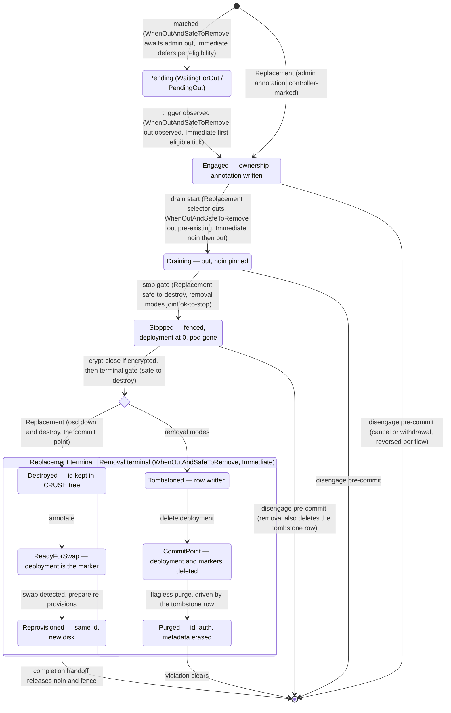

# Design: OSD device exclusion

Related issues: [rook/rook#16077](https://github.com/rook/rook/issues/16077), [rook/rook#16535](https://github.com/rook/rook/issues/16535) (users reaching for the discovery daemon's udev blacklist and being surprised by its actual, discovery-only effect).

## Problem

A physical disk that should never be used again can keep re-entering the OSD provisioning pipeline. The motivating case is a failing SAS drive that repeatedly dies and revives: each revival enumerates under a new kernel name (`sdo` one day, `sdk` the next), so no name-based configuration can refer to it durably. While its OSD still exists, the daemon crashloops — pod restarts, repeated peering, mon churn — and because `mon_osd_down_out_interval` requires a *continuous* down period, a drive that revives every few minutes resets the timer and may never be auto-marked `out` (Ceph's laggy-interval grace extension lengthens the window further for flapping OSDs). After the admin purges the OSD and deletes its deployment, nothing prevents the disk's next revival from being re-adopted or resurfacing in inventory. Every cycle costs manual work.

Every device-selection mechanism in `CephCluster.spec.storage` is an allowlist: `useAllDevices`, `deviceFilter`, `devicePathFilter`, and the explicit `devices` list. The filters are RE2 regular expressions, which have no negative lookahead, so "every device except this one" is not practically expressible; switching a `useAllDevices` cluster to explicit per-node device lists abandons automated selection entirely and is itself keyed by unstable names. The one knob named "blacklist", `DISCOVER_DAEMON_UDEV_BLACKLIST`, only filters udev *events* in the optional discovery daemon; it never gates provisioning.

This design adds a declarative device exclusion list ("deny list") to the CephCluster storage spec, keyed by stable device identity, physical slot, or model — plus reporting when a live OSD occupies an excluded device, and an opt-in mode that finishes the removal of such an OSD once the admin marks it `out`. The target operating environment is fleet-scale clusters managed declaratively (GitOps), where drives fail weekly and hands-free removal is a requirement, not a convenience — completed from one `ceph osd out` (`WhenOutAndSafeToRemove`) or from the exclusion entry alone (`Immediate`).

## Goals and non-goals

Goals:

- Permanently prevent OSD provisioning on specific physical devices, identified by stable properties (serial, WWN, Ceph device ID), physical slot path, or model — never by kernel name.
- Surface when an existing OSD sits on an excluded device, so the remaining manual step is prompted rather than discovered.
- Optionally finish the removal of an excluded OSD once the cluster admin expresses intent by marking it `out` — stopping crashloop churn and completing the purge without further human steps — and, at the highest opt-in level (`Immediate`), treat the exclusion entry itself as that intent, evacuating and removing matched OSDs with no per-OSD admin action at all.

Non-goals:

- **Rook initiates data migration only by explicit opt-in.** Under `Never` and `WhenOutAndSafeToRemove`, rook does not mark an `up`+`in` OSD `out`, reweight it, or otherwise evacuate a live OSD — `ceph osd out` by the admin is the intent signal. `Immediate` is the opt-in: the exclusion entry is standing authorization, and rook issues the `out` itself (see Automated removal).
- **PVC-backed OSDs** (`storageClassDeviceSets`). Device choice there belongs to the PV provisioner; out of scope.
- **Discovery daemon inventory.** The discovery daemon's reports are not filtered by exclusions; they gate nothing. (The operator's hotplug *trigger* comparison is exclusion-aware — see Provisioning-time enforcement — but the reported inventory stays complete.)
- **Host-level device hiding** (udev rules, sysfs SCSI deletes). Imperative, reboot-fragile, and invisible to GitOps; exclusion belongs in the cluster spec.
- **Automatic purge of OSDs that are not `out`.** Under `Never` and `WhenOutAndSafeToRemove`, an excluded device whose OSD is `up`+`in` is only reported; even under `Immediate`, nothing is stopped or purged until the OSD is `out` and Ceph certifies each step.
- **A no-drain replacement variant.** Replacement here always drains fully before the swap. A variant that stops the OSD immediately and holds its CRUSH mapping through the swap — ending a crashloop at once with zero PG relocation, at the cost of a degraded window spanning the physical turnaround — is out of scope for v1; a crashlooping OSD is handled by removal (id freed, churn ended at the joint stop gate) or by drained replacement (id kept; driven from the start, churn ends when the drain completes — a pre-commit replacement takeover of a removal-engaged OSD inherits the earlier stop, with its degraded window; see Interaction with OSD replacement).

## API

Exclusions are a single cluster-level list on `StorageScopeSpec`, with optional per-entry node scoping. They are deliberately NOT part of the `Selection` struct: node-level `Selection` content is resolved with node-overrides-cluster semantics and is discarded entirely under `useAllNodes: true` (the operator logs that `nodes` entries "will be IGNORED"), and an exclusion must survive both behaviors. A top-level list flows into the operator's resolved storage spec unchanged regardless of `useAllNodes`, and per-entry scoping expresses the one genuinely node-local case (slot exclusion — identical hardware yields identical `by-path` strings on every node) without a second per-node list to merge.

```go
type StorageScopeSpec struct {
	...
	// ExcludedDevices lists devices that must never be used for OSDs (data or
	// metadata), even if explicitly listed in devices. Exclusion applies on
	// every node unless an entry is scoped with nodes.
	// +kubebuilder:validation:MaxItems=256
	// +optional
	ExcludedDevices []ExcludedDevice `json:"excludedDevices,omitempty"`
	// ExcludedDeviceRemoval controls whether Rook automatically completes the
	// removal of OSDs that occupy excluded devices. "Never" (default): report
	// only. "WhenOutAndSafeToRemove": once such an OSD is marked out (by the
	// admin, or by Ceph after a permanent failure), Rook pins it out, stops
	// its pod when a joint `ceph osd ok-to-stop` check passes, and purges it
	// when `ceph osd safe-to-destroy` passes.
	// "Immediate": the entry itself is the trigger — Rook marks each matched
	// OSD out at the first eligible tick and runs the same pipeline; the
	// spec is the only control.
	// +kubebuilder:validation:Enum=Never;WhenOutAndSafeToRemove;Immediate
	// +optional
	ExcludedDeviceRemoval string `json:"excludedDeviceRemoval,omitempty"`
}

// ExcludedDevice identifies a device (or class of devices) to exclude.
// Exactly one selector field must be set.
type ExcludedDevice struct {
	// Serial is the printed disk serial number, as shown on the drive label,
	// by smartctl, and as the trailing component of `ceph device ls` IDs
	// (exact match; see Matching semantics for the udev fields consulted).
	// +kubebuilder:validation:MinLength=1
	// +kubebuilder:validation:MaxLength=128
	// +optional
	Serial string `json:"serial,omitempty"`
	// WWN is the disk world wide name (exact match, case-insensitive, with or
	// without the 0x prefix). Provisioning-gate only: WWNs do not appear in
	// `ceph osd metadata`, so wwn entries cannot trigger reporting or removal.
	// +kubebuilder:validation:MinLength=1
	// +kubebuilder:validation:MaxLength=128
	// +optional
	WWN string `json:"wwn,omitempty"`
	// CephDeviceID is the device ID as printed by `ceph device ls`
	// (exact match).
	// +kubebuilder:validation:MinLength=1
	// +kubebuilder:validation:MaxLength=128
	// +optional
	CephDeviceID string `json:"cephDeviceID,omitempty"`
	// DevicePathRegex is an RE2 regular expression matched against persistent
	// device paths. Use for slot/bay exclusion via /dev/disk/by-path.
	// +kubebuilder:validation:MinLength=1
	// +kubebuilder:validation:MaxLength=256
	// +optional
	DevicePathRegex string `json:"devicePathRegex,omitempty"`
	// ModelRegex is an RE2 regular expression matched against the device
	// model string. Use to exclude an entire drive model.
	// +kubebuilder:validation:MinLength=1
	// +kubebuilder:validation:MaxLength=256
	// +optional
	ModelRegex string `json:"modelRegex,omitempty"`
	// Nodes limits the entry to the named nodes (Kubernetes node names, as in
	// spec.storage.nodes). Empty means the entry applies on every node.
	// +kubebuilder:validation:MaxItems=64
	// +optional
	Nodes []string `json:"nodes,omitempty"`
	// Comment is a free-form operational note (why/when the device was
	// excluded). It appears in logs, Events, and status when the entry
	// matches.
	// +kubebuilder:validation:MaxLength=256
	// +optional
	Comment string `json:"comment,omitempty"`
}
```

Example:

```yaml
spec:
  storage:
    useAllNodes: true
    useAllDevices: true
    excludedDeviceRemoval: WhenOutAndSafeToRemove
    excludedDevices:
      - serial: WSD4QCXX
        comment: "flapping SAS drive, RMA 2026-08-07"
      - cephDeviceID: SEAGATE_ST8000NM014A_WSD4PT3Q
      - modelRegex: "(^|_)ST3000DM001" # fleet-wide model exclusion; (^|_) tolerates vendor-prefixed IDs report-side
      - devicePathRegex: "-sas-.*-phy3-"
        nodes: ["node042"]           # bay ban, scoped to one node
        comment: "bay 3 backplane flaky"
```

Node scoping note: at provisioning time the effective node identity under `useAllNodes` is the hostname (`k8sutil.GetNodeHostNames`), and at reporting time it is the `hostname` field of `ceph osd metadata`, which equals the Kubernetes node name in rook clusters (Ceph rewrites it from `$NODE_NAME`, which rook sets on all daemon pods). The implementation normalizes once, in the operator: CR node names and `osd metadata` hostnames (Kubernetes node names) are both resolved through the Node objects to the same `kubernetes.io/hostname` identity used at provisioning.

Validation:

- A CEL rule on `ExcludedDevice` enforces that exactly one selector field is set (`nodes` and `comment` excluded from the count). With the list bounded by `MaxItems=256` and all-scalar fields bounded by `MaxLength`, the rule's static cost is far inside the apiserver's per-rule budget; the bounds above are part of the API, not implementation detail — an unbounded list of all-optional structs pushes any natural exactly-one expression over the estimator's limit and the CRD would be rejected at registration. A CRD-registration test asserts the manifests apply cleanly.
- `MinLength=1` on every selector closes the empty-string hole: without it, `serial: ""` satisfies exactly-one while matching nothing — a silently inert entry.
- CEL cannot verify that a regular expression compiles. The operator validates every `devicePathRegex` and `modelRegex` at reconcile time and **fails the reconcile** on a compile error. Fail-closed is deliberate: an exclusion that silently does not apply is the precise failure mode this feature exists to prevent.

## Matching semantics

Exclusion is evaluated at two points with different information sources: the provisioning gate reads udev properties of a present disk, and the reporting/removal path reads what Ceph recorded about an OSD's device in `ceph osd metadata` (`device_ids`, `device_paths`, `hostname` — Ceph records no standalone serial, WWN, or model fields; both device fields are comma-joined `devname=value` strings, which the reporting matcher splits and strips of the `devname=` prefix before applying the table to each value). The contract below defines, per selector, exactly what each side matches; selectors that cannot be evaluated on the reporting side are called **reporting-blind** and are surfaced as such (see Reporting).

| Selector | Provisioning gate matches | Reporting/removal matches | Notes |
|---|---|---|---|
| `serial` | set membership over udev `ID_SCSI_SERIAL`, `ID_SERIAL_SHORT`, and `ID_SERIAL` (exact) | the trailing `_<serial>` component of each `device_ids` value (suffix match) | `ID_SERIAL` alone is NOT the printed serial: it is the NAA identifier on SAS and a `MODEL_SERIAL` composite on SATA/NVMe. Rook currently collects only `ID_SERIAL`; the implementation adds `ID_SCSI_SERIAL` and `ID_SERIAL_SHORT` to `LocalDisk`. |
| `wwn` | udev `ID_WWN` / `ID_WWN_WITH_EXTENSION` (exact, case-insensitive, `0x` optional) | **reporting-blind** — no WWN exists anywhere in `osd metadata` | Gate-only; warned when removal is enabled. |
| `cephDeviceID` | the ID derived from udev fields following Ceph's `get_device_id` three-tier algorithm (exact) | `device_ids` values (exact) | Derivation is `ID_VENDOR_ID_MODEL_ID_SCSI_SERIAL` when all three exist, else `ID_MODEL_ID_SERIAL_SHORT` (no vendor — the common SATA case), else raw `ID_SERIAL`; spaces become underscores. The implementation reproduces this algorithm (kept in sync with ceph-volume's `_get_device_id`) using the same new udev fields as `serial`. |
| `devicePathRegex` | every persistent path symlink plus `/dev/NAME` — the same set `devicePathFilter` matches | `device_paths` values, which contain **only** `/dev/disk/by-path` links | A pattern targeting `by-id`/`by-uuid` links gates provisioning but is reporting-blind; slot bans written against `by-path` work on both sides. |
| `modelRegex` | the udev model string | best-effort against `device_ids` values, whose model component has spaces replaced by underscores | Patterns containing spaces should use `[ _]` to match on both sides; identity selectors are preferred when removal matters. |

Rules:

1. **Exclusion is absolute.** It is evaluated before and above every allow mechanism: `useAllDevices`, `deviceFilter`, `devicePathFilter`, explicit `devices` entries, and `metadataDevice` references. An explicit allow that matches an exclusion is suppressed with a warning (see below), never honored — a stale `devices: [{name: sdk}]` entry must not resurrect an excluded disk that inherited the kernel name.
2. **Node scoping.** An entry with `nodes` set applies only on those nodes; all other entries apply everywhere. There is no node-level exclusion list to merge or override — the cluster-level list is the single source of truth and is unaffected by `useAllNodes`.
3. **Identity matching is best-effort by nature.** A device whose udev identity cannot be read cannot match an identity selector (fail-open). A `devicePathRegex` exclusion on its bay still catches it. This limitation is documented rather than papered over with a knob. Note the common transports are already imperfect without this: the printed serial lives in different udev fields per transport, which is exactly why `serial` matches a set of fields rather than one.

## Provisioning-time enforcement

The operator resolves the effective exclusion list per node (cluster list filtered by each entry's `nodes` scope) and passes it to the OSD prepare job as JSON in a new `ROOK_EXCLUDED_DEVICES` environment variable, alongside the existing `ROOK_DATA_DEVICES`/`ROOK_DATA_DEVICE_FILTER` variables (the provision command binds env vars onto its flags via `SetFlagsFromEnv`, so this surfaces as an `--excluded-devices` flag on `rook ceph osd provision`). There is no operator↔prepare version-skew concern: the prepare container runs the cluster's Ceph image with the rook binary injected from the operator image, so producer and consumer are always the same rook version.

In the prepare job's `getAvailableDevices` loop, every discovered device is checked against the list **before** desired-device matching:

- On match, the device is skipped with a log line naming the matched selector and comment, e.g. `skipping device "sdk": excluded by cluster spec (serial=WSD4QCXX, "flapping SAS drive, RMA 2026-08-07")`.
- If the excluded device was also explicitly requested (a `devices` entry by name or path), the conflict is recorded in the prepare job's orchestration status, and the operator emits a Kubernetes warning Event (`ExcludedDeviceConflict`) on the CephCluster naming both the exclusion entry and the explicit request.
- If a configured `metadataDevice` matches an exclusion, provisioning for the affected OSDs **fails loudly** with an explicit error rather than proceeding without a metadata device.

The gate also covers the **existing-OSD enumeration**. The prepare job's `ceph-volume lvm list`/`ceph-volume raw list` pass — which re-reports OSDs from BlueStore labels so the operator can rebuild their deployments — is filtered against the exclusion list by underlying device identity, at the same points the destroyed-OSD filter applies today. This is load-bearing after automated removal: purge (unlike the replacement flow's `destroy`) removes the OSD id from the CRUSH tree entirely, so the destroyed-id filter cannot recognize a purged-but-unzapped disk, and its next revival would otherwise be re-reported to the operator and rebuilt as a crashlooping, auth-less deployment on the banned device — or squat on a since-recycled OSD id and block the legitimate OSD's deployment. A suppressed stale OSD is recorded in the orchestration status and surfaced as a warning Event, never silently dropped.

Two replacement-flow paths get the same treatment. The replacement's metadata recovery re-provisions with a surviving DB/WAL LV chosen from the host, deliberately reading no spec — so the configured-`metadataDevice` rule cannot catch it; the recovered LV's underlying device (VG→PV parents resolved to udev identity) is therefore checked against the exclusion list, and a match **fails that replacement slot loudly**, mirroring the excluded-`metadataDevice` rule. And when a destroyed replacement slot is waiting for a blank device while candidate devices on that node were exclusion-suppressed in the same prepare run, the suppression is recorded in the orchestration status and the operator emits a warning Event (`ExcludedDeviceBlocksReplacement`) — a banned incoming disk must not silently wedge a replacement at ready-for-swap.

When the discovery daemon is enabled, its per-node inventory ConfigMaps additionally *trigger* OSD orchestration on device-list changes (the hotplug watcher). That trigger comparison is exclusion-aware, with the filter set chosen so no consent path loses its event: a device is dropped from a list snapshot iff it matches a **live entry**, or it matches a **tombstone and that snapshot shows the device non-empty**. An unzapped excluded flapper is therefore suppressed on both sides and schedules nothing — ending the fleet-wide no-op prepare waves of the #16535 churn class — while a zap (non-empty → empty) keeps its new-side entry, the lists differ, and the trigger fires the orchestration that re-adopts the freshly blank disk: zapping is the *event-driven* re-adoption consent. Tombstone-row deletion, by contrast, is deliberately event-less (the operator-owned ConfigMap is unwatched) and takes effect at the next orchestration from any cause — the two consents are deliberately not equivalent. The decision is evaluated **per target cluster at enqueue time**: the watch's update handler owns the delta computation and the fan-out, suppressing the enqueue only for clusters whose own spec filters the entire delta — one cluster's exclusions must never eat a trigger another cluster needed. Node scoping resolves the ConfigMap's node label through the same normalizer as every other matcher call-site; if Node resolution fails, scoped entries are treated as non-matching for this decision. The daemon's reported inventory itself stays complete (the non-goal below stands): only the decision to schedule work consults exclusions. The filter needs the same identity fields as the prepare-side matcher, so the udev collection additions apply to the discovery probe as well; and if the spec's patterns cannot be compiled, the watcher falls back to the unfiltered comparison — failing open toward triggering is the safe direction: the triggered reconcile itself fails closed on the invalid pattern, and no prepare launches until the spec is fixed.

## Reporting

OSDs already deployed on excluded devices are detected by the OSD health monitor on its existing interval: `ceph osd metadata` (mon-store persisted; available for down OSDs until purge) is matched against the exclusion list using the reporting column of the matching contract.

Violations surface in a **dedicated status section owned exclusively by the OSD health monitor** — deliberately not inside `status.storage`, whose existing writer rebuilds that struct from zero on every OSD orchestration and would wipe any co-located rows. The monitor maintains its section with read-modify-write against the previously published status plus a full-set memory: rows are ordered deterministically (ascending OSD id), `since` values survive rewrites, and `ExcludedDeviceInUse` Events are deduplicated against the complete computed violation set — held by the monitor and re-seeded from published status on operator start (worst case, one repeated Event per restart) — never against the truncated rows alone. Violations beyond the row cap are represented by `violationCount` and one aggregate warning Event; per-row Events never fire for beyond-cap rows:

```go
// CephClusterStatus gains:
ExcludedDevices *ExcludedDevicesStatus `json:"excludedDevices,omitempty"`

type ExcludedDevicesStatus struct {
	// ViolationCount is the total number of live OSDs on excluded devices.
	ViolationCount int `json:"violationCount"`
	// Violations lists up to 32 violations; ViolationCount carries the rest.
	Violations []ExcludedDeviceViolation `json:"violations,omitempty"`
	// ReportingBlindEntries names exclusion entries that can gate
	// provisioning but can never match `ceph osd metadata` (e.g. wwn
	// selectors), and therefore cannot trigger reporting or removal.
	ReportingBlindEntries []string `json:"reportingBlindEntries,omitempty"`
	// TombstonedDevices lists devices the removal pipeline purged that have
	// not been zapped or re-admitted; the durable record is the tombstone
	// ConfigMap — this view survives entry deletion so the remaining zap
	// work is never forgotten.
	TombstonedDevices []string `json:"tombstonedDevices,omitempty"`
}

type ExcludedDeviceViolation struct {
	OSD             int         `json:"osd"`
	Host            string      `json:"host"`
	DeviceID        string      `json:"deviceID,omitempty"`
	MatchedSelector string      `json:"matchedSelector"` // e.g. "serial=WSD4QCXX"
	Phase           string      `json:"phase,omitempty"`
	Message         string      `json:"message,omitempty"`
	Since           metav1.Time `json:"since,omitempty"`
}
```

`Phase` is a typed constant, documented in the field's doc comment like `ClusterState` — deliberately without a status-side `Enum` marker, so a rolled-back operator predating a future phase value can never have its status writes rejected. It is populated whenever removal is enabled (`excludedDeviceRemoval` other than `Never`):

- `WaitingForOut` — the OSD is `up`+`in`; rook is waiting for admin intent (`WhenOutAndSafeToRemove`).
- `PendingOut` — `Immediate` only: matched but not yet outed, deferred for a node drain, a correlated host-down grouping, or an active replacement; `message` names the cause.
- `Draining` — the OSD is `out`; spans from the first observation of `out` until `safe-to-destroy` passes (including any wait for the joint `ok-to-stop` check). The term matches cephadm's `orch osd rm status` vocabulary; the data movement is Ceph's recovery, not rook-initiated.
- `Removing` — `safe-to-destroy` has passed; purge and cleanup steps are executing.

Under `excludedDeviceRemoval: Never`, `phase` is empty and `message` states the mode explicitly for any violation whose OSD is already `out` — e.g. `OSD is out and eligible for removal; automated removal is disabled (excludedDeviceRemoval: Never)` — so an operator can distinguish "disabled by configuration" from "stuck" at a glance. Blocking conditions under `WhenOutAndSafeToRemove` (joint stop check failing, `safe-to-destroy` refusing, purge errors) are written into `message` each tick.

A violation disappears once the OSD is purged (purge removes its `osd metadata`). A warning Event (`ExcludedDeviceInUse`) fires when a violation is first observed; entries using reporting-blind selectors additionally raise a warning Event (`ExcludedDeviceUnreportable`) when removal is enabled.

## Automated removal

Two removal modes share one pipeline — pin, certify, stop, purge, all derived per health-monitor tick — and differ only in who issues the `out` that starts it.

### Shared destroy state machine

The removal modes are not a parallel pipeline: they and the OSD-replacement destroy flow are flows over one **shared destroy state machine**, factored out of the replacement implementation. That machine's shape is already what replacement ships today: a per-tick sweep collects deployments carrying a flow-ownership annotation, and a per-OSD selector advances each one independently — a short, bounded action sequence per tick, state derived entirely from durable markers and live queries, every error a warn-and-retry-next-tick. The refactor extracts what is already seam-shaped:

- **Actions**: `osd out`, `osd down`, `osd destroy` / flagless `osd purge`, `set-group`/`unset-group noin`, deployment scale-down, the crypt-close Job, tombstone write, deployment deletion, marker annotation writes.
- **Markers**: per-flow ownership annotations (`replace-in-progress`, `exclusion-in-progress`), the shared reconcile-fence label, deployment scale, per-OSD Ceph state (`out`, `noin`, destroyed), tombstone rows, `ready-for-swap`.
- **Flow interface** (Go code per flow, not configuration): engagement predicate with any flow-specific eligibility pre-pass (e.g. `Immediate`'s drain/host-correlation grouping), drain-start action, stop gate, terminal gate and sequence, commit point, disengage rules. Reconcile-side helpers (engagement marking, the dangling ready-for-swap reaper) stay reconcile-side.

| Flow | Engagement | Drain start | Stop gate | Terminal gate | Terminal | Commit point |
|---|---|---|---|---|---|---|
| Replacement | admin annotation, controller-marked pre-snapshot | selector outs (in→out) | `safe-to-destroy` | `safe-to-destroy` re-check | pod-gone → crypt-close → `osd down` + `osd destroy`; deployment kept as ready-for-swap marker | destroy |
| `WhenOutAndSafeToRemove` | observed matched ∧ `out` → annotation (initiator: admin) | pre-existing `out`; `noin` pinned | joint `ok-to-stop` (set-wise, see below) | `safe-to-destroy` | crypt-close → tombstone → delete deployment → purge | deployment deletion |
| `Immediate` | observed matched ∧ eligible → annotation (initiator: rook) | selector pins `noin` then outs | joint `ok-to-stop` (set-wise, see below) | `safe-to-destroy` | crypt-close → tombstone → delete deployment → purge | deployment deletion |

The shared spine, with the flow-parameterized transitions labeled (the table above carries the full per-flow parameters; disengage edges exist from every pre-commit state):



Machine-level invariants, replacing the per-flow special cases: **one *driving* flow per OSD** — the machine advances an OSD under exactly one flow's control, and a flow whose engagement predicate matches an OSD another flow is driving defers (replacement outranks exclusion while active). A deferring exclusion still writes its **passive claim** — the ownership annotation and the `noin` pin — at first deferral observation: that claim is what the cancellation-precedence and completion-handoff rules act on, and it converts to driving when the other flow completes or cancels. A replacement request on an exclusion-driving OSD takes over at the next tick while the exclusion is pre-commit — the exclusion reverts to a passive claim without reversing the out or the pin (the completion handoff already releases the pin when the reprovisioned deployment is recreated), and the takeover deletes the member's purge tombstone row if already written (as a pre-commit withdrawal does); past the exclusion's commit point any request is refused with an Event, and the runbook is to let removal finish and add the new disk as a new OSD. Disengage clears only the disengaging flow's own markers (the cancellation-precedence rule). Set-wise computation is confined to small pre-passes feeding per-OSD verdicts: one machine-global joint `ok-to-stop` per tick over every flow's stop candidates and stopped-but-uncommitted members, the orchestration (`Progressing`) deferral, and `Immediate`'s eligibility grouping (the node-drain and correlated host-down deferrals). The purge tail — the one span that outlives the deployment — is driven by tombstone rows whose OSD id still exists in the osdmap, keeping every phase of the machine durable-marker-driven.

Staging: the factoring is a standalone, behavior-preserving refactor PR whose acceptance gate is the existing replacement test suite passing unchanged; it lands before any removal-mode implementation. This keeps the removal modes from becoming the codebase's fourth OSD-removal pathway, and inherited details (the pod-gone Running-phase check, the `osd down`-before-destroy EBUSY dodge, the retry discipline) are paid for once.

### `WhenOutAndSafeToRemove`

The interface is deliberately human-in-the-loop: **the admin's `ceph osd out <id>` is the removal trigger** for a live OSD. Marking `out` is reversible, requires no waiting, and is the smallest possible expression of "I am done with this disk." Everything downstream of that intent is automated. The mode also engages when Ceph itself marks a permanently dead OSD `out` after `mon_osd_down_out_interval`, so cleanly failed drives are handled hands-free — though a flapping drive resets that timer indefinitely, which is the case `Immediate` closes.

### `Immediate`

The exclusion entry itself is the removal trigger: there is no per-OSD admin action at all, and the `out` rook issues here is the only data-migration-initiating act in this design. There are no tiers, no admission gate, and no batching machinery — each matched, not-yet-outed OSD is advanced independently by the shared selector at the first eligible tick: ownership annotation, `noin` pin, `out`, then the shared pipeline. Engagements are announced by a per-tick aggregate warning Event on the CephCluster naming the count and OSD ids — client-go's per-object spam filter caps same-object Event bursts at 25, so per-OSD Events alone cannot record a fleet-scale engagement — plus a per-OSD Event anchored on each OSD's Deployment. Two eligibility deferrals protect against node-level transients, whose `down` is indistinguishable from disk death: outs **defer for OSDs on nodes under active drain** (the disruption controller's own signals — `unschedulable`, its noout-scoped failure domain — are available in-process, and Ceph's auto-out is noout-suppressed in those windows anyway), and when several of one host's matched OSDs go down together outside a drain, their outs are deferred one tick. A lone flapper on a schedulable node is never delayed — this is the flapper-proof form of Ceph's auto-out, whose timer demands *continuous* downtime a flapping drive resets forever.

All OSDs matched by the same spec state are outed within the same tick loop, seconds apart. That bounds cross-condemned-peer movement to noise: the double-migration hazard belongs to *serialized drains* — out one, wait for its drain to complete, out the next, giving CRUSH days to fill condemned peers — which never exists here, because outs never wait on drains. An OSD matched later is exposed for at most one tick, the same class as a late-added entry. Entries declared together still drain together — declare the full set in one spec change when possible.

Under `Immediate` the spec is the only control. An admin `ceph osd in` is re-outed at the next tick — futile by design, and rook does not pay a resurrection cycle to prove it: while the entry still matches, the observed `in` is answered by re-asserting the `out` (re-pinning as needed) with a warning Event, without unfencing or scaling the pod back up, since a full honor-then-re-out cycle would boot the pod and land up to a tick of client I/O and backfill on the declared-bad device. The durable withdrawal is deleting or editing the entry, which reverses rook-initiated outs per the withdrawal rules below. A mass out into a tight cluster proceeds, stalls at `backfillfull` on Ceph's own ratio ladder (client writes continue until `full`), and is reported loudly in the violation `message`s and an Event until the spec changes or capacity is added — rook never re-ins on its own initiative.

The trust model is stated plainly: with sufficient capacity, a wrong entry left unattended progresses past churn into real per-OSD teardowns — each stop and purge still individually certified by Ceph, with warnings throughout — and for lightly-loaded OSDs the first commit points can arrive within minutes, so the timescale is not a safety net. That is the contract of acting on the spec as written; the mitigations are the withdrawal-reversal rule, the purge tombstones (a deleted entry never re-admits a removed-but-unzapped disk), and the reporting. Every admission guard considered for this mode was deliberately rejected; the complete record, with rationale, is under Alternatives considered.

### The shared pipeline

Each health-monitor tick derives actions from observed Ceph and Kubernetes state for the violation set. There is no persisted *workflow position* — every step is re-derived and idempotent — but the flow does write durable markers — the fence label and ownership annotation on the deployment, and the per-OSD `noin` flag in Ceph — that record ownership and intent; the cluster remains the checkpoint.

1. **Pin the out state.** On observing an excluded OSD `out`, rook sets the per-OSD `noin` flag (`ceph osd set-group noin` — the non-deprecated form of `add-noin`); under `Immediate`, the selector pins **before** issuing its own `out`, so not even a boot racing the map transition can re-`in` the OSD. Re-issuing `ceph osd out` would NOT work: on an already-out OSD it is a mon-side no-op that leaves the `AUTOOUT` flag set, and `mon_osd_auto_mark_auto_out_in` (default true) re-ins auto-outed OSDs at next boot — so a flapping drive's revival would pull data back onto the disk and, worse, the flow would misread that mon-initiated `in` as admin withdrawal. `noin` blocks the boot-time mark-in path entirely (all its variants, including non-default `mon_osd_auto_mark_in=true`) while leaving an explicit admin `ceph osd in` fully functional as the withdrawal signal. The flag raises the standard `OSD_FLAGS` health mention — consistent signal for a declared-bad device, and the same warning class rook's disruption controller already produces with its drain-time `noout`. `ceph osd purge` clears per-OSD flags with the OSD, so no debris survives removal; rook removes the flag itself (`ceph osd rm-noin`) on withdrawal or entry deletion.
2. **Stop the pod at the earliest availability-safe moment.** Both removal modes use the same gate: candidates are certified by a **joint** `ceph osd ok-to-stop` over the union of {this tick's candidates} ∪ {already-stopped-but-unpurged members} (Ceph's `osd ok-to-stop` accepts an explicit ID list; rook's existing single-seed `--max` wrapper is extended to pass one); an OSD observed `down` passes trivially, ending its crashloop at once. Per-OSD checks must not be issued sequentially in a loop: each would be blind to the stops this tick already initiated (a scale-to-zero is invisible to Ceph until the pod terminates and the map commits), and sequential singular checks pass in exactly the configurations where the joint check reports PGs would go inactive; the joint form composes with concurrent node drains and the disruption controller the same way the updater does. The early stop intentionally does not wait for the drain: an exclusion entry is a declaration of distrust, and an `out`-but-`up` OSD remains in the acting set — still taking client reads and writes for its undrained PGs — so distrusted media leaves the I/O path as soon as no PG's availability depends on it, with recovery proceeding from the surviving replicas. The cost is a bounded degraded window for the not-yet-drained PGs (the joint check caps simultaneous loss at `size − min_size` replicas per PG); a decommission that must never reduce redundancy uses `Never` with the careful manual sequence (`out`, wait for `HEALTH_OK`, then stop) or the replacement flow when slots are being reused. If the check refuses (the OSD holds the last available copy of some PG), the pod is left running so recovery can extract data during the drive's functional bursts, with the blocking reason in the violation's `message`. Certified OSDs are fenced and scaled to zero (see the fencing protocol below).
3. **Purge, tick-shaped and ordered for retryability.** Once `ceph osd safe-to-destroy <id>` passes, removal proceeds as discrete idempotent steps in the monitor, one bounded Ceph/Kubernetes call each, errors surfaced into the violation `message` and retried next tick — the same shape as the OSD-replacement destroy flow. The order is chosen so every remaining step keeps a retry driver: first the crypt-close Job for encrypted OSDs (the replacement flow's existing builder; it resolves node and encryption from the deployment, so it runs while the deployment exists, and no stale dm-crypt mapping is left on the host), then the **purge tombstone** — the OSD id and device identity recorded in an operator-owned ConfigMap (the disruption controller's pdbStateMap precedent for durable operator memory) — then deletion of the deployment and the flow's markers, and the flagless `ceph osd purge <id>` **last**. The enumeration gate consults live entries ∪ tombstones, so a purged-but-unzapped disk stays suppressed even after its entry is deleted — deleting the wrong entry is the documented error recovery, and it must not resurrect the disks that were already torn down. Removing a tombstone row (or zapping the disk) is the explicit re-adoption consent, a tombstone row is cleared automatically when an OSD is successfully provisioned on that device identity — a lingering row must never suppress a re-adopted OSD from later enumeration passes — and a withdrawal before the commit point deletes the member's row (see the withdrawal rules). Purge erases the OSD's `osd metadata`, so nothing may be ordered after it; with purge last and the tombstone written before the deployment goes, every remaining step keeps a durable driver — once the deployment is gone, the purge tail is driven by tombstone rows whose OSD id still exists in the osdmap, with no reliance on `osd metadata` surviving. (Fenced deployments are additionally located by their exclusion annotation — the same sweep that rebuilds the stopped-but-unpurged set after an operator restart and that implements unfencing once an entry has been deleted from the spec.) The mgr re-verifies safe-to-destroy at purge time as defense in depth — no force flag is ever passed — and a refusal (EBUSY/EAGAIN) simply retries next tick. The existing `RemoveOSDs` function is deliberately NOT reused: it is Job-shaped (unbounded context-free retry loops that would wedge the monitor goroutine on degraded Ceph), swallows per-step errors, always passes `--force --yes-i-really-mean-it` to the purge (waiving the mgr's re-check), and its package imports the operator's osd package, so the monitor cannot call it without an import cycle. The `kubectl rook-ceph rook purge-osd` Job remains the manual override for wedged states.

### Fencing and ownership

The scale-to-zero fence reuses the `ceph.rook.io/do-not-reconcile` label, but the label alone cannot carry the flow: it is a multi-writer fence (admins and kubectl-rook-ceph also set it; the codebase notes the label alone cannot tell an in-flight automated flow from an unrelated manual fence), and the OSD updater consults a once-per-reconcile snapshot of it, so a fence landing mid-reconcile would be stripped by the deployment rebuild. The protocol is therefore:

- **Marker pair.** The monitor writes the fence label and an exclusion-owned `osd.rook.io/exclusion-in-progress` annotation (value: the matched selector), mirroring the replacement flow's label+annotation pair; when both land at the same step (`WhenOutAndSafeToRemove`, at stop time) they are written in one atomic update. The annotation is the ownership record — under `Immediate` it is written **first**, before the `noin` pin and the `out` (a crash between annotation and out leaves a harmless annotated-not-yet-outed OSD, re-derived next tick; the reverse order would leave a rook-initiated out indistinguishable from an admin's, silently exempting it from reversal and from the legacy-path protection keyed on this annotation) — and records rook as the initiator, the evidence the withdrawal rule needs to reverse rook's own outs and never an admin's; the label is only the reconcile fence.
- **Update-time honoring.** The OSD updater additionally honors the fence label found on the freshly fetched deployment, not only the reconcile-start snapshot. This shrinks the race window from reconcile-scale to the get→update gap; a residual race strips at most one fence, is repaired at the next tick, and cannot restart the data yo-yo (the `noin` pin lives in Ceph, not on the deployment).
- **Cross-flow precedence.** Replacement cancellation (`cancelReplaceOSD`) currently unfences and re-`in`s unconditionally; when the exclusion annotation is present, cancellation must clear only replacement's own markers and leave the OSD `out`, `noin`-pinned, and fenced. An OSD can legitimately carry both flows' markers (a replacement was started on a drive later declared excluded); exclusion outlives replacement cancellation. While an OSD is under **active** replacement (the replacement flow's ignore-set, which includes ready-for-swap deployments), the exclusion flow defers all removal actions for it — `Immediate` out-initiation included — and keeps reporting: the two teardowns diverge — slot-preserving destroy plus ready-for-swap versus slot-erasing purge plus deployment deletion — so exactly one flow may drive at a time, and exclusion engages only after the replacement completes or is cancelled.
- **Orchestration deferral.** The monitor initiates no pod stops while OSD orchestration is updating deployments (observed via the `Progressing` condition the update path maintains around its batches): the updater's just-initiated stops are invisible to a concurrent joint check — the same blindness the joint rule exists to prevent, across goroutines. Deferred stops resume on a later tick; reporting is unaffected.
- **Completion handoff.** Replacement completion deletes its marker deployment — the ignore-set's only key — while the reprovisioned OSD is still `out` (Ceph's `osd new` on a destroyed slot never touches the weight; the daemon's first boot marks it in via the NEW flag) and `ceph osd metadata` still names the old disk until that boot. Two rules bridge the window: removal actions additionally defer for any OSD whose osdmap state includes `new` — a recreated, not-yet-booted slot, whose metadata is definitionally from the previous incarnation — and when the create path recreates a deployment for an OSD carrying exclusion markers, it releases rook's `noin` pin and fence in that same step (the marker deployment is the last surviving record of the pin, and destroy→`osd new` never clears per-OSD flags, so a leaked `noin` would silently block the boot-time mark-in forever).
- **Un-fencing requires positive evidence.** The monitor unfences (and scales back up, and removes `noin`) only when the owning exclusion entry is observed removed from the spec AND no remaining entry matches the device identity recorded at fence time — a spec-side re-match, needed because entries are unkeyed list values and overlap (a fleet-wide model pattern alongside a per-serial entry) is the normal case, so deleting one entry must not release a still-excluded OSD — or when the admin has marked the OSD `in` (withdrawal). It never unfences on mere `osd metadata` match absence: a transient metadata miss must not revive the crashlooper, and unfence-by-set-difference would clobber unrelated manual admin fences.
- **Disruption controller.** Exclusion-fenced OSDs are exempted from down-OSD accounting the same way replacement-in-progress OSDs are (the `shouldIgnoreOSD` mechanism, keyed on the exclusion annotation); PG-clean gating continues to govern blocking PDBs.

### Properties worth stating explicitly

- **A drive that dies mid-drain needs no special handling.** The next tick observes the new state (down, still out, still pinned) and continues: recovery completes from replicas, `safe-to-destroy` eventually passes, purge proceeds.
- **`noout` does not pause this flow — by design.** `noout` (global, or the crush-scoped variant rook's own disruption controller sets during node drains) suppresses only Ceph's *automatic* marking-out. The admin's explicit `out`, the `noin` pin, the joint stop check, and `safe-to-destroy` are all `noout`-independent, so an in-flight removal proceeds during maintenance windows; the availability gates compose with drains via the joint certification. The one drain-aware exception is `Immediate`'s out-initiation, which defers for nodes under active drain (see that section). Pausing the flow requires removing the entry (or, under `WhenOutAndSafeToRemove`, withdrawing the intent with `ceph osd in`).
- **The admin can change their mind — until the commit point.** Under `WhenOutAndSafeToRemove`, `ceph osd in` withdraws the intent durably: rook removes its `noin` flag (`osd unset-group noin`), unfences, scales the deployment back up, and returns the violation to reporting (the exclusion continues to be reported, and the provisioning gate still applies). Under `Immediate` the entry is a standing trigger, so an admin `in` is futile by contract: while the entry matches, rook re-asserts the `out` at the next tick without unfencing or scaling the pod back up (the full honor sequence is reserved for `WhenOutAndSafeToRemove`, where `in` *is* the withdrawal contract); the durable withdrawal under `Immediate` is editing the spec. Deleting the entry withdraws durably in both modes, subject to the overlap re-match above — and under `Immediate` it additionally reverses the `out` rook itself issued: `rm-noin`, then mark back `in` for members that are `up`; still-`down` members get `rm-noin` and stay `out` (mapping PGs onto a dead device helps no one — the admin re-`in`s on revival). In both cases the member's purge tombstone row, if already written, is deleted in the same step — tombstone-row presence otherwise implies a committed removal, and a stale row would falsely mark a live OSD's device as purged-pending-zap, suppress it from enumeration, and stand as an unauthorized purge trigger. Fix the spec and the cluster rebalances back with no per-OSD repair, except members already past the commit point (their disks stay suppressed by the purge tombstones below). An `out` the admin issued is never reversed by rook. The commit point is the deployment-deletion step — mirroring the replacement flow, which honors cancellation only before destroy; from there the flow completes the purge. One expressiveness limit is acknowledged: a pattern entry (`modelRegex`, `devicePathRegex`) has no per-device spec-side exemption — keeping two of twenty matched drives means replacing the pattern with per-serial entries.
- **Interaction with `removeOSDsIfOutAndSafeToRemove`.** The existing cluster-wide flag does less than its name suggests: for an OSD observed down+out with the flag on, it deletes **only the Kubernetes deployment** (after a 60-minute deployment-age grace, gated on `safe-to-destroy`) — it never purges the OSD from CRUSH or auth. Exclusion-owned OSDs are exempted from that path via the same ignore-set the replacement flow already uses: the legacy deletion would otherwise remove the deployment out from under the crypt-close step, which resolves node and encryption from it. With the exemption, running both is safe — the legacy flag handles non-excluded OSDs exactly as today, and the scoped mode is the only path that actually removes an OSD.

## Interaction with OSD replacement

The OSD replacement flow (`design/ceph/osd-replacement.md`) and device exclusion are complementary: replacement answers "swap this disk in this bay, preserving the OSD id" — per-OSD, admin-confirmed, a slot-preserving `destroy` with a ready-for-swap signal — while exclusion answers "never use this physical device (or model, or bay) again" — spec-level, one entry may cover many OSDs, and it follows the disk wherever it is inserted. The flows share the reconcile fence label but each carries its own ownership annotation; the arbitration rules are specified in the fencing protocol above (while an OSD is under active replacement the exclusion flow defers and only reports, and replacement cancellation preserves exclusion state). Exclusion with `WhenOutAndSafeToRemove` remains the tool when no replacement disk is coming — capacity shrink, fleet-wide model bans, bay bans.

When both intents apply to one disk — ban the physical device forever AND pass its slot and OSD id to a successor — the combined procedure is in-place (same slot, same id, no purge) with a full drain: the OSD's data is relocated away, then backfilled back after the swap, so redundancy is never reduced and every PG moves twice. The procedure, with the exclusion entry hardening each step:

1. **Exclude the failing disk by identity.** Add an entry for its serial (from `ceph device ls` or the drive label). From this moment no provisioning path can place an OSD on that physical disk — not new-device selection, not the existing-OSD enumeration, and not the re-provisioning step that completes a replacement — even if the disk revives mid-procedure. `excludedDeviceRemoval` may remain `Never` — the replacement flow owns this teardown — or stay `WhenOutAndSafeToRemove`: the completion-handoff rules in the fencing protocol keep the deferred exclusion flow from acting on the freshly recreated OSD.

   ```yaml
   spec:
     storage:
       excludedDevices:
         - serial: WSD4QCXX
           comment: "failing drive, node042 bay 3; RMA 12345, replaced 2026-08-10"
   ```

2. **Mark the OSD for replacement.**

   ```console
   kubectl -n rook-ceph annotate deployment rook-ceph-osd-273 \
     osd.rook.io/replace="yes-really-replace-osd-273"
   ```

   No purge is involved: the replacement flow marks the OSD out, drains it fully (`safe-to-destroy`), destroys it slot-preservingly (the id stays in the CRUSH tree), and announces ready-for-swap. The exclusion flow observes the replacement markers and defers, continuing to report the violation.
3. **Swap the disk.** The prepare job re-provisions the preserved OSD id onto the replacement disk, whose serial passes the gate. This is the step the exclusion entry hardens. A revived failing disk with its BlueStore label intact is already ineligible — the replacement flow stakes its swap detection on that signature, and unreadable disks fail closed. The entry closes the label-loss variants: an admin who zaps the old disk in place before pulling it (a data-wipe habit carried over from purge-based runbooks — without the entry, the zapped failing disk becomes exactly the blank device the swap detection is waiting for and is immediately re-provisioned into the destroyed slot) and failing media that presents blank without erroring. With the entry, only the new disk can be chosen regardless of the old disk's label state.
4. **The pulled disk stays banned.** If it is later shelved into this or any other node, the gate refuses it, and a violation is reported should an OSD ever be found on it.

Under an active removal mode the ordering is forgiving: if the exclusion flow has already engaged the OSD — `out` (the admin's own under `WhenOutAndSafeToRemove`, rook-issued under `Immediate`) and draining toward purge — the replacement annotation seizes the OSD pre-commit (the ownership rules above), inheriting its progress through the shared machine (the out, the drain, even a stop already taken at the removal modes' earlier gate) and swapping the terminal: slot-preserving destroy and ready-for-swap instead of purge and deployment deletion, so the id is never freed. The takeover step deletes the member's purge tombstone row if the removal terminal had already written one — the same action and rationale as a pre-commit withdrawal, restoring the marker state a from-the-start replacement produces. An inherited stop carries the early gate's already-open bounded degraded window, which closes when recovery completes; the never-reduced property above belongs to a replacement driven from the start. Past the commit point the id is already being released: a request that raced the deletion is refused with a warning Event on the CephCluster, and once the deployment is gone the annotation has no surface at all — the new disk joins as a new OSD.

For entries created as part of a swap procedure, prefer identity selectors (`serial`, `wwn`, `cephDeviceID`). A `modelRegex` or bay-scoped `devicePathRegex` that matches the **incoming** replacement disk refuses it — correctly, but the replacement then holds at ready-for-swap until the entry is adjusted or a different disk is inserted; the `ExcludedDeviceBlocksReplacement` Event surfaces this state. RMA programs routinely substitute the same model, which a fleet-wide model ban would refuse.

The two teardown shapes compare as follows:

| | Replacement | Removal |
|---|---|---|
| OSD id / CRUSH position | preserved | freed at purge |
| PG relocation | twice (drain away, backfill back) | once (drain away, permanent) |
| Crashloop ended | after the full drain | at the joint `ok-to-stop` |
| Redundancy during | full once drained | full once drained |
| Old disk's data | drained from it as source | recovered from replicas |

## Other interactions and edge cases

- **Downgrade / version skew.** An older operator ignores `excludedDevices` entirely and could re-adopt an excluded device; an older CRD prunes the field on apply. A downgrade while an OSD is mid-removal leaves its fenced deployment at zero replicas (older operators honor the fence label); complete the removal with the standard `purge-osd` runbook, or reclaim the OSD by removing the `ceph.rook.io/do-not-reconcile` label and the exclusion annotation. All removal-mode values ship in one release; an operator that sees an unknown `excludedDeviceRemoval` value (skew window) treats it as `Never` and raises a warning Event, and an older CRD that knows the field but not a value rejects the apply until CRDs are upgraded — the standard CRDs-before-operator ordering. Called out in the documentation and release notes.
- **Multipath.** `serial`/`cephDeviceID` catch every path to the disk; `devicePathRegex` is per-path by nature.
- **Encrypted OSDs.** Gate-side matching happens on the raw device before dmcrypt layering; removal closes the dm-crypt mapping via the crypt-close Job before purge.
- **`cleanupPolicy` / zapping.** Unaffected. Zapping an excluded device is fine; it simply stays unused.
- **Metadata devices.** Exclusion applies to metadata (db/wal) placement as well as data devices.
- **External clusters.** The OSD health monitor does not run for external clusters, so reporting and removal are inert there; the provisioning gate is moot (no operator-managed OSDs).

## Testing

- Table-driven unit tests for the matcher, per adapter: every selector type against both information sources, the per-transport serial field set (`ID_SCSI_SERIAL`/`ID_SERIAL_SHORT`/`ID_SERIAL`), the three-tier `cephDeviceID` derivation, `device_ids` suffix matching, WWN normalization, node scoping with hostname normalization, devices with missing identity fields, and reporting-blind classification.
- `getAvailableDevices` unit tests extended with excluded-device scenarios, including the explicit-`devices` conflict path and the excluded-`metadataDevice` failure.
- Existing-OSD enumeration gate: a stale BlueStore-labeled excluded disk is suppressed from the orchestration status (with its warning Event) instead of re-reported; a purged id never re-enters the deployment set.
- Hotplug trigger filter: an unzapped excluded (or tombstoned) flapper's revival schedules no orchestration; a zap of a tombstoned disk (non-empty → empty) triggers, and the freshly blank disk is adopted; a change including any non-excluded device still triggers; per-cluster evaluation (one cluster's exclusions never suppress another cluster's enqueue); a pattern-compile failure falls back to the unfiltered comparison; tombstone auto-clear on successful re-provision.
- Removal ordering: crypt-close, then tombstone, then deployment deletion, then purge; purge failure or operator restart resumes from tombstone rows (osdmap-existing ids) and the annotation sweep; tombstone auto-clear on successful re-provision; the reversibility commit point sits at deployment deletion.
- Shared state machine: the refactor PR's acceptance gate is the existing replacement test suite passing unchanged; selector transition tests are written once against the machine, with per-flow tests reduced to the flow-interface parameters (engagement, drain start, stop gate, terminal, commit point, disengage).
- Replacement composition: the recovered-DB-LV gate fails a slot on an excluded metadata device; `ExcludedDeviceBlocksReplacement` fires when a waiting destroyed slot coincides with suppressed candidate devices; the zap-in-place scenario (blanked old disk) is refused by the gate.
- `Immediate`: pin+out at the first eligible tick regardless of up/down state (the lone flapper is never delayed); deferral for nodes under active drain and the one-tick deferral for correlated host-wide downs; all same-spec members outed within one tick loop; per-OSD out Events; stops certified by the shared joint `ok-to-stop` (down members pass trivially — the crashloop ends at once); admin `in` re-outed at the next tick; entry deletion reverses rook-initiated outs (`rm-noin` + `osd in` for up members; down members stay `out` unpinned) and never admin outs; ownership annotation written before pin+out (crash between them re-derives harmlessly); a late-added entry forms a later wave; stall reporting when a drain hits `backfillfull`; unknown enum value treated as `Never` with a warning Event; admin `in` answered without unfence or scale-up (no resurrection cycle); the per-tick aggregate engagement Event plus per-Deployment Events; the `PendingOut` phase with its cause message; a pre-commit withdrawal deletes the member's tombstone row.
- Health-monitor unit tests against canned `ceph osd metadata`, joint `ok-to-stop`, and `safe-to-destroy` responses via the fake executor, covering: `noin` pinning (including that plain re-`out` is asserted *not* to be the mechanism), each phase transition and its `message`, the joint-stop set construction (multi-OSD violation sets stop only jointly-certified subsets), purge-step error surfacing and retry, withdrawal (`ceph osd in`) and entry-deletion reversibility including `rm-noin` and unfence, and the `Never`-mode message.
- Fencing and cross-flow tests: updater honors the fence label from a fresh Get; the marker pair is written atomically; `cancelReplaceOSD` preserves exclusion markers; removal defers for OSDs in the replacement ignore-set; stops defer while the `Progressing` condition is set; unfence requires the spec-side re-match (overlapping-entry case); legacy-path exemption via the ignore-set; disruption-controller exemption; completion handoff (removal defers on osdmap `new` state, `noin`+fence released when the create path recreates a replacement's deployment, no action against a freshly completed replacement); the passive-claim write on deferral and its conversion to driving; replacement seizure of a pre-commit exclusion-driving OSD — including deletion of the member's tombstone row when already written — and refusal past the commit point.
- Status tests: read-modify-write preserves `since` across health cycles and across OSD orchestrations; deterministic row ordering; the 32-row cap, `violationCount`, and the beyond-cap aggregate Event; full-set Event dedup re-seeded after an operator restart; `reportingBlindEntries`.
- CRD validation: CEL exactly-one rules (including rejection of multi-selector and empty-string entries), and a registration test applying the generated CRDs to a live apiserver so a CEL cost-budget regression fails in CI by construction.
- Integration (follow-up): a canary-style test that excludes one loop device by path and asserts its twin is provisioned while it is skipped.

## Documentation

- New subsection in the cluster CRD storage-selection documentation: the example above, the per-selector capability table (including reporting-blind selectors), and the removal modes — the `WhenOutAndSafeToRemove` runbook (one command: `ceph osd out`, with `ceph osd in` as the withdrawal), the `Immediate` contract (the spec is the only control; entry deletion is the withdrawal), and the tombstone re-adoption consent (zap the disk or delete the row).
- The replacement section of the OSD management documentation (`Documentation/Storage-Configuration/Advanced/ceph-osd-mgmt.md`) gains the combined exclude-and-replace procedure of the interaction section above.
- Commented-out example in `deploy/examples/cluster.yaml`.
- `PendingReleaseNotes.md` entry (implementation PRs, not this design PR).

## Alternatives considered

- **Negated `deviceFilter`/`devicePathFilter`.** RE2 has no negative lookahead; complement-of-a-literal is not practically expressible, and filters are allowlists by contract.
- **Explicit per-node `devices` lists.** Abandons automated selection on every node to solve a per-device problem, and is itself keyed by unstable kernel names unless every entry uses full `by-id` paths — at which point each node's list must be hand-maintained anyway.
- **`DISCOVER_DAEMON_UDEV_BLACKLIST`.** Wrong layer: filters udev event processing in the optional discovery daemon; gates nothing in provisioning.
- **Host-side hiding (udev rules, `echo 1 > /sys/block/X/device/delete`).** Works until reboot or re-enumeration, requires per-host imperative management outside the cluster spec, and is invisible to anyone reading the CephCluster.
- **A separate CRD for exclusions.** A new controller, RBAC, and cross-resource watches for no added capability; the storage spec is where every other device-selection decision already lives.
- **Operator-level configuration (env var / ConfigMap).** Not per-cluster, weakly validated, and invisible in the cluster spec.
- **Exclusions under `spec.storage.nodes[].excludedDevices` (the `Selection` struct, per-node lists with union merge).** Rejected: the operator discards `nodes[]` entirely under `useAllNodes: true` before node resolution ever runs (with only an operator-log warning), and resolves node-level `Selection` content with override semantics otherwise — so per-node exclusion lists would be silently inert in the dominant hands-off configuration, or would require a second node-config channel with bespoke union-merge rules; nesting the entry validation inside unbounded `nodes[]` also breaks the CEL cost budget discussed under Validation. Per-entry `nodes` scoping on one cluster-level list expresses the same intent without any of these failure modes.
- **Reusing `RemoveOSDs` for the purge step.** Rejected: Job-shaped (unbounded retry loops unsafe in the monitor goroutine), error-swallowing, forces the purge past the mgr's re-check, and structurally uncallable from the monitor (import cycle). The tick-shaped teardown rides the shared destroy state machine instead.
- **A parallel removal pipeline** (the removal modes as their own state machine beside replacement's). Rejected: it would be the codebase's fourth OSD-removal pathway. The shared destroy state machine factors replacement's selector into flow-parameterized building blocks instead; the cost — a behavior-preserving refactor of a just-merged feature — is contained by staging it as a standalone PR gated on the replacement test suite passing unchanged.
- **Extending `kubectl rook-ceph purge-osd` instead of operator-side removal.** An extended plugin command (out → wait → stop pod → purge) would cover the interactive path with no new operator machinery, but delivers nothing hands-free: the motivating fleets require removal to complete from the admin's single `ceph osd out` (or Ceph's auto-out of a dead drive) without a follow-up invocation, and pure-GitOps environments may not run the plugin at all. The provisioning gate plus the plugin was evaluated and rejected as the complete story; the plugin remains the manual override.
- **Admission guards for `Immediate`, all rejected.** Rook-initiated out (Ceph's `mgr/devicehealth` `self_heal` is precedent that policy-initiated outs are tractable — noting that it is floor-guarded and out-only, never purging) ships with deliberately zero admission gates — the entry is the authorization and Ceph's own ladders are the backstop. The guards considered and rejected:
  - *Serialized, one-at-a-time outs* — serial draining lets CRUSH land a condemned drive's data on the next condemned drive, migrating it twice and writing onto declared-bad hardware; the single-command batch out is strictly better on total movement, elapsed time, and wear.
  - *A degraded-PG yield rule* (defer initiating while any PG is degraded) — deadlocks on the founding case, since the crashlooping OSD causes the very degradation that would block its own removal; starves elective batches on fleets with routine drive deaths; and duplicates once, crudely, at admission time what Ceph's recovery prioritization already does continuously per-op (degraded recovery preempts backfill).
  - *An in-ratio floor (mass-match circuit breaker)* — a **deliberate divergence from Ceph precedent**: both of Ceph's own policy-out mechanisms enforce `mon_osd_min_in_ratio` (`devicehealth self_heal` trims its batch at the floor and warns `DEVICE_HEALTH_TOOMANY`; the mon's auto-out refuses in `can_mark_out`), so `Immediate` is knowingly the floor-less one. The rationale: the entry set is explicit admin intent, a hardware-generation migration legitimately evacuates large fractions of a fleet, and refusing it diverts exactly that operation to manual `ceph osd out` — which checks nothing — while every destructive step remains per-OSD certified by Ceph regardless of scale. Scale is announced by the per-tick engagement Event instead of gated.
  - *Capacity-headroom projection* — per-class projection is unavoidably approximate (CRUSH-pinned pools, per-OSD skew, balancer motion), and a false refusal again diverts to the unchecked manual path; Ceph's `nearfull`→`backfillfull` ladder and stall reporting bound the damage, and a wrong out is recoverable non-destructively via spec withdrawal.
  - *A fullness admission gate* (no outs while `nearfull`/`backfillfull` present) — destination-side fullness is already governed by Ceph's ratio ladder, which stalls backfill non-destructively while client writes continue; neither of Ceph's policy-out mechanisms gates on fullness; a refusal diverts to manual `ceph osd out`, which checks nothing; and the stall is reported loudly with spec withdrawal or added capacity as the remedies. Removing it also removed the receiving-subtree scoping machinery and the `WaitingForAdmission` phase.
  - *Single-command batched outs* — unnecessary: per-OSD outs within one tick loop land seconds apart, far below the timescale at which backfill can move data onto a not-yet-outed condemned peer, so the double-migration hazard (which belongs to serialized drains, never part of this design) does not arise — and per-OSD processing lets `Immediate` share the replacement selector's exact per-OSD discipline.
