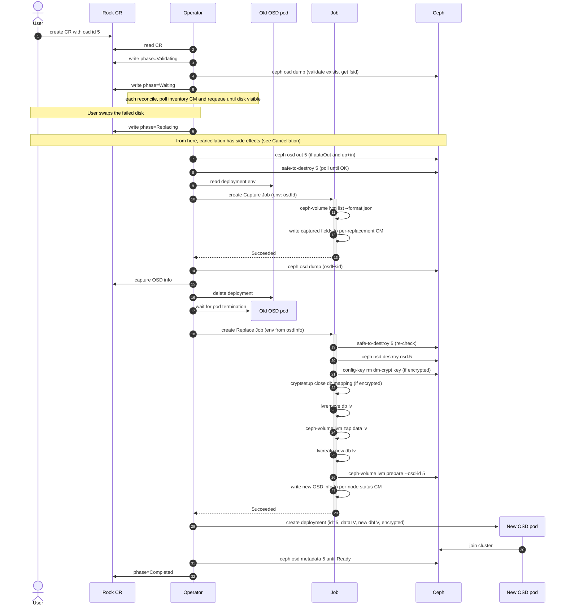

# Design: Single OSD replacement with a shared metadata device

Issue: [rook/rook#13240](https://github.com/rook/rook/issues/13240)

## Problem

When an OSD's data and metadata live on different devices (per `spec.storage` `metadataDevice` config in the CephCluster CR), Rook today cannot replace a single failed OSD on its own. The user must either re-provision all OSDs sharing the same metadata device or run a multi-step manual workflow including scaling down the operator to zero. Raw-mode OSDs (data and metadata on a single disk) follow a similar manual procedure today, with fewer steps.

This design proposes a workflow to replace a single failed OSD in place — preserving its OSD ID — without affecting other OSDs sharing the same metadata device.

## Notation

- **User** - the human cluster admin who edits the CR.
- **Operator** - the Rook controller process.
- **Data LV / data device** - the LV (or block device) holding an OSD's bulk data. One per OSD.
- **DB LV / metadata device** - the LV holding the OSD's rocksdb (`block.db`). One per OSD; multiple OSDs can share the same metadata device.

## User story

A disk corresponding to `osd.5` fails on a node where five HDD OSDs share one NVMe metadata device. The user marks `osd.5` for replacement in the Rook CR, swaps the physical disk in the chassis, and walks away. Rook destroys `osd.5`, frees its DB LV slot on the NVMe, provisions a new OSD on the replacement disk *with the same OSD ID 5*, and the other four OSDs on the same NVMe stay up the whole time.

## Constraints

### Replacement is same-host

The new disk must go to the same host as the destroyed OSD: the DB slot freed by destroying the old OSD lives on a metadata device attached to that host, and the replacement OSD's DB must reuse it. Cross-host replacement is permitted by Ceph but out of scope here.

### Rook cannot tell a replacement disk from a new disk

When a fresh empty disk appears on a node, Rook has no way to tell it's the replacement for a failed OSD. With `useAllDevices` or a matching `deviceFilter`, the next reconcile auto-provisions the new disk with a fresh ID and leaks the failed OSD's resources. The user must mark the OSD for replacement in the CR *before* swapping the disk.

### Storage device config must tolerate device swap

Rook lets users identify OSD data devices via `spec.storage`:

- `useAllDevices: true` — match any empty disk on the node.
- `deviceFilter: "<regex>"` — match disks whose `lsblk` properties match a regex.
- `nodes[].devices[].name: "<value>"` — match a specific path or name. Accepts a kernel name (`vdb`), a raw path (`/dev/sdc`), or a udev symlink (`/dev/disk/by-path/...`, `/dev/disk/by-id/...`).
- `nodes[].devices[].fullpath: "<value>"` — explicit DevLinks match (`/dev/disk/by-id/...`, `/dev/disk/by-path/...`). Compared against discovered symlinks, not regex.

Each shape interacts differently with the Linux device-naming interfaces:

- **Kernel names** (`vdb`, `sdc`, `/dev/sdc`) are assigned by the kernel at boot and [not guaranteed to be persistent](https://wiki.archlinux.org/title/Persistent_block_device_naming).
- **`/dev/disk/by-path/...`** is a udev symlink built from the sysfs port path: same physical port, same symlink.
- **`/dev/disk/by-id/...`** is a udev symlink built from the disk's hardware serial / WWN, unique per physical disk.
- **`/dev/disk/by-uuid/...`** is a udev symlink built from the filesystem or LV UUID, assigned at provisioning time.

The shapes that tolerate any swap (same-slot or different-slot, any new disk) are `useAllDevices` and `deviceFilter`. `by-path` tolerates only same-slot replacement. Kernel names tolerate only the lucky case where the kernel happens to assign the same name. `by-id`/`by-uuid` references in `name`/`fullpath` cannot work for a disk that hasn't been seen yet.

The replacement flow must validate the affected OSD's CR references beforehand so the new disk is still resolvable under those references after the swap.

## Current gaps

Rook has no automated flow for replacing a failed OSD today. The closest existing primitive is the migration flow (`spec.storage.migration`), which recreates OSDs in place after encryption or store-type spec changes: it destroys the OSD and re-prepares with `ceph-volume raw prepare --osd-id` via the `ROOK_REPLACE_OSD` env var. Migration only covers raw-mode OSDs; the shared-metadata case needs the following fixes:

1. `DestroyOSD` cleans up only the data LV. The DB LV on the shared metadata disk stays as an orphan, and the dm-crypt key in Ceph's config-key store is never removed (causing LUKS collisions on retry of encrypted OSDs). (`DestroyOSD`, [remove.go#L244-L290](https://github.com/rook/rook/blob/59ce48ae88e5ea59df44249b41a887af96a2806c/pkg/daemon/ceph/osd/remove.go#L244-L290))
2. **The prepare-pod can't find a shared metadata disk once any OSD lives on it.** Rook's disk-discovery (`DiscoverDevicesWithFilter`, [disk.go#L97-L111](https://github.com/rook/rook/blob/59ce48ae88e5ea59df44249b41a887af96a2806c/pkg/clusterd/disk.go#L97-L111)) skips any disk with `len(deviceChild) > 1` as a guard against claiming a user-partitioned disk. From the first OSD onward — encrypted or not — that count is ≥ 2 (parent + LV, plus crypt mapping if encrypted), so the filter triggers and the prepare-pod's `initializeDevicesLVMMode` errors with `metadata device <X> is not found`. Same root cause as upstream issues [#15868](https://github.com/rook/rook/issues/15868) and parts of [#17477](https://github.com/rook/rook/issues/17477).
3. **No discover-only mode in the prepare-job.** The prepare-job conflates discovery and provisioning in a single sequential pass (`Provision`, [daemon.go#L159-L283](https://github.com/rook/rook/blob/59ce48ae88e5ea59df44249b41a887af96a2806c/pkg/daemon/ceph/osd/daemon.go#L159-L283)) — no way to inventory a node without auto-claiming any empty disks it finds. The replacement flow needs "scan but don't claim" so the empty replacement disk doesn't get auto-provisioned with a fresh ID before the operator can drive `ceph-volume lvm prepare --osd-id`. This design adds a `ROOK_DISCOVER_ONLY` mode to the prepare-job; the cluster controller passes it for nodes with an active `CephOSDReplace`.

## Proposed flow

This flow orchestrates [Ceph's documented OSD-replacement procedure](https://docs.ceph.com/en/latest/rados/operations/add-or-rm-osds/#replacing-an-osd) (`safe-to-destroy` → `osd destroy` → `lvm zap` → `lvm prepare --osd-id` → `lvm activate`) inside a single short-lived Kubernetes Job, with state machine maintained in Rook CR status. `cephadm` — Ceph's container-orchestrator analogue — preserves OSD IDs by default ([cephadm OSD service docs](https://docs.ceph.com/en/latest/cephadm/services/osd/#replacing-an-osd)); this design follows the same convention.

### Sequence



### Open question: controller placement

The diagram doesn't pick a concrete CR or controller for the replacement reconcile logic. Two candidates: extend the existing CephCluster controller (which already hosts `spec.storage.migration`), or introduce a separate `CephOSDReplace` CRD with its own controller. The design leans toward the separate CRD for the following reasons:

1. **CephCluster's `reconcileCephDaemons` is monolithic and synchronous** — mon, mgr, and osd reconcile run sequentially in one call ([`cluster.go#L116-L160`](https://github.com/rook/rook/blob/59ce48ae88e5ea59df44249b41a887af96a2806c/pkg/operator/ceph/cluster/cluster.go#L116-L160)); `osd.Cluster.Start()` returns plain `error`, so there's no way to express terminal failure (bad CR rejected) vs. transient `RequeueAfter` (waiting for disk-swap or Job completion). Adding long-running multi-step logic to this path interferes with mon/mgr reconcile and lacks the return semantics the flow needs.
2. **Replacement state has to survive between reconciles**, and the cluster controller has no existing place to store sub-operation state — adding one (a side ConfigMap, or extending `CephCluster.status`) is part of the cost.

Concrete shape of each candidate:

- **Extend the cluster controller** — state in either a side ConfigMap (`osd-replacement-state`, similar to `osd-migration-config`) or `CephCluster.status`.
- **New `CephOSDReplace` CRD + dedicated controller** — state on `.status`. Independent reconcile loop; doesn't modify the existing OSD path (shares only the pod-scaffold builder, `provisionPodTemplateSpec`). Light coupling on the cluster side: skip auto-provisioning on affected nodes.

The rest of this design is based on a separate `CephOSDReplace` CRD, with implications for the cluster-CR fallback flagged inline.

### CRD proposal

Config lives on `CephOSDReplace.spec` and state in `.status`. `spec.cephCluster` and `spec.osdId` are immutable post-create. `.status` carries phase and conditions following the K8s operator pattern.

```yaml
apiVersion: ceph.rook.io/v1
kind: CephOSDReplace
metadata:
  name: replace-osd-5
  namespace: rook-ceph
  labels:
    rook.io/osd-replacement-node: node-1       # operator-managed; equals the target OSD's host node
spec:
  cephCluster: my-cluster                      # immutable; target cluster in this namespace
  osdId: 5                                     # immutable
  confirmation: yes-really-replace-osd-5       # must equal "yes-really-replace-osd-{osdId}"; copy-paste guard against operating on the wrong OSD
  autoOut: false                               # optional; if true, operator marks healthy OSD `out` automatically (during Replacing). Default: false (fail-fast on up+in at Validating)
  safeToDestroyTimeout: 1h                     # optional; how long Replacing tolerates EBUSY on safe-to-destroy before Failed. Default: 1h
  diskWaitTimeout: 24h                         # optional; how long Waiting tolerates a missing disk before Failed. Default: 24h

status:
  phase: Replacing                             # Pending | Validating | Waiting | Replacing | Completed | Failed | Cancelled
  conditions:
    - type: Ready
      status: "False"
      reason: Replacing
      message: Replace Job in flight
      observedGeneration: 1
      lastTransitionTime: "2026-05-05T12:00:00Z"

  # captured at start of Replacing, before deployment delete
  osdInfo:
    node: node-1                                          # OSD deployment NodeSelector (operator reads via K8s API)
    dataLV: /dev/ceph-data-vg-5/osd-block-aaa...          # OSD deployment env ROOK_BLOCK_PATH
    dbLV: /dev/ceph-metadata-vg-1/osd-db-bbb...           # `[db].lv_path` from `ceph-volume lvm list` (Capture Job)
    metadataSourceDevice: /dev/vdd                        # `[db].devices[0]` from `ceph-volume lvm list` (Capture Job)
    metadataVG: ceph-metadata-vg-1                        # `[db].vg_name` from `ceph-volume lvm list` (Capture Job)
    crushDeviceClass: hdd                                 # OSD deployment env ROOK_OSD_CRUSH_DEVICE_CLASS
    databaseSizeMB: 1500                                  # `[db].lv_size` (bytes) / 1048576 from `ceph-volume lvm list` (Capture Job)
    encrypted: true                                       # `[db].tags.ceph.encrypted` from `ceph-volume lvm list` (Capture Job)
    osdFsid: 07bb0602-5e27-4fcc-86b1-c1faa0bc20ac         # `ceph osd dump`: `.osds[id=].uuid` (operator via mon)

  # populated on phase=Completed
  newFsid: ""                                  # recorded on Completed
  completedAt: null
```

Users cancel a replacement by deleting the `CephOSDReplace` CR. A finalizer gives the operator a chance to clean up before the CR is removed. If the user cancels before the operator picks up the swapped disk, no Ceph or host state has changed and the CR is removed cleanly. If the replacement has already started, the operator runs it to a terminal state (success or failure) before removing the CR — see [Cancellation](#cancellation).

CR names are arbitrary. To re-replace the same OSD, the user creates a new CR with a different name. Terminal CRs (`Completed`, `Cancelled`, `Failed`) for the same `osdId` are ignored by the operator and can be deleted when no longer useful.

#### Coordination

Replacements run serially per CephCluster as a simplifying choice, matching cephadm's `osd rm` queue and Rook's existing OSD migration. Per-OSD `safe-to-destroy` only returns OK once the OSD is fully drained from every PG's acting set, so concurrent destroys of independently-safe OSDs are technically safe — but serial keeps the operational model simple.

The queue is implemented via a `Pending` phase. Each reconcile, the controller lists peer `CephOSDReplace` CRs in the same namespace targeting the same cluster. If no earlier-`creationTimestamp` peer is in a non-terminal phase, this CR advances to `Validating`; otherwise it stays in `Pending` and re-checks next reconcile. UID breaks same-second ties.

> Extending CephCluster with a `spec.storage.replaceOSD` field needs no coordination logic — a single field admits only one in-flight replacement.

#### Auto-provisioning skip

The Rook cluster controller spawns the prepare-job, which by default auto-discovers devices and provisions new OSDs. To make the replacement flow work, the cluster controller must run the prepare-job in "discover only" mode on a node where a replacement is running — discovery happens, provisioning doesn't.

In the existing cluster controller, add a gate before each `runPrepareJob` call in `startProvisioningOverNodes` ([create.go#L345](https://github.com/rook/rook/blob/59ce48ae88e5ea59df44249b41a887af96a2806c/pkg/operator/ceph/cluster/osd/create.go#L345)): list `CephOSDReplace` CRs whose `rook.io/osd-replacement-node` label equals the current node; if any is in a non-terminal phase, launch the Job with `ROOK_DISCOVER_ONLY=true` in its env. The replacement controller stamps this label on its CR at creation, reading the node from the target OSD's deployment. It clears the label on transition to a terminal phase; the deletion finalizer is a backup.

In discover-only mode, the prepare-job runs the same discovery code as a normal run (`DiscoverDevicesWithFilter` + `getAvailableDevices`) and writes the eligible-device list to the existing per-node status CM (`rook-ceph-osd-<node>-status`) and stops without provisioning.

The optional discovery DaemonSet (`ROOK_ENABLE_DISCOVERY_DAEMON=true`) only inventories devices; it doesn't provision. When enabled, it updates `local-device-<node>` on udev events with seconds latency. The replacement controller may watch that CM as a fast wake-up signal, but treats the discover-only status CM as authoritative — `local-device-<node>` is unfiltered (does not apply the cluster's `deviceFilter`/`useAllDevices`).

> With the cluster-CR fallback (`spec.storage.replaceOSD` on CephCluster), the cluster controller reads its own spec field instead of listing CRs — same flag plumbing.

#### Phase state machine

```
  Pending ─→ Validating ─→ Waiting ─→ Replacing ─→ Completed
       │           │           │           │
       ▼           ▼           ▼           ▼
                Cancelled / Failed
```

On operator restart, reconcile resumes from `.status.phase` plus observable state — Jobs by name, deployment presence, `osdInfo` populated, OSD `up+in` in `ceph osd tree`. Sub-step progress within `Replacing` is not persisted on the CR.

### Step-by-step

The walk-through uses the running example.

#### 1. Trigger — user creates a `CephOSDReplace` CR

Typical case is a failed disk: Ceph auto-marks the OSD `down` and `out` and rebalances the data. User creates a `CephOSDReplace` CR and replaces the failed disk in the datacenter.

Healthy (`up+in`) OSDs are rejected by [Validate](#2-validate) unless the user marks the OSD out manually first (`ceph osd out <id>`) or sets `spec.autoOut: true`.

On creation, the CR enters `Pending` and waits for any earlier in-flight replacement to terminate. Once cleared, it advances to `Validating`.

#### 2. Validate

Cheap upfront checks. Each reconcile cycle runs the checks in order; the first failure ends the phase.

1. **Confirmation matches.** `spec.confirmation` must equal `"yes-really-replace-osd-{spec.osdId}"`. On mismatch: `Failed` with `reason=InvalidSpec` (typo guard).
2. **Target OSD exists.** If absent from the OSD map: `Failed` with `reason=InvalidSpec`.
3. **Target OSD is destroyable.** If `up && in` and `spec.autoOut: false`: `Failed` with `reason=OSDStillIn`. If `up && in` and `spec.autoOut: true`: accepted; the actual `ceph osd out` runs in [Replace](#4-replace), not here.
4. **CR-level device matching is swap-tolerant.** The OSD's data device must be referenced via `useAllDevices`, `deviceFilter`, or a `/dev/disk/by-path/...` path (same-slot replacement only). Kernel names (`vdb`, `/dev/sda`), `by-id`, and `by-uuid` references are rejected — they can't resolve to a fresh disk. On rejection: `Failed` with `reason=InvalidSpec`. (Whether to make this configurable is [open question 6](#open-questions).)

On all checks passing, advances to `Waiting`.

#### 3. Wait for replacement disk

Each reconcile, the controller checks whether the replacement disk is visible by reading the per-node status CM (`rook-ceph-osd-<node>-status`, populated by the prepare-job). If the empty replacement disk isn't there yet, requeue. When it appears, advance to `Replacing`.

Cancel during `Waiting` is clean: no Ceph or host state has been changed, no LVs touched. Deletion of the CR ends the flow with no recovery needed.

If `spec.diskWaitTimeout` (default 24h) is exceeded, transitions to `Failed` with `reason=ReplacementDiskMissing`. After timeout, the user can insert the disk and create a new CR for the same OSD ID (the OSD is still alive in Ceph at this point), or delete the CR.

#### 4. Replace

`Replacing` runs the full set of state changes in sequence. On each reconcile, the operator inspects observable state (deployment presence, `status.osdInfo`, Replace Job status, `ceph osd tree`) and runs the next unfinished sub-step.

1. **autoOut (conditional).** If the OSD is `up && in` and `spec.autoOut: true`, run `ceph osd out <id>`. For the typical failed-disk case the OSD is already `out` (Ceph auto-marked it after `mon_osd_down_out_interval`) and this step is a no-op.

2. **Wait for `safe-to-destroy` OK.** `ceph osd safe-to-destroy <id>` returns OK only after the OSD is fully drained from every PG's acting set. Requeued until OK. If `spec.safeToDestroyTimeout` (default 1h) is exceeded, transitions to `Failed` with `reason=NotSafeToDestroy`.

3. **Capture OSDInfo.** Field sources (full schema in [CRD proposal](#crd-proposal)):

   - `node`, `dataLV`, `crushDeviceClass`: from the OSD deployment env, read by the operator via the K8s API.
   - `dbLV`, `metadataVG`, `metadataSourceDevice`, `databaseSizeMB`, `encrypted`: from `ceph-volume lvm list --format json`'s `[db]` entry. Host-only call, run by a **Capture Job** the operator spawns on the target node (same pod scaffold as the Replace Job — same cephx auth caveat as in step 5 below). The Job assumes the metadata device is still readable from the target node; if it has failed too, replacement cannot proceed. The Job writes captured fields to a per-replacement ConfigMap named `rook-ceph-osd-replace-<crName>`, owned by the `CephOSDReplace` CR (cascade-deleted on CR delete) and kept for the CR's lifetime. The operator waits for Job success, reads the CM, and copies fields to `.status.osdInfo` before proceeding to step 4 below.
   - `osdFsid`: from `ceph osd dump --format json` run by the operator via its mon connection.

   Jobs spawned at this and later steps use a deterministic name including an attempt counter (e.g., `rook-ceph-osd-replace-<crName>-capture-<n>`, `-replace-<n>`) to avoid name collisions on retry; the operator increments `<n>` on each spawn after a prior attempt's terminal status.

4. **Delete OSD deployment.** The operator calls `k8sutil.DeleteDeployment` ([`deployment.go#L388`](https://github.com/rook/rook/blob/59ce48ae88e5ea59df44249b41a887af96a2806c/pkg/operator/k8sutil/deployment.go#L388)) on `rook-ceph-osd-5` and polls until the pod is gone.

5. **Replace Job.** Built on the existing prepare-job pattern (same one the OSD migration flow uses): a new rook subcommand on the prepare-job's pod scaffold (`provisionPodTemplateSpec`) runs the destroy + prepare bash sequence. Volume mounts, init containers, `DM_DISABLE_UDEV=1`, and cephx auth bootstrap are all inherited from that pattern. The new DB LV's UUID is generated by the operator at Job creation and passed via env.

   The container's command:

```bash
set -euo pipefail

# Skip safe-to-destroy + destroy if osd.5 is already destroyed (idempotent on Job retry).
already_destroyed() {
  ceph osd dump --format json | python3 -c "
import sys, json
osds = json.load(sys.stdin).get('osds', [])
o = next((o for o in osds if o.get('osd') == 5), None)
sys.exit(0 if o and 'destroyed' in (o.get('state') or []) else 1)
"
}

if ! already_destroyed; then
  # Re-check safe-to-destroy (insurance against races between phase transition and Job start).
  ceph osd safe-to-destroy 5
  # Destroy in Ceph (preserves OSD ID 5 for reuse).
  ceph osd destroy osd.5 --yes-i-really-mean-it
fi

# Remove dm-crypt key (no-op on Ceph v19+; defensive for older versions).
ceph config-key exists dm-crypt/osd/<osdFsid>/luks \
  && ceph config-key rm dm-crypt/osd/<osdFsid>/luks

# Close DB-side LUKS mapping.
DB_MAPPING=$(lsblk -nlo NAME,TYPE /dev/ceph-metadata-vg-1/osd-db-<dbUuid> | awk '$2=="crypt"{print $1; exit}')
[ -n "$DB_MAPPING" ] && cryptsetup status "$DB_MAPPING" >/dev/null 2>&1 \
  && cryptsetup close "$DB_MAPPING"

# Free the DB slot.
lvs /dev/ceph-metadata-vg-1/osd-db-<dbUuid> >/dev/null 2>&1 \
  && lvremove -f /dev/ceph-metadata-vg-1/osd-db-<dbUuid>

# Zap the data LV (also handles the data-side dm-crypt mapping).
lvs /dev/ceph-data-vg-5/osd-block-<dataUuid> >/dev/null 2>&1 \
  && ceph-volume lvm zap /dev/ceph-data-vg-5/osd-block-<dataUuid> --destroy

# Pre-allocate the new DB LV; skip if it already exists (retry-safe).
lvs /dev/ceph-metadata-vg-1/osd-db-12cf3a91-... >/dev/null 2>&1 \
  || lvcreate -L 1500M -n osd-db-12cf3a91-... ceph-metadata-vg-1 --wipesignatures y

# Provision the new OSD with the preserved ID. --dmcrypt only when the record's
# `encrypted` field is true.
ceph-volume lvm prepare \
  --bluestore [--dmcrypt] \
  --osd-id 5 \
  --data /dev/vdh \
  --block.db /dev/ceph-metadata-vg-1/osd-db-12cf3a91-... \
  --crush-device-class hdd
```

   The Job writes the new OSD's info to `rook-ceph-osd-<node>-status` (the per-node CM Rook already uses to drive daemon creation).

6. **Create new Deployment.** The cluster controller's existing path takes over: `createOSDsForStatusMap` ([`status.go#L324`](https://github.com/rook/rook/blob/59ce48ae88e5ea59df44249b41a887af96a2806c/pkg/operator/ceph/cluster/osd/status.go#L324)) reads the per-node status CM the Replace Job wrote and creates the daemon Deployment.

7. **Wait for `up+in`.** The controller polls `ceph osd tree` each reconcile until the new daemon is `up` AND `in`. Once visible, capture `osd_uuid` from `ceph osd metadata <id>` and transition to [Complete](#5-complete).

#### 5. Complete

Terminal phase. `.status.newFsid` and `.status.completedAt` are recorded; the `Ready` condition transitions to `True`.

### Cancellation

Cancel = delete the `CephOSDReplace` CR; a finalizer runs any cleanup needed.

**Pending, Validating, Waiting.** Clean cancel — no Ceph or host state has been changed. The finalizer is a no-op aside from clearing the auto-provisioning gate label on the affected node.

**Replacing — best-effort, deferred.** Once `Replacing` begins, the operator commits to running through to a terminal phase. Cancel intent is recorded but not acted on mid-flow:

- If the Replace Job is in flight, the operator lets it complete. `ceph-volume lvm prepare` cannot be safely interrupted mid-call (partial dm-crypt + half-LUKS LV).
- On Job failure, the finalizer spawns a one-shot cleanup Job on the target node (same pod scaffold) to remove any partially-allocated DB LV before removing the CR.
- On Job success, cancel is not honored — the new OSD joins the cluster.

## Notes on Scope

### Multiple metadata devices on one node — works conditionally

Rook supports per-device metadata-device pairing:

```yaml
nodes:
- name: "node-1"
  devices:
  - name: "/dev/disk/by-path/...sda"
    config: { metadataDevice: "nvme0n1" }
  - name: "/dev/disk/by-path/...sdb"
    config: { metadataDevice: "nvme0n1" }
  - name: "/dev/disk/by-path/...sdc"
    config: { metadataDevice: "nvme1n1" }   # different metadata device on the same node
```

This setup requires exact `name:` (or `fullpath:`) references — the per-device `config:` block can only be attached to a specific device entry, not to a regex match. Replacement of a single OSD on this setup works structurally (each OSD's `metadataSourceDevice` is captured in its `osdInfo` at destroy time), with two caveats:

- **Device-name validation must permit exact entries** — see [open question 6](#open-questions).
- **Same-slot replacement is required** — `by-path` resolves only when the new disk is in the original slot. Different-slot replacement stalls in the Wait step.

### PVC-based OSD replacement — separate design

PVC-backed OSDs use a different code path (raw mode via `GetCephVolumeRawOSDs`, separate destroy plumbing). Issue #13240 is host-based storage; PVC replacement is a separate design.

## Open questions

1. **Controller placement.** Design leans toward a separate `CephOSDReplace` CRD; `spec.storage.replaceOSD` on CephCluster (mirroring `spec.storage.migration`) is a fallback — see [Open question: controller placement](#open-question-controller-placement). Maintainers' call.

2. **Parallelism.** The proposed OSD replacement process is serial. Are there use-cases for parallel replacement we should support — multiple OSDs safe-to-destroy on the same node, all safe-to-destroy in the cluster at once, configurable concurrency?

3. **Auto-replace mode.** The proposed flow is always triggered explicitly by the user (CR creation). Should there be a follow-up option for automated replacement that triggers the same flow when a failed OSD and a fresh disk are detected on a node?

4. **Default values.** Proposed: `safeToDestroyTimeout: 1h`, `diskWaitTimeout: 24h`, disk-wait re-check interval `5 min` (cluster-config tunable). Reasonable, or do reviewers see a reason to change them?

5. **Disk-swap responsiveness.** Can the design rely on Rook's existing discovery (rook-discover when enabled, otherwise the per-reconcile prepare-job inventory) to detect the replacement disk?

6. **Device-name validation.** Proposed: reject kernel names (`/dev/sda`, `vda`), `by-id`, and `by-uuid` references; accept `useAllDevices`, `deviceFilter`, and `by-path` (with implicit same-slot expectation). Sample:

   ```yaml
   spec:
     storage:
       nodes:
       - name: node-1
         devices:
         - name: /dev/sda             # kernel name — rejected (not swap-stable)
         - name: /dev/disk/by-path/... # by-path — accepted (same-slot only)
   ```

   Should this be configurable, more permissive (user takes responsibility for any name), or stricter (reject `by-path` too)?

7. **Cross-host replacement for non-shared-metadata OSDs.** Same-host is required by this design because the captured `metadataVG` lives on the original host. For OSDs without a metadata device this argument doesn't apply. Ceph itself permits cross-host replacement: `ceph osd destroy` retains no host info; CRUSH auto-relocates the OSD on daemon start at the cost of full PG remapping. Should this flow be supported by Rook osd replacement?

8. **Combine Capture and Replace into one Job.** The Capture step currently runs as a separate Job before the Replace Job. It could be merged into the Replace Job's first commands, with intermediate state persisted to a per-replacement ConfigMap (mirroring the prepare-job's CM hand-off pattern) so the Job remains retry-idempotent: on retry the Job reads the CM if present and skips re-capture, then proceeds with destroy + prepare. Saves one Job spawn per replacement; adds a CM-check branch at the top of the Job's bash and a CM-write helper invocation.
