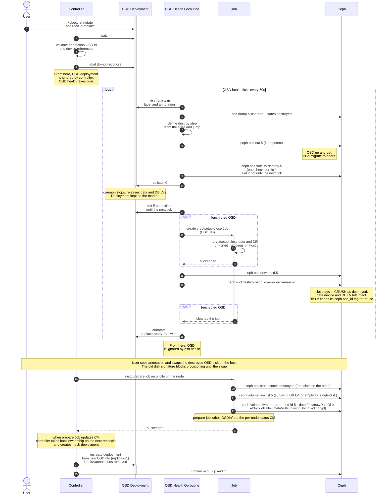

# Design: Single OSD replacement with a shared metadata device

Issue: [rook/rook#13240](https://github.com/rook/rook/issues/13240)

## Problem

When an OSD's data and metadata live on different devices (per `spec.storage` `metadataDevice` config in the CephCluster CR), Rook today cannot replace a single failed OSD on its own. The user must either re-provision all OSDs sharing the same metadata device or run a multi-step manual workflow including scaling down the operator to zero. Raw-mode OSDs (data and metadata on a single disk) follow a similar manual procedure today, with fewer steps.

This design proposes a workflow to replace a single failed OSD in place — preserving its OSD ID — without affecting other OSDs sharing the same metadata device.

## Notation

- **User** - a human cluster admin, or a third-party controller acting on their behalf, that edits Kubernetes objects.
- **Operator** - the Rook controller process (CephCluster controller).
- **Data LV / data device** - the LV (or block device) holding an OSD's bulk data. One per OSD.
- **DB LV / metadata device** - the LV holding the OSD's rocksdb (`block.db`). One per OSD; multiple OSDs can share the same metadata device.

## Goals and non-goals

Goals:

- Automate the single-OSD replacement process in a host-based cluster, preserving the OSD's config, CRUSH position, and DB LV (for shared-metadata OSDs), without interrupting the operator's normal reconcile flow or the other OSDs on the same node.
- Expose an API for the user to initiate a replacement and be notified when the disk may be safely swapped.
- Eliminate the need for manual operations, toolbox access, and disabling the operator for OSD replacement.

Non-goals:

- **PVC-backed OSDs.** Different code path; out of scope.
- **External clusters.** No operator-managed OSDs, so replacement does not apply.
- **Detecting which disk failed.** Rook does not decide that an OSD needs replacing. A Rook user makes that call and triggers the flow.
- **Metadata device replacement.** The flow reuses the surviving DB LV on the metadata device. Replacing the failed disk used as a shared metadata device across several OSDs is out of scope for this document.

## Constraints and assumptions

### Replacement is same-host

The new disk must go to the same host as the destroyed OSD. For shared-metadata layouts this is a hard requirement: the metadata VG holding the new DB LV lives on a device attached to that host. For other layouts there is no hard constraint, but preserving the OSD ID across hosts does not buy anything — CRUSH remaps PGs on daemon start anyway. Cephadm takes the same defensive approach and does not allow [cross-host replacement](https://docs.ceph.com/en/latest/cephadm/services/osd/#replacing-an-osd).

### Marking the OSD is the user's responsibility

Rook cannot reliably distinguish a freshly added disk from a replacement disk, so it does not decide what to replace. The Rook user marks the failed OSD *before* swapping the disk, which lets Rook drive cleanup and reserve the OSD slot for the incoming disk. Annotate first, then swap any time after Rook signals the disk is ready to pull.


### Replacement is a transient operation

Replacement is a transient operation: it does not describe desired cluster state (which is what the CR spec is for), and there is no need to keep a history of disk replacements. Once a replacement is fully complete the cluster state equals the one before the failure, and the process can be repeated for the same OSD with no cleanup. These properties make the CR a poor API contract both for the user's replacement trigger and for Rook signaling swap-readiness back to the user — especially with gitops tools like Flux or Argo that continuously reconcile the CR toward a checked-in state.

The natural Kubernetes mechanism for such an operation is an annotation, as used for similar integrations by monitoring tools. So an annotation on the OSD Deployment serves both as the destroy trigger and as the destroy-completion and swap-readiness signal.

### Device references may not survive a swap

Rook's `spec.storage` accepts non-persistent (see [persistent block device naming](https://wiki.archlinux.org/title/Persistent_block_device_naming)) device references — `deviceFilter`, `useAllDevices`, kernel names, and udev symlinks under `/dev/disk/by-path`, `by-id`, and `by-uuid` — for both the data device and the `metadataDevice`. This is existing behavior and cannot be restricted without breaking backward compatibility. Non-persistent device names (e.g. `/dev/sda`) can change even for an existing device on a node restart, and some persistent udev links can change due to a disk replacement. The design must tolerate this: fail fast with a validation error before the replacement process if such drift can be detected from the cluster spec, and derive the correct device name from the host if references have drifted from the spec.

## User story

A disk corresponding to `osd.5` fails on a node where five HDD OSDs share one NVMe metadata device. The user annotates the failed OSD's deployment:

```sh
kubectl -n rook-ceph annotate deployment rook-ceph-osd-5 \
  osd.rook.io/replace=yes-really-replace-osd-5
```

Rook drains and destroys `osd.5` in Ceph, scales its deployment to zero, and — once the OSD is destroyed and safe to pull — annotates the deployment `osd.rook.io/replace-ready-for-swap`. The user swaps the physical disk in the chassis at any later time, minutes or days, after watching for that annotation. Rook detects the new disk on the following reconcile and brings `osd.5` back up with the preserved OSD ID 5. The other four OSDs on the same NVMe stay up the whole time.

## Proposed flow

The flow follows [Ceph's documented OSD-replacement procedure](https://docs.ceph.com/en/latest/rados/operations/add-or-rm-osds/#replacing-an-osd) (`osd out`, `safe-to-destroy`, `osd destroy`), the same one [cephadm](https://docs.ceph.com/en/latest/cephadm/services/osd/#replacing-an-osd) automates, in two phases:

1. **Destroy and reserve the slot.** (Triggered by the `replace` annotation above) Rook validates the replacement request, drains the OSD, scales its Deployment to zero, and runs the Ceph destroy commands without zapping the OSD's on-disk signature. When done, the scaled-down Deployment is annotated as ready for swap.
2. **Provision the replaced OSD.** The existing prepare-job, with the adjustments described below, detects the swapped-in disk and provisions a new OSD into the destroyed slot, reusing its id and its surviving shared-metadata DB LV.

The destroy flow does not require the disk to have failed; it works uniformly for healthy OSDs too, since Rook is not responsible for hardware-failure detection.

### State and markers

The flow is multistep, and its state is carried by the following Ceph and Kubernetes data:

- **`osd.rook.io/replace` annotation on the OSD Deployment.** The caller's intent and a confirmation guard (value `yes-really-replace-osd-<id>`). Present from the trigger until the replacement finishes. The Deployment is kept and scaled to `replicas=0`, not deleted, so the annotation persists on it.
- **`osd.rook.io/replace-ready-for-swap` annotation.** Set by Rook once the OSD is destroyed. It signals to the user that the disk may now be physically swapped.
- **The destroyed slot and the old disk's signature.** `ceph osd destroy` marks the slot `destroyed` in the OSDMap, preserving the OSD id, CRUSH bucket, and weight — that slot is the id the new disk reuses. The destroyed OSD's disk is left untouched, so its Ceph on-disk signature still blocks provisioning onto it; the signature's disappearance after the physical swap is how Rook detects the swap. A disk too broken to read is equally safe — discovery never sees an unreadable device as available.

### Sequence



### Step-by-step

The walk-through uses the running example.

#### 1. Trigger and validation

The user sets `osd.rook.io/replace=yes-really-replace-osd-<id>` on the OSD Deployment. The numeric `<id>` in the value must equal the Deployment's `ceph-osd-id` label, a copy-paste guard against operating on the wrong OSD.

Rook's CephCluster controller predicate ([predicate.go#L252-L255](https://github.com/rook/rook/blob/59ce48ae88e5ea59df44249b41a887af96a2806c/pkg/operator/ceph/controller/predicate.go#L252-L255)) is adjusted to trigger a reconcile when the annotation is added. The controller then runs cheap in-place checks:

1. **Confirmation matches.** Annotation value equals `yes-really-replace-osd-<id>` where `<id>` equals the Deployment's `ceph-osd-id` label.
2. **Target OSD exists and is not already destroyed.** `ceph osd dump`: the OSD must exist and its `state` must not contain `destroyed`.
3. **Deployment is host-based.** Label `ceph.rook.io/pvc` must be absent.
4. **Device references resolve now.** Best-effort check of the OSD's `spec.storage` references, per [Device references may not survive a swap](#device-references-may-not-survive-a-swap).

On the first failed check the controller skips the OSD and emits a Warning event on the CephCluster CR; see [open question 2](#open-questions). On all checks passing, it sets the `ceph.rook.io/do-not-reconcile` label. From here the OSD and its Deployment are ignored by the controller's normal reconcile until the replacement completes or is cancelled, and the OSD health monitor goroutine takes over.

#### 2. Drain

The rest of OSD destroy flow runs in the OSD health monitor goroutine, which the operator starts per CephCluster ([monitoring.go#L94-L96](https://github.com/rook/rook/blob/59ce48ae88e5ea59df44249b41a887af96a2806c/pkg/operator/ceph/cluster/monitoring.go#L94-L96)). When enabled, it calls `ceph osd dump` every 60s to check OSD status; replacement extends this loop. Before the normal status check, the goroutine selects the Deployments carrying the replacement annotation and no-reconcile label, excludes them from normal health processing, and runs the replacement logic on them.

The replacement logic is a state machine. Each tick the goroutine derives each OSD's phase from durable state — the OSDMap, the Deployment's labels and annotations, and the per-OSD cleanup Job — and takes the one action for that phase. It keeps no memory of its own, so an operator restart resumes wherever the state left it, and every action is idempotent.

| Phase | How the goroutine detects it | Action this tick |
| --- | --- | --- |
| Not validated | no `do-not-reconcile` label | ignore — the controller has not validated and labelled it yet |
| Not started | labelled; OSD still `in` | run `ceph osd out <id>` |
| Draining | labelled; OSD `out`; not yet `safe-to-destroy` | re-check `ceph osd safe-to-destroy <id>`, otherwise exit for retry |
| Ready to destroy | `safe-to-destroy` passes; slot not yet `destroyed` | run the [Destroy](#3-destroy) steps |
| Destroyed | slot `destroyed`; no `replace-ready-for-swap` annotation | add the `replace-ready-for-swap` annotation |
| Done | `replace-ready-for-swap` present | ignore — the goroutine's work is finished |

Rook marks every annotated OSD `out` and lets them drain in parallel. Marking `out` keeps the daemon `up` while its PGs migrate to peers, so it never makes data unavailable — the only destructive step, `destroy`, is gated separately by `safe-to-destroy`. After marking an OSD `out`, the goroutine re-checks `ceph osd safe-to-destroy <id>` each tick until no PGs map to it. There is no timeout: a large OSD can take hours or days, and the user cancels by removing the annotation (see [Cancellation and retry](#cancellation-and-retry)).

The daemon is not stopped during the drain. Scaling the Deployment to zero belongs to [Destroy](#3-destroy) and runs only after `safe-to-destroy` passes — stopping the daemon earlier would both keep `safe-to-destroy` from returning a clear answer (a `down` OSD whose PGs have not finished migrating cannot be confirmed safe) and risk PG availability.

#### 3. Destroy

Once an OSD reports `safe-to-destroy`, the goroutine destroys it. Each step is idempotent, so a restart re-runs them safely:

1. **Scale the Deployment to `replicas=0`.** Then wait, re-checking on later ticks, until the OSD pod is gone — the daemon holds the data and DB LVs open while it runs.
2. **Close dm-crypt mappings (encrypted only).** This is the only host-side step, and the operator pod cannot run it, so the goroutine spawns a Kubernetes Job named after the OSD id (standard Rook scaffold) on the node to run `cryptsetup close`. It polls the Job on later ticks and proceeds once it succeeds; the Job is kept as state and cleaned up later.
3. **`ceph osd down osd.<id>`.** Forces the mon view to `down`. Idempotent, and dodges a heartbeat-lag `EBUSY` on the next call.
4. **`ceph osd destroy osd.<id> --yes-i-really-mean-it`.** The slot becomes `destroyed`; CRUSH bucket and weight are preserved. The mon's `KVMonitor::do_osd_destroy` clears the `dm-crypt/osd/<uuid>/*` and `daemon-private/osd.<id>/*` keys ([KVMonitor.cc#L369-L387](https://github.com/ceph/ceph/blob/v19.2.2/src/mon/KVMonitor.cc#L369-L387)), so no explicit `config-key rm` is needed. The data device and the DB LV are left intact, and the DB LV keeps its `ceph.osd_id` tag for reuse. Re-running it is a no-op on an already-`destroyed` slot; that state, read with `ceph osd tree --states destroyed`, is what stops a second destroy and lets the goroutine resume here after a restart.
5. **Annotate the Deployment `osd.rook.io/replace-ready-for-swap`.** Its presence signals that the disk may now be physically swapped. For an encrypted OSD, the cleanup Job is removed here, before annotating.

#### 4. Swap detection and reprovision safety

Until the disk is physically swapped — possibly days later — two things must hold on every reconcile:

- **Detecting the swap.** Rook's device discovery (`getAvailableDevices`, [daemon.go#L361-L391](https://github.com/rook/rook/blob/59ce48ae88e5ea59df44249b41a887af96a2806c/pkg/daemon/ceph/osd/daemon.go#L361-L391)) offers a device for a new OSD only when it can read it and finds it empty. The destroyed OSD's disk still carries its Ceph signature, so it is skipped. After the swap the new disk is blank, passes the gate, and becomes available; that transition is the swap signal.
- **Not rebuilding the destroyed OSD.** The prepare-job reports the OSDs it discovers with `ceph-volume list` to the status CM, today filtered only by cluster FSID ([volume.go#L1108-L1111](https://github.com/rook/rook/blob/59ce48ae88e5ea59df44249b41a887af96a2806c/pkg/daemon/ceph/osd/volume.go#L1108-L1111)). The design extends that filter to also skip OSDs marked `destroyed` in the OSDMap, so the destroyed slot is never reported and the controller leaves it for the replacement.

Swapping the disk before the OSD is destroyed leaves no destroyed slot to pair with, so the blank disk is provisioned as a brand-new OSD with a new id. The `replace-ready-for-swap` annotation exists to make the correct ordering observable.

#### 5. Provision and complete

When the user swaps the disk, the blocking Ceph signature — the FSID and other tags — disappears. On the next prepare-job reconcile, the prepare-job runs the existing discovery pass plus a new per-node pre-step:

1. **Enumerate destroyed slots for this node.** `ceph osd tree --states destroyed --format json` filtered by the prepare-job's node name (read from `ROOK_NODE_NAME` env).
2. **Discovery finds the new empty data device.**
3. **Recover the OSD's DB LV.** `ceph-volume lvm list <id>` reports the surviving DB LV (path and VG) on the metadata device — it kept its `ceph.osd_id` tag through the swap. An empty result means the OSD had no separate metadata device (single-disk), so provisioning is data-only.
4. **Invoke `ceph-volume` with the preserved slot ID.** Per layout:
   - **LVM with shared metadata device** (encrypted or not): `ceph-volume lvm prepare --bluestore --osd-id <id> --data /dev/<newDataDisk> --block.db /dev/<metadataVG>/<survivingDbLV> [--dmcrypt] --crush-device-class <class>`.
   - **LVM single-disk** (no separate metadata device): same command with `--block.db` omitted.
   - **Raw single-disk**: `ceph-volume raw prepare --bluestore --osd-id <id> --data /dev/<newDataDisk>`.

Invocation notes:

- **`--osd-id <id>` claims the destroyed slot.** Internally `ceph-volume` calls `ceph osd new <new-fsid> <id>`; the OSD ID, CRUSH bucket, and weight are preserved, only the OSD UUID is new.
- **Reusing the old DB LV in place is safe.** `ceph-volume` retags and re-mkfs the LV passed via `--block.db`, allocating nothing on the metadata device, so sibling DB LVs are untouched and stale BlueStore or LUKS leftovers are overwritten during prepare. This is why the flow uses `lvm prepare --block.db <vg/lv>` and not `lvm batch`, which always allocates a new DB slot and refuses a surviving sibling LV.
- **A failed `lvm prepare` can be destructive.** Its rollback runs `ceph osd purge-new`, which removes the destroyed slot and zaps the reused DB LV; recovery is then manual (see [Cancellation and retry](#cancellation-and-retry)). The one known trigger cannot reach prepare, since the availability gate never offers a device pinned by a stale mapping.

The prepare-job writes the reprovisioned OSD's id and OSDInfo to the per-node status CM `rook-ceph-osd-<node>-status`, exactly as for any OSD it provisions, and never touches the Deployment. That new entry brings the slot back under the controller's create path; nothing in the goroutine runs past `replace-ready-for-swap`.

Once the OSD is in the per-node status CM, the controller's create path stops ignoring it and picks it up on the next reconcile. It finds the scaled-down Deployment still carrying `replace-ready-for-swap`, recognizes a finished replacement, and deletes and recreates it from the CM ([create.go#L93-L98](https://github.com/rook/rook/blob/59ce48ae88e5ea59df44249b41a887af96a2806c/pkg/operator/ceph/cluster/osd/create.go#L93-L98), the same delete-then-create the migration flow uses, [osd.go#L410-L417](https://github.com/rook/rook/blob/59ce48ae88e5ea59df44249b41a887af96a2806c/pkg/operator/ceph/cluster/osd/osd.go#L410-L417)). The rebuilt Deployment comes back at `replicas=1` with the new disk's OSDInfo and none of the replacement labels or annotations — deleting the old Deployment is what removes them. The cluster is fully back to its pre-failure state.

The replacement is complete once `osd.<id>` is `up` and `in`, at which point the controller emits an `OSDReplaceCompleted` event.

### Cancellation and retry

Cancellation is done by removing the `osd.rook.io/replace` annotation.

- **Before destroy (during validate or drain).** Clean cancel: no Ceph state has been changed that cannot be reversed. On the next tick the goroutine sees the annotation gone, stops the `safe-to-destroy` wait, marks the OSD back `in` with `ceph osd in <id>`, and clears the `do-not-reconcile` label so the updater scales the Deployment back to `replicas=1`. The goroutine may clear the label here even though it must never *set* it (see [Why split the work](#why-split-the-work-between-the-controller-and-the-goroutine)). Clearing is safe in a race: if a reconcile does not see the cleared label, it just skips the OSD for one more tick. Setting is not safe: a reconcile that does not see a newly set label would scale the OSD back up and undo the replacement.
- **After destroy succeeds.** Not honored. The slot is already `destroyed` in the OSDMap. Recovery is to either let the flow complete (provision a new disk into the same slot) or abandon it manually: `ceph osd purge <id>` to retire the slot, `ceph-volume lvm zap --destroy` the surviving DB LV, and delete the held OSD Deployment.

Retry after a terminal failure (validation rejection): the user removes the `osd.rook.io/replace` annotation and re-adds it. The carve-out fires a fresh reconcile and the controller re-validates.

## Design choices

The [Step-by-step](#step-by-step) flow above covers the happy path. This section explains how the design handles other cases and records design choices not covered above.

### Multiple metadata devices on one node

Rook supports per-device metadata-device pairing:

```yaml
nodes:
- name: "node-1"
  devices:
  - name: "/dev/disk/by-path/...sda"
    config: { metadataDevice: "nvme0n1" }
  - name: "/dev/disk/by-path/...sdb"
    config: { metadataDevice: "nvme0n1" }
  - name: "/dev/disk/by-path/...sdc"
    config: { metadataDevice: "nvme1n1" }   # different metadata device on the same node
```

This setup requires exact `name` (or `fullpath`) references — the per-device `config` block can only be attached to a specific device entry, not to a regex match.

Replacement works here because provisioning never re-reads the per-device `config`: `ceph-volume lvm list <id>` recovers the destroyed OSD's own DB LV, which lives on the correct metadata device by construction, and reuses it in place — see [open question 1](#open-questions). The only added caveat is that same-slot replacement is required: a `by-path` reference resolves only when the new disk is in the original slot, so a different-slot swap fails at provisioning.

### OSDs without a separate metadata device

The flow naturally covers OSDs that have no metadata device:

- **LVM single-disk.** Teardown is `ceph osd destroy` (plain) or `destroy` plus closing the data dm-crypt mapping (encrypted). The data LV is left as the marker. Provisioning uses `lvm prepare --data` without `--block.db`.
- **`ceph-volume raw` OSDs.** Teardown is `ceph osd destroy`; the BlueStore label on the disk is the marker. Provisioning uses `raw prepare --osd-id <id>`.

Host-based raw OSDs are always plain: `allowRawMode` provisions in lvm mode whenever the OSD is encrypted, has a metadata device, or sets `osdsPerDevice > 1` ([volume.go#L418-L463](https://github.com/rook/rook/blob/59ce48ae88e5ea59df44249b41a887af96a2806c/pkg/daemon/ceph/osd/volume.go#L418-L463)). So an encrypted single host disk is an lvm-mode OSD, and raw-encrypted does not arise. The flow covers all OSD types in a host-based cluster.

### Why keep the Deployment instead of deleting it

This design introduces a new, valid state for an OSD Deployment: kept at `replicas=0` through teardown and the swap-wait. Deleting it at destroy would also work, but then the in-flight state would have to live elsewhere — an auxiliary ConfigMap or the cluster status, as the migration flow does. It would also give the user a weaker contract: with no Deployment, the `replace-ready-for-swap` annotation has nowhere to live, so the user would have to inspect a ConfigMap to learn when the disk can be swapped instead of reading it off the Deployment. The Deployment is deleted only at the very end, when the create path rebuilds it from the status CM.

### Why split the work between the controller and the goroutine

The simplest design would keep everything in one place. Neither end works alone:

- **Not all in the goroutine.** The controller and the goroutine act on the same OSD concurrently, so the goroutine needs a fence that keeps the controller's updater off the Deployment while it works. That fence is the `do-not-reconcile` label ([update.go#L155-L158](https://github.com/rook/rook/blob/59ce48ae88e5ea59df44249b41a887af96a2806c/pkg/operator/ceph/cluster/osd/update.go#L155-L158)), and only the controller can set it safely. Reconciles of one CephCluster are serialized ([controller.go#L166](https://github.com/rook/rook/blob/59ce48ae88e5ea59df44249b41a887af96a2806c/pkg/operator/ceph/cluster/controller.go#L166)), so a label written inside a reconcile is durable. The goroutine runs as a separate thread: if it set the label, a reconcile already in flight — one that read its skip set before the write — would not see the label, regenerate the Deployment, drop it, and scale the OSD back to `replicas=1`, fighting the replacement. So validation and labelling stay in the controller, and the goroutine only acts on OSDs that are already fenced.
- **Not all in the controller.** Draining waits on `safe-to-destroy` for hours or days. Running that in the reconcile would tie up the controller and delay its other, more important flows. The goroutine runs on its own 60s loop ([health.go#L70-L91](https://github.com/rook/rook/blob/59ce48ae88e5ea59df44249b41a887af96a2806c/pkg/operator/ceph/cluster/osd/health.go#L70-L91)), independent of the reconcile, so it carries the long teardown without blocking anything and a failure there cannot stall the controller.

The label is the handoff: the controller owns the OSD until it is labelled, the goroutine owns it afterward.

## Intersection with existing Rook config

The flow depends on a few CephCluster and operator settings:

- **`spec.healthCheck.daemonHealth.osd.disabled`** (default `false`, i.e. enabled). The destroy logic runs inside the OSD health monitor, so it must stay enabled for replacement.
- **`spec.removeOSDsIfOutAndSafeToRemove`** (default `false`). Must be disabled, or replacement breaks: when enabled, Rook deletes a down+out OSD's Deployment ([health.go#L135-L167](https://github.com/rook/rook/blob/59ce48ae88e5ea59df44249b41a887af96a2806c/pkg/operator/ceph/cluster/osd/health.go#L135-L167)), which can remove a failed OSD's Deployment before the user annotates it for replacement.
- **rook-discover daemon** (`ROOK_ENABLE_DISCOVERY_DAEMON`). When enabled, it triggers the reconcile that runs the prepare-job to detect the swapped-in disk; without it the user must trigger a reconcile manually after the swap (see [Provision and complete](#5-provision-and-complete)).


## Open questions

1. **Metadata device: reuse the surviving DB LV, or consult the spec?** The design recovers the metadata device from the destroyed OSD's surviving DB LV (`ceph-volume lvm list <id>`) and reuses that LV in place. This is drift-proof and needs no spec read. The trade-off: a user edit to `spec.storage[<node>].config.metadataDevice` is ignored for the replacement. (A replacement where no DB LV survives is already a non-goal.) Should provisioning ever consult the spec, or always follow the surviving DB LV?

2. **Where to report the validation result.** The current proposal emits a Warning event on the CephCluster CR (matching Rook convention). Should it also emit on the OSD Deployment, the object the caller annotated?

