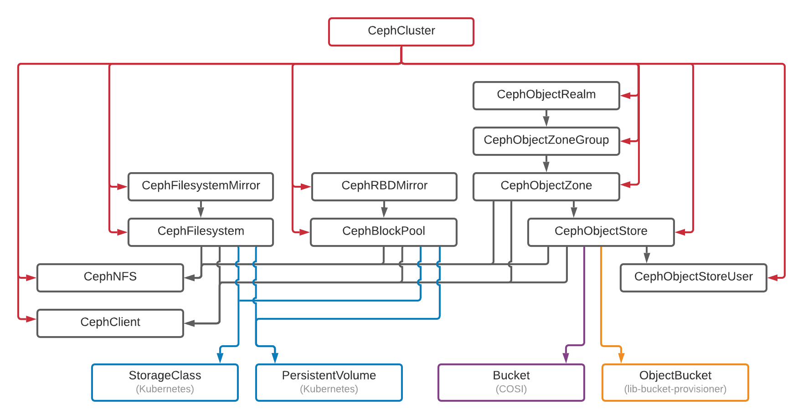

# Resource dependency relationships

**Targeted for v1.7**

## Goal

Custom Resources in Rook-Ceph can act as data/storage "providers" for other Resources in the
Kubernetes cluster which may be "dependent" on the data/storage provided to them. This dependency
relationship is not codified in Rook, and it is possible for Custom Resources which have dependents
to be deleted, removing the underlying data that dependents need. This leaves those resources
orphaned and could destroy valuable end-user data.

An example of this is a user needing NFS storage from Rook-Ceph. The user needs to create a
CephCluster. They also need a CephFilesystem. Finally, they need a CephNFS which references the
CephFilesystem. In this example, the CephNFS is dependent on the data pool created by the
CephFilesystem which is in turn dependent on the underlying CephCluster.

It should not be possible for an administrator to delete the CephFilesystem until the CephNFS
resource is deleted because a user may be using the CephNFS resource. Similarly, it should not be
possible for an administrator to delete the CephCluster while the CephFilesystem exists because the
filesystem could be in use. It is up to the administrator to ensure users no longer need storage
before they delete resources like CephNFS or CephFilesystem.

The goal of this design is to add safety measures into Rook to help prevent accidental destruction
of end-user data. This design proposes to enable this by tracking resource dependency relationships
and block deletion of any given Rook-Ceph Custom Resource when it is referenced by another resource
in the Kubernetes cluster.

### Summary of changes

1. Block deletion of a CephCluster when there are other Rook-Ceph resources in the same namespace
1. Block deletion of a CephBlockPool, CephFilesystem, CephObjectStore, or CephObjectZone when a
   CephNFS or CephClient uses one of its pools.
1. Block deletion of a CephObjectStore when there is a user bucket present in the store.
   - This allows Rook to block deletion when lib-bucket-provisioner or COSI Bucket resources exist
     without having to probe an external API.
   - This already has an implementation, but it blocks for unrelated lib-bucket-provisioner OBs.
1. Block deletion of a CephBlockPool or CephFilesystem when there is a PersistentVolume reliant on it.
1. Block deletion of a CephObjectStore when there is a CephObjectStoreUser reliant on it.
1. Block deletion of a CephRBDMirror if a CephBlockPool has mirroring enabled.
1. Block deletion of a CephFilesystemMirror if a CephFilesystem has mirroring enabled.
1. Block deletion of object "multisite" resources with their hierarchy:
   CephObjectRealm -> CephObjectZoneGroup -> CephObjectZone -> CephObjectStore

## Inventory of resources that could have dependency relationships

All Rook-Ceph CRDs:

- CephCluster
- CephBlockPool
- CephFilesystem
- CephObjectStore
- CephObjectStoreUser
- CephNFS
- CephClient
- CephRBDMirror
- CephFilesystemMirror
- CephObjectRealm
- CephObjectZoneGroup
- CephObjectZone

Resources for which Rook-Ceph acts as a driver/provisioner:

- ObjectBucket (lib-bucket-provisioner)
- Bucket (COSI)

Kubernetes resources which can depend on Rook:

- StorageClass (Kubernetes)
- PersistentVolume (Kubernetes)

## Proposed dependency relationships

A graph of proposed dependency relationships is shown below with more detail to follow.

#### `CephCluster`

A CephCluster does not create pools itself, but the Ceph cluster it represents houses pools, and
users can manually create pools using Ceph tooling outside of Kubernetes manifests. It is useful but
not critical to understand which resources interact with pools and in what ways.

Dependents which can create/delete pools:

- CephBlockPools in the same namespace
- CephFilesystems in the same namespace
- CephObjectStores in the same namespace
- CephObjectZones in the same namespace

Dependents which can consume arbitrary pools including user-created pools:

- CephNFSes in the same namespace
- CephClients in the same namespace

Dependents that do not interact with pools:

- CephRBDMirrors in the same namespace
- CephFilesystemMirrors in the same namespace
- CephObjectRealms in the same namespace
- CephObjectZoneGroups in the same namespace

It is most safe if the `CephCluster` treats all possible Rook-Ceph CRs besides itself as simple
dependents. If a dependent exists in the same namespace, block deletion. In this way, CephCluster
is the most protected provider resource. It also acts as a root for preserving deletion ordering.

#### `CephBlockPool`

Dependents which can consume this provider's pools:

- CephNFSes in the same namespace that have `spec.pool == <a provider pool>`
- CephClients in the same namespace that have any `spec.caps` value with the string `pool=<a provider pool>`

Dependents via CSI:

- StorageClasses that have:
  - `provisioner == <operator namespace>.rbd.csi.ceph.com` AND
  - `parameters.clusterID == <ceph cluster namespace>` AND
  - `parameters.pool` OR `parameters.dataPool` references a `CephBlockPool` pool
- PersistentVolumes that have:
  - `spec.CSI.Driver` == `<operator namespace>.rbd.csi.ceph.com` AND
  - `spec.CSI.VolumeAttributes["clusterID"] == <ceph cluster namespace>` AND
  - `spec.CSI.VolumeAttributes["pool"]` OR `spec.CSI.VolumeAttributes["journalPool"]` references a `CephBlockPool` pool
  - OR
  - `spec.storageClassName == <name of StorageClass which references the CephBlockPool>`
  - NOTE: dependents should continue to be ignored if `spec.cleanupPolicy.allowUninstallWithVolumes == true`

#### `CephFilesystem`

Dependents which can consume this provider's pools:

- CephNFSes in the same namespace that have `spec.pool == <a provider pool>`
- CephClients in the same namespace that have any `spec.caps` value with the string `pool=<a provider pool>`

Dependents via CSI:

- StorageClasses that have:
  - `provisioner == <operator namespace>.cephfs.csi.ceph.com` AND
  - `parameters.clusterID == <ceph cluster namespace>` AND
  - `parameters.pool` OR `parameters.dataPool` references a `CephBlockPool` pool
- PersistentVolumes that have:
  - `spec.CSI.Driver` == `<operator namespace>.cephfs.csi.ceph.com` AND
  - `spec.CSI.VolumeAttributes["clusterID"] == <ceph cluster namespace>` AND
  - `spec.CSI.VolumeAttributes["pool"]` OR `spec.CSI.VolumeAttributes["journalPool"]` references a `CephBlockPool` pool
  - OR
  - `spec.storageClassName == <name of StorageClass which references the CephBlockPool>`
  - NOTE: dependents should continue to be ignored if `spec.cleanupPolicy.allowUninstallWithVolumes == true`

#### `CephObjectStore`

Dependents which can consume this provider's pools:

- CephNFSes in the same namespace that have `spec.pool == <a provider pool>`
- CephClients in the same namespace that have any `spec.caps` value with the string `pool=<a provider pool>`

Dependents which reference this provider by name:

- CephObjectStoreUsers in the same namespace that have `spec.store == <CephObjectStore.metadata.name>`

Dependents via lib-bucket-provisioner:

- ObjectBucketClaims that have:
  - `spec.endpoint.bucketHost == <provider's service name>.<ceph cluster namespace>.svc` AND
  - `spec.endpoint.bucketName == <a provider bucket>`

Dependents via COSI:

- Buckets with a reference to a provider's service and bucket (specific paths TBD by COSI design)

#### `CephObjectZone`, `CephObjectZoneGroup`, and `CephObjectRealm`

These resources are all part of Rook-Ceph's multi-site object storage strategy.

`CephObjectZone` creates pools. A zone can be effectively thought of as the "object store" itself.
Dependents which can consume this provider's pools:

- CephObjectStores in the same namespace that have `spec.zone.name == CephObjectZone.metadata.name`
- CephNFS in the same namespace that have `spec.pool = <a provider pool>`
- CephClient in the same namespace that has an `spec.caps` value with the string `pool=<a provider pool>`

`CephObjectRealm` has dependents:

- CephObjectZoneGroups in the same namespace that have `spec.realm == CephObjectRealm.metadata.name`

`CephObjectZoneGroup` has dependents:

- CephObjectZones in the same namespace that have `spec.zoneGroup == CephObjectZoneGroup.metadata.name`

#### Mirroring resources

CephRBDMirror has dependents:

- CephBlockPools in the same namespace that have `spec.mirroring.enabled == true`

CephFilesystemMirror has dependents:

- CephFilesystems in the same namespace that have `spec.mirroring.enabled == true`

## Analysis and discussion

### Reusable patterns

We can identify some common metrics for determining whether a resource is a dependent of a given
"provider" resource. Not all metrics are always applicable, but each these metrics appear more than
once. It should be possible to design reusable patterns/methods for reusing logic.

- Is a dependent in the same namespace as the provider?
- Does a dependent reference the current Rook-Ceph operator?
- Does a dependent reference the Ceph cluster namespace of the provider?
- Does the dependent reference pools created by provider?
- Does the dependent reference the provider by name? (e.g., CephObjectZone references CephObjectZoneGroup)

### User feedback

It will be important for the user to understand why resources are not being deleted if Rook is
blocking the deletion. This design proposes that the Rook operator report to the user when it is
blocking deletion of a resource due to dependents in two ways:

- report it in a status condition of the resource object being deleted
- report a Kubernetes Event ([reference](https://kubernetes.io/blog/2018/01/reporting-errors-using-kubernetes-events/))

Using both of these methods will maximize user visibility.

**Status:**
Reported statuses will be modified as follows:

1. Object's status.phase should be changed to "Deleting" as soon as a deletion timestamp is detected
   and never changed
1. A status.condition should be added if the operator is blocking deletion:
   - Type: "DeletionIsBlocked"
   - Status: "True"
   - Reason: "ObjectHasDependents"
   - Message: "object deletion is blocked because it has dependents:" followed by a full list of
     which dependents exist of which Kubernetes Object Kinds (e.g., CephBlockPools or
     PersistentVolumes) or of which Ceph kinds (e.g., pools or buckets).

**Event:**
Reported events will have the following content:

- Type: "Warning"
- Reason: "ReconcileFailed"
- Message: "object deletion is blocked because it has dependents:" followed by a full list of which
  dependents exist of which Kubernetes Object Kinds (e.g., CephBlockPools or PersistentVolumes) or
  of which Ceph kinds (e.g., pools or buckets).

### Detecting PersistentVolume dependents

Rook currently inspects Kubernetes PersistentVolume (PV) resources when deleting CephClusters. This
provides protection from deleting the backing Ceph cluster when user applications are using it.

With the changes proposed here, it would be more specific to block deleting CephBlockPool resources
when there are PVs referencing the specific CephBlockPool. Similarly, it would be more specific to
block deleting CephFilesystem resources when there are PVs referencing the specific CephFilesystem.

Kubernetes APIs are quite stable, and it is unlikely that the methods Rook uses to inspect
PersistentVolumes will require changes with any regularity. If changes are necessary, Kubernetes
will likely give well over a year of time to migrate away from deprecated API elements.

Removing a Ceph cluster that is hosting PVs in use by Kubernetes applications could be disastrous
for users. Therefore, this document proposes to continue checking for PersistentVolumes that depend
on Ceph storage. The document further proposes to increase protection of user data by detecting
dependencies for specific CephBlockPools and CephFilesystems when they are deleted rather than
checking when the CephCluster is deleted. Detecting the existence of PVs when the CephCluster is
deleted then becomes redundant and should be removed.

### Detecting StorageClass dependents

As a note, StorageClasses (SCs) are only used during initial creation of a
PersistentVolume based on the StorageClass.

It may not be a good idea to block deletion when there are StorageClasses that reference Rook-Ceph
block/file storage. An admin may at times wish to leave StorageClasses
(a more user-focused API point) and replace the Rook-Ceph resources providing the storage
represented by the SC without disturbing users' ability to reference the SC. Any user that tried to
use the StorageClass while the cluster was down would merely fail until a replacement cluster came
online.

This document outlines the steps needed to treat StorageClasses as a dependent but proposes not to
implement the dependency at this time. If we get more information in the future that provides a
compelling use-case for treating StorageClasses as dependencies, this functionality can be
implemented at that time.

### Detecting object bucket dependents without querying lib-bucket-provisioner or COSI resources

Detecting lib-bucket-provisioner ObjectBuckets that are dependent on a given CephObjectStore
requires inspecting ObjectBuckets for a reference to a bucket found in the object store as well as a
reference to the address of the Kubernetes Service created for access to RGWs
(`<service name>.<namespace>.svc`). Detecting COSI Buckets will be similar.

This detection does require accessing external APIs (lib-bucket-provisioner and COSI). This is
non-ideal for COSI whose APIs will be progressing from v1alpha1, through beta stages, and then into
v1 in the coming months/years. Rook can merely check for the existence of buckets in order to
support lib-bucket-provisioner and COSI simultaneously with the same code. This would also remove
any need for Rook to update its COSI API for dependency checking though it will still need to
update its API to continue operating as a COSI driver. This would allow Rook to block deletion of
CephObjectStores without care for who has "claimed" a bucket.

Given that a Kubernetes cluster might have many hundreds of ObjectBuckets, or COSI Buckets, having a
simpler way of querying for dependents can lighten the load on the Kubernetes API server and reduce
Rook's resource usage.

Since OBs and COSI Buckets both result in buckets being created in a CephObjectStore, Rook can query
the object store and block deletion if buckets exist.

This is an elegant solution for blocking when buckets are claimed by these outside resources. It
does mean that CephObjectStores that have had buckets created in them directly (by admins or users)
will block until the buckets are manually deleted. An admin may need to request that users remove
unneeded buckets or may instead remove the buckets themselves.

If the admin wishes to preserve the CephObjectStore's pools on deletion along with their data, the
admin may merely remove the finalizer on the CephObjectStore.

While this requires more steps to delete the CephObjectStore, it provides additional safety for user
data by requiring users or admins to inspect and clean up unneeded buckets.

The main downside to this approach is that Rook will not be able to report if there are specific
OBs or COSI Buckets consuming storage from the CephObjectStore. An admin would need to examine the
resources in their cluster to determine if there are claims to the storage manually. A diligent
admin will likely have done this work beforehand.

This document proposes to implement this strategy to avoid reliance on external APIs. Rook
developers should revisit the decision at a later date to discuss whether the strategy is continuing
to adequately meet users' needs and whether the drawbacks noted are causing any issues.

### Implementation in stages

This design will result in changes to every major Rook-Ceph controller. However, it should be quite
easy to tackle these changes in stages so that changes can be more easily implemented and reviewed.

Stages by priority:

1. Block deletion of a CephCluster when there are other Rook-Ceph resources in the same namespace
1. Block deletion of a CephObjectStore when there is a user bucket present in the store.
   - This already has an implementation, but it blocks for unrelated OBs
1. Block deletion of a CephBlockPool, CephFilesystem, CephObjectStore, or CephObjectZone when a
   CephNFS uses one of its pools.
1. Block deletion of a CephBlockPool or CephFilesystem when there is a PersistentVolume reliant on it.
1. Block deletion of a CephObjectStore when there is a CephObjectStoreUser reliant on it.
1. Block deletion of a CephRBDMirror if a CephBlockPool has mirroring enabled, AND
   Block deletion of a CephFilesystemMirror if a CephFilesystem has mirroring enabled.
   - These are such similar checks that they should be simple to do at the same time.
1. Block deletion of object multisite resources with their hierarchy:
   - CephObjectRealm -> CephObjectZoneGroup -> CephObjectZone -> CephObjectStore
1. Block deletion of a CephBlockPool, CephFilesystem, CephObjectStore, or CephObjectZone when a CephClient uses one of its pools.
   - CephClients are seldom used, and few users will be affected if this is not in place.

### Future work

Immediate feedback is always more helpful to users when possible.
