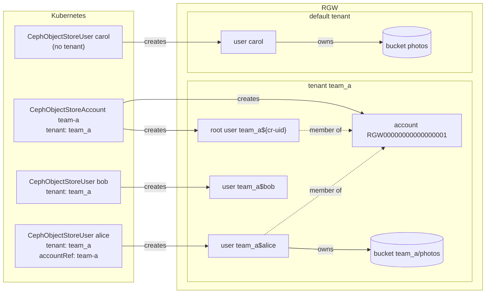
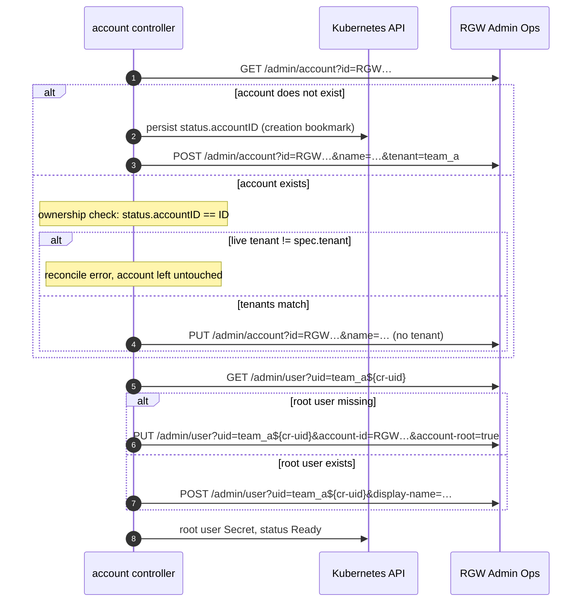
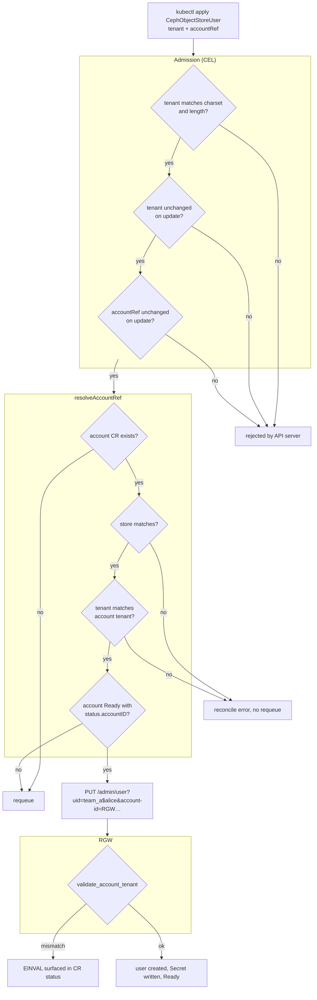

# RGW User Multitenancy and Default Placement Targeting in CephObjectStoreUser

- **Issue**: https://github.com/rook/rook/issues/17274

## Summary

This document proposes extending the `CephObjectStoreUser` CRD with three new
optional spec fields:

- `tenant` — assigns the RGW user to a named tenant, enabling bucket name
  isolation across tenants.
- `defaultPlacement` — sets the user's default bucket placement target,
  controlling which data/metadata pools newly created buckets land in.
- `defaultStorageClass` — sets the user's default storage class for objects,
  applied on top of `defaultPlacement`.

A fourth field, `placementTags`, is deferred to follow-up work (see
[Future work](#future-work)).

[Tenanted accounts](#tenanted-accounts) extends `tenant` to
`CephObjectStoreAccount`, so that a tenanted `CephObjectStoreUser` can be a
member of an account.

### Why tenant and placement are covered in the same document

`tenant` and the placement fields are unrelated in what they do in RGW, but
they are proposed together because they are optional additions to the same
CRD spec (`ObjectStoreUserSpec`), reviewed against the same schema and
immutability rules, and share the same controller entry points
(`generateUserConfig`, `isUserSync`, `createOrUpdateCephUser`). Keeping them
together makes the field interactions (e.g. `defaultStorageClass` requiring
`defaultPlacement`, the placement fields being independent of `tenant`)
visible in one place.

## Motivation

### Tenant Isolation

Ceph RGW supports a multitenancy model where users live in named tenants.
Users in different tenants can own buckets with the same name without
collision:

```
# Two separate objects, no conflict
tenantA$user1 → s3://photos
tenantB$user1 → s3://photos
```

Rook currently has no mechanism to place a `CephObjectStoreUser` in an RGW
tenant. Operators who need per-tenant user isolation must manage RGW users
manually outside of Rook, forgoing the benefits of the operator (secret
rotation, lifecycle management, status reporting).

### Placement Targeting

`CephObjectStore.spec.sharedPools.poolPlacements` already allows defining named
placement targets (each backed by distinct metadata/data pools). However, the
`CephObjectStoreUser` controller has no way to assign a user's
`default-placement`, meaning all users default to the store-wide default
placement.

## Goals

- Add `spec.tenant` to `CephObjectStoreUser`. The controller addresses the
  RGW user by its combined identity `<tenant>$<name>` in every Admin Ops
  call (see [RGW Tenant User ID Format](#rgw-tenant-user-id-format)).
- Add `spec.defaultPlacement` and `spec.defaultStorageClass`, applied via
  `CreateUser`/`ModifyUser` in the RGW Admin Ops API.
- Require `defaultPlacement` to be set whenever `defaultStorageClass` is
  set, since RGW cannot apply a storage class without a placement target.
- Treat `tenant` as immutable (RGW does not support moving a user between
  tenants; `radosgw-admin user rename` rejects tenant changes).
- Treat `defaultPlacement` and `defaultStorageClass` as mutable.
- Leave placement validation to RGW: the serving RGW validates
  `default-placement` against the live zonegroup on every create/modify and
  rejects unknown targets with `EINVAL`. The operator surfaces that failure
  in the CR status instead of duplicating the check against a rook CR (which
  would be wrong for zone-backed and external stores, where the store CR
  does not carry the placement list).
- Treat an absent placement field as **unmanaged**: the controller neither
  writes nor reconciles it (see
  [Field removal](#field-removal-unmanaged-semantics)).
- CR behavior is identical on every supported Ceph version (see
  [Ceph version invariance](#ceph-version-invariance)).
- Preserve backward compatibility: all new fields are optional; existing
  resources and pre-existing RGW users are unaffected.

## Ceph version invariance

The CRD contract MUST NOT vary with the cluster's Ceph version: the same
spec produces the same RGW state, the same errors, and the same status on
every supported release. RGW Admin Ops API differences are absorbed inside
the controller, never exposed as version-conditional CRD behavior, and
nothing in the CRD schema, godoc, or user documentation references Ceph
versions.

This is not hypothetical for these fields. Squid's admin ops API applies a
user's storage class only when it is embedded in the placement rule
(`<placement>/<storage-class>`) and ignores the separate
`default-storage-class` parameter; Tentacle (via
[ceph#57985](https://github.com/ceph/ceph/pull/57985),
[tracker 66439](https://tracker.ceph.com/issues/66439), not backported)
takes `default-placement` verbatim and honors the separate parameter — the
embedded form fails with `EINVAL` there. The controller therefore selects
the wire encoding by `cephver`:

| cluster Ceph | wire encoding for `defaultStorageClass` |
|---|---|
| Squid (v19) | embedded: `default-placement=<placement>/<class>` |
| Tentacle (v20) and later | separate: `default-placement=<placement>` + `default-storage-class=<class>` |

Both encodings produce the identical `rgw_placement_rule` on the user, are
validated by the same server-side `valid_placement` check, and are reported
back identically by user info — so `isUserSync` and status are
version-blind. The embedded form is an explicitly temporary path, retired
when Squid leaves the support window. Unit tests assert the exact wire
fields `generateUserConfig` produces for both versions; the integration
suites exercise whichever arm matches their Ceph image.

The same rule constrains future changes: a capability absent from older
Ceph (e.g. clearing a user's placement, once
[tracker 79090](https://tracker.ceph.com/issues/79090) lands) may only
change CR semantics once rook's minimum supported Ceph includes it — never
behind a runtime version gate.

## Background

### RGW Tenant User ID Format

When a user is created in a tenant, the user's identity everywhere in RGW is
the combined form `<tenant>$<uid>`. Every RGW Admin Ops operation resolves
the `uid` parameter through this form (`rgw_user::from_str` splits on `$`);
a bare `uid` addresses the user in the default (empty) tenant.

The Admin Ops API accepts a separate `tenant` parameter **only on user
create**. User info, modify, and remove have no tenant parameter — on those
operations a tenant can only be expressed inside the combined `uid`. go-ceph
mirrors this: `admin.User.Tenant` is transmitted by `CreateUser` only and
silently dropped by `GetUser`/`ModifyUser`/`RemoveUser`.

The controller therefore uses the combined `<tenant>$<name>` string as the
user ID for **every** Admin Ops call, create included, and never relies on
the go-ceph `Tenant` struct field. This is essential for correctness, not
style: addressing a tenanted user by bare `uid` silently resolves to the
same-named user in the default tenant — reconciliation would adopt (and CR
deletion would delete) an unrelated user.

As a safety backstop, the reconcile fails with an explicit error if the live
user's tenant does not match `spec.tenant`, rather than adopting a user
from another tenant.

Equivalently via CLI:

```bash
radosgw-admin user create --uid="tenantA$user1" --display-name="User 1"
radosgw-admin user info --uid="tenantA$user1"
```

## Proposed API Changes

### `ObjectStoreUserSpec` (`pkg/apis/ceph.rook.io/v1/types.go`)

`defaultPlacement` and `defaultStorageClass` are flat, top-level fields on
`ObjectStoreUserSpec`, named after the go-ceph `admin.User` fields they map
to. This mirrors go-ceph's flat `admin.User` shape; a nested
`ObjectStoreUserPlacementSpec` was considered in review and set aside, as
the nesting would cover only these two fields.

```go
// ObjectStoreUserSpec represent the spec of an Objectstoreuser
// +kubebuilder:validation:XValidation:message="defaultStorageClass requires defaultPlacement",rule="!has(self.defaultStorageClass) || has(self.defaultPlacement)"
// +kubebuilder:validation:XValidation:message="tenant is immutable",rule="has(oldSelf.tenant) == has(self.tenant) && (!has(self.tenant) || self.tenant == oldSelf.tenant)"
type ObjectStoreUserSpec struct {
    // ... existing fields ...

    // Tenant is the RGW tenant this user belongs to.
    // Users in different tenants can have buckets with the same name without
    // conflict. When set, the effective user ID in RGW is "<tenant>$<name>".
    // This field is immutable after creation: it may not be added, changed,
    // or removed on an existing user.
    // +optional
    // +kubebuilder:validation:Pattern=`^[a-zA-Z0-9_]+$`
    // +kubebuilder:validation:MaxLength=255
    Tenant string `json:"tenant,omitempty"`

    // DefaultPlacement sets the default pool placement target for buckets
    // created by this user. It must name a placement target known to the
    // zonegroup serving the referenced object store; RGW rejects unknown
    // targets. If this field is absent the controller does not manage the
    // user's placement: an existing value (set previously through this
    // field, or outside of Rook) is left in place.
    // +optional
    // +kubebuilder:validation:MinLength=1
    // +kubebuilder:validation:MaxLength=2048
    // +kubebuilder:validation:Pattern=`^[a-zA-Z0-9._-]+$`
    DefaultPlacement string `json:"defaultPlacement,omitempty"`

    // DefaultStorageClass sets the default storage class for objects created
    // by this user, within the placement set by DefaultPlacement (which must
    // also be set). The storage class must exist on that placement target;
    // RGW rejects unknown storage classes. If this field is absent the
    // controller does not manage the user's storage class.
    // +optional
    // +kubebuilder:validation:MinLength=1
    // +kubebuilder:validation:MaxLength=2048
    DefaultStorageClass string `json:"defaultStorageClass,omitempty"`
}
```

Notes on the validation shape, from review:

- The `tenant` immutability rule is spec-level with `has()` guards. A
  field-level `self == oldSelf` rule is skipped by the API server when an
  optional field is set or unset, which would permit exactly the two
  transitions (adding or removing `tenant` on an existing user) that orphan
  RGW users.
- `tenant`'s charset is RGW's: `rgw_validate_tenant_name` accepts only
  alphanumerics and `_`. `MaxLength=255` is a rook-side bound; RGW imposes
  no length limit.
- `MinLength=1` on the placement fields makes the empty string
  unrepresentable. `""` would satisfy the `has()` in the requires-rule
  while being meaningless on the wire (empty values cannot be transmitted —
  see [Field removal](#field-removal-unmanaged-semantics)).
- `defaultPlacement` forbids `/`, which is the storage-class separator in
  RGW's embedded placement-rule syntax; permitting it would make the same
  spec value parse differently across Ceph versions (see
  [Ceph version invariance](#ceph-version-invariance)). Note that the
  pre-existing `PoolPlacementSpec.Name` pattern permits `/`, so a
  slash-bearing placement target defined on a store cannot be referenced
  from this field; such names are ambiguous in RGW's own placement-rule
  syntax regardless, and a follow-up may tighten `PoolPlacementSpec.Name`
  to match.

### Field removal (unmanaged semantics)

An absent `defaultPlacement`/`defaultStorageClass` means **unmanaged**: the
controller neither writes nor compares the corresponding RGW user property.
Removing a previously-set field stops management and leaves the last-applied
value in place on the RGW user; it does not revert the user to the
zonegroup default. A pre-existing RGW user adopted by a CR keeps whatever
placement it already had, whether it was set through this field or outside
of Rook. A user who wants zonegroup-default behavior sets `defaultPlacement`
to the default target's name explicitly (note this pins the user to that
target; it does not track later changes to the zonegroup default).

Revert-on-removal is not implementable today, on any supported Ceph, through
any client: go-ceph never transmits empty parameter values
([go-ceph#1307](https://github.com/ceph/go-ceph/issues/1307)), and RGW's
admin ops modify handler ignores empty `default-placement` values anyway
([tracker 79090](https://tracker.ceph.com/issues/79090)); `radosgw-admin`
shares the same guard. Those issues track the upstream fixes. Per
[Ceph version invariance](#ceph-version-invariance), Rook may adopt
revert-on-removal semantics only once its minimum supported Ceph and a
released go-ceph both support clearing — as an explicit, documented
behavior change.

The unmanaged contract is also what protects brownfield users: reconcile
must not churn `ModifyUser` calls (or worse, rewrite state) for users whose
placement was configured out-of-band and whose CRs never mention it.

### Example CR

```yaml
apiVersion: ceph.rook.io/v1
kind: CephObjectStoreUser
metadata:
  name: user1
  namespace: rook-ceph
spec:
  store: my-store
  displayName: "Tenant A User 1"
  tenant: tenantA
  defaultPlacement: hot-tier
  defaultStorageClass: STANDARD_IA
```

## Status

The controller echoes applied state into the CR status after a successful
reconcile: the effective `default_placement` and `default_storage_class`
read back from user info. A placement or storage class rejected by RGW
(`EINVAL` from server-side validation) fails the reconcile and surfaces the
RGW error in the CR status; this is the intended validation UX, replacing
operator-side pre-validation. A tenant mismatch between spec and the live
user (see the addressing backstop above) is likewise a surfaced reconcile
error, never a silent adoption.

## Multisite

RGW user metadata — including `default_placement` and
`default_storage_class` — is realm-scoped and replicates to every zone via
metadata sync. Placement *targets*, however, are zonegroup-scoped, and their
pools are zone-local. Consequences this design accepts and documents:

- Validation happens at apply time, by the RGW serving the referenced
  object store, against **its** zonegroup only.
- In a realm with multiple zonegroups (or independently-managed zone specs),
  a user's synced `default_placement` may name a target that does not exist
  in a peer zonegroup. Bucket creation there fails with
  `InvalidLocationConstraint` at the S3 layer; Rook does not detect this.
  Deployments using per-user placement across zonegroups should define the
  same placement target names in every zonegroup of the realm.
- Rook does not re-validate user placements when zonegroup placement targets
  change after the fact.

Zone-backed stores (`spec.zone.name` set) and external-mode stores are fully
supported: because validation is RGW-side, no rook CR needs to carry the
placement list.

## Compatibility and rollback

All fields are optional; CRs created by older Rook are unaffected, and the
new schema invalidates no stored object.

Rolling back to a Rook release that predates `spec.tenant` while tenanted
CRs exist is **destructive**: the older operator addresses the user by bare
name, fails to find the tenanted user, creates an untenanted user with the
same name, and repoints the CR's Secret at it — orphaning the tenanted user
and its buckets. Before downgrading, tenanted `CephObjectStoreUser` CRs must
be removed (or the operator scaled down). This warning ships in the release
notes. The placement fields carry no such hazard: an older operator simply
stops managing them.

## S3 Client Configuration for Tenanted Users

RGW exposes tenanted users to S3 clients through their access key / secret key pair — the S3 client itself requires no special modification. Credentials stored in the Rook-managed Kubernetes Secret are functionally identical regardless of whether the user belongs to a tenant.

```ini
# AWS CLI profile for a tenanted user — identical to a non-tenanted user
[profile tenantA-user1]
aws_access_key_id     = <AccessKey from rook-ceph-object-user-my-store-user1>
aws_secret_access_key = <SecretKey from rook-ceph-object-user-my-store-user1>
```

### Intra-tenant access (primary use case)

Users within the same tenant access their buckets using standard S3 virtual-host-style URLs with no changes:

```
my-bucket.s3.ceph.io   ← works normally for same-tenant users
```

RGW resolves the bucket to the correct tenant namespace based on the credentials used. No DNS changes or special endpoint configuration are required for this feature's primary use case.

### Cross-tenant access (out of scope, deprecated upstream)

Cross-tenant bucket access via path-style requests using the `tenant:bucket`
notation (e.g. `s3.ceph.io/tenantA:my-bucket/`) is a Ceph extension to the S3
protocol. As noted in the Ceph Tentacle release notes, this feature is
deprecated and scheduled for removal.

> S3 API support for cross-tenant names such as `Bucket='tenant:bucketname'`

Virtual-host-style cross-tenant access (`tenantA:my-bucket.s3.ceph.io`) is not
possible because `:` is not valid in DNS names.

**Cross-tenant bucket sharing is explicitly out of scope for this feature.**
Users who need to share buckets across tenant boundaries should be placed in
the same tenant namespace. This aligns with Ceph's upstream direction of
removing cross-tenant path-style access.

## Immutability

`tenant` is immutable because RGW does not support moving a user between
tenants; the only path is deletion and recreation (`radosgw-admin user
rename` explicitly rejects tenant changes, and the Admin Ops API has no
rename operation). Changing `tenant` on an existing `CephObjectStoreUser`
would create a second user in the new tenant while leaving the original
orphaned. Enforcement is the spec-level CEL transition rule in
[Proposed API Changes](#proposed-api-changes), backed by the controller's
tenant-mismatch check described in
[RGW Tenant User ID Format](#rgw-tenant-user-id-format).

`defaultPlacement` and `defaultStorageClass` are mutable — RGW supports
changing a user's default placement and storage class at any time; changes
only affect future bucket/object creation, not existing buckets/objects.
Removal of either field is covered by
[Field removal](#field-removal-unmanaged-semantics).

## Tenanted accounts

This section adds a `tenant` field to `CephObjectStoreAccount`, so that a
tenanted `CephObjectStoreUser` can be an account member through
`accountRef`.

### RGW account tenancy

These properties of RGW accounts shape the design. Each is checked against
the Ceph v20.2.4 source; none of the logic differs in v19.2.x or on main.

- An account has a tenant (`RGWAccountInfo::tenant`), set on create through
  the Admin Ops `tenant` parameter (`POST /admin/account`). An empty tenant
  is the default tenant.
- The tenant cannot change. Account modify returns `EINVAL` ("cannot modify
  account tenant") when it is given a different tenant, and ignores an
  absent one.
- Account IDs are globally unique, across all tenants. Account names are
  unique only within a tenant (the name index key is `<tenant>$<name>`).
- Get, modify and delete by account ID ignore the tenant entirely. RGW
  therefore never reports a mismatch between a CR's tenant and the live
  account's tenant; the controller has to compare them itself.
- An account member must be in the account's tenant
  (`validate_account_tenant`, enforced on user create and on user modify
  into an account). A mismatch fails with `EINVAL` ("User tenant does not
  match account tenant"). This includes the account root user.
- RGW validates nothing about an account's tenant string, but it rejects a
  user whose tenant is formatted like an account ID (`RGW` followed by 17
  digits). An account with such a tenant could never have members.

go-ceph v0.41.0, which Rook already pins, carries `admin.Account.Tenant` and
sends it on `CreateAccount` and `ModifyAccount`. Empty strings are never
sent, so an untenanted account produces exactly the same requests as today.

### Tenancy model



`team_a/photos` and `photos` do not collide because they live in different
tenants. `bob` shares `alice`'s tenant, so bucket names collide between them,
but `bob` is not an account member.

### API change

```go
// ObjectStoreAccountSpec represents the spec of an RGW Account
// +kubebuilder:validation:XValidation:message="tenant is immutable",rule="has(oldSelf.tenant) == has(self.tenant) && (!has(self.tenant) || self.tenant == oldSelf.tenant)"
type ObjectStoreAccountSpec struct {
    // ... existing fields ...

    // Tenant is the RGW tenant this account belongs to. A CephObjectStoreUser
    // that references this account must set the same tenant.
    // This field is immutable after creation: it may not be added, changed,
    // or removed on an existing account.
    // +optional
    // +kubebuilder:validation:MinLength=1
    // +kubebuilder:validation:MaxLength=255
    // +kubebuilder:validation:Pattern=`^[a-zA-Z0-9_]+$`
    // +kubebuilder:validation:XValidation:message="tenant must not be formatted as an account ID",rule="!self.matches('^RGW[0-9]{17}$')"
    Tenant string `json:"tenant,omitempty"`
}
```

The charset, length and immutability rule are the same as
`ObjectStoreUserSpec.Tenant`, for the same reasons (see
[Immutability](#immutability)); the transition rule is spec-level and
`has()`-guarded so that adding or removing the field is blocked too. The
account-ID rule exists because RGW accepts such a tenant on the account and
only fails later, on every member.

On `ObjectStoreUserSpec`, the admission rule that rejected `tenant` together
with `accountRef` is removed. Removing a validation rule only widens what the
API accepts, so no stored object becomes invalid.

### Membership: the user states its tenant explicitly

A member user sets `tenant` itself, and it must equal the account's
`tenant`. The user does not inherit the tenant from the account:

- **Deletion must not depend on another object.** The user controller
  addresses a tenanted user as `<tenant>$<name>` in every Admin Ops call. If
  the tenant came from the account, deleting the user would require reading
  the account CR first. Account CRs are often deleted before their users
  during cleanup, which would leave the RGW user unaddressable and orphaned.
- **A user's RGW identity stays readable from its own CR**, the same as for
  users without an account.
- **The check cannot drift.** `CephObjectStoreUser.spec.tenant`,
  `CephObjectStoreUser.spec.accountRef` and `CephObjectStoreAccount.spec.tenant`
  are all immutable, so a mismatch can only exist from the moment the user is
  created. It never appears later.

CEL cannot compare fields across objects, so the check runs in the user
controller rather than at admission. `resolveAccountRef` already rejects a
`store` mismatch between the user and the account; the tenant check sits
beside it and fails the reconcile without requeueing, since the mismatch
cannot resolve itself. RGW's own `validate_account_tenant` remains the final
backstop, but its `EINVAL` does not say which fields disagree.

### Controller behavior

`CephObjectStoreAccount` reconcile:

- **Create:** `tenant` is sent on `CreateAccount`, and only there.
- **Existing account:** the live account's tenant (from `GetAccount`) must
  equal `spec.tenant`, or the reconcile fails with an explicit error and the
  account is left untouched. This runs after the existing ownership check.
  `ModifyAccount` never sends `tenant`; RGW cannot move an account between
  tenants, and a modify that names a different one fails.
- **Root user:** its ID becomes `<tenant>$<CR UID>` for a tenanted account,
  and that combined form is used for every Admin Ops user call, as for
  `CephObjectStoreUser`. Untenanted accounts keep the bare `<CR UID>`.
- **Deletion:** account lookups and the purge job address the account by its
  globally unique ID, so they need no tenant.

This is the reverse of the user controller, which never relies on a
separate tenant parameter. The difference follows from how RGW addresses the
two objects: users by an ID that embeds the tenant, accounts by a global ID
that does not.



### Where each rule is enforced



The account CR goes through the same admission rules for its own `tenant`,
plus the account-ID-format rule.

### Rollout

The `tenant` + `accountRef` admission rule ships with `CephObjectStoreUser`
tenants and is removed in the same change that adds
`CephObjectStoreAccount.spec.tenant`, so no release accepts a combination the
controller cannot satisfy. If both land in the same release, the rule never
ships.

### Compatibility and rollback

`tenant` is optional and absent on every existing account, and an absent
tenant produces the same requests as today, so existing accounts and their
root users are unaffected.

Rolling back to a Rook release without `CephObjectStoreAccount.spec.tenant`
while tenanted accounts exist is unsupported, as for tenanted users (see
[Compatibility and rollback](#compatibility-and-rollback)). The older
operator addresses the root user by its bare `<CR UID>`, so it cannot find
the tenanted root user, and recreating it fails RGW's tenant check. Before
downgrading, remove tenanted `CephObjectStoreAccount` CRs and their member
users, or scale the operator down. This warning ships in the release notes
alongside the one for tenanted users.

### Multisite

Account metadata, tenant included, is realm-scoped and replicates through
metadata sync in the same way as user metadata. Because account IDs are
global, an account created in one zone keeps its ID and tenant in every
zone. No zone-specific behavior is added.

### Test plan

- Unit: `tenant` sent on account create; modify never sends `tenant`; a
  live-tenant mismatch fails without calling modify; root user ID is
  `<tenant>$<CR UID>` only when a tenant is set; `resolveAccountRef` accepts
  matching tenants and rejects every mismatch (tenanted user with untenanted
  account, the reverse, and two different tenants) without requeueing.
- Integration (object suite): a tenanted account with a tenanted member
  user, checking the RGW identities `team_a$alice` and the root user's
  `team_a$<CR UID>`, account membership, and that a member with a different
  tenant never becomes Ready.

## Future work

- **`placementTags`** (deferred from this design): RGW `placement_tags` is a
  bucket-creation authorization list — a user may only create buckets in a
  tagged placement target when one of the user's tags matches. It is
  deferred because (a) its enabling half, tags on zonegroup placement
  targets, has no Rook API (`PoolPlacementSpec` would need a `tags` field);
  (b) client support requires a `go.mod` bump — Rook currently pins go-ceph
  v0.40.0, which predates `PlacementTags` support
  ([go-ceph#1290](https://github.com/ceph/go-ceph/pull/1290), merged
  2026-07-09 and released in go-ceph v0.41.0 on 2026-08-11 — the dependency
  itself is released, only Rook's pin is behind); and (c) tags cannot be
  cleared through the admin ops API once set
  ([tracker 79090](https://tracker.ceph.com/issues/79090)). When revisited:
  the field is named `placementTags` (it is not scoped to the default
  placement), ships together with `PoolPlacementSpec.tags`, and gates on
  bumping Rook's go-ceph pin to v0.41.0+.
- **Revert-on-removal** for the placement fields, once
  [tracker 79090](https://tracker.ceph.com/issues/79090) and
  [go-ceph#1307](https://github.com/ceph/go-ceph/issues/1307) are in Rook's
  support floor.
