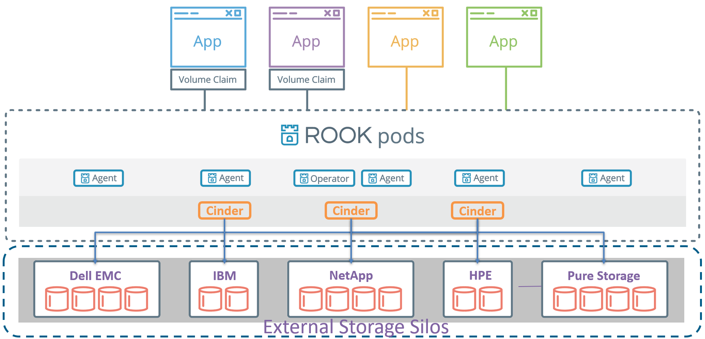

# Legacy Block Storage with Rook


## Overview

### Value of legacy block storage support to Rook

* In order to completely integrate with Kubernetes and utilize Rook's autonomous healing, scaling, and managing features, backend storage systems need to be software-based, distributed (clustered), and capable of being containerized. 
Not all modern storage systems meet these requirements.
* Many expensive and proprietary appliance storage silos are still providing services for Enterprise IT infrastructures.
* Many companies only trust well-certified and time-proven storage solutions for their mission critical applications

For transitioning into existing enterprise IT infrastructures, Rook will have a much easier time with support for legacy block storage systems.


### Storage Resource Normalization

The OpenStack Block Storage service (Cinder) provides a standardized architecture to aggregate the features and management of all kinds of block storage systems.
It is the first service to have a standardized interface that is widely supported by most storage vendors including Dell EMC, IBM, NetApp, Hitachi, HPE, Pure Storage, VMware, etc.

The major functions of the Cinder volume driver include:

* Create/Delete Volume
* Attach/Detach Volume
* Extend Volume
* Create/Delete Snapshot
* Create Volume from Snapshot
* Create Volume from Volume (clone)
* Create Image from Volume
* Volume Migration (host assisted)

The following are some references for OpenStack Cinder:

* [OpenStack Cinder](https://access.redhat.com/documentation/en/red-hat-enterprise-linux-openstack-platform/version-7/red-hat-enterprise-linux-openstack-platform-7-architecture-guide/chapter-1-components#comp-cinder)
* [Cinder Driver Support Matrix](https://wiki.openstack.org/wiki/CinderSupportMatrix)

In this project, we propose to leverage the open source project [OpenStack Cinder](https://github.com/openstack/cinder) as the unified storage connector that integrates legacy block storage with Rook.
Through this implementation, we can quickly extend Rook's storage backend support to most modern block storage solutions that are already used in production today.


## Architecture



### Operator

* start and monitor the Cinder service pods
* watch for state changes and apply the changes
* monitor the health of external storage systems
* manage custom resource definitions (CRDs) for pools


### Agent

* deployed on each Kubernetes nodes
* handle attaching/detaching, mounting/unmounting volumes and formatting the file system


## Details

### lbs (legacy block storage) cluster CRD example

```yaml
apiVersion: lbs.rook.io/v1alpha1
kind: Cluster
metadata:
  name: rook-lbs
  namespace: rook-lbs
spec:
  cinderVersion:
    image: openstack/cinder:v13.0.2-4
  dataDirHostPath: /var/lib/rook
  api:
    count: 3
    allowMultiplePerNode: true
  storage:
    useAllNodes: true
    resources:
      limits:
        cpu: 2
        memory: 2048Mi
      requests:
        cpu: 2
        memory: 2048Mi
    config:
      enabled_backends: svc1234, netapp123
      svc1234:
        volume_backend_name: svc1234
        volume_driver: cinder.volume.drivers.ibm.storwize_svc.storwize_svc_iscsi.StorwizeSVCISCSIDriver
        san_ip: 1.2.3.4
        san_login: superuser
        san_password: passw0rd
        storwize_svc_volpool_name: pool1
      netapp123:
        volume_driver: cinder.volume.drivers.netapp.common.NetAppDriver
        netapp_storage_family: ontap_cluster
        netapp_storage_protocol: iscsi
        netapp_server_hostname: 1.2.3.5
        netapp_server_port: 443
        netapp_login: root
        netapp_password: password
```

### StorageClass example:

When multiple backends are configured, each of the pools on all backends should be mapped to a StorageClass.

```yaml
apiVersion: lbs.rook.io/v1
kind: LegacyBlockPool
metadata:
  name: netapp_pool1
  namespace: rook-lbs
spec:
  thinprovision: true
---
apiVersion: storage.k8s.io/v1
kind: StorageClass
metadata:
   name: legacy-netapp
provisioner: lbs.rook.io/block
parameters:
  blockPool: netapp_pool1
  clusterNamespace: rook-lbs
  fstype: xfs
```

### PersistentVolumeClaim example:

```yaml
apiVersion: v1
metadata:
  name: myclaim
spec:
  accessModes:
    - ReadWriteOnce
  resources:
    requests:
      storage: 8Gi
  storageClassName: legacy-netapp
```
