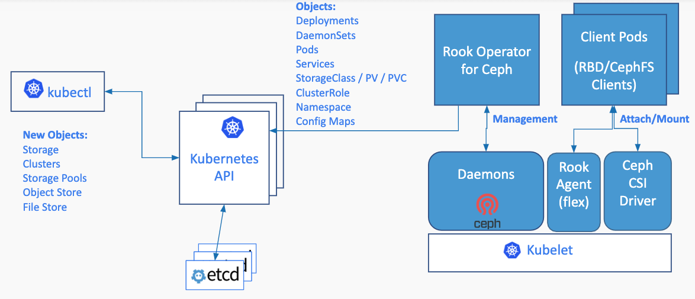

# Add NFS to Rook

## Overview

This document explores a design to add NFS to Rook. This is a part of the rook feature request [#1551](https://github.com/rook/rook/issues/1551).

## Rook Architecture

Rook turns distributed storage software into a self-managing, self-scaling, and self-healing storage services. It does this by automating deployment, bootstrapping, configuration, provisioning, scaling, upgrading, migration, disaster recovery, monitoring, and resource management. Rook uses the facilities provided by the underlying cloud-native container management, scheduling and orchestration platform to perform its duties.


## Network File System (NFS)

NFS allows remote hosts to mount file systems over a network and interact with those file systems as though they are mounted locally. This enables system administrators to consolidate resources onto centralized servers on the network.

## Why NFS?

NFS is widely used for persistent storage in kubernetes cluster. Using NFS storage is a convenient and easy way to provision storage for applications.
An NFS volume allows an existing NFS (Network File System) share to be mounted into the pod.
The contents of an NFS volume are preserved and the volume is merely unmounted if the pod is stopped/destroyed. This means that an NFS volume can be pre-populated with data, and that data can be “handed off” between pods.
NFS supports multiple read/write simultaneously so a single share can be attached to multiple pods.

## Design
With this design Rook is exploring to providing another widely adopted storage option for admins and users of cloud-native environments. This design tends to automate NFS starting from its configuration (such as allowed hosts, read/write permissions etc.) to deployment and provisioning. The operations on NFS which cannot be done natively by Kubernetes will be automated.
NFS doesn’t provide an internal provisioner for kubernetes, so Rook is needed as an external provisioner.
This design uses NFS-Ganesha server and NFS v4.

### Initial Setup

The flow of creating NFS backed storage in Rook is
1. The settings are determined and saved in an NFS server CRD (rook-nfs.yaml)
2. `kubectl create -f rook-nfs.yaml`
3. When the NFS CRD instance is created, Rook responds to this request by starting the NFS daemon with the required configuration and exports stated in the CRD and creates a service to expose NFS.
4. NFS volume is ready to be consumed by other pods through a PVC.

### NFS CRD

The NFS CRD spec will specify the following:
1. NFS server storage backend configuration. E.g., configuration for various storage backends(ceph, ebs, azure disk etc) that will be shared using NFS.
2. NFS server configuration
   The following points are required for configuring NFS server:
    - export (The volume being exported)
    - client (The host or network to which the export is being shared)
    - client options (The options to be used for the client) e.g., read and write permission, root squash etc.

The parameters to configure NFS CRD are demonstrated in the example bellow which is followed by a table that explains the parameters:

A simple example for sharing a volume(could be hostPath, cephFS, cephRBD, googlePD, EBS etc.) using NFS, without client specification and per export based configuration, whose NFS-Ganesha export entry looks like:
```
EXPORT {
    Export_Id = 1;
    Path = /export;
    Pseudo = /nfs-share;
    Protocols = 4;
    Sectype = sys;
    Access_Type = RW;
    Squash = none;
    FSAL {
        Name = VFS;
    }
}
```
the CRD instance will look like the following:
```yaml
apiVersion: rook.io/v1alpha1
kind: NetworkFileSystem
metadata:
  name: nfs-vol
  namespace: rook
spec:
  replicas: 1
  exports:
  - name: nfs-share
    server:
      accessMode: ReadWrite
      squash: root
    persistentVolumeClaim:
      claimName: googlePD-claim
```
The table explains each parameter

| Parameter                                  | Description                                                                                                                                 | Default    |
| ------------------------------------------ | ------------------------------------------------------------------------------------------------------------------------------------------- | ---------- |
| `replicas`                                 | The no. of NFS daemon to start                                                                                                              | `1`        |
| `exports`                                  | Parameters for creating an export                                                                                                           | <none>     |
| `exports.name`                             | Name of the volume being shared                                                                                                             | <none>     |
| `exports.server`                           | NFS server configuration                                                                                                                    | <none>     |
| `exports.server.accessMode`                | Volume access modes(Reading and Writing) for the share                                                                                      | `ReadOnly` |
| `exports.server.squash`                    | This prevents root users connected remotely from having root privileges                                                                     | `root`     |
| `exports.server.allowedClients`            | Access configuration for clients that can consume the NFS volume                                                                            | <none>     |
| `exports.server.allowedClients.name`       | Name of the host/hosts                                                                                                                      | <none>     |
| `exports.server.allowedClients.clients`    | The host or network to which export is being shared.(could be hostname, ip address, netgroup, CIDR network address, or all)                 | <none>     |
| `exports.server.allowedClients.accessMode` | Reading and Writing permissions for the client*                                                                                             | `ReadOnly` |
| `exports.server.allowedClients.squash`     | Squash option for the client*                                                                                                               | `root`     |
| `exports.persistentVolumeClaim`            | Claim to get volume(Volume could come from hostPath, cephFS, cephRBD, googlePD, EBS etc. and these volumes will be exposed by NFS server ). | <none>     |
| `exports.persistentVolumeClaim.claimName`  | Name of the PVC                                                                                                                             | <none>     |

*note: if `exports.server.accessMode` and `exports.server.squash` options are mentioned, `exports.server.allowedClients.accessMode` and `exports.server.allowedClients.squash` are overridden respectively.

Available options for `volumes.allowedClients.accessMode` are:
1. ReadOnly
2. ReadWrite
3. none

Available options for `volumes.allowedClients.squash` are:
1. none     (No user id squashing is performed)
2. rootId   (uid 0 and gid 0 are squashed to the anonymous uid and anonymous gid)
3. root     (uid 0 and gid of any value are squashed to the anonymous uid and anonymous gid)
4. all      (All users are squashed)

The volume that needs to be exported by NFS must be attached to NFS server pod via PVC. Examples of volume that can be attached are Host Path, AWS Elastic Block Store, GCE Persistent Disk, CephFS, RBD etc. The limitations of these volumes also apply while they are shared by NFS. The limitation and other details about these volumes can be found [here](https://kubernetes.io/docs/concepts/storage/persistent-volumes/).

### Examples

Here are some examples for advanced configuration:

1. For sharing a volume(could be hostPath, cephFS, cephRBD, googlePD, EBS etc.) using NFS, which will be shared as /nfs-share by the NFS server with different options for different clients whose NFS-Ganesha export entry looks like:
```
EXPORT {
    Export_Id = 1;
    Path = /export;
    Pseudo = /nfs-share;
    Protocols = 4;
    Sectype = sys;
    FSAL {
        Name = VFS;
    }
    CLIENT {
        Clients = 172.17.0.5;
        Access_Type = RO;
        Squash = root;
    }
    CLIENT {
        Clients = 172.17.0.0/16, serverX;
        Access_Type = RW;
        Squash = none;
    }
}
```
the CRD instance will look like the following:
```yaml
apiVersion: rook.io/v1alpha1
kind: NetworkFileSystem
metadata:
  name: nfs-vol
  namespace: rook
spec:
  replicas: 1
  exports:
  - name: nfs-share
    server:
      allowedClients:
      - name: host1
        clients: 172.17.0.5
        accessMode: ReadOnly
        squash: root
      - name: host2
        clients:
        - 172.17.0.0/16
        - serverX
        accessMode: ReadWrite
        squash: none
    persistentVolumeClaim:
      claimName: ebs-claim
```

2. For sharing multiple volumes using NFS, which will be shared as /share1 and /share2 by the NFS server whose NFS-Ganesha export entry looks like:
```
EXPORT {
    Export_Id = 1;
    Path = /export;
    Pseudo = /share1;
    Protocols = 4;
    Sectype = sys;
    FSAL {
        Name = VFS;
    }
    CLIENT {
        Clients = all;
        Access_Type = RO;
        Squash = none;
    }
}
EXPORT {
    Export_Id = 2;
    Path = /export2;
    Pseudo = /share2;
    Protocols = 4;
    Sectype = sys;
    FSAL {
        Name = VFS;
    }
    CLIENT {
        Clients = all;
        Access_Type = RW;
        Squash = none;
    }
}
```
the CRD instance will look like the following:
```yaml
apiVersion: rook.io/v1alpha1
kind: NetworkFileSystem
metadata:
  name: nfs-multi-vol
  namespace: rook
spec:
  replicas: 1
  exports:
  - name: share1
    server:
      allowedClients:
      - name: ebs-host
        clients: all
        accessMode: ReadOnly
        squash: none
    persistentVolumeClaim:
      claimName: ebs-claim
  - name: share2
    server:
      allowedClients:
      - name: ceph-host
        clients: all
        accessMode: ReadWrite
        squash: none
    persistentVolumeClaim:
      claimName: cephfs-claim
```

## Adding and Removing exports from an existing NFS server
Exports can be added and removed by updating the CRD using kubectl edit/replace -f rook-nfs.yaml

## Client Access
The administrator creates a storage class.
Here is an example of NFS storage class for Example 1:
```yaml
apiVersion: storage.k8s.io/v1
kind: StorageClass
metadata:
  name: rook-nfs
provisioner: nfs.rook.io/nfs
parameters:
  server: nfs-vol
  export: nfs-share
```

The user can use the NFS volume by creating a PVC.
Here is an example of NFS PVC
```yaml
apiVersion: v1
kind: PersistentVolumeClaim
metadata:
  name: httpd-pv-claim
  labels:
    app: web
spec:
  storageClassName: rook-nfs
  accessModes:
  - ReadWriteOnce
  resources:
    requests:
      storage: 1Gi
---
apiVersion: apps/v1
kind: Deployment
metadata:
  name: web-server
  labels:
    app: web
spec:
  template:
    metadata:
      labels:
        app: web
        tier: httpd
    spec:
      containers:
      - image: httpd
        name: httpd
        ports:
        - containerPort: 80
          name: httpd
        volumeMounts:
        - name: httpd-persistent-storage
          mountPath: /var/www/html
      volumes:
      - name: httpd-persistent-storage
        persistentVolumeClaim:
          claimName: httpd-pv-claim
---
