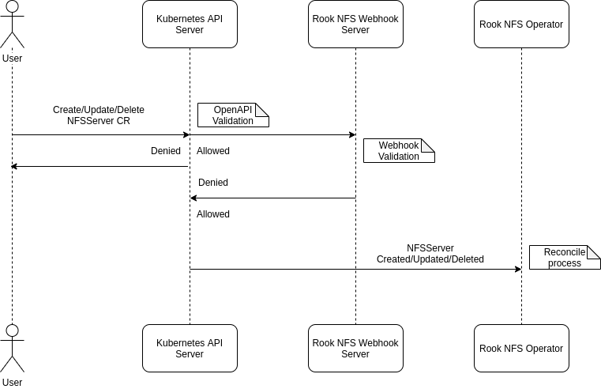
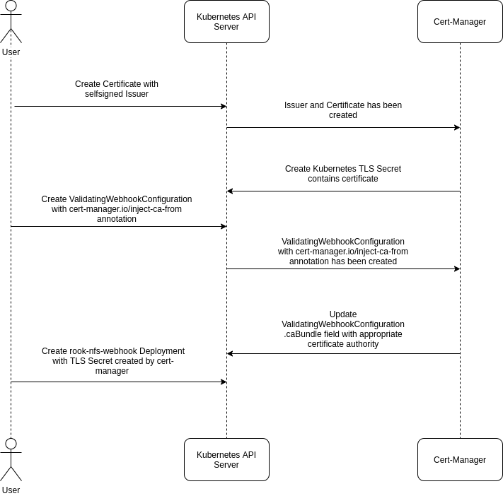

# Implement controller-runtime in Rook NFS Operator

## Background

This proposal is to implement controller-runtime in Rook NFS Operator to improve reliability of the operator itself. Currently, Rook nfs-operator only simply watches an event of CustomResource from an informer using simple [WatchCR][rook-watchcr] method which has limited functionality such as event can not be re-queued if failed. To implement controller-runtime is expected to overcome the shortcomings of current implementation.

## Why controller-runtime?

[Controller-runtime][controller-runtime] is widely used for writing Kubernetes operators. It is also leveraged by Kubebuilder and Operator SDK. Controller-runtime consists of several packages that have their respective responsibilities in building operators. The main function of controller-runtime is

- **Manager:** Runnable for the operator with leader election option. It is also provides shared dependencies such as clients, caches, schemes, etc.
- **Controller:** Provides types and functions for building Controllers which ensure for any given object, the actual state matches the desired state which called `Reconciling` process.
- **Admission Webhook:** Provides methods to build an admission webhook (both Mutating Admission Webhook and Validating Admission Webhook) and bootstrap a webhook server.
- **Envtest:** Provides libraries for integration testing by starting a local control plane (etcd and kube-apiserver).
- **Matrics:** Provides metrics utility for controller.

## Implementation

The implementation of this proposal is to rewrite NFS Operator controller to use controller-runtime and introduce the validation admission webhook using controller-runtime for NFS Operator.

### Controller & Reconciliation

Operators are Kubernetes extensions that use custom resources to manage applications and their components using the Kubernetes APIs and kubectl tooling. Operators follow the Kubernetes controller principles. The process in which the actual state of the object (both cluster object and external object) will be matching the desired state which called *Reconciliation* process in the controller-runtime.

The current implementation is the operator watch an event (create, update and delete) of CustomResource and will be handled by registered function in `ResourceEventHandlerFuncs` which every event has its own handler but only the create handler that implemented.

Controller-runtime introduces an interface called [Reconciler][Controller-runtime-reconciler] that will ensure the state of the system matches what is specified by the user in the object at the time the Reconciler is called. Reconciler responds to generic events so it will contain all of the business logic of a Controller (create, update, and delete). What have to do here is only to implement the [Reconcile][Controller-runtime-reconcile] method of the interface in the controller. The controller-runtime also have utility functions for creating and updating an object called [CreateOrUpdate][controller-runtime-createorupdate] which will make easier to handling update of an object.

Since the implementation controller using controller-runtime only changes the logic of the controller, so the deployment process will be like current implementation. However, the deployment process of admission webhook using controller-runtime will have additional steps as explained below.

### Validation

CustomResource validation in the operator can be done through the Controller itself. However, the operator pattern has two common types to validate the CustomResource.

- **Syntactic validation** By defining OpenAPI validation rules.
- **Semantic Validation** By creating ValidatingAdmissionConfiguration and Admission Webhook.

The current implementation only validates the CustomResource in the controller and just gives an error log in the operator stdout if the given resource is invalid. In this implementation will also cover the CustomResouce validation both though *Syntactic validation* and *Semantic Validation* and also give an improvement validation in the controller.



To implement *Syntactic validation* is only by defining OpenAPI validation rules. Otherwise, the *Semantic Validation* implementation is a bit more complicated. Fortunately, controller-runtime provides an awesome package that helpfully to create admission webhook such as bootstraping webhook server, registering handler, etc. Just like controller that have [Reconciler][controller-runtime-reconciler] interface, admission webhook in controller-runtime also have [Validator][controller-runtime-validator] interface that handle the operations validation.

> Controller-runtime also provide [Defaulter][controller-runtime-defaulter] interface to handle mutation webhook.

Since the webhook server must be served through TLS, a valid TLS certificate will be required. In this case, we can depend on [cert-manager][cert-manager]. The cert-manager component can be deployed as usual [cert-manager-installation](cert-manager-installation) no matter which namespace the cert-manager component lives. But keep in mind that *Certificate* must be in the same namespace as webhook-server.



Example self signed certificate.

```yaml
---
apiVersion: cert-manager.io/v1alpha2
kind: Certificate
metadata:
  name: rook-nfs-webhook-cert
  namespace: rook-nfs-system
spec:
  dnsNames:
  - rook-nfs-webhook.rook-nfs-system.svc
  - rook-nfs-webhook.rook-nfs-system.svc.cluster.local
  issuerRef:
    kind: Issuer
    name: rook-nfs-selfsigned-issuer
  secretName: rook-nfs-webhook-cert
---
apiVersion: cert-manager.io/v1alpha2
kind: Issuer
metadata:
  name: rook-nfs-selfsigned-issuer
  namespace: rook-nfs-system
spec:
  selfSigned: {}
```

And the ValidatingAdmissionConfiguration will look like

```yaml
---
apiVersion: admissionregistration.k8s.io/v1beta1
kind: ValidatingWebhookConfiguration
metadata:
  annotations:
    cert-manager.io/inject-ca-from: rook-nfs-system/rook-nfs-webhook-cert
  creationTimestamp: null
  name: rook-nfs-validating-webhook-configuration
webhooks:
- clientConfig:
    caBundle: Cg==
    service:
      name: rook-nfs-webhook
      namespace: rook-nfs-system
      path: /validate-nfs-rook-io-v1alpha1-nfsserver
  failurePolicy: Fail
  name: validation.nfsserver.nfs.rook.io
  rules:
  - apiGroups:
    - nfs.rook.io
    apiVersions:
    - v1alpha1
    operations:
    - CREATE
    - UPDATE
    resources:
    - nfsservers
```

By providing [cert-manager.io/inject-ca-from][cert-manager-cainjector] annotation, `cert-manager` will replace `.clientConfig.caBundle` with appropriate certificate. When constructing controller-runtime using [Builder][controller-runtime-webhook-builder] controller-runtime will serving the validation handler on `/validate-group-version-kind` and mutation handler on `/mutate-group-version-kind`. So `.clientConfig.service.path` must be have correct value. And the implementation is the admission webhook server will be deployed independently. The `Semantic Validation` will be optional and users can enable or disable this validation by deploying the admission webhook configuration and server or not. The example manifests to deploy the admission webhook server will look like this.

```yaml
---
kind: Service
apiVersion: v1
metadata:
  name: rook-nfs-webhook
  namespace: rook-nfs-system
spec:
  selector:
    app: rook-nfs-webhook
  ports:
  - port: 443
    targetPort: webhook-server
---
apiVersion: apps/v1
kind: Deployment
metadata:
  name: rook-nfs-webhook
  namespace: rook-nfs-system
  labels:
    app: rook-nfs-webhook
spec:
  replicas: 1
  selector:
    matchLabels:
      app: rook-nfs-webhook
  template:
    metadata:
      labels:
        app: rook-nfs-webhook
    spec:
      containers:
      - name: rook-nfs-webhook
        image: rook/nfs:v1.6.1
        imagePullPolicy: IfNotPresent
        args: ["nfs", "webhook"]
        ports:
        - containerPort: 9443
          name: webhook-server
        volumeMounts:
        - mountPath: /tmp/k8s-webhook-server/serving-certs
          name: cert
          readOnly: true
      volumes:
      - name: cert
        secret:
          defaultMode: 420
          secretName: rook-nfs-webhook-cert
```

Since *Semantic Validation* will be optional, validating CustomResource in the controller should still there. The improvement that will be introduced is if a given resource is invalid it should be given information in the CustomResouce status subresource.

## References

1. https://book.kubebuilder.io/cronjob-tutorial/controller-overview.html
1. https://pkg.go.dev/sigs.k8s.io/controller-runtime
1. https://kubernetes.io/docs/concepts/extend-kubernetes/extend-cluster/
1. https://kubernetes.io/docs/tasks/access-kubernetes-api/custom-resources/custom-resource-definitions/
1. https://www.openshift.com/blog/kubernetes-operators-best-practices

[rook-watchcr]: https://github.com/rook/rook/blob/release-1.3/pkg/operator/k8sutil/customresource.go#L48
[cert-manager]: https://cert-manager.io/
[cert-manager-installation]: https://cert-manager.io/docs/installation/
[cert-manager-cainjector]: https://cert-manager.io/docs/concepts/ca-injector/
[controller-runtime]: https://github.com/kubernetes-sigs/controller-runtime
[controller-runtime-createorupdate]: https://godoc.org/sigs.k8s.io/controller-runtime/pkg/controller/controllerutil#CreateOrUpdate
[controller-runtime-reconcile]: https://godoc.org/sigs.k8s.io/controller-runtime/pkg/reconcile#Func.Reconcile
[controller-runtime-reconciler]: https://godoc.org/sigs.k8s.io/controller-runtime/pkg/reconcile#Reconciler
[controller-runtime-defaulter]: https://godoc.org/sigs.k8s.io/controller-runtime/pkg/webhook/admission#Defaulter
[controller-runtime-validator]: https://godoc.org/sigs.k8s.io/controller-runtime/pkg/webhook/admission#Validator
[controller-runtime-webhook-builder]: https://godoc.org/sigs.k8s.io/controller-runtime/pkg/builder#WebhookBuilder
