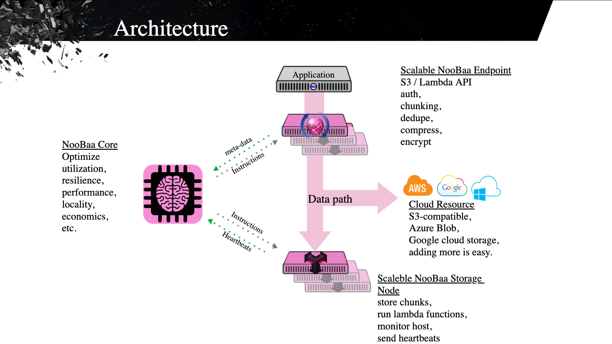

♜ [Rook NooBaa Design](README.md) /
# About NooBaa

- [NooBaa Github Project](https://github.com/noobaa/noobaa-core)
- [NooBaa On Ceph Tech Talk (youtube)](https://www.youtube.com/watch?v=uW6NvsYFX-s)
- [NooBaa From Zero To Multi Cloud (youtube)](https://www.youtube.com/watch?v=fuTKXBMwOes)
- [OBC Design Document](https://github.com/yard-turkey/lib-bucket-provisioner/blob/master/doc/design/object-bucket-lib.md)

# Terminology:

| Term | a.k.a | Description |
|------|-------|-------------|
| NooBaa Core | "The Brain" | |
| NooBaa Endpoint | "S3 server" | stateless |
| NooBaa Agent | "The Daemon" or "Storage Node" | stateful for local FS volume, embeds endpoint |

# Main Components:

