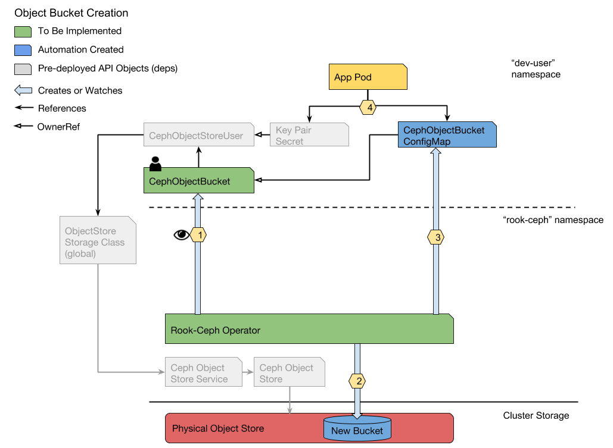

# Rook-Ceph Object Bucket Controller

## Proposed Feature

Currently, the automation exists in the Rook-Ceph operator to support [Ceph Object Store](../object-store.md) and [Ceph Object Store User](https://github.com/rook/rook/issues/1583) custom resource definitions (CRDs).  

This design closes the loop for Rook-Ceph object stores with a CephObjectBucket controller and CRD.  Users will request buckets via the Kubernetes API and have returned ConfigMaps with connection information for that bucket.  One ConfigMap will be created per CephObjectBucket.  ConfigMap names will be deterministic and based on the name of the CephObjectBucket.  This gives users the opportunity to define their Pod spec at the same time as the CephObjectBucket.  Additionally, the CephObjectBucket and Pod can safely be deployed at the same time thanks to built in synchronization in Kubernetes.

Bucket deletion in the early stages of this controller design will not be addressed beyond cleaning up generated resources.  Deleting a CephObjectBucket will only cause deletion of the associated ConfigMap.  The controller will not delete the bucket from the object store. 

## Dependencies

This design assumes that cross-namespace support for CephObjectUsers, proposed in #2473, has been accepted into the project.  Specifically, the coupling of CephObjectStores to StorageClasses, which are then referenced by the CephObjectUser.

## Object Bucket Walkthrough

### Assumptions

- The `storageClass` field has been added to the CephObjectStoreUser API
- Rook-Ceph Object has been deployed in a Kubernetes Cluster ([_see:_ quick start](https://rook.github.io/docs/rook/master/object.html))
- The `CephObjectStoreUser` has been created in the developer's namespace and the associated credentials are stored in a `Secret`

### Work Flow

**Use Case: Provision a Bucket** 
_As a Kubernetes user, I want leverage the Kubernetes API to create ceph object buckets owned by a given object user in an object store. I expect to get back the bucket’s URL which can be consumed as a ConfigMap key._
 



1. The enhanced Rook-Ceph Operator sees an CephObjectBucket in the dev-user namespace.  The operator extracts the CephObjectStoreUser from the CephObjectBucket. From the CephObjectStoreUser the StorageClass, if present, is used to determine the associated object store. The operator uses the name of the CephObjectStoreUser to get the associated Key Pair Secret.  If the StorageClass is not defined in the CephObjectStoreUser then the object store name must be present. Also, in the case of omitting StorageClass, the object user and object store must reside in the same namespace.
1. With the object store IP, port, and user name from step 1, the operator makes an S3 API call to create a new bucket with the CephObjectStoreUser as the owner.
1. The operator creates a bucket ConfigMap in the dev-user namespace. The Host, Port, BucketName, and SSL (bool) are stored under data: .  For the purpose of bookkeeping, the namespace/CephObjectStoreUser.metadata.name and namespace/Secret.metadata.name are stored as annotations.
1. An app Pod may then mount the Secret (annotated in the config map)  and the ConfigMap keys to begin accessing the bucket. 

**Use Case:** Delete an Object Bucket 
_As a Kubernetes user, I want to use kubectl to delete object bucket API resources owned by a given object user. (Note: the underlying S3 bucket is not deleted. Permanent deletion is left to the admin.)_

1. The user deletes the CephObjectBucket.  This triggers an automated cleanup sequence:
1. The CephObjectBucket is marked for deletion first and left in the foreground. Deletion is blocked by a finalizer on the CephObjectBucket, pending step (b).
1. The respective ConfigMap is deleted.
1. The finalizer in the CephObjectBucket is removed and the object is garbage collected.

## API Specifications

### CephObjectBucket

```yaml
apiVersion: object.k8s.io/v1
kind: CephObjectBucket
metadata:
  name: my-bucket-1
  namespace: dev-user
  ownerReferences: # added by provisioner
  - apiVersion: ceph.rook.io/v1
    blockOwnerDeletion: true
    kind: ObjectStoreUser
    name: my-user-1
    uid: 1234-3456-7839-1231
spec:
  bucketName:<string>         [1]
  generateBucketName:<string> [1]
  ownerUser: my-user # required, name of object user’s metadata.Name
status:
  phase: [ “creating”, “available”, ...]

```

[1] `bucketName` and `generateBucketName` are mutually exclusive. It is expected that `generateBucketName` be the common usage. This field produces a random bucket name beginning with the value of this stanza. If bucketName is defined then that value alone is used as the name of the bucket. Within an object store, buckets must be unique, so if bucketName is used there may be a higher chance of name collision. The api will continue retrying if the bucket cannot be created.

### CephObjectBucketConfigMap

```yaml
apiVersion: v1
kind: ConfigMap
metadata:
  name: rook-ceph-object-bucket-my-bucket-1
  namespace: dev-user
  annotations:
    bucket_secret: “rook-ceph-object-user-my-user-1”
    bucket_owner: “my-user-1”
  ownerReferences:
  - name: my-bucket-1
    uid: 1234-qwer-4321-rewq
    apiVersion: object.k8s.io/v1
    kind: CephObjectBucket 
  finalizers:
  - rook-ceph.io/provisioner/my-bucket-1
data:
  BUCKET_HOST: http://my-store-url-or-ip
  BUCKET_PORT: 80
  BUCKET_NAME: my-bucket-1
  BUCKET_SSL: no
```

### objectStorageClass

```yaml
apiVersion: storage.k8s.io/v1
   kind: StorageClass
   metadata:
     name: rook-ceph-object-store
   provisioner: kubernetes.io/rook-ceph-operator
   parameters:
     # namespace/objectStoreService
     objectStoreNamespace: rook-ceph 
     objectStoreName: objectStoreName
```

## Rejected Alternatives
**PVC Analogue**

Non-object storage providers benefit significantly from the core k8s PV/PVC model over object storage. Mounting a volume is the intended access method regardless of the storage provider, with the attachment details handled under the hood.  K8s supports this concept innately.

Object storage loses out in this respect because buckets cannot be mounted.  Instead of a volume, we only need a few bits of information (endpoint and keypair) to access a bucket.  So representing the bucket as a persistent volume analoge buys us nothing as we have still have no way of communicating this data to a pod.

On top of that, the PVC/PV model provides an abstraction layer between developer and the admin regarding the underlying storage.  A developer doesn’t need to know the connection details of the volume, just the PVC name.  Object users are the opposite - the endpoint and security protocol (if used) are basic necessities that can’t be hidden from the developer.  Therefore, using Bucket-PVs to hide underlying connection details is self defeating.

Our design would therefore need at least 4 objects: a secret, bucket claim, bucket-pv, and a pod-consumable core k8s object (configMap probably) to mirror the bucket-pv data into so that the pod can consume it.  The most obvious issue with this is unnecessary redundancy.  More subtly, because buckets are owned by object store users, and users are namespaced, bucket-pv’s would necessarily be namespaced objects.  This moves them closer to the developer and away from the admin.

And bucket-pvs serve no useful purpose other than to pretend to carry forward the pvc-pv model.  Since a bucket-pv cannot be directly consumed by a pod, it’s data would need to be cloned to a pod-consumable resource, such as a secret or configMap.  K8s PVs are also attachable to any k8s PVC (of the same storage type) in any namespace (assuming lenient RBAC policies). Bucket-PVs, because of the namespaced ObjectOwner, would always be tied to a specific namespace.  Designing the bucket-pvs this way could only lead to confusion about their relationship to bucket claims since, on the surface, the model would appear similar to PV/PVCs.

The bucket-pv design is complicated further by Bucket Policies.  In S3, a bucket owner can define a bucket policy that links another user’s access keys to the bucket under a set of permissions.  This concept doesn’t exist in the PV/PVC model but is definitely something we should support for object storage.  Bucket Policies can be defined at any time after bucket creation.  To support this, it would make sense to track the policies in the bucket claim, then allow users to modify/update the claim after creation.  This would make bucketClaims more representative of the bucket than the bucket-pv, short of mirroring the data between the two for more redundancy.

At this point, what we have is a PVC/PV model in name only.   The bucket-pv doesn’t contain any data not stored in another k8s resource. Even worse, the data it holds would be inaccessible to the consuming pod. And the Bucket Claim, with policies, may be more descriptive of the bucket than the actual bucket pv.  Instead, it makes more sense to just call the bucket resource a CephObjectBucket and omit the PV analog.
   
