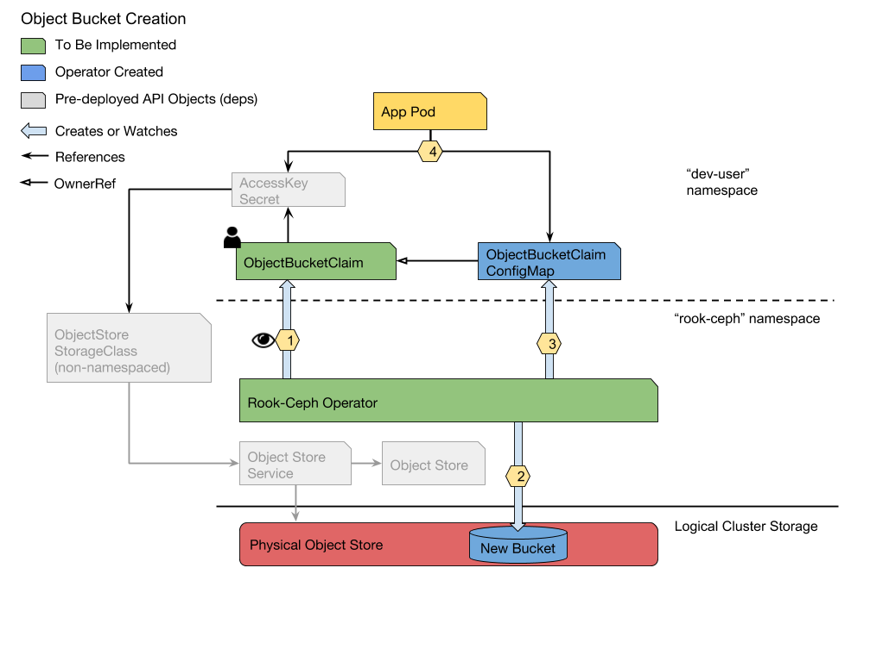

# ObjectBucketClaim CRD and Controller

## Proposed Feature

**A generalized method of S3 bucket provisioning through the implementation of an `ObjectBucketClaim` CRD and controller.** 

Users will request buckets via the Kubernetes API and have returned ConfigMaps with connection information for that bucket.  

One ConfigMap will be created per `ObjectBucketClaim` instance.  ConfigMap names will be deterministic and derived from the `ObjectBucketClaim` name.  This gives users the opportunity to define their Pod spec at the same time as the `ObjectBucketClaim`.  Additionally, the `ObjectBucketClaim` and Pod can be deployed at the same time thanks in-built synchronization in Kubernetes.

Bucket deletion in the early stages of this controller design will not be addressed beyond cleaning up API objects.  Deletion of the bucket within the object store is left as an administrator responsibility.  This is to prevent the accidental destruction of data by users.

## Design

### Work Flow

#### Assumptions

- An object store has been deployed in a Kubernetes Cluster ([e.g. Rook-Ceph Object](https://rook.github.io/docs/rook/master/ceph-object.html))
- A `Secret` (defined below) containing the Access Key and Secret Key has been created.
- A `StorageClass` (defined below) has been created for the object store service.

**Use Case: Provision a Bucket** 

_As a Kubernetes user, I want leverage the Kubernetes API to create S3 buckets. I expect to get back the bucket connection information in a ConfigMap._
 


1. The Rook Operator detects a new `ObjectBucketClaim` instance.  
    1. The operator uses `objectBucketClaim.spec.accessKeySecretName` to get the S3 access keys secret.  
    1. The operator uses `objectBucketClaim.spec.storageClassName` to get the `Service` endpoint of the object store.
1. The operator uses the object store endpoint and access keys for an S3 "make bucket" call.
1. The operator creates a ConfigMap in the namespace of the `ObjectBucketClaim` with relevant connection data of the bucket.
1. An app Pod may then mount the Secret and the ConfigMap to begin accessing the bucket. 

**Use Case:** Delete an Object Bucket

_As a Kubernetes user, I want to delete `ObjectBucketClaim` instances and cleanup generated API resources._

1. The user deletes the `ObjectBucketClaim` via `kubectl delete ...`.
1. The `ObjectBucketClaim` is marked for deletion and left in the foreground.
1. The respective ConfigMap is deleted.
1. The `ObjectBucketClaim` is garbage collected.

---

## API Specifications

#### ObjectBucketClaim CRD

```yaml
apiVersion: apiextensions.k8s.io/v1beta1 
kind: CustomResourceDefinition
metadata:
  name: objectbucketclaims.rook.io
spec:
  group: rook.io
  version: v1alpha2
  scope: namespaced
  names:
      kind: ObjectBucketClaim
      listKind: ObjectBucketClaimList
      singular: objectbucketclaim
      plural: objectbucketclaims
```

#### ObjectBucketClaim

```yaml
apiVersion: rook.io/v1alpha2
kind: ObjectBucketClaim
metadata:
  name: my-bucket-1
  namespace: dev-user
  labels:
    rook.io/bucket-provisioner:
    rook.io/object-bucket-claim: my-bucket-1 <sup>1</sup>
spec:
  storageClassName: some-object-store
  accessKeySecretName: my-s3-access-keys
  generateBucketName: prefix<sup>2</sup>
status:
  phase: ["creating", "available", "error", "unknown"]
  events:
```

1. Added by the rook operator.
1. As with `metadata.generateName`, the operator will append a hyphen followed by random characters to the string given here.

#### ObjectBucketClaim ConfigMap

```yaml
apiVersion: v1
kind: ConfigMap
metadata:
  name: rook-object-bucket-my-bucket-1
  namespace: dev-user
  labels:
    rook.io/object-bucket-claim-controller:
    rook.io/object-bucket-claim: my-bucket-1
  ownerReferences: <sup>1</sup>
  - name: my-bucket-1
    uid: 1234-qwer-4321-rewq
    apiVersion: rook.io/v1alpha2
    kind: `ObjectBucketClaim`
    blockOwnerDeletion: true 
data:
  ROOK_BUCKET_HOST: http://my-store-url-or-ip
  ROOK_BUCKET_NAME: my-bucket-1
  ROOK_BUCKET_PORT: 80
  ROOK_BUCKET_SSL: no
```

1. Treat the configMap as a child of the `ObjectBucketClaim` for garbage collection.

#### ObjectStore StorageClass

```yaml
apiVersion: storage.k8s.io/v1
kind: StorageClass
metadata:
  name: some-object-store
provisioner: rook.io/object-bucket-claim-controller
parameters:
  objectStoreService: "my-store"
  objectStoreNamespace: "some-namespace"
```
  
