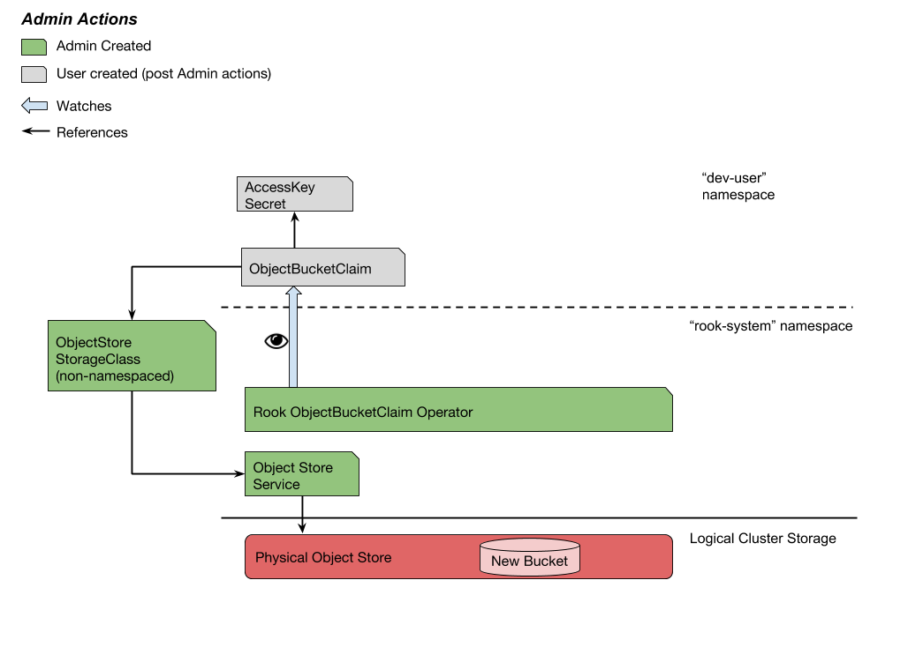
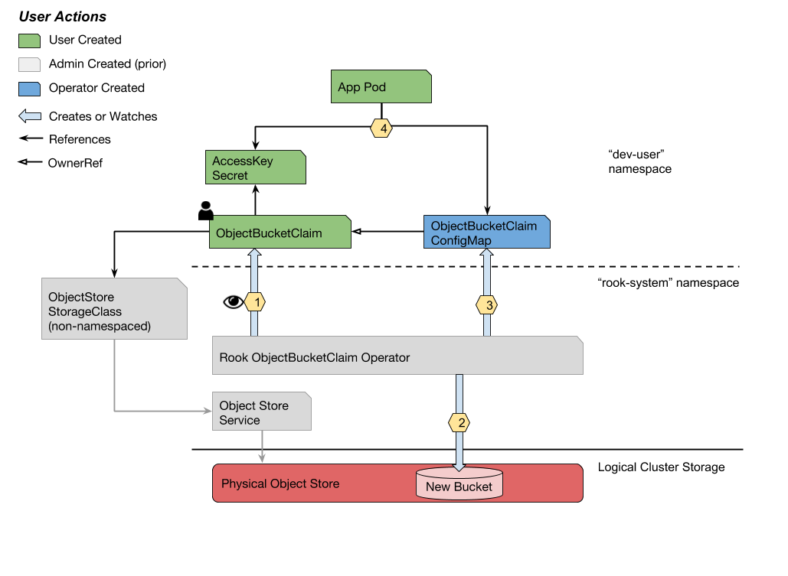

# ObjectBucketClaim CRD and Controller

## Proposed Feature

**A generalized method of S3 bucket provisioning through the implementation of an ObjectBucketClaim CRD and controller.** 

A cluster user will request bucket via the Kubernetes API and have returned a ConfigMap with connection information for that bucket.  

One ConfigMap will be created per ObjectBucketClaim instance.  ConfigMap names will be semi-deterministic and derived from the ObjectBucketClaim name.  If an ObjectBucketClaim is created with the `generateName` field, then the name cannot be known ahead of time.

Additionally, the ObjectBucketClaim and Pod can be deployed at the same time thanks to in-built synchronization in Kubernetes: 
- Pods mounting the configMap as either `envFrom:` or `env[0].valueFrom.ConfigMapKeyRef` will have a status of `CreateContainerConfigError` until the configMap is created.
- Pods mounting the ConfigMap as a volume will have a status of `ContainerCreating` until the configMap is created. In both cases, the Pod will start once the configMap exists.

Bucket deletion in the early stages of this controller design will not be addressed beyond cleaning up API objects.  Deletion of the bucket within the object store is left as an administrator responsibility.  This is to prevent the accidental destruction of data by users.

## Design

### ConfigMap Naming Convention

ConfigMaps generated by the ObjectBucketClaim Operator will be named in the pattern:

    objectBucketClaim.metadata.name-config-map

For instance, a claim with `metadata.name: "my-object-bucket-123"` will be named `my-object-bucket-123-config-map`.

### Work Flow

### Assumptions

- An object store has been provisioned with a reachable endpoint.  ([e.g. the Rook-Ceph Object provisioner](https://rook.github.io/docs/rook/master/ceph-object.html)) This may also be an external endpoint such as AWS S3.
- A Kubernetes Service and/or Endpoint API object exists to route connections to the object store.  Typically, object store operators generate these. In cases where the is external to the cluster, they must be configured manually.

### Use Cases

**Use Case: Expose an Object Store Endpoint for Bucket Provisioning**

_As a cluster admin, I want to expose an object store to cluster users so that they may begin bucket provisioning via the Kubernetes API._



In any order, the cluster admin: 

- creates the ObjectBucketClaim Operator (a Deployment API object)
- creates a StorageClass with `parameters[serviceName]=objectstore-service` and `parameters[serviceNamespace]=some-namespace`
  - _Note:_ `provisioner` field is left blank.  Defining the operator/provisioner is unnecessary, and if a value is provided it is silently ignored. 

**Use Case: Provision a Bucket** 

_As a Kubernetes user, I want to leverage the Kubernetes API to create S3 buckets. I expect to get back the bucket connection information in a ConfigMap._
 


1. The Rook Operator detects a new ObjectBucketClaim instance.  
    1. The operator uses `objectBucketClaim.spec.secretName` to get the S3 access keys secret.  
    1. The operator uses `objectBucketClaim.spec.storageClassName` to get the `Service` endpoint of the object store.
1. The operator uses the object store endpoint and access keys for an S3 "make bucket" call.
1. The operator creates a ConfigMap in the namespace of the ObjectBucketClaim with relevant connection data of the bucket.
1. An app Pod may then mount the Secret and the ConfigMap to begin accessing the bucket. 

**Use Case:** Delete an Object Bucket

_As a Kubernetes user, I want to delete ObjectBucketClaim instances and cleanup generated API resources._

1. The user deletes the ObjectBucketClaim via `kubectl delete ...`.
1. The ObjectBucketClaim is marked for deletion and left in the foreground.
1. The respective ConfigMap is deleted.
1. The ObjectBucketClaim is garbage collected.

---

## API Specifications

### ObjectBucketClaim CRD

```yaml
apiVersion: apiextensions.k8s.io/v1beta1 
kind: CustomResourceDefinition
metadata:
  name: objectbucketclaims.rook.io
spec:
  group: rook.io
  version: v1alpha2
  scope: namespaced
  names:
      kind: ObjectBucketClaim
      listKind: ObjectBucketClaimList
      singular: objectbucketclaim
      plural: objectbucketclaims
```

### ObjectBucketClaim

```yaml
apiVersion: rook.io/v1alpha2
kind: ObjectBucketClaim
metadata:
  name: my-bucket-1
  namespace: dev-user
  labels:
    rook.io/bucket-provisioner:
    rook.io/object-bucket-claim: my-bucket-1 [1]
spec:
  storageClassName: some-object-store
  secretName: my-s3-key-pair
  bucketNamePrefix: prefix [2]
```

1. Added by the rook operator.
1. The operator will append a hyphen followed by random characters to the string given here.

### Access Keys Secret  
  
```yaml
apiVersion: v1
kind: Secret
metadata:
  name: my-s3-key-pair
  namespace: dev-user
data:
  accessKeyId: <base64 encoded string>
  secretAccessKey: <base64 encoded string>
```

### ObjectBucketClaim ConfigMap

```yaml
apiVersion: v1
kind: ConfigMap
metadata:
  name: rook-object-bucket-my-bucket-1
  namespace: dev-user
  labels:
    rook.io/object-bucket-claim-controller:
    rook.io/object-bucket-claim: my-bucket-1
  ownerReferences:  [1]
  - name: my-bucket-1
    uid: 1234-qwer-4321-rewq
    apiVersion: rook.io/v1alpha2
    kind: ObjectBucketClaim
    blockOwnerDeletion: true 
data:
  ROOK_BUCKET_HOST: http://my-store-url-or-ip
  ROOK_BUCKET_NAME: my-bucket-1
  ROOK_BUCKET_PORT: 80
  ROOK_BUCKET_SSL: no
```

1. Treat the configMap as a child of the ObjectBucketClaim for garbage collection.

### ObjectStore StorageClass

```yaml
apiVersion: storage.k8s.io/v1
kind: StorageClass
metadata:
  name: some-object-store
provisioner: "" [1]
parameters:
  serviceName: my-store
  serviceNamespace: some-namespace
```

1. Since ObjectBucketClaim instances are only watched by the ObjectBucketClaim operator, defining the provisioner is unnecessary.
