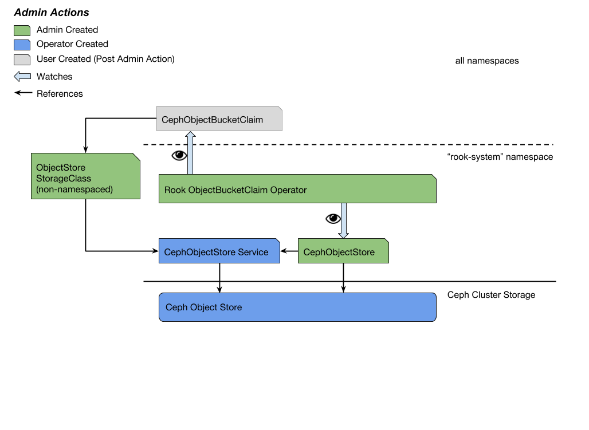
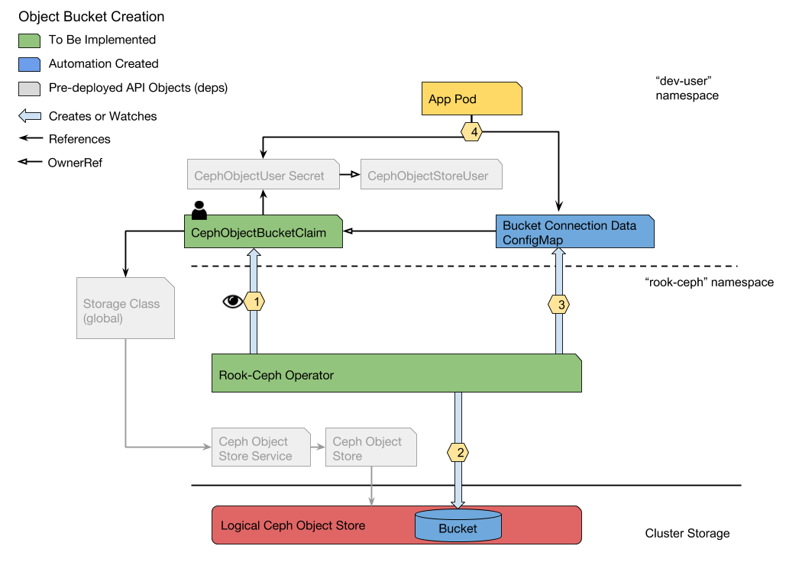

# Rook-Ceph Bucket Provisioning

## Proposed Feature

Enable Rook-Ceph Object users the ability to request buckets in an object store through the ObjectBucketClaim (OBC) and ObjectBucket (OB) API resource types.

### Overview

Rook-Ceph has developed Custom Resource Definitions (CRDs) to support the dynamic provisioning of object stores and users (CephObjectStores and CephObjectStoreUsers, respectively).  This proposal introduces the next logical step in this design: the addition a controller for handling dynamic bucket creation requests via the generalized ObjectBucketClaim and ObjectBucket APIs.  These APIs are defined in an external project with the intent of working to garner broader community support.  The intent is to round out the Rook-Ceph experience for Kubernetes users by providing a single control plane for the managing of Ceph Object components.  The ObjectBucketClaim and ObjectBucket APIs represent generic S3 bucket creation requests to enable the provisioning of buckets by most object store providers.

## Glossary

- Admin: A Kubernetes cluster administrator with RBAC permissions to instantiate and control access to cluster storage. The admin will provision object stores via CephObjectStore custom resources and create StorageClasses to enable user access.  
- User: A Kubernetes cluster user with limited permissions, typically confined to CRUD operations on Kubernetes objects within a single namespace.  The user will request Ceph Object buckets by instantiating ObjectBucketClaims.
- ObjectBucketClaim: a namespaced, user facing Custom Resource Definition representing a request for a dynamically created bucket (similar in use to PersistentVolumeClaims).  ObjectBucketClaims reference a StorageClass whose _provisioner:_ field contains the name of an object store provisioner capable of dynamically provisioning buckets.  ObjectBucketClaims serve to abstract the underlying object store provider from the user.
- ObjectBucket: a non-namespace, admin facing Custom Resource Definition representing the fulfillment of a user request for a dynamically created bucket in an existing object store (similar in use to PersistentVolumes).  ObjectBuckets serve to provide discrete information about the bucket and object store provider to admins.

## Goals

- Provide Rook-Ceph users the ability to dynamically provision object buckets via the Kubernetes API
- Enable cluster admin control over bucket creation and object store access via the Kubernetes API
- Restrict users from creating buckets with automation-generated access keys outside of the Kubernetes API (e.g. via `s3cmd` CLI tool)
- Utilize a familiar and deterministic pattern when injecting bucket connection information into workload environments
- Ensure the consuming Pod will not be started until the bucket has been created

## Non-Goals

- This design does not describe a generalized bucket provisioner
- This design does not provide users a means of deleting buckets via the Kubernetes API so as to avoid accidental loss of data.  A Delete operation only deletes operator created API resources.
- This design does not include the Swift interface implementation by Ceph Object.

## Requirements

1. The Rook-Ceph operator must have a single access key for bucket creation and reuse this key for the lifetime of the object store.
1. Users must have permissions to PUT/GET/DELETE objects in the requested bucket
1. Users must have permissions to define the access policies of objects in the requested bucket
1. Users must be provided credential and connection information in a Pod-consumable resource
1. Users must be able to reacquire bucket credential and connection information should the ObjectBucketClaim or child resource be deleted
1. Deleting ObjectBucketClaims and/or ObjectBuckets should not cause the deletion of a bucket to prevent accidental loss of data
1. Bucket naming conventions should protect users from bucket name collisions in the object store by concatenating the `metadata.namespace` and `metadata.name` of the OBC.
1. The object store endpoint must be exposed inside the cluster through a Service

## Use Cases

### Assumptions

- A running Kubernetes cluster
- The Rook-Ceph Operator is deployed in namespace `rook-ceph-system`
- A CephCluster CRD instance created in namespace `rook-ceph-system`
- A CephObjectStore CRD instance created in namespace `rook-ceph`
- A Service exists to expose the object store endpoint inside the cluster

**Use Case: Expose a Ceph Object Store for Bucket Provisioning**

_As an admin, I want to expose an existing Ceph object store to users so they can begin requesting buckets via the Kubernetes API._

//TODO update diagram to reflect API changes



1. The admin creates a [StorageClass](#storageclass) with the `provisioner=ceph.rook.io/object`, `parameters[serviceName]=OBJECT-STORE-SERVICE`, and `parameters[serviceNamespace]=OBJECT-STORE-NAMESPACE` key-values.

**Use Case: List All Provisioned Buckets in a Cluster**

_As an admin, I want to quickly list all dynamically created buckets in a cluster and access their object store specific metadata._

- The admin can get an at-a-glance picture of provisioned buckets by listing all ObjectBuckets in the cluster.
- The admin can get metadata specific to the bucket and its object store by executing a `kubectl describe` on a particular ObjectBucket.

**Use Case: Provision a Bucket** 

_As a Kubernetes user, I want to leverage the Kubernetes API to create object store buckets. I expect to get back the bucket endpoint information in a Pod-consumable API resource._
 
//TODO update diagram to reflect API changes  
 


1. The user creates an OBC in their namespace.
1. The operator detects the new OBC instance.
    1. The operator checks the `provisioner` field of the OBC's StorageClass.  If it matches, continue to the next step. Else, end the process here.
    1. The operator gets the object store service using `storageClass.parameters.objectStoreNamespace` + `storageClass.parameters.objectStore`.
1. The operator creates a CephObjectUser if it does not exist in order to generate the operator's access key.
1. The operator creates the bucket using the service endpoint and access key.  The bucket name will be a concatenation of the  OBC's `metadata.namespace` and `metadata.name`.
    1. If the bucket already exists in the store, the operator will instead regenerate the ConfigMap and Secret associated with that bucket.  This allows users the ability to reacquire buckets who's claims have been deleted.
1. The operator creates an OB containing metadata about the new bucket and sets it as bound to the OBC.
1. The operator updates the OBC to set it as "bound" to the OB.
1. The operator creates a ConfigMap in the namespace of the OBC with the endpoint information for that bucket.
    1. The operator uses the radosgw-admin CLI to generate the user's access key.  
    1. The key is linked to the bucket.
1. The operator creates a Secret in the namespace of the OBC with the **user's** access key.
1. An app Pod may then reference the Secret and the ConfigMap to begin accessing the bucket.

**Use Case: Delete an Object Bucket**

_As a Kubernetes user, I want to delete ObjectBucketClaim instances and cleanup generated API resources._

1. The user deletes the OBC via `kubectl delete objectbucketclaim -n default FOO`.
1. The OBC is marked for deletion and left in the foreground.
1. The respective ConfigMap and user Secret are deleted.
1. The OBC is garbage collected.
1. The OB phase is changed from "bound" to "lost"

    Note: this does not cause the deletion of the OB.  Since the actual bucket is not deleted, it is reasonable that it should still tracked in Kubernetes.

---

## Looking Forward

- Resource Quotas cannot yet be defined for CRDs.  This limits admin control over how many buckets can be created per object store.  An operator could be made configurable (via ConfigMap) to cap the number of buckets per object store.  A PR exists for enabling quotas on CRDs (https://github.com/kubernetes/kubernetes/pull/72384).  If it is merged into Kubernetes, a ResourceQuota example should be defined for OBCs.

- Custom Bucket and Object policies are not defined for OBCs.  Currently all user keys will have Object PUT/GET/DELETE and object policy setting permissions.  It would be useful to allow users to link secondary keys with a subset of these permissions to buckets.

---

## API Specifications

### OBC Custom Resource Definition

```yaml
apiVersion: apiextensions.k8s.io/v1beta1
kind: CustomResourceDefinition
metadata:
  name: objectbucketclaims.store-operator.s3
spec:
  group: store-operator.s3
  names:
    kind: ObjectBucketClaim
    listKind: ObjectBucketClaimList
    plural: objectbucketclaims
    singular: objectbucketclaim
  scope: Namespaced
  version: v1alpha1
  subresources:
    status: {}
```

### OBC Custom Resource (User Defined)

```yaml
apiVersion: objectbucket.s3.io/v1alpha1
kind: ObjectBucketClaim
metadata:
  name: MY-BUCKET-1 [1]
  namespace: USER-NAMESPACE [2]
spec:
  storageClassName: SOME-OBJECT-STORE-STORAGE-CLASS [3]
  tenant: MY-TENANT [4]
```

1. `name` of the ObjectBucketClaim. Composes part of the bucket name and ConfigMap name
1. `namespace` of the ObjectBucketClaim. Composes part of the bucket name. Determines the namespace of the ConfigMap
1. `storageClassName` is used to target the desired Object Store.  Used by the operator to get the Object Store service URL.
1. `tenant` allows users to define a tenant in an object store in order to namespace their buckets and access keys. 

### OBC Custom Resource (Operator Updated)

```yaml
apiVersion: store-operator.s3/v1alpha1
kind: ObjectBucketClaim
metadata:
  name: MY-BUCKET-1
  namespace: USER-NAMESPACE
spec:
  storageClassName: SOME-OBJECT-STORE-STORAGE-CLASS
status:
  phase: {"pending", "bound", "lost"}  [1]
  objectBucketRef: objectReference{}  [2]
  configMapRef: objectReference{}  [3]
  secretRef: objectReference{}  [4]
```
 
1. `phase` 3 possible phases of bucket creation, mutually exclusive
    - `pending`: the operator is processing the request
    - `bound`: the operator finished processing the request and linked the OBC and OB
    - `lost`: the OBC has been deleted, leaving the OB unclaimed
1. `objectBucketRef` is an objectReference to the bound ObjectBucket 
1. `configMapRef` is an objectReference to the generated ConfigMap 
1. `secretRef` is an objectReference to the generated Secret

### OB Custom Resource Definition

```yaml
apiVersion: apiextensions.k8s.io/v1beta1
kind: CustomResourceDefinition
metadata:
  name: objectbuckets.store-operator.s3
spec:
  group: store-operator.s3
  names:
    kind: ObjectBucket
    listKind: ObjectBucketList
    plural: objectbuckets
    singular: objectbucket
  scope: Namespaced
  version: v1alpha1
  subresources:
    status: {}
```

### OB Custom Resource

```yaml
apiVersion: store-operator.s3/v1alpha1
kind: ObjectBucket
metadata:
  name: object-bucket-claim-MY-BUCKET-1
  ownerReferences: [1]
  - name: CEPH-CLUSTER
    ...
  labels:
    ceph.rook.io/object: [2]
spec:
  objectBucketSource: [4]
    provider: ceph.rook.io/object
status:
  claimRef: objectreference [5]
  phase: {"pending", "bound", "lost"} [6]
```

1. `ownerReferences` makes the OB a child of the object store.  If the store is destroyed, the OBs are deleted.
1. Label `ceph.rook.io/object/claims` associates all artifacts under the Rook-Ceph object provisioner.
1. `objectBucketSource` is a struct containing metadata of the object store provider
1. `claimRef` is an objectReference to the ObjectBucketClaim associated with this ObjectBucket
1. `phase` is the current state of the ObjectBucket
    - `pending`: the operator is processing the request
    - `bound`: the operator finished processing the request and linked the OBC and OB
    - `lost`: the OBC has been deleted, leaving the OB unclaimed

### (User Access Key) Secret

```yaml
apiVersion: store-operator.s3/v1alpha1
kind: Secret
metadata:
  name: object-bucket-claim-MY-BUCKET-1 [1]
  namespace: USER-NAMESPACE [2]
  ownerReferences:
  - name: MY-BUCKET-1 [3]
    ...
data:
  ACCESS_KEY_ID: BASE64_ENCODED
  SECRET_ACCESS_KEY: BASE64_ENCODED
```

1. `name` is composed from the OBC's `metadata.name`
1. `namespce` is that of a originating OBC
1. `ownerReference` makes this secret a child of the originating OBC for clean up purposes.

### ConfigMap

```yaml
apiVersion: v1
kind: ConfigMap
metadata:
  name: rook-ceph-object-bucket-MY-BUCKET-1 [1]
  namespace: USER-NAMESPACE [2]
  labels:
    ceph.rook.io/object: [3]
  ownerReferences: [4]
  - name: MY-BUCKET-1
    ...
data: 
  S3_BUCKET_HOST: http://MY-STORE-URL [5]
  S3_BUCKET_PORT: 80 [6]
  S3_BUCKET_NAME: MY-BUCKET-1 [7]
  S3_BUCKET_SSL: no [8]
```
1. `name` composed from `rook-ceph-object-bucket-` and ObjectBucketClaim `metadata.name` value concatenated
1. `namespace` determined by the namespace of the ObjectBucketClaim
1. Label `ceph.rook.io/object/claims` associates all artifacts under the ObjectBucketClaim operator. Set by operator.
1. `ownerReference` sets the ConfigMap as a child of the ObjectBucketClaim. Deletion of the ObjectBucketClaim causes the deletion of the ConfigMap
1. `S3_BUCKET_HOST` host URL
1. `S3_BUCKET_PORT` host port
1. `S3_BUCKET_NAME` bucket name
1. `S3_BUCKET_SSL` boolean representing SSL connection

### StorageClass

```yaml
apiVersion: storage.k8s.io/v1
kind: StorageClass
metadata:
  name: SOME-OBJECT-STORE
  labels: 
    ceph.rook.io/object: [1]
provisioner: "" [2]
parameters:
  objectStoreService: MY-STORE [3]
  objectStoreServiceNamespace: MY-STORE-NAMESPACE [4]
  region: LOCATION [5]
```

1. Label `ceph.rook.io/object/claims` associates all artifacts under the ObjectBucketClaim operator.  Defined in example StorageClass and set by cluster admin.  
1. `provisioner` the provisioner responsible to handling OBCs referencing this StorageClass
1. `objectStore` used by the operator to derive the object store Service name.
1. `objectStoreNamespace` the namespace of the object store
1. `region` (optional) defines a region of the object store
