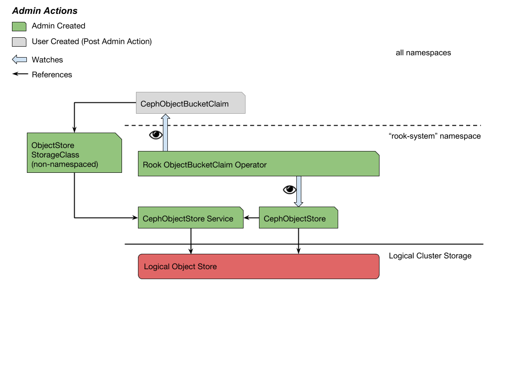

# Rook-Ceph Bucket Provisioning

## Proposed Feature

Add a CephObjectBucketClaim API endpoint and control loop to the Rook-Ceph operator for the dynamic provisioning of S3 buckets by Kubernetes users.

### Overview

  Rook-Ceph has developed Custom Resource Definitions (CRDs) to support the dynamic provisioning of Ceph Object Stores and Ceph Object Store Users.  This proposal introduces the next logical step: dynamic bucket provisioning with the addition of a CephObjectBucketClaim CRD.  The intent is to round out the Rook-Ceph experience for Kubernetes users by providing a single control plane for the managing of Ceph Object components.      

## Goals

- Provide Rook-Ceph users the ability to dynamically provision object buckets via the Kubernetes API with a CephObjectBucketClaim CRD.
- Enable cluster admin control over bucket creation and object store access via the Kubernetes API.
- Utilize a familiar and deterministic pattern when injecting bucket connection information into workload environments. 

## Non-Goals

- This proposal does not implement a generalized method for bucket provisioning; it will be specific to Rook-Ceph
- This design does not attempt to implement a 1:1 model of Kubernetes PersistentVolumes and PersistentVolumeClaims.  Some shallow similarities will exist. 
- This design does not include the Swift interface implementation by Ceph Object.
- This design does not provide users a means of deleting buckets via the Kubernetes API in order to avoid accidental loss of data.  A Delete operation only deletes the Kubernetes API objects.

## Requirements

1. The Rook-Ceph operator should be the only object store accessor with bucket CREATE privileges.
1. Users' access key privileges must only have object PUT, GET, and DELETE rights for the bucket they have requested.
1. When a user creates a CephObjectBucketClaim instance, the operator should create, in the CephObjectBucketClaims' namespace,
    1. a ConfigMap with the bucket's connection information
    1. a Secret with the access key with an object PUT/GET/DELETE ACL.

## Users

- Admin: A Kubernetes cluster administrator with RBAC permissions to instantiate and control access to cluster storage. The admin will use existing Rook-Ceph CRDs to create Ceph Object Stores and StorageClasses to make them accessible to users.  
- User: A Kubernetes cluster user with limited permissions, typically confined to CRUD operations on Kubernetes objects within a single namespace.  The user will request Ceph Object buckets by instantiating CephObjectBucketClaims. 

## Use Cases

### Assumptions

- A running Kubernetes cluster

##### Use Case: Expose an Object Store Endpoint for Bucket Provisioning

As an admin, I want to expose an existing object store to cluster users so they can begin bucket provisioning via the Kubernetes API._



1. The admin creates the Rook-Ceph Operator and a CephCluster in namespace `rook-ceph-system`
    1. The operator begins watching for CephObjectBucketClaim instances in all namespaces
1. The admin creates a CephObjectStore in namespace `rook-ceph`
1. The operator detects a new CephObjectStore and provisions a Ceph Object store. 
1. The admin creates a StorageClass with `parameters[serviceName]=OBJECT-STORE-SERVICE` and `parameters[serviceNamespace]=OBJECT-STORE-NAMESPACE`

**Use Case: Provision a Bucket** 

_As a Kubernetes user, I want to leverage the Kubernetes API to create Ceph Object Buckets. I expect to get back the bucket connection information in a Pod-attachable object._
 


1. The user creates a CephObjectBucketClaim in their namespace.
1. The operator detects the new ObjectBucketClaim instance.
    1. The operator derives the object store service via `storageClass.parameters.objectStoreNamespace` + `storageClass.parameters.objectStore`.
1. If a CephObjectUser for the CephObjectStore does not exist, the operator creates it and waits for the associated Secret.  This will give the operator **bucket** CREATE/GET/DELETE permissions in the object store.  This key is reused later and exists for the lifetime of the object store.
1. The operator creates the bucket using the service endpoint and CephObjectStoreUser **bucket** access key.
1. The operator creates or updates a ConfigMap in the namespace of the CephObjectBucketClaim with relevant connection data for that bucket.
    1. The operator uses the radosgw-admin CLI to generate a **user** access key.  This key will be bound to the bucket with an **object** PUT/GET/DELETE ACL.
    1. The operator binds the **user** key to the bucket with an **object** PUT/GET/DELETE ACL.
1. The operator creates a Secret in the namespace of the CephObjectBucketClaim with the **user** key pair.
1. An app Pod may then mount the Secret and the ConfigMap to begin accessing the bucket.

##### Use Case: Delete an Object Bucket

_As a Kubernetes user, I want to delete ObjectBucketClaim instances and cleanup generated API resources._

1. The user deletes the CephObjectBucketClaim via `kubectl delete ...`.
1. The CephObjectBucketClaim is marked for deletion and left in the foreground.
1. The respective ConfigMap is deleted.
1. The CephObjectBucketClaim is garbage collected.

---

## Looking Forward

- Resource Quotas cannot be defined for CRDs.  This limits admin control over how many buckets can be created per object store.  A operator could be made configurable (via ConfigMap) to cap the number of buckets per object store.

- ACL control doesn't exist for CephObjectBucketClaims.  Currently all user end keys will have Object PUT/GET/DELETE.  It would be useful to allow users to request secondary keys with a subset of these ACLs. For instance, an Object GET-only key.

---

## API Specifications

### Custom Resource Definition

```yaml
apiVersion: apiextensions.k8s.io/v1beta1 
kind: CustomResourceDefinition
metadata:
  name: cephobjectbucketclaims.rook.io
spec:
  group: ceph.rook.io
  version: v1
  scope: namespaced
  names:
      kind: CephObjectBucketClaim
      listKind: CephObjectBucketClaimList
      singular: cephobjectbucketclaim
      plural: cephobjectbucketclaims
```

### Custom Resource

```yaml
apiVersion: ceph.rook.io/v1
kind: CephObjectBucketClaim
metadata:
  name: MY-BUCKET-1 [1]
  namespace: USER-NAMESPACE [2]
  ownerReferences: [3]
  - name: SOME-CEPH-CLUSTER
    kind: CephCluster
    blockOwnerDeletion: true
    <TRUCANTED FOR CLARITY>
  labels:
    ceph.rook.io/object/claims: [4]
spec:
  storageClassName: SOME-OBJECT-STORE [5]
  bucketPrefix: PREFIX [6]
status:
  phase: {"pending", "available", "error"}  [7]
  configMapRef: objectReference{}  [8]
```

1. `name` of the CephObjectBucketClaim composes part of the ConfigMap name
1. `namespace` of the CephObjectBucketClaim, determines the namespace of the ConfigMap
1. `ownerReference` sets the CephObjectBucketClaim as a child of the Ceph Cluster.  Cluster deletion causes the deletion of the ConfigMap 
1. Label `ceph.rook.io/object/claims` associates all artifacts under the CephObjectBucketClaim operator. Set by operator.
1. `storageClassName` is used to target the desired Object Store.  Used by the operator to get the Object Store service URL.
1. `bucketPrefix` the operator will utilize the k8s.io/apiserver `names` package for generating random 5 character suffixes
1. `phase` 3 possible phases of bucket creation, mutually exclusive
1. `configMapRef` is an objectReference to the generated ConfigMap 

### ConfigMap

```yaml
apiVersion: v1
kind: ConfigMap
metadata:
  name: rook-ceph-object-bucket-MY-BUCKET-1 [1]
  namespace: USER-NAMESPACE [2]
  labels:
    ceph.rook.io/object/claims: [3]
  ownerReferences: [4]
  - name: MY-BUCKET-1
    kind: CephObjectBucketClaim
    blockOwnerDeletion: true
    <TRUCANTED FOR CLARITY>
data: 
  CEPH_BUCKET_HOST: http://MY-STORE-URL [5]
  CEPH_BUCKET_PORT: 80 [7]
  CEPH_BUCKET_NAME: MY-BUCKET-1 [6]
  CEPH_BUCKET_SSL: no [8]
```
1. `name` composed from `rook-ceph-object-bucket-` and CephObjectBucketClaim `metadata.name` value concatenated
1. `namespace` determined by the namespace of the CephObjectBucketClaim
1. Label `ceph.rook.io/object/claims` associates all artifacts under the CephObjectBucketClaim operator. Set by operator.
1. `ownerReference` sets the ConfigMap as a child of the CephObjectBucketClaim. Deletion of the CephObjectBucketClaim causes the deletion of the ConfigMap
1. `CEPH_BUCKET_HOST` host URL
1. `CEPH_BUCKET_PORT` host port
1. `CEPH_BUCKET_NAME` bucket name
1. `CEPH_BUCKET_SSL` boolean representing SSL connection

### StorageClass

```yaml
apiVersion: storage.k8s.io/v1
kind: StorageClass
metadata:
  name: SOME-OBJECT-STORE
  labels: 
    ceph.rook.io/object/claims: [1]
provisioner: "" [2]
parameters:
  objectStore: MY-STORE [3]
  objectStoreNamespace: MY-STORE-NAMESPACE [4]
```

1. Label `ceph.rook.io/object/claims` associates all artifacts under the CephObjectBucketClaim operator.  Defined in example StorageClass and set by cluster admin.  
1. `provisioner` value ignored, only the Rook-Ceph operator will watch CephObjectBucketClaims
1. `objectStore` used by the operator to derive the object store Service name.
1. `objectStoreNamespace` the namespace of the object store
