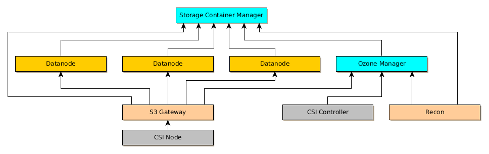

# Operator for Apache Hadoop Ozone

## What is Ozone?

Ozone is a new generic storage system. It is highly scalable and can be used via multiple interface:

    It works as an S3 compatible file system
    It can be used as a Hadoop compatible file system (from spark, hive, hbase, etc.)
    It has an internal CSI server and can be used as raw Kubernetes storage.

You can find more information here: http://hadoop.apache.org/ozone/

## Why?

The two main advantages of using Ozone in Kubernetes with Rook:

 * It can provide Hadoop file system interface which is not provided by any other storage. Existing Hadoop compatible big data projects can use the storage via the Hadoop FS, but in the mean time the same data can be access from s3 interface or as a k8s volume.
 * The design is based on the HDFS design. It can be scaled easily to thousand of nodes (but in the mean time the legendary small file problem of HDFS is also solved.)


## Components of Ozone

Ozone has the following components in a typical cluster:

 * Two kind of metadata servers:
    * **Storage Container Manager** (SCM): for block space management (create huge binary blocks which are replicated between the datanodes)
    * **Ozone Manager** (OM): for key space management (create buckets, keys on top the blocks which are replicated by the Storage Container Manager)
 * **Datanodes**: Storage daemons
 * **S3 gateway** (stateless rest services, with AWS S3 compatible interface)
 * **Recon** server (generic UI, anomaly detection, historical data)
 * DB backend for recon

The CSI interface requires two additional daemons:

  * CSI Controller service
  * CSI Node service

Ozone uses `StatefulSet` for the master servers (Storage Container Manager, Ozone Manager, S3 gateway, Recon Server) and slave servers (datanode)



In a real world setup Ozone use the following components:

 * Prometheus to collect all of the metrics
 * Grafana to display the default dashboards

## Storage requirements

Similar to other Software Defined Storage, Ozone is the gateway between the local storage and network storage.

It's suggested to use local storage. Ozone suggests to use SSD or NVMe, for the metadata store and spinning disk for the real data.

## Implementation

The initial implementation of the Operator should be based on the available examples. The main behavior will be similar to the CockroachDB operator (alpha), it will install Ozone cluster based on a custom CRD. Some notable differences.

 * Versioning support (see the next section)
 * Kubernetes resources are generated from the original k8s template files provided by the Ozone project (it is an advanced version of the existing Ceph/CSI example)

### Version support

By default, Ozone tools are not required by the operator. The only reason is to use the `apache/ozone` container image as the base image is to have all the required k8s resources templates.

The version of Ozone can be decoupled from the version of the Operator similar to the [CSI version decoupling](https://github.com/rook/rook/blob/master/design/decouple-ceph-version.md). The default version will be defined by the Rook operator version but other version can be used based on CRD entry.

### Kubernetes resource generation

Ozone provides examples K8s resources files and transformation definitions using [flekszible](https://github.com/elek/flekszible). This is a composition based k8s resource generator where the transformations can be reused.

Let's say we have a simple Kubernetes resource:

```yaml
apiVersion: apps/v1
kind: StatefulSet
metadata:
  name: datanode
  labels:
    app.kubernetes.io/component: ozone
spec:
  selector:
    matchLabels:
      app: ozone
      component: datanode
  serviceName: datanode
  replicas: 3
  template:
    metadata:
      labels:
        app: ozone
        component: datanode
    spec:
      containers:
      - name: datanode
        image: "apache/hadoop:0.5.0-SNAPSHOT"
        args: ["ozone","datanode"]
        ports:
           - containerPort: 9870
             name: rpc
```

Prometheus annotations can be added by a simple rule:

```yaml
type: Add
path: ["spec","template","spec","metadata","annotations"]
trigger:
   metadata:
      name: datanode
value:
   prometheus.io/scrape: "true"
   prometheus.io/port: "9882"
   prometheus.io/path: "/prom"
```

This transformation can be applied to any of the k8s resources.

Until now it is very similar to Kustomize, but here we have more predefined transformations (NodePort service generator, value replacer).

Even better the transformations can be reused. The previous definition can be reused by putting it to the right directory:

```yaml
name: ozone/prometheus
description: Enable prometheus monitoring in Ozone
---
- type: Add
  path: ["spec","template","spec","metadata","annotations"]
  trigger:
     metadata:
        name: datanode
  value:
     prometheus.io/scrape: "true"
     prometheus.io/port: "9882"
     prometheus.io/path: "/prom"
```

After this step, you can use it as

```yaml
type: ozone/prometheus
```

Or from golang API:

```golang

context, err := Initialize("../testdata/api")
if err != nil {
   return err
}

err = context.AppendCustomProcessor("ozone/prometheus", make(map[string]string))
if err != nil {
   return err
}

context.Render()

s, err := context.Resources()[0].Content.ToString()
if err != nil {
   return err
}

assert.Contains(t, s, "prometheus.io/scrape: \"true\"")
```

### Create k8s resource from operator

One easy way to integrate the existing resource generation of Ozone is to use it from golang API. This is similar to the approach of [Ceph CSI](https://github.com/rook/rook/tree/master/pkg/operator/ceph/csi) which reads the k8s template files from the disk.

The main difference here is that before the final adjustment we can reuse the basic transformations which are already implemented by ozone.

At the end of the transformations we will have a list of real K8s resources object, where we can do any final adjustment on the API object and send them to the k8s API services.

The main logic is the following:

 * The resource generator can be initialized with the main k8s definition directory (which is included in the Ozone release, and included in the Rook operator image)
 * The transformations can be enabled from the API based on CRD properties
 * The real k8s golang objects are generated
 * After final adjustment in golang, we can post all the objects to the K8S api

### CRD

A good operator CRD provides a good balance between the simplicity and power. By default the CRD should be as simple as possible but we should keep the possibility to customize any segment of the generated cluster.

This can be achieved by the use k8s generator tool.

 1. The default cluster will be generated based on the main attributes of CRD
 2. Additional attributes can trigger additional transformations
 3. Finally we can provide an option to define any custom transformations


```yaml
apiVersion: v1
kind: Namespace
metadata:
  name: rook-ozone
---
apiVersion: ozone.rook.io/v1alpha1
kind: OzoneObjectStore
metadata:
  name: my-store
  namespace: rook-ozone
spec:
  components: #component specific settings
     csi:
        enable: true
        placement: #see rook.io/v1alpha1 PlacementSpec
     recon:
        enable: true
        placement: #see rook.io/v1alpha1 PlacementSpec
     s3g:
        enable: true
        placement: #see rook.io/v1alpha1 PlacementSpec
     scm:
        #required component, always enabled
        placement: #see rook.io/v1alpha1 PlacementSpec
     om:
        #required component, always enabled
        placement: #see rook.io/v1alpha1 PlacementSpec
  features: # these are not components but confiuration groups
     prometheus: true
     tracing: true
  ozoneVersion: #see Ceph versioning doc for mor details
    image: apache/ozone:0.4.1
    allowUnsupported: false
  upgradePolicy: #see Ceph versioning doc for mor details (Won't be implmented in Phase 1)
    ozoneVersion:
      image: apache/ozone:0.5.0
      allowUnsupported: false
  storage: #see rook.io/v1alpha1/StorageScopeSpec
  placement: #see rook.io/v1alpha1 PlacementSpec
  annotations: #custom annotations for all the created k8s resources
     key: value
  customization: #deep water: any additional transformations to modify k8s resources. Only for advanced users.
    - type: Add
      path: ["metadata", "labels"]
      value:
         generated-with: rook
```

The type of the `storage` attribute is `StorageScopeSpec` which is a [common Rook type](https://github.com/rook/rook/blob/818ad9c7ca4d352a9bed202e619d47b05f1a4dab/pkg/apis/rook.io/v1alpha2/types.go), and can be used to specifiy the details of the storage (eg. volumeClaimTemplates, nodeCounts, etc.)

## Operator capabilities

The main benefit to use an operator is to provide additional functionalities based on the current state of the runtime environment. The power of the operator based on the runtime information which is not available for any other installer tool.

Some option which can be implemented as part of the Operator:

 * Use emptyDir instead of Persistent Volumes in case of the dev cluster (_opt-in_ only, it should be configured, for example by an environment variable on the operator side.)
 * Connection Kubernetes decommissioning and Ozone decommissioning
 * Configure local persistence based on the available disks
 * Support storage based auto-scaling (if datanodes are `StatefulSet`)
 * Expose S3 endpoint based on the available ingress, LB
 * Volume support: Ozone has a hierarchy of volumes/buckets/keys. Bucket and keys are the same what we have in any S3 compatible store, volumes can contain generic replication/security rules for all the assigned buckets. We can support Volume CRD to make it easier the management of the volumes
 * Environment specific configuration (host names) can be adjusted based on the current topology (host names, namespace)
 * Security: Hadoop/Ozone depends on kerberos for security. If kerberos is not available, the Operator can install kerberos.
