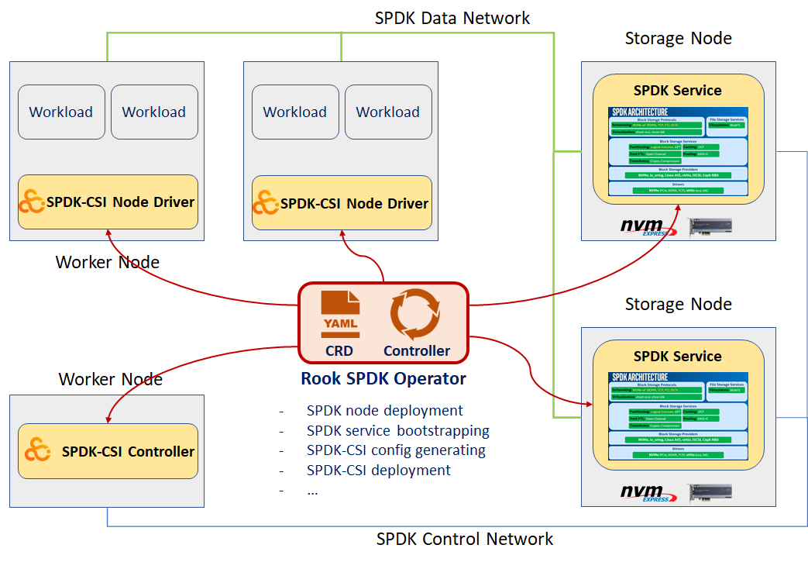

# Add SPDK to Rook

## Overview

This document explores a design to deploy and manage SPDK services and CSI plugins by adding an SPDK operator to Rook.

### SPDK and SPDK-CSI

The Storage Performance Development Kit ([SPDK](https://spdk.io)) provides a set of tools and libraries for writing high performance, scalable, user-mode storage applications. SPDK makes use of modern hardware features to achieve extreme performance. E.g, interacting with hardware directly in user space, polling data readiness instead of interrupt, no locks in I/O path, etc. Besides local NVMe devices, SPDK also supports NVMe-oF and iSCSI targets, which makes SPDK a perfect fit to accelerate network storage workloads.

[SPDK-CSI](https://github.com/spdk/spdk-csi) is a Kubernetes CSI plugin brings SPDK to Kubernetes storage through NVMe-oF and iSCSI. It supports dynamic volume provisioning and enables Pods to use SPDK storage transparently.

### What is missing?

What's missing is how to deploy and maintain SPDK services and SPDK-CSI plugin in Kubernetes cluster automatically. This is non-trivial and requires domain specific knowledge. It can be greatly simplified by leveraging Rook's mature framework and implementing an SPDK operator for Rook.

## Design

SPDK operator leverages [Kubernetes controller-runtime Project](https://github.com/kubernetes-sigs/controller-runtime), and [Kubebuilder](https://book.kubebuilder.io/) is used to generate boilerplate codes and manifests.



### SPDK Cluster CRD

SPDK Cluster CRD defines custom resources of an SPDK storage cluster. Includes but not limited to:
- Choose Kubernetes nodes to deploy SPDK services
- Select NVMe devices to be managed by SPDK on each node, or auto discover.
- Set NVMe-oF target type and address for each node
- ...

#### Example API definition

```yaml
type ClusterSpec struct {
    SpdkNodes   []SpdkNode         `json:"spdkNodes,omitempty"`
}

type SpdkNode struct {
    Name string                  `json:"name"`
    NvmePcieAddrs []SpdkPcieAddr `json:"nvmePcieAddrs,omitempty"`
    Target SpdkTarget            `json:"target,omitempty"`
}

type SpdkTarget struct {
    Type string `json:"type"`
    Addr string `json:"addr,omitempty"`
    Port int    `json:"port,omitempty"`
}
```

#### Example CRD yaml

CRD yaml is automatically generated by Kubebuilder per API definition.

```yaml
apiVersion: apiextensions.k8s.io/v1beta1
kind: CustomResourceDefinition
metadata:
  name: clusters.spdk.rook.io
spec:
  group: spdk.rook.io
  names:
    kind: Cluster
  scope: Namespaced
  validation:
    openAPIV3Schema:
      properties:
        spec:
          properties:
            spdkNodes:
              items:
                properties:
                  name:
                    type: string
                  nvmePcieAddrs:
                    items:
                      type: string
                    type: array
                  target:
                    properties:
                      addr:
                        type: string
                      port:
                        type: integer
                      type:
                        type: string
                    required:
                    - type
                    type: object
                required:
                - name
                type: object
              type: array
          type: object
      type: object
  version: v1alpha1
```

### SPDK Cluster Instance

An SPDK cluster instance looks like below

```yaml
apiVersion: spdk.rook.io/v1alpha1
kind: Cluster
metadata:
  name: cluster-sample
spec:
  spdkNodes:
  - name: k8s-spdk-node
    nvmePcieAddrs: ["00:01.0"]
    target:
      type: "nvme-tcp"
      addr: "192.168.101.4"
      port: 4420
```

### SPDK Operator

SPDK operator is responsible for SPDK and CSI deployment. It watches SPDK CRD resource status in its reconciliation loop and moves cluster to the desired status.

#### SPDK Services Deployment

SPDK operator provisions and bootstraps SPDK service on specified storage nodes.
- Get SPDK cluster object and other resources.
- Launch SPDK pod on each storage node. The pod contains SPDK binaries and should be a privileged container with host network to access raw NVMe devices and fast data path.
- Start SPDK service on each storage node, with appropriate NVMe devices (statically set or dynamically discovered).
- Iterate attached NVMe devices and create according Bdevs and Logical Volume Stores.
- Export SPDK targets (NVMe-oF or iSCSI per cluster definition) on each storage node.
- Start SPDK Json RPC http proxy with access token (randomly generated or preset).

#### SPDK CSI Deployment

SPDK operator deploys SPDK CSI after SPDK services are successfully started on storage nodes.
- SPDK operator generates ConfigMap for CSI to find SPDK storage nodes.
- SPDK operator generates Secret necessary for CSI to connect to Json RPC http proxy.
- SPDK operator deploys CSI plugin.

**Generate ConfigMap**

```yaml
apiVersion: v1
kind: ConfigMap
metadata:
  name: spdkcsi-cm
data:
  config.json: |-
    {
      "nodes": [
        {
          "name": "",
          "rpcURL": "http://172.17.0.4:9009",
          "targetType": "nvme-tcp",
          "targetAddr": "192.168.101.4"
        }
      ]
    }
```

### Using SPDK in Kubernetes

With SPDK services and CSI plugin deployed and started, user can leverage SPDK storage in Kubernetes easily with standard PV and PVC.

```yaml
# storage class
apiVersion: storage.k8s.io/v1
kind: StorageClass
metadata:
  name: spdkcsi-sc
provisioner: csi.spdk.io

# pvc
kind: PersistentVolumeClaim
apiVersion: v1
metadata:
  name: spdkcsi-pvc
spec:
  accessModes:
  - ReadWriteOnce
  resources:
    requests:
      storage: 256Mi
  storageClassName: spdkcsi-sc

# test pod
kind: Pod
apiVersion: v1
metadata:
  name: spdkcsi-test
spec:
  containers:
  - name: alpine
    image: alpine:3
    imagePullPolicy: "IfNotPresent"
    command: ["sleep", "365d"]
    volumeMounts:
    - mountPath: "/spdkvol"
      name: spdk-volume
  volumes:
  - name: spdk-volume
    persistentVolumeClaim:
      claimName: spdkcsi-pvc
```
