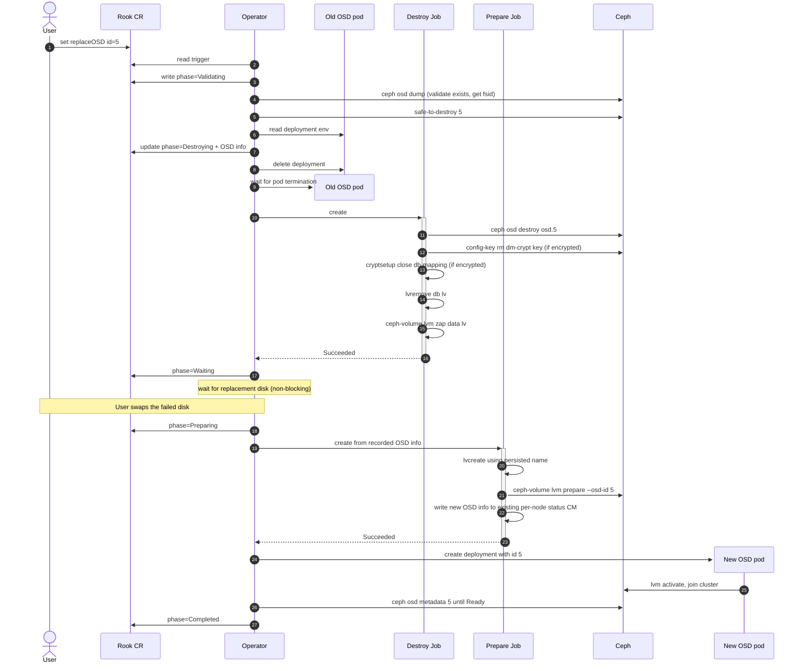

# Design: Single OSD replacement with a shared metadata device

Issue: [rook/rook#13240](https://github.com/rook/rook/issues/13240)

## Problem

When an OSD's data and metadata live on different devices (per `spec.storage` `metadataDevice` config in the CephCluster CR), Rook today cannot replace a single failed OSD on its own. The user must either re-provision all OSDs sharing the same metadata device or run a multi-step manual workflow including scaling down the operator to zero. Both are slow and error-prone.

This design proposes a workflow to replace a single failed OSD in place — preserving its OSD ID — without affecting other OSDs sharing the same metadata device.

## Notation

- **User** - the human cluster admin who edits the CR.
- **Operator** - the Rook controller process.
- **Data LV / data device** - the LV (or block device) holding an OSD's bulk data. One per OSD.
- **DB LV / metadata device** - the LV holding the OSD's rocksdb (`block.db`). One per OSD; multiple OSDs can share the same metadata device.

## User story

A disk corresponding to `osd.5` fails on a node where five HDD OSDs share one NVMe metadata device. The user marks `osd.5` for replacement on the CephCluster CR, swaps the physical disk in the chassis, and walks away. Rook destroys `osd.5`, frees its DB LV slot on the NVMe, provisions a new OSD on the replacement disk *with the same OSD ID 5*, and the other four OSDs on the same NVMe stay up the whole time.

## Constraints

Two facts about the environment shape every later choice in this design.

### Rook cannot tell a replacement disk from a new disk

When a fresh empty disk appears on a node, Rook has no way to tell it's the replacement for a failed OSD. The next CephCluster reconcile calls `startProvisioningOverNodes`, which spawns a prepare-job on each node. With `useAllDevices: true` (or a matching `deviceFilter`) the prepare-job auto-provisions a new OSD on the empty disk with a fresh ID; orphan resources for the failed OSD stay leaked.

This is why the user must mark the OSD for replacement in the CR *before* swapping the disk. Otherwise, a reconcile triggered between the swap and the CR edit auto-provisions the new disk with a fresh ID instead of replacing osd.5.

### Storage device config must tolerate device swap

Rook lets users identify OSD data devices via `spec.storage`:

- `useAllDevices: true` — match any empty disk on the node.
- `deviceFilter: "<regex>"` — match disks whose `lsblk` properties match a regex.
- `nodes[].devices[].name: "<value>"` — match a specific path or name. Accepts a kernel name (`vdb`), a raw path (`/dev/sdc`), or a udev symlink (`/dev/disk/by-path/...`, `/dev/disk/by-id/...`).
- `nodes[].devices[].fullpath: "<value>"` — explicit DevLinks match (`/dev/disk/by-id/...`, `/dev/disk/by-path/...`). Compared against discovered symlinks, not regex.

Each shape interacts differently with the Linux device-naming interfaces:

- **Kernel names** (`vdb`, `sdc`, `/dev/sdc`) are not guaranteed to be persistent (see [Arch Wiki: Persistent block device naming](https://wiki.archlinux.org/title/Persistent_block_device_naming)). [Ceph's own admin docs](https://docs.ceph.com/en/latest/rados/operations/add-or-rm-osds/#replacing-an-osd) use raw paths like `/dev/sdX` in their replacement examples, but the manual procedure can be re-validated at each step; an automated flow has fewer recovery options if the name has shifted.
- **`/dev/disk/by-path/...`** is built by udev rules from the sysfs port path. Same physical port → same `by-path` symlink. So `by-path` survives a *same-slot* swap and breaks on a different-slot swap. Same-slot replacement is **not** a Rook or Ceph requirement: [Ceph upstream is silent on slot semantics](https://docs.ceph.com/en/latest/rados/operations/add-or-rm-osds/#replacing-an-osd); cephadm's `ceph orch device replace` is slot-agnostic.
- **`/dev/disk/by-id/...`** identifies the disk by hardware serial / WWN. Different disk → different `by-id`. Useless for replacement (the new disk *is* a different disk).
- **`/dev/disk/by-uuid/...`** identifies the filesystem/LV UUID. The replacement disk has a fresh UUID after provisioning. Same as `by-id`: useless here.

The shapes that tolerate any swap (same-slot or different-slot, any new disk) are `useAllDevices` and `deviceFilter`. `by-path` tolerates only same-slot replacement. Kernel names tolerate only the lucky case where the kernel happens to assign the same name. `by-id`/`by-uuid` references in `name`/`fullpath` cannot work for a disk that hasn't been seen yet.

The replacement flow must validate the affected OSD's CR references beforehand so the new disk is still resolvable under those references after the swap.

## Current gaps

Rook has no automated flow for replacing a failed OSD today. The closest existing primitive is the migration flow (`spec.storage.migration.confirmation`), which recreates OSDs in place after encryption or store-type spec changes: it destroys the OSD and re-prepares with `ceph-volume raw prepare --osd-id` via the `ROOK_REPLACE_OSD` env var. Migration only covers raw-mode OSDs; the shared-metadata case needs five additional fixes:

1. The replacement code path runs only in raw mode; LVM mode (required when a metadata device is configured) does not pass `--osd-id`, so the new OSD gets a new ID. (`initializeDevicesLVMMode`, [volume.go#L584-L844](https://github.com/rook/rook/blob/59ce48ae88e5ea59df44249b41a887af96a2806c/pkg/daemon/ceph/osd/volume.go#L584-L844))
2. Destroy zaps only the data LV; the DB LV on the shared metadata disk stays as an orphan. (`DestroyOSD`, [remove.go#L244-L292](https://github.com/rook/rook/blob/59ce48ae88e5ea59df44249b41a887af96a2806c/pkg/daemon/ceph/osd/remove.go#L244-L292))
3. The dm-crypt key in Ceph's config-key store is never removed, leading to LUKS collisions on retry of encrypted OSDs. (`DestroyOSD`, [remove.go#L244-L292](https://github.com/rook/rook/blob/59ce48ae88e5ea59df44249b41a887af96a2806c/pkg/daemon/ceph/osd/remove.go#L244-L292))
4. **The prepare-pod can't find a shared metadata disk once it hosts a DB LV.** Rook's disk-discovery (`DiscoverDevicesWithFilter`, [disk.go#L97-L111](https://github.com/rook/rook/blob/59ce48ae88e5ea59df44249b41a887af96a2806c/pkg/clusterd/disk.go#L97-L111)) skips any disk with `len(deviceChild) > 1` as a guard against claiming a user-partitioned disk. The first OSD's DB LV trips that filter, and the prepare-pod's `initializeDevicesLVMMode` then errors with `metadata device <X> is not found`. Same root cause as upstream issues [#15868](https://github.com/rook/rook/issues/15868) and parts of [#17477](https://github.com/rook/rook/issues/17477).
5. `OSDInfo.MetadataPath` is never populated for LVM-mode OSDs (the parser walks only `[block]` entries from `ceph-volume lvm list`), so the operator has no record of which metadata disk a destroyed OSD used. (`GetCephVolumeLVMOSDs`, [volume.go#L1104-L1177](https://github.com/rook/rook/blob/59ce48ae88e5ea59df44249b41a887af96a2806c/pkg/daemon/ceph/osd/volume.go#L1104-L1177))

## Proposed flow

This flow orchestrates [Ceph's documented OSD-replacement procedure](https://docs.ceph.com/en/latest/rados/operations/add-or-rm-osds/#replacing-an-osd) (`safe-to-destroy` → `osd destroy` → `lvm zap` → `lvm prepare --osd-id` → `lvm activate`) across short-lived Kubernetes Jobs, with operator-side state for crash recovery and Rook-specific gates around auto-provisioning. cephadm — Ceph's container-orchestrator analogue — preserves OSD IDs by default ([cephadm OSD service docs](https://docs.ceph.com/en/latest/cephadm/services/osd/#replacing-an-osd)); this design follows the same convention.

Two short-lived jobs — Destroy Job and Prepare Job — separated by the wait for the replacement disk. The operator owns all phase transitions and the wait; jobs are workers observed via `Job.status.succeeded`. Replacements run serially cluster-wide.

### Sequence



### Open question: controller placement

The diagram doesn't pick a concrete CR or controller for the replacement reconcile logic. Two candidates: extend the existing CephCluster controller (which already hosts `spec.storage.migration`), or introduce a separate `CephOSDReplace` CRD with its own controller. The design leans toward the separate CRD for the following reasons:

1. **CephCluster's `Reconcile()` runs mon, mgr, and osd reconcile sequentially in one call** ([`cluster.go#L116-L160`](https://github.com/rook/rook/blob/59ce48ae88e5ea59df44249b41a887af96a2806c/pkg/operator/ceph/cluster/cluster.go#L116-L160)). New long-running logic on the OSD path can interfere with mon/mgr reconcile for the same cluster.
2. **Replacement is long-running and multi-step**, so its state has to survive between reconciles. The cluster controller has no existing place to store sub-operation state — adding one (a side ConfigMap, or extending `CephCluster.status`) is part of the cost.
3. **Replacement reconciles need two outcomes the current cluster reconcile can't express**: terminal failure (bad CR rejected) and `RequeueAfter` (waiting for external events — disk inserted, Job done). Today `osd.Cluster.Start()` returns plain `error`; the parent reconcile has no way to learn "OSD step is mid-replacement, retry in N minutes." It's also unclear how a requeue would interact with components reconciled after the OSD step in the same `Reconcile` call.

Concrete shape of each candidate:

- **Extend the cluster controller** — state in either a side ConfigMap (`osd-replacement-state`, mirroring `osd-migration-config`) or `CephCluster.status`. Same UX as `spec.storage.migration`.
- **New `CephOSDReplace` CRD + dedicated controller** — state on `.status`. Independent reconcile goroutine; never touches the existing OSD path. Light coupling on the cluster side: skip auto-provisioning on affected nodes; surface an `OSDReplacementInProgress` condition.

The rest of this design proposes the CRD shape concretely. Using `spec.storage.replaceOSD` on CephCluster instead is a fallback that reuses the same state machine and step semantics — implications flagged inline where they differ.

### State

State lives on `CephOSDReplace.spec` (immutable post-create) and `.status` (operator-updated). Status surfacing follows the standard Kubernetes conditions pattern. Field details and sources inline as YAML comments below. For raw-mode OSDs, `dbLV`, `metadataSourceDevice`, `metadataVG`, and `databaseSizeMB` are absent and `dataLV` is the raw device path; the Destroy step skips DB cleanup and the Prepare step omits `--block.db`.

```yaml
apiVersion: ceph.rook.io/v1
kind: CephOSDReplace
metadata:
  name: replace-osd-5
  namespace: rook-ceph
spec:                                          # immutable post-create; re-replace = create a new CR
  cephCluster: my-cluster                      # target cluster in this namespace
  osdId: 5
  confirmation: yes-really-replace-osd-5       # must equal "yes-really-replace-osd-{osdId}"; typo guard against destroying the wrong OSD
  autoOut: false                               # optional; if true, operator marks healthy OSD `out` automatically. Default: false (fail-fast on up+in)
  safeToDestroyTimeout: 1h                     # optional; how long Validating tolerates EBUSY before Failed. Default: 1h
  diskWaitTimeout: 24h                         # optional; how long Waiting tolerates a missing disk before Failed. Default: 24h

status:
  phase: Destroying                            # Pending | Validating | Destroying | Waiting | Preparing | Completed | Failed | Cancelled
  conditions:
    - type: Ready
      status: "False"
      reason: Destroying
      message: Destroy Job in flight
      observedGeneration: 1
      lastTransitionTime: "2026-05-05T12:00:00Z"

  # captured at the Validating → Destroying transition
  osdInfo:
    node: node-1                                          # OSD deployment NodeSelector; survives the deployment delete
    dataLV: /dev/ceph-data-vg-5/osd-block-aaa...          # OSD deployment env ROOK_BLOCK_PATH
    dbLV: /dev/ceph-metadata-vg-1/osd-db-bbb...           # OSD deployment env ROOK_METADATA_DEVICE; absent for raw-mode OSDs
    metadataSourceDevice: nvme0n1                         # OSD deployment env ROOK_METADATA_SOURCE_DEVICE; absent for raw-mode OSDs; from `ceph-volume lvm list` if env missing (see Capture step)
    metadataVG: ceph-metadata-vg-1                        # from `pvs --noheadings -o vg_name <metadataSourceDevice>`
    crushDeviceClass: hdd                                 # OSD deployment env ROOK_OSD_CRUSH_DEVICE_CLASS
    databaseSizeMB: 4096                                  # from `lvs --noheadings -o lv_size <dbLV>` ÷ 1MiB
    encrypted: true                                       # from LV tag `ceph.encrypted` on <dbLV>
    osdFsid: 8b7e6c19-...                                 # from `ceph osd dump --format json`

  # populated on phase=Completed
  newFsid: ""                                  # for audit only; never used for re-arming
  completedAt: null
```

`metadataSourceDevice` and the env it's read from (`ROOK_METADATA_SOURCE_DEVICE`) are only present on OSDs deployed after required changes #2 and #5 land; older OSDs use the fallback in [Capture](#3-capture). U-8 explores eliminating the fallback at the source.

**Cancel and re-replace.** Cancel = delete the CR; a finalizer runs the operator's cleanup (delete partially-allocated DB LV if any; leave the OSD `destroyed` for the user to `ceph osd purge` manually). Re-replacement of the same OSD = create a new CR with a different name. Terminal CRs (`Completed`, `Cancelled`, `Failed`) are inert — keep them as audit trail or delete them; the operator requires neither.

#### Coordination

Replacements run serially cluster-wide as a simplifying choice, matching cephadm's `osd rm` queue and Rook's existing OSD migration. Per-OSD `safe-to-destroy` only returns OK once the OSD is fully drained from every PG's acting set, so concurrent destroys of independently-safe OSDs are technically safe — but serial keeps the operational model simple.

With a separate `CephOSDReplace` CRD, coordination is explicit: new CRs enter `Pending` and wait for any peer `CephOSDReplace` in the same namespace (targeting the same cluster) to reach a terminal phase. FIFO ordering by `(creationTimestamp, UID)` — the UID tiebreaker handles same-second creations. Race-safe under optimistic concurrency: two CRs that see each other both stay `Pending`; the older wakes first.

Extending CephCluster with a `spec.storage.replaceOSD` field needs no coordination logic — a single field admits only one in-flight replacement.

#### Phase state machine

```
  Pending ─→ Validating ─→ Destroying ─→ Waiting ─→ Preparing ─→ Completed
                  │                         │
                  ▼                         ▼
             Failed/Cancelled            Failed/Cancelled
```

(With the cluster-CR fallback, `Pending` is omitted — a single `spec.storage.replaceOSD` field admits only one in-flight replacement.)

Per-phase behavior:

| Phase | Normal exit | Transient failure (retried) | Terminal exit |
|---|---|---|---|
| (no record) | → `Pending` once trigger valid | — | — |
| `Pending` | → `Validating` once no earlier peer is in non-terminal phase | re-checks each reconcile while an earlier peer is in-flight | → `Cancelled` if user deletes the CR |
| `Validating` | → `Destroying` once all checks pass | `safe-to-destroy` returns EBUSY (peers backfilling) — re-checked each reconcile | → `Cancelled` on CR delete; → `Failed` with `reason=InvalidSpec` (target OSD missing, unstable device name, confirmation mismatch) or `reason=OSDStillIn` (up+in target without `autoOut: true`) or `reason=NotSafeToDestroy` (escalation timeout) |
| `Destroying` | → `Waiting` on Destroy Job success | Destroy Job retries on transient errors (Ceph unreachable, pod scheduling) | — |
| `Waiting` | → `Preparing` once replacement disk visible | inventory poll until disk visible | → `Cancelled` on CR delete; → `Failed` with `reason=ReplacementDiskMissing` after disk-swap wait expires |
| `Preparing` | → `Completed` when new daemon is Ready in Ceph | Prepare Job pod retries on transient errors; `lvcreate` precheck handles partial LV from a prior pod; Deployment creation retries | — |
| `Completed` | record persists for audit | — | terminal |
| `Cancelled`, `Failed` | record persists for audit | — | terminal until user-side action |

Phase is the operator's internal cursor. The user-visible signal is a single `Ready` condition: `True` only on `Completed`; `False` otherwise, with `reason` set to the current phase name (or a typed terminal reason for `Failed`: `InvalidSpec`, `OSDStillIn`, `NotSafeToDestroy`, `ReplacementDiskMissing`). This gives `kubectl wait --for=condition=Ready` semantics. Use `metav1.Condition` (with `observedGeneration`), not Rook's legacy `cephv1.Condition`.

#### Reconcile resume behavior

| Phase on disk | Recovery on next reconcile |
|---|---|
| no record | Trigger re-evaluated. If valid, record created with `phase=Pending`. No destructive action taken yet. |
| `Pending` | Peer list re-evaluated; if no earlier-timestamp peer is in non-terminal phase, advance to `Validating`. No destructive action taken yet. |
| `Validating` | Checks re-run (idempotent); `safe-to-destroy` escalation clock continues from the record's creation timestamp. No destructive action taken yet. |
| `Destroying`, no Destroy Job | Operator re-issues the deployment delete (idempotent), waits for pod termination, creates the Destroy Job. |
| `Destroying`, Destroy Job in flight | Operator awaits Job; on retry, recreates it. All commands in Destroy step are idempotent via precheck patterns. |
| `Waiting` | Operator polls for replacement disk; once visible, advances to `Preparing` and creates the Prepare Job (UUID generated inline, baked into Job env so pod retries reuse it). |
| `Preparing`, Prepare Job in flight | Operator awaits Job; on retry, recreates it. `lvcreate` skipped if LV exists; `lvm prepare --osd-id` reuses the destroyed slot. |
| `Preparing`, Prepare Job done | Existing per-node OSD-status reconcile creates the Deployment; operator polls `ceph osd metadata` until Ready, then transitions to `Completed`. |
| `Completed` | Validation short-circuits; record deleted on next spec change. |

> **⚠️ Destroy is irreversible.** Once `Validating` passes (phase advances to `Destroying`), `osd.5` will be destroyed on this reconcile cycle. There is no preview surfacing the captured OSD info. If the user typed the wrong OSD ID, the wrong OSD is gone — recovery is via [Cancellation](#cancellation), not by retracting the trigger.

### Step-by-step

The walk-through uses the running example.

#### 1. Trigger — user creates a `CephOSDReplace` CR

Typical case is a failed disk: Ceph auto-marks the OSD `down` and `out` after `mon_osd_down_out_interval` (default 600s) and backfills; once the OSD is drained from every PG's acting set, `safe-to-destroy` clears and the flow proceeds. The user creates a `CephOSDReplace` CR and replaces failed device in datacenter.

For proactive replacement of a healthy (up+in) OSD, two options:

1. **Default — user marks `out` first.** With `autoOut: false` (default), Validating fails fast on a still-`in` OSD with `reason=OSDStillIn`. The user runs `ceph osd out <id>` themselves, waits for backfill, then re-applies the CR.
2. **Opt-in — `autoOut: true`.** Operator runs `ceph osd out <id>` at entry to Validating and loops `safe-to-destroy` through the full backfill. The `safeToDestroyTimeout` should be extended to fit the cluster's expected backfill time when using this.

The disk can be swapped any time after the CR is applied — the Capture step tolerates a missing data PV. If multiple OSDs need replacement — open question U-2.

#### 2. Validate

Phase `Validating`. Entered when a fresh trigger advances out of `Pending` and no matching record exists. The operator persists the record on entry (so the `safe-to-destroy` escalation clock — origin = record creation timestamp — survives reconciles), then runs the checks below each reconcile cycle until exit. Failures land on `phase=Failed` with a typed `reason` exposed via `.status.conditions`.

1. **Confirmation matches.** `spec.confirmation` must equal `"yes-really-replace-osd-{spec.osdId}"`. → `Failed` with `reason=InvalidSpec` on mismatch (typo guard).
2. **Target OSD exists** in the OSD map. → `Failed` with `reason=InvalidSpec` if absent.
3. **Target OSD is destroyable.** If the OSD is `up && in`: with `spec.autoOut: false` (default), → `Failed` with `reason=OSDStillIn`. With `spec.autoOut: true`, the operator runs `ceph osd out <id>` once at entry and falls through to check 5.
4. **CR-level device matching is swap-tolerant.** → `Failed` with `reason=InvalidSpec` if the OSD's data device is referenced by an unstable name in the CR. Validation policy is configurable per U-10.
5. **`safe-to-destroy <id>` returns OK.** Returns EBUSY while any PG still has the OSD in its acting set — the only safety gate (`down`/`out` alone is not sufficient because data may not have replicated). EBUSY → stay in `Validating`, re-check next reconcile. `spec.safeToDestroyTimeout` exceeded → `Failed` with `reason=NotSafeToDestroy`.

When all checks pass, the operator advances to `Destroying` and proceeds to [Capture](#3-capture).

There is no auto-provisioning-race detection. If the user mis-orders — inserts the disk before creating the `CephOSDReplace` CR — Rook auto-provisions a new OSD on it (with a fresh ID), and the subsequent replacement then stalls in the Wait step (no empty disk left to claim). The user resolves by purging the auto-provisioned OSD; the design relies on this observable failure mode rather than embedding pre-trigger detection.

#### 3. Capture

Capture the failed OSD's info from sources that do not require the failed data device. Runs at the `Validating` → `Destroying` transition: the operator captures the fields below and atomically updates the existing record (sets `phase=Destroying` plus the captured fields). From this point on, the record carries OSD info; a crashed operator restarts and resumes from the persisted phase.

The OSD's own DB LV is the source for `database-size-mb` and `encrypted` (the metadata VG is by construction intact at this step: failure is on the data device, and the destroy LV-removal hasn't run yet). Live spec is *not* the source: a user-edited `spec.storage.config.databaseSizeMB` between original provisioning and replacement would size the new DB LV inconsistently with siblings, and `encrypted` is immutable per-OSD so a CR-level toggle cannot retroactively change it. If the OSD's own LV is missing, fall back to a surviving sibling LV in the same VG.

For OSDs whose deployment predates required changes #2 and #5, `ROOK_METADATA_DEVICE` and `ROOK_METADATA_SOURCE_DEVICE` are absent. A one-shot `ceph-volume lvm list --format json` Job on the OSD's node, via Rook's existing `cmdreporter`, fills both. Output's `[db]` entry: `devices` → metadata source device, `tags.ceph.db_device` → DB LV path. Correct even when the data device has physically failed (reads from VG metadata replicated on the metadata-VG's surviving PV). Verified on the Lima cluster.

#### 4. Destroy

Operator calls `k8sutil.DeleteDeployment` ([`deployment.go#L388`](https://github.com/rook/rook/blob/59ce48ae88e5ea59df44249b41a887af96a2806c/pkg/operator/k8sutil/deployment.go#L388)) on `rook-ceph-osd-5` — this deletes the deployment and polls until the pod is gone. The pod-gone wait is required: while the daemon runs, it holds the DB-side LUKS mapping open and the next step's `cryptsetup close` would fail.

If the wait times out (transiently NotReady node), the operator sets `WaitingForOSDPodTermination` and re-checks on the next reconcile. The operator does NOT force-delete: a stuck pod on a NotReady node may still be holding the LUKS mapping when kubelet recovers; force-delete would diverge K8s and host state.

**Host permanently down — out of scope.** If the host is gone (powered off, hardware failure), this flow cannot proceed: the Destroy Job's NodeSelector pins it to that node, and force-deleting the OSD pod doesn't bring the kubelet back. The Destroy Job stays Pending. Replacement of an OSD on a permanently-dead host is a different workflow (node decommission, then OSD-out-and-purge, then re-add the host with fresh OSDs) — handled by existing Rook flows.

The Destroy Job's container invokes `DestroyOSD` ([`remove.go#L244-L292`](https://github.com/rook/rook/blob/59ce48ae88e5ea59df44249b41a887af96a2806c/pkg/daemon/ceph/osd/remove.go#L244-L292)) — the same Go function the existing migration flow already calls from [`cmd/rook/ceph/osd.go#L272`](https://github.com/rook/rook/blob/59ce48ae88e5ea59df44249b41a887af96a2806c/cmd/rook/ceph/osd.go). The bash below specifies the behavior `DestroyOSD` must implement after required change #3 lands (today it only does the first step and a partial last step). Each operation is idempotent on retry; no standalone shell script ships in the operator.

```bash
# Destroy in Ceph (preserves OSD ID 5 for reuse).
ceph osd destroy osd.5 --yes-i-really-mean-it    # idempotent: already-destroyed → succeeds

# Remove dm-crypt key. On Ceph v19.2.2 (verified) `ceph osd destroy` already
# cleans the key and `config-key rm` on a missing key is itself idempotent
# (returns 0), so this whole step is typically a no-op. The explicit `exists`
# precheck is defensive: keeps the chain safe on older Ceph versions where
# rm's exit-code behavior on missing key has not been measured.
ceph config-key exists dm-crypt/osd/8b7e6c19-.../luks \
  && ceph config-key rm dm-crypt/osd/8b7e6c19-.../luks

# Close DB-side LUKS mapping. Enumerate children with TYPE explicit and pick
# the crypt child specifically — robust against future LV-stack shapes.
DB_MAPPING=$(lsblk -nlo NAME,TYPE /dev/ceph-metadata-vg-1/osd-db-bbb... | awk '$2=="crypt"{print $1; exit}')
[ -n "$DB_MAPPING" ] && cryptsetup status "$DB_MAPPING" >/dev/null 2>&1 \
  && cryptsetup close "$DB_MAPPING"

# Free the DB slot. Real lvremove failures bubble up; state machine retries.
lvs /dev/ceph-metadata-vg-1/osd-db-bbb... >/dev/null 2>&1 \
  && lvremove -f /dev/ceph-metadata-vg-1/osd-db-bbb...

# Zap the data LV (also handles the data-side dm-crypt mapping).
lvs /dev/ceph-data-vg-5/osd-block-aaa... >/dev/null 2>&1 \
  && ceph-volume lvm zap /dev/ceph-data-vg-5/osd-block-aaa... --destroy
```

After the Job completes, operator advances the record to `phase: Waiting`.

#### 5. Wait for replacement disk

The wait is non-blocking (see [Open question: controller placement](#open-question-controller-placement) above). Each reconcile cycle either checks for the disk and yields, or finds it and creates the Prepare Job. Inventory needs a path that doesn't auto-provision — the standard prepare-job spawn for this node would otherwise claim the empty disk with a fresh ID. Two cases:

- **`rook-discover` enabled** — operator watches the per-node `local-device-<node>` CM. Reconcile triggers on CM update via the hotplug-CM watch. Latency: seconds (rook-discover's udev monitor) up to its `ROOK_DISCOVER_DEVICES_INTERVAL` (default 60 min) for the polling fallback.
- **`rook-discover` disabled** (the operator's default) — the operator yields with a periodic re-check (default 5 min; see U-9), and on each cycle spawns a one-shot `ceph-volume inventory --format json` Job via `cmdreporter`. The Job is read-only — does not auto-provision — so it doesn't conflict with the replacement.

While waiting, the operator surfaces a `WaitingForReplacementDisk` condition. Default timeout `spec.diskWaitTimeout` (24h). On timeout the condition flips to `ReplacementDiskMissing` and polling stops.

**Recovery from timeout — two paths:**

1. **Insert the disk and create a new CR** for the same OSD ID (re-replacement). The new CR enters `Validating` fresh; the failed CR is inert.
2. **Abandon** by deleting the CR. Per [Cancellation](#cancellation), this substate honors cancel: the finalizer cleans up; `osd.5` stays `destroyed`; user runs `ceph osd purge 5` manually if they want to remove the slot.

#### 6. Prepare

Phase `Preparing` (entered when the replacement disk is visible). The operator generates a fresh UUID for the new DB LV and bakes it into the Job spec as an env var (same pattern as `ROOK_REPLACE_OSD` in `provision_spec.go:317,322`); pod retries within the Job's backoff reuse the same env. The Job performs:

```bash
# Pre-allocate the DB LV using the persisted name. Idempotent on retry —
# if the LV already exists from a previous attempt, lvcreate is skipped.
lvs /dev/ceph-metadata-vg-1/osd-db-12cf3a91-... >/dev/null 2>&1 \
  || lvcreate -L 4096M -n osd-db-12cf3a91-... ceph-metadata-vg-1 --wipesignatures y

# Provision the new OSD with the preserved ID.
# --dmcrypt is conditional on the record's `encrypted` field;
# omitted for unencrypted OSDs.
ceph-volume lvm prepare \
  --bluestore [--dmcrypt] \
  --osd-id 5 \
  --data /dev/sdh \
  --block.db /dev/ceph-metadata-vg-1/osd-db-12cf3a91-... \
  --crush-device-class hdd
```

The UUID in `osd-db-12cf3a91-...` is the operator-generated UUID from the Wait step, not the OSD's fsid. ceph-volume assigns its own fsid during prepare and writes `ceph.osd_fsid` / `ceph.db_uuid` LV tags.

Prepare writes the new OSD's info to the per-node prepare-job status CM that Rook already uses to drive daemon creation. The phase stays `Preparing` while the operator creates the Deployment and waits for the new daemon to become Ready in Ceph.

#### 7. Activate

Reuses the existing reconcile path: `createOSDsForStatusMap` ([`status.go#L324`](https://github.com/rook/rook/blob/59ce48ae88e5ea59df44249b41a887af96a2806c/pkg/operator/ceph/cluster/osd/status.go#L324)) sees the per-node status CM the Prepare Job wrote and creates the daemon Deployment from it. The new deployment carries `ROOK_METADATA_DEVICE` and `ROOK_METADATA_SOURCE_DEVICE` directly — no fallback Job needed for any future replacement of this OSD.

#### 8. Complete

Like the disk wait, the wait for the new daemon to join Ceph is non-blocking. Each reconcile cycle calls `ceph osd metadata <id>`. Ready = a record returned with a non-empty fsid, `id` matching, and `hostname` matching the record's `node`. This single check covers both the up-in-Ceph signal and the new-fsid capture.

On Ready, the operator transitions to `phase: Completed` and records `newFsid` and `completedAt`. The record persists for audit; the user keeps or deletes the CR at their leisure (the next reconcile short-circuits on the terminal phase).

### Cancellation

Cancel = delete the `CephOSDReplace` CR. A finalizer runs the operator's per-phase response:

| Phase | Cancel honored? | Effect |
|---|---|---|
| `Pending` | Yes | Finalizer removes the CR. Nothing has happened. |
| `Validating` | Yes | Finalizer removes the CR. Nothing destructive has happened. (If `autoOut: true` was set and the operator marked the OSD `out`, the OSD stays `out` — user marks `in` manually if they want to recover the cluster's original layout.) |
| `Destroying` | No | State record drives the flow forward. Destroy is short-lived; cancel is a no-op. |
| `Waiting` (destroy complete; no Prepare Job yet) | Yes | Finalizer removes the CR. `osd.5` stays `destroyed`; user runs `ceph osd purge 5` to remove the slot. **No orphan LV**. **ID-preserving retry of osd.5 is unavailable after this cancel** — the original Deployment is gone (Destroy step) and data + DB LVs are wiped, so a future `CephOSDReplace` for the same ID has no OSD info to capture and aborts with `OSDInfoCaptureFailed`. To re-add an OSD here, the user accepts a fresh ID. |
| `Preparing`, Prepare Job running (`lvcreate` may have run; `ceph-volume lvm prepare` may have started LUKS-formatting) | Only on Job failure | `ceph-volume lvm prepare` cannot be safely interrupted mid-call (partial dm-crypt + half-LUKS LV). Operator records the cancel intent and acts at Job exit: **on Job failure**, finalizer removes the CR; the partially-allocated DB LV is left as a named orphan (UUID is in the failed Job's env); osd.5 stays `destroyed`. **On Job success**, cancel is **not** honored — the new OSD is provisioned and joins the cluster. Removing the just-provisioned OSD is an `out`+`purge` workflow, not a rollback of this flow. |
| `Preparing` (post-Job, awaiting daemon Ready) or `Completed` | No | New OSD is already provisioned. Cancel makes no sense. |

## Required code changes

Six changes. Items 1–3 and 5 are independent bug fixes that map 1:1 to the five gaps in [Current gaps](#current-gaps) and are worth landing regardless of this design. Item 4 wires LVM-mode replacement; item 6 is the new orchestration. Implementation-level details (algorithms, edge cases, pattern reuse) are tracked separately from the design.

| # | Fix | File / lines |
|---|---|---|
| 1 | Inventory must include shared metadata disks. The current `len(children) > 1` filter excludes any disk hosting a Ceph LV. Algorithm: when the filter would trigger, check children for the `ceph.cluster_fsid=<this-cluster-fsid>` LV tag — same authoritative signal Rook already uses elsewhere — and bypass the filter if any child carries this cluster's FSID. | [disk.go#L97-L111](https://github.com/rook/rook/blob/59ce48ae88e5ea59df44249b41a887af96a2806c/pkg/clusterd/disk.go#L97-L111) |
| 2 | Populate `OSDInfo.MetadataPath` and a new `OSDInfo.MetadataDevice` field for LVM-mode OSDs. The data is in `ceph-volume lvm list --format json`'s `[db]` section (LV `path` and source `devices`); the parser today walks only `[block]` entries. Forward-compat across rolling upgrade: standard `encoding/json` decode with no `DisallowUnknownFields` policy — old operator silently drops the new field; new operator decoding an old CM gets the zero value (which the Capture fallback handles). | [volume.go#L1104-L1177](https://github.com/rook/rook/blob/59ce48ae88e5ea59df44249b41a887af96a2806c/pkg/daemon/ceph/osd/volume.go#L1104-L1177) |
| 3 | `DestroyOSD` cleans up the DB LV and the dm-crypt config-key. Add `ceph config-key exists+rm`, `cryptsetup close <mapping>`, and `lvremove -f <metadata-path>` (gated on `osdInfo.MetadataPath != ""`). Use the precheck patterns from the Destroy step so genuine failures bubble up while already-clean state is tolerated. | [remove.go#L244-L292](https://github.com/rook/rook/blob/59ce48ae88e5ea59df44249b41a887af96a2806c/pkg/daemon/ceph/osd/remove.go#L244-L292) |
| 4 | Wire LVM-mode replacement through `lvm prepare --osd-id`. Today only raw mode at [volume.go#L548-L555](https://github.com/rook/rook/blob/59ce48ae88e5ea59df44249b41a887af96a2806c/pkg/daemon/ceph/osd/volume.go#L548-L555) adds `--osd-id`. When `a.replaceOSD != nil` and a metadata device is set, pre-allocate the DB LV with `lvcreate` (using the operator-persisted name) and call `lvm prepare --osd-id` instead of `lvm batch`. `lvm prepare --osd-id` claims a destroyed slot atomically (race-safe; no implicit reuse via mon's lowest-free allocation policy) and matches the existing same-device replacement flow. | [volume.go](https://github.com/rook/rook/blob/59ce48ae88e5ea59df44249b41a887af96a2806c/pkg/daemon/ceph/osd/volume.go) |
| 5 | Pass `OSDInfo.MetadataDevice` to the OSD daemon deployment as a new `ROOK_METADATA_SOURCE_DEVICE` env var. Future destroys read the metadata info from the deployment without a node-side rescan. | [spec.go#L950-L1010](https://github.com/rook/rook/blob/59ce48ae88e5ea59df44249b41a887af96a2806c/pkg/operator/ceph/cluster/osd/spec.go#L950-L1010) |
| 6 | Orchestration — `CephOSDReplace` CRD definition + dedicated controller implementing the state machine (Pending queue, Validating with confirmation/up+in/safe-to-destroy checks, Destroy/Prepare Job split, non-blocking disk wait). Cluster-side coupling: skip auto-provisioning on nodes with an active replacement; surface an `OSDReplacementInProgress` condition on `CephCluster.status`. | new package `pkg/operator/ceph/cluster/osd/replace/` |

## Out of scope

### Multiple metadata devices on one node — works conditionally

Rook supports per-device metadata-device pairing:

```yaml
nodes:
- name: "node-1"
  devices:
  - name: "/dev/disk/by-path/...sda"
    config: { metadataDevice: "nvme0n1" }
  - name: "/dev/disk/by-path/...sdb"
    config: { metadataDevice: "nvme0n1" }
  - name: "/dev/disk/by-path/...sdc"
    config: { metadataDevice: "nvme1n1" }   # different metadata device on the same node
```

This setup requires exact `name:` (or `fullpath:`) references — the per-device `config:` block can only be attached to a specific device entry, not to a regex match. Replacement of a single OSD on this setup works structurally (each OSD's `metadata-source-device` is captured in its record at destroy time), with two caveats:

- **Validation policy must permit exact entries** — see U-10. The default `strict` mode rejects this setup from the flow.
- **Same-slot replacement is required** — `by-path` resolves only when the new disk is in the original slot. Different-slot replacement stalls in the Wait step.

The broader multi-metadata-device feature work (improvements to per-device `metadataDevice` UX, multi-NVMe-per-node setups) was scoped separately by maintainers in [#13240](https://github.com/rook/rook/issues/13240) (tracked by `zhucan`). This design does not add new logic for that setup — it just doesn't actively forbid replacement on it under permissive validation.

### PVC-based OSD replacement — separate design

PVC-backed OSDs use a different code path (raw mode via `GetCephVolumeRawOSDs`, separate destroy plumbing). Issue #13240 is host-based storage; PVC replacement is a separate design.

### Permanently-down host — different workflow

If the OSD's host is gone, this flow cannot proceed (the Destroy step requires the host). Existing Rook node-decommission + OSD-purge flow handles it.

## Open questions

### Decided (rationale captured for review)

- **U-1 — Trigger surface.** Decision: dedicated `CephOSDReplace` CRD with `spec` carrying trigger fields (see [State](#state)). Cluster-CR fallback shape: `spec.storage.replaceOSD: {id, confirmation, ...}` mirroring `spec.storage.migration`.
- **U-6 — State-record substrate.** Resolved by [Open question: controller placement](#open-question-controller-placement) — `CephOSDReplace.status`.
- **U-7 — OSD-ID preservation primitive.** Decision: `ceph osd destroy` + `lvm prepare --osd-id` + operator pre-allocates DB LV. This is [Ceph's documented replacement procedure](https://docs.ceph.com/en/latest/rados/operations/add-or-rm-osds/#replacing-an-osd) — the design just orchestrates it across pods. Verified end-to-end on Ceph v19.2.2 (`osd-rep-log.md`). Race-safe: the destroyed slot can't be claimed by another OSD between destroy and prepare. Matches Rook's existing same-device replacement flow ([volume.go#L548-L555](https://github.com/rook/rook/blob/59ce48ae88e5ea59df44249b41a887af96a2806c/pkg/daemon/ceph/osd/volume.go#L548-L555)). Alternatives compared in `osd-id-reuse-analysis.md`.

### Open for PR-review decision

- **U-O — Controller placement.** [Open question: controller placement](#open-question-controller-placement) lays out the trade-offs. The doc leans toward the CRD option but does not prescribe. Maintainers' call.
- **U-2 — Parallelism.** Issue #13240 names multi-disk-failure on a chassis as a real operational pain — replacing N disks means N sequential CR edits, each blocking on disk-swap wait + reconcile cadence. This design stays serial for operational simplicity, not correctness — per-OSD `safe-to-destroy`'s drained semantic makes concurrent destroys safe. Two follow-up paths: (a) widen the trigger surface to a list (`replaceOSDs: [{id, confirmation}, …]`); (b) N-per-reconcile execution via N parallel Destroy/Prepare Jobs each running `lvm prepare --osd-id <i>`. An `lvm batch --osd-ids X Y Z --prepare` invocation does **not** work for shared-metadata setups (rejects the metadata VG outright); (b) must use N parallel `lvm prepare --osd-id` invocations, not a single `lvm batch` call.
- **U-3 — Auto-replace mode.** Follow-up: opt-in `spec.storage.autoReplaceOSDs: true` to run the same flow without explicit trigger when an OSD is `down_in` and a new empty disk appears. Extra checks (cluster health, PG state) would gate it. Deferred.
- **U-4 — Default timeout values.** Per-CR configurability is decided (`spec.safeToDestroyTimeout`, `spec.diskWaitTimeout` — see [State](#state)). Defaults open: 1h / 24h is a starting point. `safeToDestroyTimeout` default fits the failed-disk path (Ceph auto-`out`s and backfills before the user even creates the CR); needs a longer override when `autoOut: true` is used on a healthy OSD where backfill begins inside the flow.
- **U-5 — Faster wake on disk-swap.** With `rook-discover` enabled, latency floor is its udev-event delivery (seconds) up to `ROOK_DISCOVER_DEVICES_INTERVAL` (60 min). Without it, the wait re-checks every U-9 interval. Optional follow-up: treat udev "new disk" events on the node as reconcile triggers while a replacement is in progress.
- **U-8 — `getOSDInfo` fallback for old deployments.** Rook regenerates each OSD's Deployment spec on every reconcile, but `getOSDInfo` only recovers what's already in the env. For OSDs deployed before changes #2 and #5, the new env vars are missing → empty values on regenerated deployments. The Capture fallback handles this per replacement. Alternative: push the `lvm list` fallback into `getOSDInfo` itself, so existing deployments get backfilled on operator upgrade. The per-replacement fallback then becomes redundant. Worth doing if change #2's footprint is small.
- **U-9 — Wait-for-disk re-check pattern.** Default 5 min interval is a working starting point. Lower (1 min) cuts latency at the cost of more inventory-Job pods. Likely cluster-config-tunable rather than hardcoded.
- **U-10 — Device-matching validation policy.** Three policies: `strict` (reject any exact entry on the OSD's data device), `accept-by-path` (reject only kernel-name entries), `lenient` (accept anything; mismatch surfaces as Wait-step stall). Defaults and configurability scope (operator-global / per-replacement / hard-coded) are open.

## Validation plan

Coverage areas this design must validate (detailed scenarios in [`osd-test-scenarios.md`](osd-test-scenarios.md)):

- **Happy path** on shared-metadata setups: single OSD replaced while siblings stay up, with and without `encryptedDevice: true`; multiple metadata devices on the same node (per-device config); same-device (raw-mode) regression.
- **Required-change validation**: new OSD deployment carries non-empty `ROOK_METADATA_DEVICE` / `ROOK_METADATA_SOURCE_DEVICE`; metadata VG with healthy siblings is now visible to inventory.
- **Crash recovery**: Destroy Job and Prepare Job killed mid-run; state-record-driven retry produces no orphan DB LVs across N retries.
- **Validation gates**: trigger after auto-provisioning is rejected; raw kernel-name device addressing is rejected before any destructive action.
- **Edge cases**: smaller replacement disk; pre-existing leaked DB LVs in the VG; encrypted-OSD dm-crypt key cleanup across Ceph versions.

Manual verification on a Lima VM (2 simulated HDDs + 1 simulated NVMe with `databaseSizeMB: 1500`, dmcrypt on) before handoff to CI.
