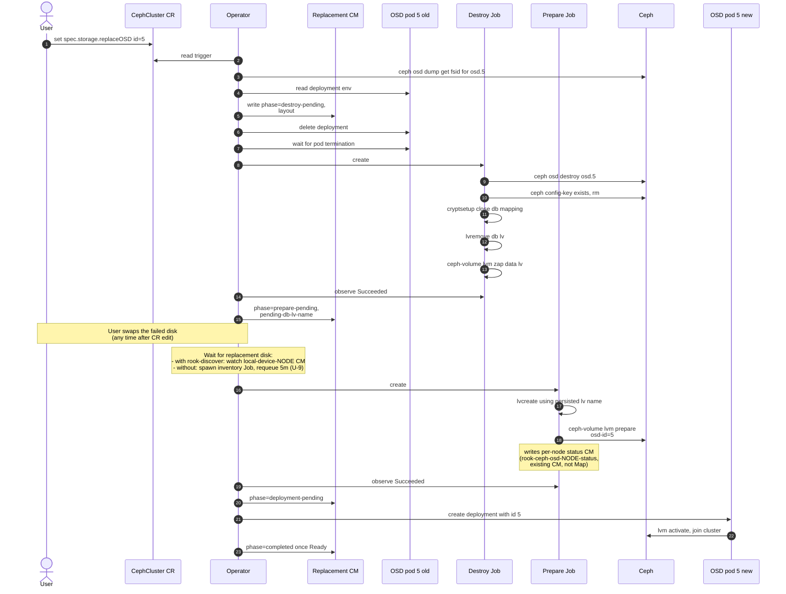

# Design: Single OSD replacement with a shared metadata device

Issue: [rook/rook#13240](https://github.com/rook/rook/issues/13240)

## Problem

When an OSD's data and metadata live on different devices (per `spec.storage` `metadataDevice` config in the CephCluster CR), Rook today cannot replace a single failed OSD on its own. The user must either re-provision all OSDs sharing the same metadata device or run a multi-step manual workflow including scaling down the operator to zero. Both are slow and error-prone.

This design proposes a workflow to replace a single failed OSD in place — preserving its OSD ID — without affecting other OSDs sharing the same metadata device.

## Notation

- **User** - the human cluster admin who edits the CR. 
- **Operator** - the Rook controller process.
- **Data LV / data device** - the LV (or block device) holding an OSD's bulk data. One per OSD.
- **DB LV / metadata device** - the LV holding the OSD's rocksdb (`block.db`). One per OSD; multiple OSDs can share the same metadata device.

## User story

A disk corresponding to `osd.5` fails on a node where five HDD OSDs share one NVMe metadata device. The user marks `osd.5` for replacement on the CephCluster CR, swaps the physical disk in the chassis, and walks away. Rook destroys `osd.5`, frees its DB LV slot on the NVMe, provisions a new OSD on the replacement disk *with the same OSD ID 5*, and the other four OSDs on the same NVMe stay up the whole time.

## Constraints

Two facts about the environment shape every later choice in this design.

### Rook cannot tell a replacement disk from a new disk

When a fresh empty disk appears on a node, Rook gets no signal — from the kernel, from Ceph, from the disk itself — that says "I am the replacement for the OSD that just failed". The next CephCluster reconcile calls `startProvisioningOverNodes`, which spawns a prepare-job on each node. With `useAllDevices: true` (or a matching `deviceFilter`) the prepare-job auto-provisions a new OSD on the empty disk with a fresh ID; orphan resources for the failed OSD stay leaked.

This is why the user must declare the intent first via `spec.storage.replaceOSD`, *before* swapping the disk. Swapping the disk first is unsafe: any reconcile trigger between the swap and the CR edit will auto-provision the new disk with a fresh ID, defeating the flow.

### Storage device config must tolerate device swap

Rook lets users identify OSD data devices in three ways via `spec.storage`:

- `useAllDevices: true` — match any empty disk on the node.
- `deviceFilter: "<regex>"` — match disks whose `lsblk` properties match a regex (e.g., model, vendor).
- `nodes[].devices[].name: "<value>"` — match a specific path or name. The value can be a kernel name (`vdb`), a raw path (`/dev/sdc`), or a udev symlink path (`/dev/disk/by-path/...`, `/dev/disk/by-id/...`).

Each shape interacts differently with the Linux device-naming interfaces. The relevant guarantees:

- **Kernel names** (`vdb`, `sdc`, `/dev/sdc`) are not persistent across reboot, hot-swap, or HBA topology changes — SCSI/SATA enumeration is allocation-order based. See [Arch Wiki: Persistent block device naming](https://wiki.archlinux.org/title/Persistent_block_device_naming). [Ceph's own admin docs](https://docs.ceph.com/en/latest/rados/operations/add-or-rm-osds/#replacing-an-osd) use raw paths like `/dev/sdX` in their replacement examples, but the manual procedure can be re-validated at each step; an automated flow has fewer recovery options if the name has shifted.
- **`/dev/disk/by-path/...`** is built by udev rules from the sysfs port path. Same physical port → same `by-path` symlink (guaranteed). Different port → different `by-path`. So `by-path` survives a *same-slot* swap and breaks on a different-slot swap. Same-slot replacement is **not** a Rook or Ceph requirement: [Ceph upstream is silent on slot semantics](https://docs.ceph.com/en/latest/rados/operations/add-or-rm-osds/#replacing-an-osd); cephadm's `ceph orch device replace` is slot-agnostic.
- **`/dev/disk/by-id/...`** identifies the disk by hardware serial / WWN. Different disk → different `by-id`. Useless for replacement (the new disk *is* a different disk).
- **`/dev/disk/by-uuid/...`** identifies the filesystem/LV UUID. The replacement disk has a fresh UUID after provisioning. Same as `by-id`: useless here.

The shapes that tolerate any swap (same-slot or different-slot, any new disk) are `useAllDevices` and `deviceFilter` — both slot-and-disk-agnostic. `by-path` tolerates only same-slot replacement. Kernel names tolerate only the lucky case where the kernel happens to assign the same name.

**Tension with per-device CR config.** Some legitimate Rook layouts *require* exact `name:` entries — notably per-device `config.metadataDevice` (`Documentation/CRDs/Cluster/ceph-cluster-crd.md:393-394`), which attaches a metadata-device pairing to a specific data device entry. There's no way to express "this data device pairs with that NVMe" via `useAllDevices` alone. Strictly rejecting all exact references in this flow would block these layouts. See "Multiple metadata devices on one node" in Out of scope.

The replacement flow's pre-check #5 enforces a validation policy — the default and configurability are open question U-10. The intent is that users with simple homogeneous-node setups (`useAllDevices` / `deviceFilter`) work transparently, while users on slot-stable hardware or per-device config can opt into a more permissive policy.

## Current gaps

Rook already has a same-device replacement flow for OSDs whose data and DB share one device. The user triggers it via `spec.storage.migration.confirmation` in the CR; the operator passes the OSD ID to the prepare-job pod via the `ROOK_REPLACE_OSD` env var, and the prepare-job calls `ceph-volume raw prepare --osd-id` to provision a new OSD reusing the destroyed slot. For the shared-metadata case, five gaps prevent that flow from working end-to-end:

1. The replacement code path runs only in raw mode; LVM mode (required when a metadata device is configured) does not pass `--osd-id`, so the new OSD gets a new ID. (`initializeDevicesLVMMode`, [volume.go#L584-L844](https://github.com/rook/rook/blob/59ce48ae88e5ea59df44249b41a887af96a2806c/pkg/daemon/ceph/osd/volume.go#L584-L844))
2. Destroy zaps only the data LV; the DB LV on the shared metadata disk stays as an orphan. (`DestroyOSD`, [remove.go#L244-L292](https://github.com/rook/rook/blob/59ce48ae88e5ea59df44249b41a887af96a2806c/pkg/daemon/ceph/osd/remove.go#L244-L292))
3. The dm-crypt key in Ceph's config-key store is never removed, leading to LUKS collisions on retry of encrypted OSDs. (same `DestroyOSD` body — [remove.go#L244-L292](https://github.com/rook/rook/blob/59ce48ae88e5ea59df44249b41a887af96a2806c/pkg/daemon/ceph/osd/remove.go#L244-L292))
4. Once any OSD is provisioned on a shared metadata disk, Rook's inventory excludes that disk from future discovery (the "has children" filter). (`DiscoverDevicesWithFilter`, [disk.go#L97-L111](https://github.com/rook/rook/blob/59ce48ae88e5ea59df44249b41a887af96a2806c/pkg/clusterd/disk.go#L97-L111))
5. `OSDInfo.MetadataPath` is never populated for LVM-mode OSDs (the parser walks only `[block]` entries from `ceph-volume lvm list`), so the operator has no record of which metadata disk a destroyed OSD used. (`GetCephVolumeLVMOSDs`, [volume.go#L1104-L1177](https://github.com/rook/rook/blob/59ce48ae88e5ea59df44249b41a887af96a2806c/pkg/daemon/ceph/osd/volume.go#L1104-L1177))

## Proposed flow

This flow orchestrates [Ceph's documented OSD-replacement procedure](https://docs.ceph.com/en/latest/rados/operations/add-or-rm-osds/#replacing-an-osd) (`safe-to-destroy` → `osd destroy` → `lvm zap` → `lvm prepare --osd-id` → `lvm activate`) across short-lived Kubernetes Jobs, with operator-side state for crash recovery and Rook-specific gates around auto-provisioning. cephadm — Ceph's container-orchestrator analogue — preserves OSD IDs by default ([cephadm OSD service docs](https://docs.ceph.com/en/latest/cephadm/services/osd/#replacing-an-osd)); this design follows the same convention.

Two short-lived jobs — Destroy Job and Prepare Job — separated by the wait for the replacement disk. The operator owns all phase transitions and the wait; jobs are workers observed via `Job.status.succeeded`. 

>Why split into two jobs (vs. one job like the existing OSD migration flow)?
>- The disk-swap wait can take hours. Keeping a job pod alive across it is wasteful — the operator, not a job, should own the wait.
>- Destroy and prepare are independently retryable. If destroy succeeds and prepare fails, only prepare re-runs.

One OSD per reconcile cycle, gated by `safe-to-destroy <id>`.

### Sequence



### ConfigMaps and phase state

Two ConfigMaps appear in the flow:

1. **`osd-replacement-state`** — new in this design. Per-cluster, single-key. Lives in the operator namespace, owner-ref'd to the CephCluster (same lifecycle pattern as `osd-migration-config` at [`migrate.go#L42-L44`](https://github.com/rook/rook/blob/59ce48ae88e5ea59df44249b41a887af96a2806c/pkg/operator/ceph/cluster/osd/migrate.go)). Created when validation persists the trigger (Step 3); transitioned through phases by the operator; deleted (or its single entry overwritten) when the user moves on to a different OSD or clears `replaceOSD`.
2. **`rook-ceph-osd-<node>-status`** — existing per-node prepare-job output CM. The Prepare Job (Step 7) writes the new OSD's layout here; the existing reconcile path at [`status.go#L324`](https://github.com/rook/rook/blob/59ce48ae88e5ea59df44249b41a887af96a2806c/pkg/operator/ceph/cluster/osd/status.go#L324) consumes it to create the daemon Deployment. This design does not change its shape or lifecycle.

The replacement CM holds at most one entry per cluster, keyed by `osd-id`. Re-trigger of the same OSD (with a fresh `confirmation` string — see "Trigger already consumed" in Step 1 pre-checks) overwrites the entry's confirmation and resets phase. Trigger of a different OSD ID while one is in flight does not collide: the "no other replacement in progress" pre-check blocks it until the in-flight one completes. Collision on re-trigger is structurally impossible.

**Phase state machine:**

```
                       ┌────────── (timeout) ──────────┐
                       ▼                                │
(no entry) → destroy-pending → prepare-pending → deployment-pending → completed → (GC'd)
                                       ▲
                                       └── (cancel via remove replaceOSD; only honored in waiting-for-disk substate)
```

- **destroy-pending**: operator deleted the OSD deployment, Destroy Job is in flight or about to start.
- **prepare-pending**: Destroy Job succeeded, two substates — *waiting for disk* (no Prepare Job yet, only `pending-db-lv-name` reserved) and *Job running* (`lvcreate` and `ceph-volume lvm prepare` in flight).
- **deployment-pending**: Prepare Job succeeded, operator is creating the new daemon Deployment.
- **completed**: new daemon Ready in Ceph; entry kept until the next spec change for audit, then GC'd.

**Full example of the record:**

```yaml
osd-id: 5
node: node-1                     # required for Destroy/Prepare Job NodeSelector; survives Step 4's deployment delete
phase: destroy-pending           # destroy-pending → prepare-pending → deployment-pending → completed
data-lv: /dev/ceph-data-vg-5/osd-block-aaa...
db-lv: /dev/ceph-metadata-vg-1/osd-db-bbb...
metadata-source-device: nvme0n1
metadata-vg: ceph-metadata-vg-1
crush-device-class: hdd
database-size-mb: 4096
encrypted: true
osd-fsid: 8b7e6c19-...
pending-db-lv-name:              # populated when phase advances to prepare-pending
expected-disk-pending: false     # set true while phase=prepare-pending; gates auto-provision skip per required change 6
confirmation:                    # value from spec at trigger time; populated on phase=completed
new-fsid:                        # populated on phase=completed; for audit/diagnostics only, never for re-arming
completed-at:                    # populated on phase=completed
```

**Reconcile order on every cycle:** the OSD reconcile entry-point ([`Cluster.Start` in `osd.go#L255`](https://github.com/rook/rook/blob/59ce48ae88e5ea59df44249b41a887af96a2806c/pkg/operator/ceph/cluster/osd/osd.go#L255)) gains a new first-step subroutine that runs **before** the existing `updateAndCreateOSDs` path:

1. **GC** stale entries (rules in "Long-term state cleanup" below).
2. **Drive in-flight** entries forward via the state machine.
3. **Validate** any newly-set `spec.replaceOSD` and persist the entry on success.

Only after this returns does `updateAndCreateOSDs` run. This ordering prevents auto-provisioning from racing a fresh trigger when the operator restarts after a CR edit (the "operator-down race"): a replacement disk inserted during operator downtime is held off via the `expected-disk-pending` flag in the record until the replacement Prepare Job claims it.

### Step-by-step

The walk-through uses a concrete example:

```
OSD ID:           5
metadata VG:      ceph-metadata-vg-1
data device:      /dev/sdc → /dev/sdh after swap
databaseSizeMB:   4096
crush-device-class: hdd
encryption:       on
```

#### Step 1 — User sets `replaceOSD` on the CR (diagram arrows 1-2)

Typical trigger is a failed disk, but failure is not required — `safe-to-destroy` is the only gate, so the flow also covers proactive replacement of a healthy OSD.

```yaml
spec:
  storage:
    useAllNodes: true
    useAllDevices: true     # or use deviceFilter; an exact `name:` entry on osd.5's device would be rejected by pre-check #5
    replaceOSD:
      id: 5
      confirmation: "yes-really-replace-osd-5"
```

`confirmation` is a free-form string the user picks. It does not encode the OSD ID; the example just embeds `5` for human clarity. To re-trigger replacement of the *same* OSD ID after a successful run, the user changes `confirmation` to a new string (e.g., `"yes-really-replace-osd-5-take-2"`). Same UX as `spec.storage.migration.confirmation` today.

The user can swap the disk at any point after the edit succeeds — before, during, or after destroy. Step 5 tolerates a missing data PV. Only ordering rule: edit the CR first, then swap.

If multiple OSDs need replacement, the user sets `replaceOSD`, waits for completion, then sets it again with a different ID. `replaceOSD` is an object, not a list — same shape as `spec.storage.migration` for consistency. Parallelism is open question U-2.

**Pre-checks.** Each check runs on each reconcile when `spec.replaceOSD` is set. Possible outcomes per check:

- **Continue** — advance to the next check.
- **Short-circuit** — no action this reconcile (idempotency / in-flight).
- **Terminal-reject** — set `ReplacementRejected` condition + Kubernetes Event via `opcontroller.UpdateCondition` ([`conditions.go#L35`](https://github.com/rook/rook/blob/59ce48ae88e5ea59df44249b41a887af96a2806c/pkg/operator/ceph/controller/conditions.go#L35)); user must change spec to recover.
- **Transient-wait** — set a `WaitingFor*` condition; re-evaluate next reconcile, no spec change needed.

1. **Trigger already consumed.** Replacement CM has a `phase: completed` entry whose `(osd-id, confirmation)` match the spec. Match is on `(id, confirmation)` only — *not* `new-fsid`. (Re-using fsid would silently destroy an OSD that the user manually purged and recreated outside this flow.) → **Short-circuit.**
2. **Trigger already in flight.** Replacement CM has an in-progress entry (any phase before `completed`) whose `(osd-id, confirmation)` match the spec. → **Short-circuit**; the state machine drives the existing entry forward instead of re-validating.
3. **OSD 5 exists** in the OSD map. → **Terminal-reject** if absent (wrong ID, user edits spec).
4. **`safe-to-destroy 5`** returns OK. The only safety gate; `down`/`out` alone is not sufficient because data may not have replicated to peers. → **Transient-wait** (`WaitingForSafeToDestroy`) while peers backfill — verified on Ceph v19.2.2 in [`osd-rep-log.md`](osd-rep-log.md) §1.2 that `safe-to-destroy` returns EBUSY in this state. Bounded escalation timeout (default 1h; see U-4) flips to terminal `SafeToDestroyTimeout` — backfill stuck for 1h+ warrants paging.
5. **Failed OSD's CR matching is swap-tolerant** — evaluated per the validation policy (default `strict`; see U-10 for the policy and configurability discussion):
   - **`strict`** — reject if the failed OSD is matched by *any* exact `name:` entry in `spec.storage.nodes[*].devices[*]` on the OSD's node. The CR must match the failed OSD via `useAllDevices` or `deviceFilter`. Implementation: look up the failed OSD's data device from its deployment; scan the CR's `name:` entries on that node; reject if any resolves to that device.
   - **`accept-by-path`** — reject only kernel-name-style references (`vdb`, `sdc`, `/dev/sdc`); accept `/dev/disk/by-path/...` references. The user takes responsibility for performing same-slot replacement.
   - **`lenient`** — accept any CR shape. Mismatches surface as a Step 6 stall (`ReplacementDiskMissing` after the U-4 timeout).

   → **Terminal-reject** if the chosen policy rejects (spec must be made swap-tolerant before this flow can run).
6. **No unexpected OSD on the node** — catches the auto-provisioning race (a replacement disk was inserted before this trigger fired and Rook auto-provisioned a new OSD on it). Compare:
   - `ceph osd metadata` filtered by hostname (already used by [`clusterdisruption/osd.go#L450`](https://github.com/rook/rook/blob/59ce48ae88e5ea59df44249b41a887af96a2806c/pkg/operator/ceph/disruption/clusterdisruption/osd.go#L450)),
   - vs. OSD Deployments owned by Rook on this node (`app=rook-ceph-osd`, filtered by `NodeSelector[k8sutil.LabelHostname()]`).

   Any OSD Ceph reports with no matching Rook Deployment is unexpected. → **Terminal-reject** (user removes the orphan before re-triggering).
7. **No other replacement is in progress** (different `osd-id`). → **Transient-wait** (`WaitingForInFlightReplacement`); self-clearing once the in-flight entry reaches `completed` and is GC'd.

#### Step 2 — Capture layout

The operator captures the OSD's layout from sources that do not require the failed data device.

| Field                     | Source                                                                                       | Example                               |
| ------------------------- | -------------------------------------------------------------------------------------------- | ------------------------------------- |
| `osd-fsid`                | `ceph osd dump --format json`                                                                | `8b7e6c19-...`                        |
| `osd-id`                  | OSD pod label `ceph-osd-id`                                                                  | `5`                                   |
| `node`                    | OSD deployment `Spec.Template.Spec.NodeSelector[k8sutil.LabelHostname()]`                    | `node-1`                              |
| `data-lv`                 | OSD deployment env `ROOK_BLOCK_PATH`                                                         | `/dev/ceph-data-vg-5/osd-block-aaa…`  |
| `db-lv`                   | OSD deployment env `ROOK_METADATA_DEVICE` ¹                                                  | `/dev/ceph-metadata-vg-1/osd-db-bbb…` |
| `metadata-source-device`  | OSD deployment env `ROOK_METADATA_SOURCE_DEVICE` ²                                           | `nvme0n1`                             |
| `crush-device-class`      | OSD deployment env `ROOK_OSD_CRUSH_DEVICE_CLASS`                                             | `hdd`                                 |
| `metadata-vg`             | `pvs --noheadings -o vg_name <metadata-source-device>`                                       | `ceph-metadata-vg-1`                  |
| `database-size-mb`        | `lvs --noheadings -o lv_size <db-lv>` ÷ 1MiB ³                                               | `4096`                                |
| `encrypted`               | LV tag `ceph.encrypted` on `<db-lv>` ³                                                       | `true`                                |

¹ Existing env, but populated only for raw-mode OSDs today. Required change #2 fixes the parser to populate it for LVM-mode OSDs as well.
² New env, added by required change #5. For OSDs whose deployment predates required change #5, this env is missing — see fallback below.
³ Read from the OSD's own DB LV (the metadata VG is by construction intact at Step 2: failure is on the data device, and Step 5's `lvremove` hasn't run yet). Live spec is *not* the source: a user-edited `spec.storage.config.databaseSizeMB` between original provisioning and replacement would size the new DB LV inconsistently with siblings, and `encrypted` is immutable per-OSD so a CR-level toggle cannot retroactively change it. If the OSD's own LV is missing for any reason, fall back to a surviving sibling LV in the same VG.

**Fallback when `ROOK_METADATA_*` env vars are missing.** For deployments predating required change #5, the operator captures `db-lv` and `metadata-source-device` from a one-shot `ceph-volume lvm list --format json` Job on the OSD's node, via Rook's existing `cmdreporter` ([`cmdreporter.go`](https://github.com/rook/rook/blob/59ce48ae88e5ea59df44249b41a887af96a2806c/pkg/operator/k8sutil/cmdreporter/cmdreporter.go) — same pattern used today for network/version detection). The pod profile mirrors the prepare-job's (privileged + `/dev`, `/run/lvm`, `/run/udev` mounts, NodeSelector pinned to the failed OSD's node). Output's `[db]` entry: `devices` field is the metadata source device, `tags.ceph.db_device` is the DB LV path. Correct even when the data device has physically failed — `ceph-volume lvm list` reads from VG metadata replicated on the metadata-VG's surviving PV. Verified empirically against the Lima cluster's output for a healthy shared-metadata OSD. If the Job fails or returns no entry for the target OSD, validation rejects with `LayoutCaptureFailed` (terminal — user investigates, e.g. metadata disk also failed → out of scope).

#### Step 3 — Persist the replacement record (diagram arrow 5)

Operator writes the replacement CM with `phase: destroy-pending` and the layout captured in Step 2. Field schema and lifecycle: see "ConfigMaps and phase state" above. From this point on, the record is the source of truth for retry — a crashed operator restarts and resumes from the persisted phase.

#### Step 4 — Delete OSD deployment, wait for pod termination, create Destroy Job (diagram arrows 6-8)

Operator calls `k8sutil.DeleteDeployment` ([`deployment.go#L388`](https://github.com/rook/rook/blob/59ce48ae88e5ea59df44249b41a887af96a2806c/pkg/operator/k8sutil/deployment.go#L388)) on `rook-ceph-osd-5` — this deletes the deployment and polls until the pod is gone. Then it creates the Destroy Job populated with the layout. The pod-gone wait is required: while the daemon runs, it holds the DB-side LUKS mapping open and Step 5's `cryptsetup close` would fail.

If the wait times out (transiently NotReady node), the operator sets `WaitingForOSDPodTermination` and re-checks on the next reconcile. The operator does NOT force-delete: a stuck pod on a NotReady node may still be holding the LUKS mapping when kubelet recovers; force-delete would diverge K8s and host state.

**Host permanently down — out of scope.** If the host is genuinely gone (powered off, hardware failure), this flow cannot proceed: the Destroy Job's NodeSelector pins it to that node, and even a force-deleted OSD pod doesn't bring the kubelet back. The Destroy Job stays Pending. Replacement of an OSD on a permanently-dead host is a different workflow (node decommission, then OSD-out-and-purge, then re-add the host with fresh OSDs) — handled by existing Rook flows, not this design. The operator surfaces this case via a `ReplacementHostUnavailable` event after both the pod-termination wait and a Destroy-Job-Pending wait expire.

#### Step 5 — Destroy Job (diagram arrows 9-13)

Operator-owned phase stays `destroy-pending` until the Job reports `Succeeded`. The Job's container invokes `DestroyOSD` ([`remove.go#L244-L292`](https://github.com/rook/rook/blob/59ce48ae88e5ea59df44249b41a887af96a2806c/pkg/daemon/ceph/osd/remove.go#L244-L292)) — the same Go function the existing migration flow already calls from [`cmd/rook/ceph/osd.go#L272`](https://github.com/rook/rook/blob/59ce48ae88e5ea59df44249b41a887af96a2806c/cmd/rook/ceph/osd.go). The bash below specifies the behavior `DestroyOSD` must implement after required change #3 lands (today it only does the first step and a partial last step). Each operation is idempotent on retry; no standalone shell script ships in the operator.

```bash
# 5.1 Destroy in Ceph (preserves OSD ID 5 for reuse).
ceph osd destroy osd.5 --yes-i-really-mean-it    # idempotent: already-destroyed → succeeds

# 5.2 Remove dm-crypt key. On Ceph v19.2.2 (verified) `ceph osd destroy` already
#     cleans the key and `config-key rm` on a missing key is itself idempotent
#     (returns 0), so this whole step is typically a no-op. The explicit `exists`
#     precheck is defensive: keeps the chain safe on older Ceph versions where
#     rm's exit-code behavior on missing key has not been measured.
ceph config-key exists dm-crypt/osd/8b7e6c19-.../luks \
  && ceph config-key rm dm-crypt/osd/8b7e6c19-.../luks

# 5.3 Close DB-side LUKS mapping. The cryptsetup arg is the device-mapper name,
#     not the LUKS UUID. Enumerate children with TYPE explicit and pick the crypt
#     child specifically — robust against future LV-stack shapes (snapshots,
#     thin pools) that could produce additional non-crypt children.
#     Precheck pattern (no || true): if the mapping is gone, do nothing; if it's
#     present and close fails (busy device), the error bubbles up and the state
#     machine retries.
DB_MAPPING=$(lsblk -nlo NAME,TYPE /dev/ceph-metadata-vg-1/osd-db-bbb... | awk '$2=="crypt"{print $1; exit}')
[ -n "$DB_MAPPING" ] && cryptsetup status "$DB_MAPPING" >/dev/null 2>&1 \
  && cryptsetup close "$DB_MAPPING"

# 5.4 Free the DB slot. Precheck (no || true): real lvremove failures bubble up
#     and the state machine retries.
lvs /dev/ceph-metadata-vg-1/osd-db-bbb... >/dev/null 2>&1 \
  && lvremove -f /dev/ceph-metadata-vg-1/osd-db-bbb...

# 5.5 Zap the data LV (also handles the data-side dm-crypt mapping).
#     Precheck mirrors 5.4: skip if the LV no longer exists. Real failures
#     (zap returns non-zero with the LV present — partial wipe, busy device)
#     bubble up via Job exit and are retried by the state machine.
lvs /dev/ceph-data-vg-5/osd-block-aaa... >/dev/null 2>&1 \
  && ceph-volume lvm zap /dev/ceph-data-vg-5/osd-block-aaa... --destroy
```

After Job completes successfully, operator advances record to `phase: prepare-pending` and does Step 6.

#### Step 6 — Pre-allocate DB LV name and wait for replacement disk (diagram arrow 14)

Operator generates a fresh uuid for the new DB LV and persists it in the record (`pending-db-lv-name`) before Step 7.1's `lvcreate` runs. On retry, the same name is reused — no orphan DB LVs from retries.

The operator then waits for the replacement disk to appear on the node. The operator pod has no `/dev` access; the existing prepare-job spawn (which would otherwise inventory the node) is *suppressed* for this node by change #6's `expected-disk-pending` flag — without that suppression, it would auto-provision the new disk with a fresh ID. So inventory needs a path that doesn't provision:

- **If `rook-discover` is enabled:** operator watches the per-node `local-device-<node>` CM. Reconcile is triggered on CM update via the hotplug-CM watch (`controller.go:279`). Latency: seconds (rook-discover's udev monitor) up to its `ROOK_DISCOVER_DEVICES_INTERVAL` (default 60 min) for the polling fallback.
- **If `rook-discover` is disabled** (the operator's default): the operator returns `Result{RequeueAfter: 5m}` from each reconcile while in `prepare-pending` waiting-for-disk, and spawns a one-shot `ceph-volume inventory --format json` Job via the existing `cmdreporter` pattern (same one used for Step 2's older-OSD fallback). The Job runs node-side, writes its output to a result CM, and the operator reads it on the next reconcile. Latency ≈ `RequeueAfter` interval (5m) + Job pod startup.

The 5-min `RequeueAfter` interval is a working default, not a load-bearing decision — see open question U-9. The wait blocks only this OSD's flow; other OSD reconcile work proceeds normally.

While waiting, the operator sets `WaitingForReplacementDisk` on the CephCluster status. Default timeout 24h (U-4). On timeout the condition flips to `ReplacementDiskMissing` and polling stops.

**Recovery from timeout — two paths:**

1. **Insert the disk and bump `confirmation`** in the CR. Pre-checks re-run and the wait resumes. `pending-db-lv-name` is preserved across the cycle (Step 7.1's precheck handles the LV being either already-allocated or absent).
2. **Abandon** by removing `spec.storage.replaceOSD`. Per "Handling cancellation", removing the field in this substate is honored: the operator GCs the record; `osd.5` stays `destroyed` in the OSD map; user runs `ceph osd purge 5` manually if they want to remove the slot.

#### Step 7 — Prepare Job (diagram arrows 15-17)

Phase `prepare-pending`. The Job receives the record (including `pending-db-lv-name`) as env vars.

```bash
# 7.1 Pre-allocate the DB LV using the persisted name. Idempotent on retry —
#     if the LV already exists from a previous attempt, lvcreate is skipped.
lvs /dev/ceph-metadata-vg-1/osd-db-12cf3a91-... >/dev/null 2>&1 \
  || lvcreate -L 4096M -n osd-db-12cf3a91-... ceph-metadata-vg-1 --wipesignatures y

# 7.2 Provision the new OSD with the preserved ID.
#     --dmcrypt is conditional on the record's `encrypted` field;
#     omitted for unencrypted OSDs.
ceph-volume lvm prepare \
  --bluestore [--dmcrypt] \
  --osd-id 5 \
  --data /dev/sdh \
  --block.db /dev/ceph-metadata-vg-1/osd-db-12cf3a91-... \
  --crush-device-class hdd
```

(The uuid in `osd-db-12cf3a91-...` is the operator-generated uuid from Step 6, not the OSD's fsid. ceph-volume assigns its own fsid during prepare and writes `ceph.osd_fsid` / `ceph.db_uuid` LV tags.)

Prepare writes the new OSD's layout (data path, DB path, metadata source device) to the per-node status CM that Rook already uses to drive daemon creation. After the Job succeeds, operator advances to `phase: deployment-pending`.

#### Step 8 — Operator creates the new OSD deployment (diagram arrows 18-20)

Reuses the existing reconcile path: `createOSDsForStatusMap` ([`status.go#L324`](https://github.com/rook/rook/blob/59ce48ae88e5ea59df44249b41a887af96a2806c/pkg/operator/ceph/cluster/osd/status.go#L324)) sees the per-node status CM the Prepare Job wrote and creates the daemon Deployment from it. The new deployment carries `ROOK_METADATA_DEVICE` and `ROOK_METADATA_SOURCE_DEVICE` (no fallback `lvm list` job needed for a future replacement of this same OSD).

#### Step 9 — Mark replacement complete (diagram arrow 21)

Operator polls `ceph osd metadata <id>`. Ready = a record returned with a non-empty fsid, `id` matching, and `hostname` matching the record's `node`. This single check covers both the up-in-Ceph signal and the new-fsid capture; `ceph osd metadata` is the source of truth, not K8s readiness-probe semantics.

On Ready, the operator transitions the replacement CM entry from `phase: deployment-pending` to `phase: completed` and records `confirmation`, `new-fsid`, and `completed-at`. The entry is kept (not deleted) so the next reconcile sees the consumed trigger and short-circuits via pre-check #1. Same UX as `spec.storage.migration` today: the operator never mutates `spec.replaceOSD`; the user clears the field manually when they want to move on.

If the new OSD does not reach Ready, the record stays in its in-progress phase and the next reconcile resumes from there.

### Idempotency / resume table

| Phase on disk                 | Recovery on next reconcile                                                                                                |
| ----------------------------- | ------------------------------------------------------------------------------------------------------------------------- |
| no record                     | Validation re-evaluated. No destructive action taken yet.                                                                 |
| `destroy-pending`, no Destroy Job exists | Operator re-issues the deployment delete (idempotent), waits for pod termination, creates the Destroy Job.    |
| `destroy-pending`, Destroy Job in flight | Operator awaits Job; on retry, recreates the Job. All commands in Step 5 are idempotent via precheck patterns. |
| `prepare-pending`, no Prepare Job yet | Operator polls for replacement disk; once visible, creates Prepare Job. Same `pending-db-lv-name` reused — no new orphan. |
| `prepare-pending`, Prepare Job in flight | Operator awaits Job; on retry, recreates it. `lvcreate` skipped if LV exists (7.1 precheck). `lvm prepare --osd-id` reuses the destroyed slot. |
| `deployment-pending`          | Existing per-node OSD-status reconcile creates the deployment.                                                            |
| `completed` (with consumed `confirmation` + `new-fsid`) | Flow done. Pre-check #1 (trigger already consumed) short-circuits subsequent reconciles until spec moves on; entry then GC'd per "Long-term state cleanup". |

> **⚠️ Destroy is irreversible.** Once pre-checks pass and the operator persists the record (Step 3), `osd.5` will be destroyed on this reconcile cycle. There is no "are you sure?" preview surfacing the captured layout. If the user typed the wrong OSD ID, the wrong OSD is gone — recovery is via the cancellation table below, not by retracting the trigger.

### Long-term state cleanup

GC runs first on every reconcile cycle (see "Reconcile order" in "ConfigMaps and phase state"). It only acts on entries that are **not** in an in-progress phase — for in-progress entries, the cancellation table below governs; GC does not touch them. This precedence prevents the user-changes-`replaceOSD.id`-mid-flight failure mode where mid-flight osd.5 would be destroyed, then GC'd, and stuck `destroyed` with no replacement.

GC rules:

| Spec state | Entry phase | Action |
|---|---|---|
| `replaceOSD` unset | `completed` | GC the completed entry. |
| `replaceOSD` unset | `prepare-pending` (waiting-for-disk only) | GC per cancellation table below. |
| `replaceOSD` unset | any other in-progress phase | No action; cancellation table governs. |
| `replaceOSD` set; `(id, confirmation)` differ from a `completed` entry | `completed` | GC; treat spec as fresh trigger. |
| `replaceOSD` set; mismatch on in-progress entry | any in-progress phase | No action; in-flight flow runs to completion, then GC fires next cycle. |

If the user changes `spec.replaceOSD.id` from 5 to 7 mid-flight: osd.5's flow runs to `completed`; on the next reconcile, GC removes the entry (its `osd-id=5` ≠ `spec.id=7`); pre-checks then run for osd.7. The spec change is effectively queued.

### Handling cancellation

`replaceOSD` is a mutable spec field. Removing it (or changing its ID mid-flight) is a "cancel" intent. The operator's response depends on phase:

| Phase | Cancel honored? | Effect |
|---|---|---|
| Pre-Step 3 (validation in flight, no record persisted yet) | Yes | Operator detects field is gone on next reconcile and stops. No state to unwind. |
| `destroy-pending` (Destroy Job in flight or about to start) | No | State record drives the flow forward. Destroy is short-lived; cancel is a no-op. |
| `prepare-pending`, waiting-for-disk (destroy complete; only `pending-db-lv-name` reserved, no `lvcreate` yet) | Yes | Operator GCs the record. `osd.5` stays `destroyed`; user runs `ceph osd purge 5` to remove the slot. **No orphan LV** (Step 6 only reserves the *name*; `lvcreate` runs in Step 7.1). **ID-preserving retry of osd.5 is unavailable after this cancel** — the original Deployment is gone (Step 4) and data + DB LVs are wiped (Step 5), so a future `replaceOSD: {id: 5}` trigger has no layout to capture in Step 2 and aborts with `LayoutCaptureFailed`. To re-add an OSD here, the user accepts a fresh ID. |
| `prepare-pending`, Prepare-Job-running (`lvcreate` may have run; `ceph-volume lvm prepare` may have started LUKS-formatting) | Only on Job failure | `ceph-volume lvm prepare` cannot be safely interrupted mid-call (partial dm-crypt + half-LUKS LV). Operator records the cancel intent and acts at Job exit: **on Job failure**, GC the record; the partially-allocated DB LV is left as a named orphan (`pending-db-lv-name`, easy to `lvremove`); osd.5 stays `destroyed`. **On Job success**, cancel is **not** honored — the new OSD is provisioned and joins the cluster. Removing the just-provisioned OSD is an `out`+`purge` workflow, not a rollback of this flow. |
| `deployment-pending` or `completed` | No | New OSD is already provisioned. The failed disk is replaced; cancel makes no sense. |

## Required code changes

Six changes. Items 1–3 and 5 are independent bug fixes worth landing regardless of this design; 4 and 6 are the new replacement flow.

| # | Fix                                                                                                                                                                                                                                                                                                                                              | File / lines                                       |
|---|----|----|
| 1 | Inventory must include shared metadata disks. See "Change #1 details" below. | [disk.go#L97-L111](https://github.com/rook/rook/blob/59ce48ae88e5ea59df44249b41a887af96a2806c/pkg/clusterd/disk.go#L97-L111) |
| 2 | Populate `OSDInfo.MetadataPath` and a new `OSDInfo.MetadataDevice` field for LVM-mode OSDs. The data is in `ceph-volume lvm list --format json`'s `[db]` section (LV `path` and source `devices`); the parser today walks only `[block]` entries. Forward-compat across rolling upgrade: `OSDInfo` uses standard `encoding/json` struct tags ([`osd.go#L113-L136`](https://github.com/rook/rook/blob/59ce48ae88e5ea59df44249b41a887af96a2806c/pkg/operator/ceph/cluster/osd/osd.go#L113-L136)) with no `DisallowUnknownFields` policy. An old operator decoding a new prepare-job's status CM silently drops the new field. A new operator decoding an old CM gets the zero value (empty string), and Step 2's `lvm list` fallback handles that case. | [volume.go#L1104-L1177](https://github.com/rook/rook/blob/59ce48ae88e5ea59df44249b41a887af96a2806c/pkg/daemon/ceph/osd/volume.go#L1104-L1177) |
| 3 | `DestroyOSD` cleans up the DB LV and the dm-crypt config-key. Add `ceph config-key exists+rm`, `cryptsetup close <mapping>`, and `lvremove -f <metadata-path>` (gated on `osdInfo.MetadataPath != ""`). Use precheck patterns (see Step 5) so genuine failures bubble up while already-clean state is tolerated. | [remove.go#L244-L292](https://github.com/rook/rook/blob/59ce48ae88e5ea59df44249b41a887af96a2806c/pkg/daemon/ceph/osd/remove.go#L244-L292) |
| 4 | Wire LVM-mode replacement through `lvm prepare --osd-id`. Today only raw mode at [volume.go#L548-L555](https://github.com/rook/rook/blob/59ce48ae88e5ea59df44249b41a887af96a2806c/pkg/daemon/ceph/osd/volume.go#L548-L555) adds `--osd-id`. When `a.replaceOSD != nil` *and* a metadata device is set, pre-allocate the DB LV with `lvcreate` (using the operator-persisted name) and call `lvm prepare --osd-id` instead of `lvm batch`. **Why this primitive over `purge` + `lvm batch`:** `lvm prepare --osd-id` claims a destroyed slot atomically (race-safe; no implicit reuse via mon's lowest-free allocation policy) and matches the existing same-device replacement flow at [volume.go#L548-L555](https://github.com/rook/rook/blob/59ce48ae88e5ea59df44249b41a887af96a2806c/pkg/daemon/ceph/osd/volume.go#L548-L555). Alternatives tested and discussed in [`osd-id-reuse-analysis.md`](osd-id-reuse-analysis.md) (U-7). | [volume.go](https://github.com/rook/rook/blob/59ce48ae88e5ea59df44249b41a887af96a2806c/pkg/daemon/ceph/osd/volume.go) |
| 5 | Pass `OSDInfo.MetadataDevice` to the OSD daemon deployment as a new `ROOK_METADATA_SOURCE_DEVICE` env var. Future destroys read the metadata layout from the deployment without a node-side rescan. | [spec.go#L950-L1010](https://github.com/rook/rook/blob/59ce48ae88e5ea59df44249b41a887af96a2806c/pkg/operator/ceph/cluster/osd/spec.go#L950-L1010) |
| 6 | New `osd-replacement-state` ConfigMap, Destroy/Prepare Job split, reconcile-order pinning. See "Change #6 details" below. | [migrate.go](https://github.com/rook/rook/blob/59ce48ae88e5ea59df44249b41a887af96a2806c/pkg/operator/ceph/cluster/osd/migrate.go), [osd.go](https://github.com/rook/rook/blob/59ce48ae88e5ea59df44249b41a887af96a2806c/pkg/operator/ceph/cluster/osd/osd.go) |

#### Change #1 details — inventory bypass for Ceph-tagged shared metadata disks

Today [`disk.go#L97-L111`](https://github.com/rook/rook/blob/59ce48ae88e5ea59df44249b41a887af96a2806c/pkg/clusterd/disk.go#L97-L111) calls `sys.ListDevicesChild` (lsblk-based) and skips any disk where `len(children) > 1`. Once any OSD's DB LV lands on a shared metadata disk, this filter incorrectly excludes the disk from inventory, so future OSDs can't get DB LV slots on it.

**Algorithm:** when `len(children) > 1`, run `lvs --noheadings -o lv_name,vg_name,lv_tags` filtered to those children and check for the `ceph.cluster_fsid=<this-cluster-fsid>` LV tag — the same authoritative signal Rook already uses elsewhere ([volume.go#L85-L90](https://github.com/rook/rook/blob/59ce48ae88e5ea59df44249b41a887af96a2806c/pkg/daemon/ceph/osd/volume.go#L85-L90), [volume.go#L1130-L1135](https://github.com/rook/rook/blob/59ce48ae88e5ea59df44249b41a887af96a2806c/pkg/daemon/ceph/osd/volume.go#L1130-L1135)). If any child carries this cluster's FSID, treat the disk as available.

**Edge cases:**

- Mixed Ceph-tagged and untagged children → still bypass. Ceph LVs identify the disk as ours; untagged LVs would block c-v from using their PE anyway — no Rook-side issue.
- `lvs` returns error / EBUSY → conservative: fall back to today's skip behavior, log.
- No tagged children, `len > 1` → skip (today's behavior; foreign LVM or partition table).

VG/LV name patterns are convention, not guarantee; tags are. Cost: one `lvs` per filtered disk (only when `len > 1`); Rook already shells out to `lvs` / `pvs` during inventory.

#### Change #6 details — replacement state machine and reconcile-order pinning

Adds a new ConfigMap `osd-replacement-state` (separate from the existing `osd-migration-config` to avoid breaking that flow's int-keyed reader). Schema, lifecycle, and phase state machine: see "ConfigMaps and phase state" above. Persists `pending-db-lv-name` so Prepare Job retry doesn't orphan DB LVs. Splits the single prepare-job model into a Destroy Job + Prepare Job (motivated by the disk-swap wait — see "Proposed flow" intro).

**Reconcile-order pinning.** The OSD reconcile entry-point [`Cluster.Start`](https://github.com/rook/rook/blob/59ce48ae88e5ea59df44249b41a887af96a2806c/pkg/operator/ceph/cluster/osd/osd.go#L255) gets a new first-step subroutine that runs **before** the existing `updateAndCreateOSDs` path. The subroutine reads `spec.replaceOSD` and the replacement CM, runs GC → drives in-flight entries → validates new spec. Only then does `updateAndCreateOSDs` run.

The `expected-disk-pending: true` flag on the record (set while phase=`prepare-pending`) is the wire that prevents the auto-provisioning race: in `updateAndCreateOSDs`, the prepare-job spawn for a node with an `expected-disk-pending` entry is skipped — the empty replacement disk on that node is held off until the replacement Prepare Job claims it.

**Implementation pattern reuse:**

- Replacement CM lifecycle: same shape as `osd-migration-config` ([`migrate.go#L42-L44`](https://github.com/rook/rook/blob/59ce48ae88e5ea59df44249b41a887af96a2806c/pkg/operator/ceph/cluster/osd/migrate.go) — per-cluster, owner-ref'd to CephCluster, written via `k8sutil.CreateOrUpdateConfigMap`).
- Destroy Job pod profile: clones `c.provisionPodTemplateSpec` ([`provision_spec.go`](https://github.com/rook/rook/blob/59ce48ae88e5ea59df44249b41a887af96a2806c/pkg/operator/ceph/cluster/osd/provision_spec.go)) — same image, mounts, NodeSelector, RBAC.
- Conditions: set via `opcontroller.UpdateCondition` ([`conditions.go#L35`](https://github.com/rook/rook/blob/59ce48ae88e5ea59df44249b41a887af96a2806c/pkg/operator/ceph/controller/conditions.go#L35)).
- Bounded waits: `util.RetryWithTimeout` ([`retry.go#L57`](https://github.com/rook/rook/blob/59ce48ae88e5ea59df44249b41a887af96a2806c/pkg/util/retry.go#L57)) — already used by OSD migration.
- Pod-deletion wait: `k8sutil.DeleteDeployment` ([`deployment.go#L388`](https://github.com/rook/rook/blob/59ce48ae88e5ea59df44249b41a887af96a2806c/pkg/operator/k8sutil/deployment.go#L388)).
- Device-name validation (raw kernel-name rejection): extend `c.validateOSDSettings` ([`osd.go#L189`](https://github.com/rook/rook/blob/59ce48ae88e5ea59df44249b41a887af96a2806c/pkg/operator/ceph/cluster/osd/osd.go#L189)).

## Out of scope

### Multiple metadata devices on one node — works conditionally

Rook supports per-device metadata-device pairing (`Documentation/CRDs/Cluster/ceph-cluster-crd.md:393-394`):

```yaml
nodes:
- name: "node-1"
  devices:
  - name: "/dev/disk/by-path/...sda"
    config: { metadataDevice: "nvme0n1" }
  - name: "/dev/disk/by-path/...sdb"
    config: { metadataDevice: "nvme0n1" }
  - name: "/dev/disk/by-path/...sdc"
    config: { metadataDevice: "nvme1n1" }   # different metadata device on the same node
```

This layout requires exact `name:` references — the per-device `config:` block can only be attached to a specific device entry, not to a regex match. Replacement of a single OSD on this layout works structurally (each OSD's `metadata-source-device` is captured in its record at destroy time), with two caveats:

- **Validation policy must permit exact `name:`** entries — pre-check #5's `accept-by-path` or `lenient` mode (U-10). The default `strict` mode rejects this layout from the flow.
- **Same-slot replacement is required** — `by-path` resolves only when the new disk is in the original slot. Different-slot replacement stalls at Step 6.

The broader multi-metadata-device feature work (improvements to per-device `metadataDevice` UX, multi-NVMe-per-node layouts) was scoped separately by maintainers in [#13240](https://github.com/rook/rook/issues/13240) (tracked by `zhucan`). This design does not add new logic for that layout — it just doesn't actively forbid replacement on it under permissive validation.

### PVC-based OSD replacement — separate design

PVC-backed OSDs use a different code path (raw mode via `GetCephVolumeRawOSDs`, separate destroy plumbing). Issue #13240 is host-based storage; PVC replacement is a separate design.

### Permanently-down host — different workflow

If the OSD's host is gone, this flow cannot proceed (Step 4 / Step 5 require the host). Existing Rook node-decommission + OSD-purge flow handles it.

## Open questions

- **U-1 — Trigger surface.** *Decision: CR field `spec.storage.replaceOSD: {id, confirmation}`.* Matches the existing `spec.storage.migration` precedent (same UX — user clears the field manually after success), keeps trigger state in the CR, no separate object lifecycle. Alternatives below are listed for review discussion.
  - Annotation on the OSD deployment (`rook-ceph.io/replace-osd: "<confirmation>"`). Operator removes the annotation on success — no spec mutation. Rejected: the OSD's deployment is *deleted* in Step 4 before destroy, so an annotation on it disappears mid-flight (state would have to migrate to the state-record CM anyway).
  - New `CephOSDReplacement` CRD, one short-lived resource per intent, deleted on success. Rejected: new CRD is a heavier API surface for a feature that already fits the existing `spec.storage` shape; consistency with `spec.storage.migration` is more valuable than per-intent isolation.

- **U-2 — Parallelism.** Issue #13240 names multi-disk-failure on a chassis as a real operational pain — replacing 4 disks means 4 sequential edits, each blocking on disk-swap wait + reconcile cadence (potentially hours per OSD). This design stays serial because `safe-to-destroy` and `lvm prepare --osd-id` are both naturally one-at-a-time. Two follow-up paths that don't break the serial-execution invariant:
  - (a) **Widen the trigger surface to a list** (`replaceOSDs: [{id, confirmation}, ...]`) so the user records all intents upfront and the operator processes them in sequence without per-OSD CR edits. Cheap; removes most of the user-visible pain.
  - (b) **N-per-reconcile execution** via N parallel Destroy/Prepare Jobs each running `lvm prepare --osd-id <i>`, gated on cluster health and per-OSD `safe-to-destroy`. Bigger; needs careful PG-safety rules. The obvious-looking `lvm batch --osd-ids X Y Z --prepare` primitive does **not** work for shared-metadata setups (rejects the metadata VG outright — see U-7 / [`osd-id-reuse-analysis.md`](osd-id-reuse-analysis.md) Path E); (b) must use N parallel `lvm prepare --osd-id` invocations, not a single `lvm batch` call.

- **U-3 — Auto-replace mode.** This design requires explicit user input. A follow-up could add an opt-in "auto-replace on disk swap" mode (e.g. `spec.storage.autoReplaceOSDs: true`): when an OSD is `down_in` and a new empty disk appears in its CR-managed slot, the operator runs the same flow without an explicit trigger. Extra checks (cluster health, PG state) would gate it. Deferred.

- **U-4 — Configurability of the two timeouts.** Two distinct timers, different physical phenomena, different SLAs:
  - `replacement-disk` wait (default 24h): time to swap a failed disk; covers walk-away-and-handle-tomorrow workflows.
  - `safe-to-destroy` retry timeout (default 1h): time backfill is allowed to take after the user triggers replacement on a still-recovering OSD. 24h here would mask a stuck backfill and warrants paging.
  Per-replacement override (`spec.storage.replaceOSD.timeoutSeconds`) handles different chassis-swap SLAs but adds API surface; operator-global only is simpler.

- **U-5 — Faster wake on disk-swap.** With `rook-discover` enabled, latency floor is its udev-event delivery (seconds) up to `ROOK_DISCOVER_DEVICES_INTERVAL` (60 min). Without it, the wait re-checks every U-9 interval. Optional follow-up: treat udev "new disk" events on the node as reconcile triggers while a replacement is in progress — push from `rook-discover`, or a small sidecar deployed only while waiting. Optimization, not a correctness gap.

- **U-6 — State-store choice for the replacement record.** *Decision: ConfigMap `osd-replacement-state`.* Matches Rook's existing OSD-orchestration pattern (per-node status CMs, `osd-migration-config`); clean object lifecycle (create/delete); doesn't pollute CR `.status` with transient state-machine state (no precedent for that in Rook). Alternatives below are listed for review discussion.
  - CR `.status.replaceOSD`. Pros: visible via `kubectl get cephcluster -o yaml`; integrates natively with Conditions; one fewer object lifecycle. Cons: mixing transient operational state with the CR's status block is unidiomatic in Rook; status updates may race with other status writers; no precedent in the codebase for state-machine state in `.status`. Conditions can still be used independently of where the record lives.
  - Annotation on the CephCluster CR. Pros: simple, visible. Cons: limited to ~256KB total annotation size on the resource (shared with other consumers); awkward to update structurally; no precedent for state machines in annotations.

- **U-7 — Approach for OSD-ID preservation: `destroy + prepare --osd-id` vs alternatives.** Full comparison in [`osd-id-reuse-analysis.md`](osd-id-reuse-analysis.md). Summary:

  - **Chosen:** `ceph osd destroy` + `lvm prepare --osd-id` + operator pre-allocates DB LV. This is [Ceph's documented replacement procedure](https://docs.ceph.com/en/latest/rados/operations/add-or-rm-osds/#replacing-an-osd) — the design just orchestrates it across pods. Verified end-to-end on Ceph v19.2.2 (`osd-rep-log.md`). Race-safe: the destroyed slot can't be claimed by another OSD between destroy and prepare. Matches Rook's existing same-device replacement flow ([volume.go#L548-L555](https://github.com/rook/rook/blob/59ce48ae88e5ea59df44249b41a887af96a2806c/pkg/daemon/ceph/osd/volume.go#L548-L555)).
  - **Alternative — `purge` + `lvm prepare` without `--osd-id`** (used by SAP runbook + GH issue #13240 comment 3193842038): the slot is freed by `purge`, mon allocates lowest free which happens to be the just-freed ID. Implicit reuse; depends on mon allocation policy and a non-racy purge-prepare window.
  - **Alternative — `purge` + `lvm batch --prepare`** (suggested by maintainers in #13240): same implicit-ID-reuse mechanism as above, with ceph-volume handling DB-LV allocation. Verified on Ceph v19.2.2 — works (`osd-id-reuse-analysis.md` Path C); shares the implicit-reuse race window with B.
  - **Alternative — `destroy` + `lvm batch --osd-ids X --prepare`** (`lvm batch` does have `--osd-ids` plural): verified on Ceph v19.2.2 — does **not** work with shared metadata devices. ceph-volume's `--osd-ids` path rejects metadata VGs with existing free PE space ("1 fast devices were passed, but none are available"). Eliminated.

- **U-9 — Wait-for-disk re-check pattern (interval and trigger).** Step 6's wait without `rook-discover` runs an inventory Job on each reconcile and re-queues. Two related questions:
  - **Interval.** Default 5 min is a working starting point. Lower (1 min) cuts user-visible latency at the cost of more inventory-Job pods. Higher (15 min) is gentler. Likely cluster-config-tunable rather than hardcoded.
  - **Self-requeue vs. user re-trigger.** Alternative: instead of `Result{RequeueAfter: ...}`, the operator could emit a `WaitingForReplacementDisk` event and require the user to bump `confirmation` once they've swapped the disk to nudge the next reconcile. Pro: no operator-side polling, no inventory-Job spam. Con: breaks the "set replaceOSD and walk away" UX from the user story; user has to come back.
  - Proposed: `RequeueAfter` with a configurable interval (default 5 min). Decide during PR review.

- **U-10 — Device-matching validation policy for replacement.** Pre-check #5's policy is pluggable; the three policies (`strict`, `accept-by-path`, `lenient`) are defined in Step 1. Two questions for PR review:

  1. **What should the default be?**
     - `strict` is safest (pre-destroy rejection, clean UX), but adds adoption friction: existing kernel-name CRs and per-device `metadataDevice` layouts are blocked from this flow until migrated. [Ceph upstream](https://docs.ceph.com/en/latest/rados/operations/add-or-rm-osds/#replacing-an-osd) is laxer (uses raw `/dev/sdX` in examples); Rook generally permits exact `name:` entries, so strict here is more conservative than the rest of the ecosystem.
     - `accept-by-path` is the moderate middle. Kernel names rejected; by-path users can use the flow with same-slot discipline.
     - `lenient` maximizes compatibility but defers diagnosis 24h into the flow (post-destroy stall). Recoverable but bad UX.

  2. **Should the policy be configurable, and at what scope?**
     - **Operator-global** (env var like `ROOK_OSD_REPLACEMENT_DEVICE_VALIDATION`) — one knob per cluster, easy to set; doesn't accommodate mixed CR shapes within a cluster.
     - **Per-replacement** (`spec.storage.replaceOSD.deviceMatchingMode: <strict|accept-by-path|lenient>`) — most flexible, additional CR API surface.
     - **Hard-coded** with no override — simplest, no API surface, but no escape valve for users hitting the per-device-config tension or slot-stable hardware.

  - **Helper (orthogonal):** a one-shot tool that rewrites a user's `storage` spec to `useAllDevices` or `deviceFilter` would reduce strict-policy friction regardless of the default.

  No load-bearing recommendation; flagging for PR-review decision.

Coverage areas this design must validate (detailed scenarios in [`osd-test-scenarios.md`](osd-test-scenarios.md)):

- **Happy path** on shared-metadata layouts: single OSD replaced while siblings stay up, both with and without `encryptedDevice: true`; multiple metadata devices on the same node (per-device config); same-device (raw-mode) regression.
- **Required-change validation**: new OSD deployment carries non-empty `ROOK_METADATA_DEVICE` / `ROOK_METADATA_SOURCE_DEVICE`; metadata VG with healthy siblings is now visible to inventory.
- **Crash recovery**: Destroy Job and Prepare Job killed mid-run; state-record-driven retry produces no orphan DB LVs across N retries.
- **Validation gates**: trigger after auto-provisioning is rejected; raw kernel-name device addressing is rejected before any destructive action.
- **Edge cases**: smaller replacement disk; pre-existing leaked DB LVs in the VG; encrypted-OSD dm-crypt key cleanup across Ceph versions.

Manual verification on a Lima VM (2 simulated HDDs + 1 simulated NVMe with `databaseSizeMB: 1500`, dmcrypt on) before handoff to CI.
