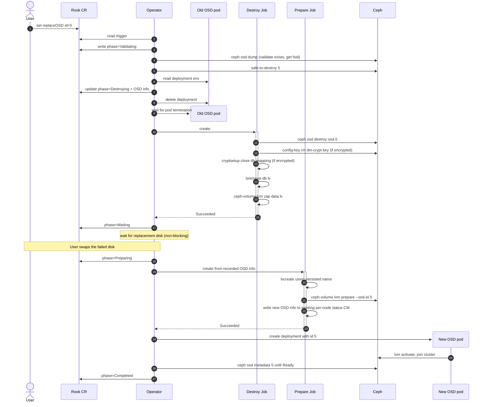

# Design: Single OSD replacement with a shared metadata device

Issue: [rook/rook#13240](https://github.com/rook/rook/issues/13240)

## Problem

When an OSD's data and metadata live on different devices (per `spec.storage` `metadataDevice` config in the CephCluster CR), Rook today cannot replace a single failed OSD on its own. The user must either re-provision all OSDs sharing the same metadata device or run a multi-step manual workflow including scaling down the operator to zero. Both are slow and error-prone.

This design proposes a workflow to replace a single failed OSD in place — preserving its OSD ID — without affecting other OSDs sharing the same metadata device.

## Notation

- **User** - the human cluster admin who edits the CR.
- **Operator** - the Rook controller process.
- **Data LV / data device** - the LV (or block device) holding an OSD's bulk data. One per OSD.
- **DB LV / metadata device** - the LV holding the OSD's rocksdb (`block.db`). One per OSD; multiple OSDs can share the same metadata device.

## User story

A disk corresponding to `osd.5` fails on a node where five HDD OSDs share one NVMe metadata device. The user marks `osd.5` for replacement on the CephCluster CR, swaps the physical disk in the chassis, and walks away. Rook destroys `osd.5`, frees its DB LV slot on the NVMe, provisions a new OSD on the replacement disk *with the same OSD ID 5*, and the other four OSDs on the same NVMe stay up the whole time.

## Constraints

Two facts about the environment shape every later choice in this design.

### Rook cannot tell a replacement disk from a new disk

When a fresh empty disk appears on a node, Rook has no way to tell it's the replacement for a failed OSD. The next CephCluster reconcile calls `startProvisioningOverNodes`, which spawns a prepare-job on each node. With `useAllDevices: true` (or a matching `deviceFilter`) the prepare-job auto-provisions a new OSD on the empty disk with a fresh ID; orphan resources for the failed OSD stay leaked.

This is why the user must mark the OSD for replacement in the CR *before* swapping the disk. Otherwise, a reconcile triggered between the swap and the CR edit auto-provisions the new disk with a fresh ID instead of replacing osd.5.

### Storage device config must tolerate device swap

Rook lets users identify OSD data devices via `spec.storage`:

- `useAllDevices: true` — match any empty disk on the node.
- `deviceFilter: "<regex>"` — match disks whose `lsblk` properties match a regex.
- `nodes[].devices[].name: "<value>"` — match a specific path or name. Accepts a kernel name (`vdb`), a raw path (`/dev/sdc`), or a udev symlink (`/dev/disk/by-path/...`, `/dev/disk/by-id/...`).
- `nodes[].devices[].fullpath: "<value>"` — explicit DevLinks match (`/dev/disk/by-id/...`, `/dev/disk/by-path/...`). Compared against discovered symlinks, not regex.

Each shape interacts differently with the Linux device-naming interfaces:

- **Kernel names** (`vdb`, `sdc`, `/dev/sdc`) are not guaranteed to be persistent (see [Arch Wiki: Persistent block device naming](https://wiki.archlinux.org/title/Persistent_block_device_naming)). [Ceph's own admin docs](https://docs.ceph.com/en/latest/rados/operations/add-or-rm-osds/#replacing-an-osd) use raw paths like `/dev/sdX` in their replacement examples, but the manual procedure can be re-validated at each step; an automated flow has fewer recovery options if the name has shifted.
- **`/dev/disk/by-path/...`** is built by udev rules from the sysfs port path. Same physical port → same `by-path` symlink. So `by-path` survives a *same-slot* swap and breaks on a different-slot swap. Same-slot replacement is **not** a Rook or Ceph requirement: [Ceph upstream is silent on slot semantics](https://docs.ceph.com/en/latest/rados/operations/add-or-rm-osds/#replacing-an-osd); cephadm's `ceph orch device replace` is slot-agnostic.
- **`/dev/disk/by-id/...`** identifies the disk by hardware serial / WWN. Different disk → different `by-id`. Useless for replacement (the new disk *is* a different disk).
- **`/dev/disk/by-uuid/...`** identifies the filesystem/LV UUID. The replacement disk has a fresh UUID after provisioning. Same as `by-id`: useless here.

The shapes that tolerate any swap (same-slot or different-slot, any new disk) are `useAllDevices` and `deviceFilter`. `by-path` tolerates only same-slot replacement. Kernel names tolerate only the lucky case where the kernel happens to assign the same name. `by-id`/`by-uuid` references in `name`/`fullpath` cannot work for a disk that hasn't been seen yet.

The replacement flow must validate the affected OSD's CR references beforehand so the new disk is still resolvable under those references after the swap.

## Current gaps

Rook has no automated flow for replacing a failed OSD today. The closest existing primitive is the migration flow (`spec.storage.migration.confirmation`), which recreates OSDs in place after encryption or store-type spec changes: it destroys the OSD and re-prepares with `ceph-volume raw prepare --osd-id` via the `ROOK_REPLACE_OSD` env var. Migration only covers raw-mode OSDs; the shared-metadata case needs five additional fixes:

1. The replacement code path runs only in raw mode; LVM mode (required when a metadata device is configured) does not pass `--osd-id`, so the new OSD gets a new ID. (`initializeDevicesLVMMode`, [volume.go#L584-L844](https://github.com/rook/rook/blob/59ce48ae88e5ea59df44249b41a887af96a2806c/pkg/daemon/ceph/osd/volume.go#L584-L844))
2. Destroy zaps only the data LV; the DB LV on the shared metadata disk stays as an orphan. (`DestroyOSD`, [remove.go#L244-L292](https://github.com/rook/rook/blob/59ce48ae88e5ea59df44249b41a887af96a2806c/pkg/daemon/ceph/osd/remove.go#L244-L292))
3. The dm-crypt key in Ceph's config-key store is never removed, leading to LUKS collisions on retry of encrypted OSDs. (`DestroyOSD`, [remove.go#L244-L292](https://github.com/rook/rook/blob/59ce48ae88e5ea59df44249b41a887af96a2806c/pkg/daemon/ceph/osd/remove.go#L244-L292))
4. **The prepare-pod can't find a shared metadata disk once it hosts a DB LV.** Rook's disk-discovery (`DiscoverDevicesWithFilter`, [disk.go#L97-L111](https://github.com/rook/rook/blob/59ce48ae88e5ea59df44249b41a887af96a2806c/pkg/clusterd/disk.go#L97-L111)) skips any disk with `len(deviceChild) > 1` as a guard against claiming a user-partitioned disk. The first OSD's DB LV trips that filter, and the prepare-pod's `initializeDevicesLVMMode` then errors with `metadata device <X> is not found`. Same root cause as upstream issues [#15868](https://github.com/rook/rook/issues/15868) and parts of [#17477](https://github.com/rook/rook/issues/17477).
5. `OSDInfo.MetadataPath` is never populated for LVM-mode OSDs (the parser walks only `[block]` entries from `ceph-volume lvm list`), so the operator has no record of which metadata disk a destroyed OSD used. (`GetCephVolumeLVMOSDs`, [volume.go#L1104-L1177](https://github.com/rook/rook/blob/59ce48ae88e5ea59df44249b41a887af96a2806c/pkg/daemon/ceph/osd/volume.go#L1104-L1177))

## Proposed flow

This flow orchestrates [Ceph's documented OSD-replacement procedure](https://docs.ceph.com/en/latest/rados/operations/add-or-rm-osds/#replacing-an-osd) (`safe-to-destroy` → `osd destroy` → `lvm zap` → `lvm prepare --osd-id` → `lvm activate`) across short-lived Kubernetes Jobs, with operator-side state for crash recovery and Rook-specific gates around auto-provisioning. cephadm — Ceph's container-orchestrator analogue — preserves OSD IDs by default ([cephadm OSD service docs](https://docs.ceph.com/en/latest/cephadm/services/osd/#replacing-an-osd)); this design follows the same convention.

Two short-lived jobs — Destroy Job and Prepare Job — separated by the wait for the replacement disk. The operator owns all phase transitions and the wait; jobs are workers observed via `Job.status.succeeded`. Replacements run serially cluster-wide.

### Sequence



### Open question: controller placement

The diagram doesn't pick a concrete CR or controller for the replacement reconcile logic. Two candidates: extend the existing CephCluster controller (which already hosts `spec.storage.migration`), or introduce a separate `CephOSDReplace` CRD with its own controller. The design leans toward the separate CRD for the following reasons:

1. **CephCluster's `Reconcile()` runs mon, mgr, and osd reconcile sequentially in one call** ([`cluster.go#L116-L160`](https://github.com/rook/rook/blob/59ce48ae88e5ea59df44249b41a887af96a2806c/pkg/operator/ceph/cluster/cluster.go#L116-L160)). New long-running logic on the OSD path can interfere with mon/mgr reconcile for the same cluster.
2. **Replacement is long-running and multi-step**, so its state has to survive between reconciles. The cluster controller has no existing place to store sub-operation state — adding one (a side ConfigMap, or extending `CephCluster.status`) is part of the cost.
3. **Replacement reconciles need two outcomes the current cluster reconcile can't express**: terminal failure (bad CR rejected) and `RequeueAfter` (waiting for external events — disk inserted, Job done). Today `osd.Cluster.Start()` returns plain `error`; the parent reconcile has no way to learn "OSD step is mid-replacement, retry in N minutes." It's also unclear how a requeue would interact with components reconciled after the OSD step in the same `Reconcile` call.

Concrete shape of each candidate:

- **Extend the cluster controller** — state in either a side ConfigMap (`osd-replacement-state`, mirroring `osd-migration-config`) or `CephCluster.status`. Same UX as `spec.storage.migration`.
- **New `CephOSDReplace` CRD + dedicated controller** — state on `.status`. Independent reconcile goroutine; never touches the existing OSD path. Light coupling on the cluster side: skip auto-provisioning on affected nodes; surface an `OSDReplacementInProgress` condition.

The rest of this design is based on a separate `CephOSDReplace` CRD, with implications for the cluster-CR fallback flagged inline.

### State

State lives on `CephOSDReplace.spec` and `.status`. `spec.cephCluster` and `spec.osdId` are immutable post-create. `.status` carries phase and conditions following the K8s operator pattern.

```yaml
apiVersion: ceph.rook.io/v1
kind: CephOSDReplace
metadata:
  name: replace-osd-5
  namespace: rook-ceph
spec:
  cephCluster: my-cluster                      # immutable; target cluster in this namespace
  osdId: 5                                     # immutable
  confirmation: yes-really-replace-osd-5       # must equal "yes-really-replace-osd-{osdId}"; typo guard against destroying the wrong OSD
  autoOut: false                               # optional; if true, operator marks healthy OSD `out` automatically. Default: false (fail-fast on up+in)
  safeToDestroyTimeout: 1h                     # optional; how long Validating tolerates EBUSY before Failed. Default: 1h
  diskWaitTimeout: 24h                         # optional; how long Waiting tolerates a missing disk before Failed. Default: 24h

status:
  phase: Destroying                            # Pending | Validating | Destroying | Waiting | Preparing | Completed | Failed | Cancelled
  conditions:
    - type: Ready
      status: "False"
      reason: Destroying
      message: Destroy Job in flight
      observedGeneration: 1
      lastTransitionTime: "2026-05-05T12:00:00Z"

  # captured at the Validating → Destroying transition
  osdInfo:
    node: node-1                                          # OSD deployment NodeSelector; survives the deployment delete
    dataLV: /dev/ceph-data-vg-5/osd-block-aaa...          # OSD deployment env ROOK_BLOCK_PATH
    dbLV: /dev/ceph-metadata-vg-1/osd-db-bbb...           # OSD deployment env ROOK_METADATA_DEVICE; absent for raw-mode OSDs
    metadataSourceDevice: nvme0n1                         # OSD deployment env ROOK_METADATA_SOURCE_DEVICE; absent for raw-mode OSDs
    metadataVG: ceph-metadata-vg-1                        # from `pvs --noheadings -o vg_name <metadataSourceDevice>`
    crushDeviceClass: hdd                                 # OSD deployment env ROOK_OSD_CRUSH_DEVICE_CLASS
    databaseSizeMB: 4096                                  # from `lvs --noheadings -o lv_size <dbLV>` ÷ 1MiB
    encrypted: true                                       # from LV tag `ceph.encrypted` on <dbLV>
    osdFsid: 8b7e6c19-...                                 # from `ceph osd dump --format json`

  # populated on phase=Completed
  newFsid: ""                                  # for audit only; never used for re-arming
  completedAt: null
```

**Cancel and re-replace.** Cancel = delete the CR; a finalizer runs the operator's cleanup (delete partially-allocated DB LV if any; leave the OSD `destroyed` for the user to `ceph osd purge` manually). Re-replacement of the same OSD = create a new CR with a different name. Terminal CRs (`Completed`, `Cancelled`, `Failed`) are inert — keep them as audit trail or delete them; the operator requires neither.

#### Coordination

Replacements run serially cluster-wide as a simplifying choice, matching cephadm's `osd rm` queue and Rook's existing OSD migration. Per-OSD `safe-to-destroy` only returns OK once the OSD is fully drained from every PG's acting set, so concurrent destroys of independently-safe OSDs are technically safe — but serial keeps the operational model simple.

The queue is implemented via a `Pending` phase. Each reconcile, the controller lists peer `CephOSDReplace` CRs in the same namespace targeting the same cluster. If no earlier-`creationTimestamp` peer is in a non-terminal phase, this CR advances to `Validating`; otherwise it stays in `Pending` and re-checks next reconcile. UID breaks same-second ties.

> Extending CephCluster with a `spec.storage.replaceOSD` field needs no coordination logic — a single field admits only one in-flight replacement.

In both shapes, the cluster controller's auto-provisioning must skip nodes with an active replacement — otherwise the empty replacement disk gets claimed with a fresh ID before the Prepare step can use it. Without explicit trigger, Rook has no way to tell a replacement disk from a new disk (see [Constraints](#rook-cannot-tell-a-replacement-disk-from-a-new-disk)).

#### Phase state machine

```
  Pending ─→ Validating ─→ Destroying ─→ Waiting ─→ Preparing ─→ Completed
                  │                         │
                  ▼                         ▼
             Failed/Cancelled            Failed/Cancelled
```

> With the cluster-CR fallback, `Pending` is omitted (single field admits one in-flight); state offloads to a side ConfigMap similar to `osd-migration-config`.

Per-phase behavior:

| Phase | Normal exit | Transient failure (retried) | Terminal exit |
|---|---|---|---|
| (no record) | → `Pending` on CR create | — | — |
| `Pending` | → `Validating` once no earlier peer is in flight (one replacement per cluster at a time) | re-checks each reconcile while an earlier peer is in-flight | → `Cancelled` if user deletes the CR |
| `Validating` | → `Destroying` once all checks pass | `safe-to-destroy` returns EBUSY (peers backfilling) — re-checked each reconcile | → `Cancelled` on CR delete; → `Failed` on validation failure (target OSD invalid, swap-intolerant CR, up+in without `autoOut`, or `safe-to-destroy` timeout) |
| `Destroying` | → `Waiting` on Destroy Job success | Destroy Job retries on transient errors (Ceph unreachable, pod scheduling) | — |
| `Waiting` | → `Preparing` once replacement disk visible | inventory poll until disk visible | → `Cancelled` on CR delete; → `Failed` with `reason=ReplacementDiskMissing` after disk-swap wait expires |
| `Preparing` | → `Completed` when new daemon is Ready in Ceph | Prepare Job pod retries on transient errors; `lvcreate` precheck handles partial LV from a prior pod; Deployment creation retries | — |
| `Completed` | terminal — success | — | — |
| `Cancelled`, `Failed` | terminal | — | — |

User-visible: `Ready=True` on `Completed`, `Ready=False` otherwise; `reason` carries the current phase or a typed terminal reason.

> **⚠️ Destroy is irreversible.** Once `Validating` passes, `osd.5` will be destroyed on the next reconcile. If the user typed the wrong OSD ID, the wrong OSD is gone.

### Step-by-step

The walk-through uses the running example.

#### 1. Trigger — user creates a `CephOSDReplace` CR

Typical case is a failed disk: Ceph auto-marks the OSD `down` and `out` after `mon_osd_down_out_interval` (default 600s) and backfills; once the OSD is drained from every PG's acting set, `safe-to-destroy` clears and the flow proceeds. The user creates a `CephOSDReplace` CR and replaces the failed device in the datacenter.

Healthy (up+in) OSDs require either `ceph osd out` first or `spec.autoOut: true` — see [Validate](#2-validate).

On creation, the CR enters `Pending` and waits for any in-flight replacement to terminate. Once cleared, it advances to `Validating`. The disk can be swapped any time after the CR is applied — the Capture step tolerates a missing data device.

#### 2. Validate

Run each reconcile cycle until all checks pass or one fails terminally:

1. **Confirmation matches.** `spec.confirmation` must equal `"yes-really-replace-osd-{spec.osdId}"`. → `Failed` with `reason=InvalidSpec` on mismatch (typo guard).
2. **Target OSD exists** in the OSD map. → `Failed` with `reason=InvalidSpec` if absent.
3. **Target OSD is destroyable.** If the OSD is `up && in`: with `spec.autoOut: false` (default), → `Failed` with `reason=OSDStillIn`. With `spec.autoOut: true`, the operator runs `ceph osd out <id>` once at entry and falls through to check 5.
4. **CR-level device matching is swap-tolerant.** → `Failed` with `reason=InvalidSpec` if the OSD's data device is referenced by an unstable name in the CR (rules per [U-6](#open-questions)).
5. **`safe-to-destroy <id>` returns OK.** Returns EBUSY while any PG still has the OSD in its acting set — the only safety gate (`down`/`out` alone is not sufficient because data may not have replicated). EBUSY → stay in `Validating`, re-check next reconcile. `spec.safeToDestroyTimeout` exceeded → `Failed` with `reason=NotSafeToDestroy`.


#### 3. Destroy

Before deleting the deployment, the operator captures `.status.osdInfo` (sources per the YAML comments in [State](#state)). Most fields come from the OSD deployment's env. Two come off the host:

- `databaseSizeMB` and `encrypted` — read from the OSD's DB LV (or a surviving sibling LV in the same VG if the OSD's own LV is missing). The live spec is not a source: a user-edited `spec.storage.config.databaseSizeMB` would size the new DB LV inconsistently with siblings.
- `metadataSourceDevice` — for OSDs created by older operator versions (env not yet plumbed), a one-shot `ceph-volume lvm list --format json` Job on the OSD's node fills it. The Job reads VG metadata from the surviving PV on the metadata device, so it works even after the data device has physically failed.

Then the operator calls `k8sutil.DeleteDeployment` ([`deployment.go#L388`](https://github.com/rook/rook/blob/59ce48ae88e5ea59df44249b41a887af96a2806c/pkg/operator/k8sutil/deployment.go#L388)) on `rook-ceph-osd-5` and polls until the pod is gone. The pod-gone wait is required: while the daemon runs, it holds the DB-side LUKS mapping open and the next step's `cryptsetup close` would fail. If the wait times out (transient NotReady node), the operator re-checks on the next reconcile. No force-delete — a stuck pod on a NotReady node may still hold the LUKS mapping when kubelet recovers.

The Destroy Job's container invokes `DestroyOSD` ([`remove.go#L244-L292`](https://github.com/rook/rook/blob/59ce48ae88e5ea59df44249b41a887af96a2806c/pkg/daemon/ceph/osd/remove.go#L244-L292)) — the same Go function the existing migration flow already calls from [`cmd/rook/ceph/osd.go#L272`](https://github.com/rook/rook/blob/59ce48ae88e5ea59df44249b41a887af96a2806c/cmd/rook/ceph/osd.go). The bash below specifies what `DestroyOSD` must do (today it only handles the first step and a partial last step). Each operation is idempotent on retry.

```bash
# Destroy in Ceph (preserves OSD ID 5 for reuse).
ceph osd destroy osd.5 --yes-i-really-mean-it

# Remove dm-crypt key (no-op on Ceph v19+; defensive for older versions).
ceph config-key exists dm-crypt/osd/8b7e6c19-.../luks \
  && ceph config-key rm dm-crypt/osd/8b7e6c19-.../luks

# Close DB-side LUKS mapping.
DB_MAPPING=$(lsblk -nlo NAME,TYPE /dev/ceph-metadata-vg-1/osd-db-bbb... | awk '$2=="crypt"{print $1; exit}')
[ -n "$DB_MAPPING" ] && cryptsetup status "$DB_MAPPING" >/dev/null 2>&1 \
  && cryptsetup close "$DB_MAPPING"

# Free the DB slot.
lvs /dev/ceph-metadata-vg-1/osd-db-bbb... >/dev/null 2>&1 \
  && lvremove -f /dev/ceph-metadata-vg-1/osd-db-bbb...

# Zap the data LV (also handles the data-side dm-crypt mapping).
lvs /dev/ceph-data-vg-5/osd-block-aaa... >/dev/null 2>&1 \
  && ceph-volume lvm zap /dev/ceph-data-vg-5/osd-block-aaa... --destroy
```

After the Job completes, operator advances the record to `phase: Waiting`.

#### 4. Wait for replacement disk

Each reconcile of the CR, the controller checks if the replacement disk is visible on the node; if not, it requeues. Discovery uses Rook's existing paths — `rook-discover` (when enabled) for udev-event-driven updates, otherwise the operator's per-reconcile prepare-job inventory. The cluster controller skips auto-provisioning on the node while this CR is active (see [Coordination](#coordination)).

Timeout per `spec.diskWaitTimeout` (default 24h) → `Failed` with `reason=ReplacementDiskMissing`. After timeout, the user can either insert the disk and create a new CR for the same OSD ID, or delete the CR (osd stays destroyed; `ceph osd purge` to free the slot).

#### 5. Prepare

Phase `Preparing` (entered when the replacement disk is visible). The operator generates a fresh UUID for the new DB LV and passes it as an env var on the Job (same pattern as `ROOK_REPLACE_OSD` in `provision_spec.go:317,322`); pod retries reuse the same env. The Job runs:

```bash
# Pre-allocate the DB LV using the persisted name; skip if it already exists.
lvs /dev/ceph-metadata-vg-1/osd-db-12cf3a91-... >/dev/null 2>&1 \
  || lvcreate -L 4096M -n osd-db-12cf3a91-... ceph-metadata-vg-1 --wipesignatures y

# Provision the new OSD with the preserved ID. --dmcrypt only when the record's
# `encrypted` field is true.
ceph-volume lvm prepare \
  --bluestore [--dmcrypt] \
  --osd-id 5 \
  --data /dev/sdh \
  --block.db /dev/ceph-metadata-vg-1/osd-db-12cf3a91-... \
  --crush-device-class hdd
```

The Job writes the new OSD's info to `rook-ceph-osd-<node>-status` (the per-node prepare-job CM that Rook already uses to drive daemon creation). The phase stays `Preparing` while the operator creates the Deployment and waits for the new daemon to become Ready in Ceph.

#### 6. Activate

Reuses the existing path: `createOSDsForStatusMap` ([`status.go#L324`](https://github.com/rook/rook/blob/59ce48ae88e5ea59df44249b41a887af96a2806c/pkg/operator/ceph/cluster/osd/status.go#L324)) sees the per-node status CM the Prepare Job wrote and creates the daemon Deployment from it. The new deployment carries `ROOK_METADATA_DEVICE` and `ROOK_METADATA_SOURCE_DEVICE` directly — future replacement of this OSD won't need the Capture fallback.

#### 7. Complete

While in `Preparing`, the controller calls `ceph osd metadata <id>` each reconcile. Ready = a record returned with a non-empty fsid, matching `id`, and matching `hostname`. On Ready, transition to `phase: Completed` and record `newFsid` and `completedAt`.

### Cancellation

Cancel = delete the `CephOSDReplace` CR; a finalizer runs cleanup. Cancel is honored cleanly in `Pending`, `Validating`, and `Waiting` (after Destroy completes — `osd.5` stays `destroyed`; user runs `ceph osd purge 5` to free the slot). `Destroying` is short-lived and ignores cancel. Once the new OSD is provisioned (post-Prepare-Job-success or `Completed`), cancel makes no sense — removing the new OSD is an `out`+`purge` workflow, not a rollback.

**Cancel during Validating with `autoOut: true`.** If the operator already marked the OSD `out`, the OSD stays `out` after cancel. User marks `in` manually to recover the original cluster layout.

**Cancel during Waiting — ID-preserving retry unavailable.** Data and DB LVs were wiped at Destroy; a future `CephOSDReplace` for the same ID has no OSD info to capture and aborts. To re-add an OSD here, accept a fresh ID.

**Cancel during Preparing, Job in flight.** `ceph-volume lvm prepare` cannot be safely interrupted mid-call (partial dm-crypt + half-LUKS LV). The operator records the cancel intent and acts at Job exit. On Job failure, the finalizer removes the CR; the partially-allocated DB LV is left as a named orphan. On Job success, cancel is not honored — the new OSD joins the cluster.

## Out of scope

### Multiple metadata devices on one node — works conditionally

Rook supports per-device metadata-device pairing:

```yaml
nodes:
- name: "node-1"
  devices:
  - name: "/dev/disk/by-path/...sda"
    config: { metadataDevice: "nvme0n1" }
  - name: "/dev/disk/by-path/...sdb"
    config: { metadataDevice: "nvme0n1" }
  - name: "/dev/disk/by-path/...sdc"
    config: { metadataDevice: "nvme1n1" }   # different metadata device on the same node
```

This setup requires exact `name:` (or `fullpath:`) references — the per-device `config:` block can only be attached to a specific device entry, not to a regex match. Replacement of a single OSD on this setup works structurally (each OSD's `metadataSourceDevice` is captured in its `osdInfo` at destroy time), with two caveats:

- **Device-name validation must permit exact entries** — open question.
- **Same-slot replacement is required** — `by-path` resolves only when the new disk is in the original slot. Different-slot replacement stalls in the Wait step.

The broader multi-metadata-device feature work (improvements to per-device `metadataDevice` UX, multi-NVMe-per-node setups) was scoped separately by maintainers in [#13240](https://github.com/rook/rook/issues/13240) (tracked by `zhucan`). This design does not add new logic for that setup — it just doesn't actively forbid replacement on it under permissive validation.

### PVC-based OSD replacement — separate design

PVC-backed OSDs use a different code path (raw mode via `GetCephVolumeRawOSDs`, separate destroy plumbing). Issue #13240 is host-based storage; PVC replacement is a separate design.

### Permanently-down host — different workflow

If the OSD's host is gone, this flow cannot proceed (the Destroy step requires the host). Existing Rook node-decommission + OSD-purge flow handles it.

## Open questions

1. **Controller placement.** Design leans toward a separate `CephOSDReplace` CRD; `spec.storage.replaceOSD` on CephCluster (mirroring `spec.storage.migration`) is a fallback — see [Open question: controller placement](#open-question-controller-placement). Maintainers' call.

2. **Parallelism.** The proposed OSD replacement process is serial. Are there use-cases for parallel replacement we should support — multiple OSDs safe-to-destroy on the same node, all safe-to-destroy in the cluster at once, configurable concurrency?

3. **Auto-replace mode.** The proposed flow is always triggered explicitly by the user (CR creation). Should there be a follow-up option for automated replacement that triggers the same flow when a failed OSD and a fresh disk are detected on a node?

4. **Default values.** Are these defaults reasonable: `safeToDestroyTimeout: 1h`, `diskWaitTimeout: 24h`, disk-wait re-check interval `5 min` (cluster-config tunable)?

5. **Disk-swap responsiveness.** Can the design rely on Rook's existing discovery (rook-discover when enabled, otherwise the per-reconcile prepare-job inventory) to detect the replacement disk? Expected latency? Caveats when the cluster uses `useAllDevices` vs. regex `deviceFilter` vs. exact `name:` entries?

6. **Device-name validation.** Should the operator validate that the OSD's data-device reference in `spec.storage.nodes[*].devices[*]` is swap-tolerant before destroying, or is this the user's responsibility? Sample to consider:

   ```yaml
   spec:
     storage:
       nodes:
       - name: node-1
         devices:
         - name: /dev/sda             # kernel name — not swap-stable
         - name: /dev/disk/by-path/... # by-path — same-slot swap only
   ```

